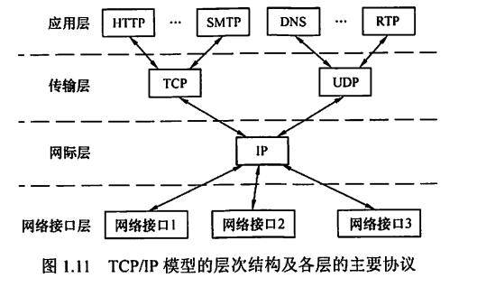
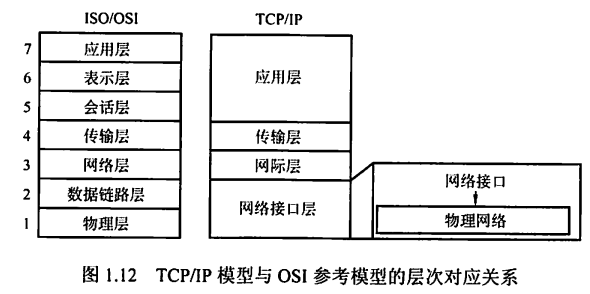

# 0x01 绪论

## 一、计算机网络概述

### 1.1 计算机网络的概念

#### 广义观点

低级阶段：只要能实现远程信息处理或能进一步达到资源共享的系统就是计算机网络

#### 资源共享观点

符合目前计算机网络的基本特征：以能够相互共享资源（目的）的方式互联起来的自治计算机（组成单元）系统的集合（必须遵循统一规则——网络协议）。

#### 用户透明性观点

网络未来发展追求的目标：存在一个能为用户自动管理资源的网络操作系统，能够调用用户所需要的资源，而整个网络对用户透明，用户无需了解网络的存在、资源的位置信息。

### 1.2 计算机网络的组成

#### 组成部分

- 硬件：主机/端系统、通信链路、交换设备和通信处理机（如网卡）
- 软件：各种实现资源共享的软件、方便用户使用的各种工具软件。多属于应用层
- 协议：计算机网络的核心。规定了网络传输数据时所遵循的规范

#### 工作方式

- 边缘部分：所有连接到因特网上、供用户直接使用的主机
- 核心部分：大量的网络和连接这些网络的路由器，为边缘部分提供连通性和交换服务

#### 功能组成

- 通信子网：由传输介质、通信设备、网络协议组成，使网络具有数据传输、交换、控制和存储的能力，实现联网计算机之间的数据通信
- 资源子网：实现资源共享功能的设备及其软件的集合

### 1.3 计算机网络的功能

- 数据通信：计算机网络<u>最基本</u>和<u>最重要</u>的功能
- 资源共享：可以是软件共享、数据共享，也可以是硬件共享。使计算机网络中的资源互通有无、分工协作
- 分布式处理：可以将复杂任务分配给网络中其他计算机系统，从而利用空闲计算机资源以提高整个系统的利用率
- 提高可靠性：网络中的计算机互为替换机
- 负载均衡：将工作任务均衡地分配给网络中的各台计算机

### 1.4 计算机网络的分类

#### 按分布范围

- 广域网（WAN）：提供长距离通信，覆盖范围达几十千米到几千千米。**是因特网的核心部分**。连接广域网各结点的链路一般都是高速链路、具有较大通信容量。
- 城域网（MAN）：覆盖范围达5~50km，大多采用以太网技术
- 局域网（LAN）：覆盖范围达几十米到几千米。局域网使用广播技术，而以太网使用交换技术
- 个人区域网（PAN）：个人电子设备（平板电脑、手机等）用无线技术连接起来的网络

若中央处理器之间的距离为1m的数量级甚至更小，则一般称为多处理机系统而不是计算机网络

#### 按传输技术

- 广播式网络：所有联网计算机共享一个公共通信信道。局域网采用广播式通信技术，广域网中的无线、卫星通信网络也采用广播式通信技术
- 点对点网络：每条物理线路连接一台计算机，若两台计算机之间没有直接物理线路，则分组传输要通过中间结点进行接收、存储和转发，直至到达目的结点。
- 重要区别：是否采用分组存储转发与路由选择机制

#### 按拓扑结构分类

- 主要指通信子网的拓扑结构
- 分为总线形、星形、环形、网状网络等。前三者多用于局域网，网状网络多用于广域网
- 总线形网络：
  - 用单根传输线连接多台计算机。
  - 建网容易、增/减结点方便、节省线路
  - 重负载时通信效率不高、总线任意一处**对故障敏感**
- 星形网络：
  - 每个终端或计算机都以单独的线路与中央设备相连。中央设备早期是计算机，现在一般是交换机或路由器。
  - 便于集中控制和管理
  - 成本高、中央设备对故障敏感
- 环形网络：
  - 所有计算机连接成一个环。典型例子是令牌环局域网
  - 可以是单环也可以是双环。
  - 环中信号单向传输
- 网状网络：
  - 每个结点至少有两条路径与其他结点相连，多用于广域网。有规则型和非规则型两种
  - 可靠性高
  - 控制复杂、线路成本高

#### 按使用者分类

- 公用网：电信公司出资建造的大型网络
- 专用网：某个部门为满足本单位特殊业务的需要而建造的网络，不向本单位以外的人提供服务

#### 按交换技术分类

- 电路交换网络：
  - 源结点和目的结点之间建立一条专用的通路用于传送数据，包括建立连接、传输数据、断开连接三个阶段。
  - 典型代表：传统电话网络
  - 特点：整个报文的比特流连续地从源点直达终点
  - 优点：数据直接传送、时延小
  - 缺点：线路利用率低、不能充分利用线路容量、不便进行差错控制
- 报文交换网络：
  - 用户数据加上源地址、目的地址、校验码等辅助信息，封装成报文。整个报文传送到相邻结点，全部存储后，再转发给下一个结点。每个报文可以独立选择到达目的结点的路径
  - 特点：存储转发
  - 优点：较为充分地利用线路容量、可以实现不同链路之间不同数据传输速率的转换、格式转换、一对多/多对一访问、差错控制
  - 缺点：增大资源开销、增加缓冲时延、需要额外的控制机制来保证多个报文的顺序不乱序、缓冲区难以管理（报文长度不确定）
- 分组交换网络：
  - 将数据分成较短的固定长度的数据块，加上目的地址、源地址等辅助信息封装成分组。
  - 特点：存储转发
  - 优点：缓冲区易于管理、平均时延更小、网络占用的平均缓冲区更少、更易于标准化和应用

#### 按传输介质

- 有线：双绞线网络、同轴电缆网络等
- 无线：蓝牙、微波、无线电

## 二、网络性能衡量指标

#### 数据量

- 单位：B（Byte，1 B = 8 bit）
- 进制：2进制，1 K = $2^{10}$，1 M = $2^{20}$，1 G = $2^{30}$

#### 速率

- 单位：bit/s
- 进制：10进制，1 K = $10^3$，1 M = $10^6$， 1G = $10^9$

#### 带宽

- 单位：bit/s
- 含义：单位时间内某信道所能通过的最高数据率

#### 吞吐量

- 单位：同数据量
- 含义：单位时间内通过某个网络/信道/接口的实际数据量

#### 时延

- 单位：s 或 ms

- 构成：

  - **发送时延/传输时延**：数据从节点到全部传输到信道上的时间
    $$
    发送时延 = \frac{数据帧长度(bit)}{发送速率(bit/s)}
    $$
传播时延：电磁波在信道中传播一定距离所花费的时间（注意，与数据量无关）。
    $$
    传播时延 = \frac{信道长度(m)}{电磁波在信道上的传播速率(m/s)}
    $$
    常用速率：光纤（$2.0\times 10^8m/s$），铜线（$2.3\times10^8m/x$）
  
- 处理时延：主机或路由器分析首部、提取数据、差错检验、查找转发表等所耗费的时间
  
- 排队时延：需要处理的分组可能会在路由器中堆积等待处理。若分组过多，导致队列溢出，分组丢失，此时排队时延为无穷大。
  
- 数据总时延
  $$
  总时延 = 发送时延+传播时延+处理时延+排队时延
  $$

- 注意点：

  - 高速链路/高带宽链路：本质上只是减小了发送时延，与数据传送时间无关，不能说使比特传送更快。
  - 光纤比铜线速率更高：这是光纤信道允许节点用更高的速率将数据发送到信道上，而不是传送速率更快。

#### 时延带宽积

- 单位：同数据量
- 含义：一段链路中最多可充满的数据量。将链路视为一段空心管道，则传播时延为它的长度，带宽为它的底面积。

$$
时延带宽积 = 传播时延\times 带宽
$$

#### 往返时间 RTT

- 单位：s 或 ms
- 含义：通信双方完成一次双向交互所需的时间，即主机A发出的数据到达信道（开始计时）→主机B发回响应→主机A收到响应（结束计时）

#### 利用率

- 信道利用率：某一信道有数据通过的时间占比

- 网络利用率：全网络信道利用率的加权平均值

- **信道利用率或网络利用率过高会产生非常大的时延**（因为网络中大部分时间都有数据，意味着路由器和主机需要一直处理转发分组，这部分速率跟不上会造成分组堆积在各节点中等待处理，导致时延越来越大）
  $$
  D（网络当前时延） = \frac {D_0（网络空闲时延）}{1-U（网络当前利用率）}
  $$

## 三、网络体系结构及参考模型

### 3.1 OSI参考模型

- 共7层：物理层、数据链路层、网络层、传输层、会话层、表示层、应用层
- 低三层为通信子网、高三层为资源子网；传输层承上启下

#### 物理层

1. 传输单位：比特
2. 任务：在节点之间透明地传输比特流
3. 功能：在物理媒体上为数据端设备透明地传输原始比特流
4. 负责解决的问题：确定传输媒体接口的特性
   - 机械特性：接口所用接线器的形状和尺寸、引线数目和排列、固定和锁定装置等。
   - 电气特性：在接口电缆的各条线上出现的电压的范围。
   - 功能特性：某条线上出现的某一电平的电压的意义。
   - 过程特性：对于不同功能的各种可能事件的出现顺序。

#### 数据链路层

1. 传输单位：帧
2. 对象：两个相邻节点之间
3. 任务：将网络层传来的IP数据报组装成帧，并在两个相邻节点之间的链路上传送数据
4. 负责解决的问题：
   - **成帧**：将网络层交下来的IP数据报组装成帧
   - 物理寻址：收发双方的物理地址（同一个网络/本地网络）
   - 访问控制：广播信道，如何决定哪台设备可以发送和接收数据
   - **差错控制**：需要检查所收到的帧是否有差错，并采取响应措施（直接丢弃或通知重传）
   - **流量控制**：接收方采取措施，使发送方不要过快发送

#### 网络层

1. 传输单位：数据报
2. 对象：两个主机之间（可能跨越多个网络）
3. 任务：负责为分组交换网上的不同主机提供通信
4. 负责解决的问题：
   - 分组：将运输层的报文段或用户数据报封装成分组或包。
   - 逻辑寻址：跨网络通信，需要给主机重新编制逻辑地址。物理寻址是基于同一个网络或本地网络。
   - 路由选择：寻找路径能够将分组通过连接设备（路由器）到目的主机。在TCP/IP体系中，网络层(网际层)使用IP协议，IP层分组叫做IP数据报，简称数据报。
   - **流量控制、拥塞控制、差错控制**、网际互连

#### 传输层

1. 传输单位：报文段（TCP）或用户数据报（UDP）
2. 对象：两个进程之间
3. 任务：为两个主机中进程之间的通信提供**通用**的数据传输服务
4. 功能：复用和分用。复用是指多个应用层进程可同时使用下面传输层的服务；分用是指传输层把收到的信息分别交付给上面应用层中相应的进程
5. 负责解决的问题：
   - 服务点寻址：通过端口地址标识特定进程，从而将报文交付对应进程
   - 分片与重组：报文可能过长，需要分片交付给下一层；收到的报文是分片的，需要重组成完整报文
   - **连接控制、流量控制、差错控制、服务质量、数据传输管理**

#### 会话层

- 允许不同主机上各个进程进行会话/建立同步（SYN）
- 任务：管理主机间的会话进程，包括建立、管理及终止。
- 功能：使用校验点使得通信失效时能从校验点处恢复通信，实现数据同步

#### 表示层

- 任务：处理在两个通信系统中交换信息的表示方式。采用抽象的标准方法定义数据结构，并采用标准编码形式。
- 功能：数据压缩、加密和解密等

#### 应用层

（1）对象：两个进程之间

（2）任务：负责给用户提供服务（注意运输层只是传输数据，应用层则是规定如何收发、利用数据）。通过应用进程间的交互完成特定网络应用。

（3）负责解决的问题：

- 定义应用进程之间的通信与交互规则

#### 总结

- 数据链路层、网络层、传输层都有差错控制和流量控制功能

  

### 3.2 TCP/IP模型

### 3.2 分组、协议、服务

#### 分组

（1）发送方将较长的报文划分为若干个等长的数据段，在数据段前面加上必要的控制信息（报文）构成**分组**，进行传输。由接收方重组。

（2）存储转发，每个分组独立地选择最合适的转发路由，体现**灵活性**。

（3）存储转发，分组传输过程中动态分配传输带宽，断续地逐段占用通信资源，体现**高效性**。

（4）以分组作为传输单位，主机之间不需要预先建立连接即可发送分组，体现**迅速**性。

（5）采用可靠的网络协议，分布式多路由的分组交换网，使网络有很好的生存性（不至于因为网络拥塞或少数节点、链路损坏而导致整体瘫痪），体现**可靠性**。

#### 协议

规定数据交换格式及相关同步问题。

协议三要素：

（1）语法：数据与控制信息的结构与格式（怎么说）

（2）语义：发出何种控制信息，完成何种动作，作出何种响应（说什么）

（3）同步：事件实现顺序的详细说明（何时说）

形式：

（1）人来阅读与理解的文字描述

（2）计算机能理解的程序代码

#### 服务

在计算机网络体系结构中，下层为相邻的上层提供的功能调用。

服务原语：上层使用下层提供的服务时与下层交换的命令

- 请求：服务用户→服务提供者，请求完成某项工作
- 指示：服务提供者→服务用户，指示用户做某件事情
- 响应：服务用户→服务提供者，作为对指示的响应
- 证实：服务提供者→服务用户，作为对请求的证实

有应答服务包含全部4类原语，无应答服务只有请求和指示两类原语

**并非在一层内完成的全部功能都称为服务，只有那些能被高一层实体看见的功能才称为服务**

服务的分类：

- 面向连接服务与无连接服务
- 可靠服务和不可靠服务
  - 可靠服务：网络具有纠错、检错、应答机制，能保证数据正确、可靠地传送到目的地
  - 不可靠服务：网络只是尽量正确、可靠地传送，不能保证一定正确、可靠
- 有应答服务和无应答服务

#### 协议与服务的区别与联系

（1）协议是“水平”的，是控制对等实体之间通信的规则；服务是“垂直”的，是下层向上层通过层间接口（**服务访问点，Service Access Point，SAP**，是*抽象的逻辑接口*）提供的

（2）层与层之间交换的数据单位为<u>服务数据单元</u>（Service Data Unit，SDU），对等层次之间传送的数据单位为<u>协议数据单元</u>（Protocol Data Unit，PDU）

（3）本层协议的实现保证了能够向上一层提供服务，而实现本层协议又需要使用下一层所提供的服务。本层只能看见所提供的服务，而看不见下一层所使用的协议；服务也仅限于本层所看到的部分，不一定是下一层所完成的全部功能。

### 3.3 TCP/IP模型与OSI参考模型的比较

#### 相同点

1. 都采取分层的体系结构
2. 都基于独立的协议栈的概念
3. 都可以解决异构网络的互联，实现世界上不同厂家生产的计算机之间的通信

#### 不同点

1. OSI精确地定义了三个主要概念：服务、协议和接口；而TCP/IP模型没有明显区分
2. OSI通用性良好；TCP/IP模型不适合任何其他非TCP/IP的协议栈，协议能够匹配模型
3. TCP/IP模型在设计之初就考虑到了多种异构网的互联问题，并将IP作为一个单独的重要层次；而OSI认识到IP重要性后才在网络层中划分出一个子层
4. **OSI在网络层支持无连接和面向连接的通信，而在传输层仅有面向连接的通信；TCP/IP在网络层仅有无连接的通信，而在传输层支持无连接和面向连接的通信**