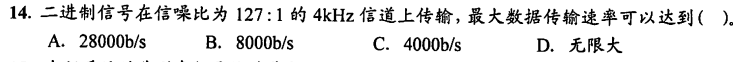
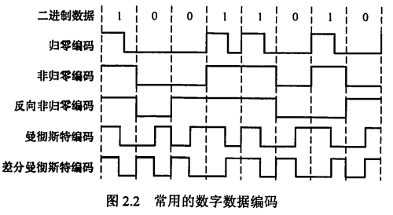
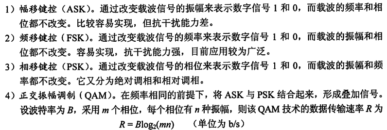
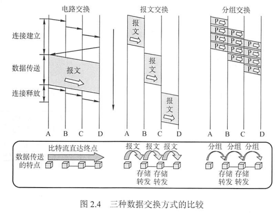
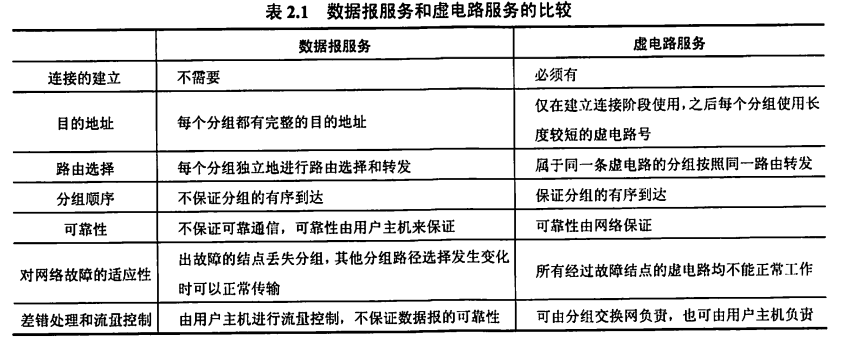
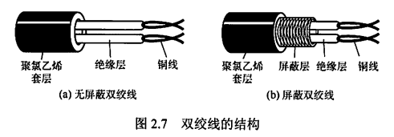
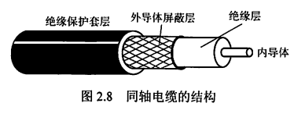
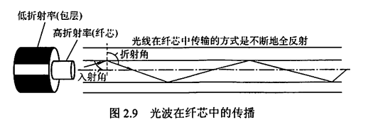

# 0x02 物理层

## 一、通信基础

### 1.1 基本概念

#### 数据、信号、码元

通信的目的是<u>传送信息</u>，信息的实体是<u>数据</u>，数据在传输过程中的存在形式是<u>信号</u>。

信号可分为模拟信号和数据信号

- 模拟信号：连续变化的
- 数字信号：取值仅允许为有限的几个离散数值的

数据传输方式可分为串行传输和并行传输

- 串行传输：1比特1比特地按照时间顺序传输
- 并行传输：若干比特通过多条通信信道同时传输

码元是数字信号的计量单位，代表不同离散数值的基本波形，它用一个固定时长的数字脉冲表示一位k进制数字，这个时长内的信号称为<u>k进制码元</u>，而该时长称为<u>码元宽度</u>

**1码元可以携带若干比特的信息**

#### 信源、信道、信宿

一个数据通信系统主要划分为信源、信道、新宿三部分

- 信源：产生和发送数据的源头
- 信宿：接收数据的终点，通常是计算机或其他数字终端装置
- 信道：不等同于电路，是信号的传输媒介，一般用来表示向某个方向传送信息的介值，因此一条通信线路往往包含一条发送信道和一条接收信道
  - 模拟信道：传输模拟信号
  - 数字信道：传输数字信号
  - 无线信道、有线信道

信道上传输的信号分为基带信号和宽带信号

- 基带信号：将数字信号1和0用两种不同电压表示，然后送到数字信道上传输（基带传输），不经过调制。基带传输一般用于计算机内部和局域网。
- 频带传输：将基带信号进行调制后送到模拟信道上传输。在进行远距离传输或无线传输时，数字信号必须用频带传输进行传输
- 宽带信号：基于频带传输，但将基带信号进行调制后形成频分复用模拟信号，然后送到模拟信道上传输（宽带传输）

通信双方信息的交互方式可分为单向通信、半双工通信、全双工通信

- 单向通信：只有一个方向的通信，仅需要一条信道。如无线电广播、电视广播
- 半双工通信：双向通信，但同一时刻只能有一个方向传输信息。需要两条信道
- 全双工通信：通信双方可以同时发送和接收信息。需要两条信道

信道的极限容量：信道的最高码元传输速率/信道的极限信息传输速率

#### 速率、带宽

- 速率：也称为数据率，表示单位时间内传输的数据量
  - 码元传输速率/波特率：表示单位时间内数字通信系统所传输的码元个数/脉冲个数/信号变化的次数，单位是波特（Baud）
  - 信息传输速率/比特率：表示单位时间内数字通信系统传输的二进制码元个数（即比特数），单位是bit/s
  - 比特率=波特率×$log_2{n}$
- 带宽：单位时间内从网络中某一点到另一点所能通过的“最高数据率”

### 1.2 奈奎斯特定理与香农定理

#### 奈奎斯特定理

码间串扰：高频分量在通过信道时受到衰减，导致接收端收到的信号波形失去码元之间的清晰界限

奈奎斯特定理：

- 给出了<u>不受到码间串扰时码元传输速率的上限值</u>
- 理想低通信道下极限数据传输速率=$2W\log_2{V}$，其中W为理想低通信道的带宽，V为每个码元离散电平的数量
- 任何信道中，码元传输速率有上限。超过此上限会出现严重的码间串扰问题
- 信道的频带更宽（即通过的信号高频分量越多），就能用更高的速率进行传输
- 只给出了码元传输速率的限制，未限制信息传输速率

#### 香农定理

- 信道的极限数据传输速率=$W\log_2{(1+S/N)}$，其中W为信道的带宽，S为信道所传输信号的平均功率，N为信道内部的高斯噪声功率。S/N为信噪比。
- 信噪比越大，极限数据传输速率越高
- 若传输带宽和信噪比确定，则其传输速率上限也确定
- 只要信息传输速率低于此极限值，就一定能找到某种方法来实现无差错的传输
- 实际信道能达到的传输速率要比这个极限值低不少

### 1.3 计算相关

- 比特率=波特率×$log_2{n}$，n为一个码元的有效离散值个数。

- 若有效离散值个数为2^k个，则一个码元包含k个比特

- **无噪声**信号满足奈奎斯特定理，最大传输速率为$2W\log_2{V}$，W为信道带宽。V为一个码元的有效离散值个数。“每个信号包含8级”的意思是一个码元有8个离散值

- 若题目给出信噪比，需要综合考虑香农定理和奈奎斯特定理，取两者结果的较小值。

  根据香农定理，最大数据传输速率=4k×log_2(127+1)=28k；根据奈奎斯特定理，**“二进制信号”表明一个码元有2个离散值**，即V=2，最大传输速率=2×4k×log_2(2)=8k；综上，最大数据传输速率为8k，选B。

- 信噪比的db/分贝单位换算：10lg{S/N}dB。如，当信噪比为30db时，实际上S/N=10^(30/10)=10^3=1000

- 若只给采样频率不给带宽，则将采样频率视为带宽。如一个信道每1/8s采样一次，带宽为8Hz.

- **若题目指明使用曼彻斯特编码，则1个比特用2个码元表示，波特率是数据率的2倍**

### 1.4 编码与调制

编码：将数据变换为数字信号

调制：将数据变换为模拟信号

#### 数字数据编码为数字信号

用于基带传输，即在<u>基本不改变数字数据信号频率的</u>情况下，直接传输数字信号。

编码规则：规定用什么样的数字信号表示1，什么样的数字信号表示0。

常用的编码规则：

- 归零编码/RZ
  - 高电平表示1，低电平表示0（或相反）
  - 在<u>每个时钟周期的中间</u>跳变到低电平。
  - 自同步机制：接收方可以通过归零调整时钟基准
  - 归零占用一部分带宽，对传输效率有一定影响
- 非归零编码/NRZ
  - 基本与归零编码相似，但不归零。
  - 无法传递时钟信号，双方难以同步。如果想同步，需要都带有时钟线
- 反向非归零编码/NRZI
  - 用信号的翻转代表0，信号保持不变代表1
  - 翻转的信号本身可以作为通知机制，因此集成了RZ和NRZ的优点，既能传输时钟信号又能尽量不损失系统带宽
  - USB2.0通信采用NRZI编码
- 曼彻斯特编码
  - 将一个码元分为两个相等的间隔，若前高后低则代表码元1，若前低后高则代表码元0（或相反）
  - 每个码元的中间出现电平跳变，既作为时钟信号，又作为数据信号。
  - 所占频带宽度是原始基带宽度的两倍
  - 以太网通信使用曼彻斯特编码
- 差分曼彻斯特编码
  - 若码元为1，则前半个码元的电平与上一个码元的后半个码元的电平相同；若码元为0，则相反。
  - 每个码元的中间出现电平跳变，可以实现自同步，抗干扰性较好
  - 局域网传输常用差分曼彻斯特编码
- 4B/5B编码
  - 每4位数据作为一组，然后按照编码规则转换为相应的5位码。5位码中只采用其中16种对应16种不同的4位码，其他16种作为控制码或保留

#### 数字数据调制为模拟信号

#### 模拟数据编码为数字信号

- **采样定理/奈奎斯特定理：要保证采样后的数字信号完整保留原始模拟信号的信息，采样频率必须≥2倍的原始信号最大频率**
- 编码步骤：
  1. 采样：对模拟信号进行周期性扫描，把时间上连续的信号变成时间上离散的信号
  2. 量化：将采样取得的电平幅值按一定的分级标度转化为对应的数字值并取整数
  3. 编码：把量化的结果转换为与之对应的二进制编码
- 典型例子：对音频信号进行编码的脉码调制

#### 模拟数据调制为模拟信号

- 可能需要较高的频率来保证传输有效性
- 可以使用频分复用技术
- 电话机和本地局交换机采用

### 1.5 电路交换、报文交换、分组交换

#### 电路交换

双方预先建立一条专用的物理通信路径（由通信双方之间的交换设备和链路逐段连接而成），并在数据传输期间一直被独占

数据传输期间，电路上的任何结点（除源节点和目的结点）都采用直通方式接收和发送数据，不存在存储转发

分为三个阶段：连接建立、数据传输、连接释放

优点：

- 通信时延小：数据都是直达的
- 有序传输
- 没有冲突
- 适用范围广：既适用于传输模拟信号，又适用于传输数字信号
- 实时性强
- 控制简单

缺点：

- 建立连接时间长
- 不具有差错控制能力
- 线路独占，使用效率低
- 灵活性差。只要出了任何一点故障，就必须重新拨号建立新的连接，不利于紧急和重要的通信
- 难以规格化。不同类型、不同规格、不同速率的终端很难相互进行通信，也很难进行差错控制

#### 报文交换

以报文为单位进行数据交换，报文携带目的地址、源地址等信息。

在交换结点采用存储转发

优点：

- 无须建立连接
- 动态分配线路
- 提高线路可靠性
- 提高线路利用率
- 提供多目标服务

缺点：

- 要进行存储转发，引起转发时延
- 对报文大小没有限制，要求网络结点有较大的缓存空间

#### 分组交换

以分组为单位进行数据交换，要发送的数据划分为等大的数据块，加上必要的控制信息后构成分组。

在交换结点采用存储转发

优点：

- 无建立时延
- 线路利用率高
- 简化了存储管理：分组长度固定，相应的缓冲区大小也固定
- 加速传输：分组是逐个传输的，分组存储和分组转发可以并行，构成流水线，从而减少报文传输时间。此外一个分组占用缓冲区比一个报文占用缓冲区小得多，从而减少了因缓冲区不足而等待的时间
- 减少了出错概率和重发数据量

缺点：

- 存在传输时延
- 需要传输额外的信息，一定程度上降低了通信效率，增加了处理时间，使控制复杂，时延增加
- 当采用数据报服务时，可能会出现失序、丢失或重复问题；采用虚电路服务也只能避免失序问题

### 1.6 数据报和虚电路

#### 数据报

- 不需要建立连接
- 尽最大努力交付，不保证可靠性，分组到达可能不是有序的
- **分组要包含发送端和接收端的完整地址**
- 分组在交换结点存储转发时，需要排队等候处理
- 网络具有冗余路径
- 存储转发延时小，提高网络吞吐量
- 收发双方不独占某条链路，资源利用率高

#### 虚电路

- 在虚电路上的每个结点都维护一张虚电路表，记录所有已打开的虚电路的信息
  - 虚电路号
  - 前一结点和下一结点的标识
- 虚电路的建立和拆除需要时间开销，不适用于交互式应用和小量短分组，但对于长时间、频发的数据交换而言效率较高
- 虚电路在连接建立时确定路由选择，从而确定传输路径
- 提供可靠通信功能，保证每个分组正确且有序到达，且可以进行流量控制
- 由于传输路径是事先确定的，一旦路径中的某个结点或某个链路失效，所有经过该结点或该链路的虚电路都将被破坏
- **分组首部不包含目的地址，而是虚电路标识符，相对于数据报方式开销小。**

## 二、传输介质

### 2.1 导向与非导向传输介质

- 导向传输介质：电磁波被导向沿着固体媒介（铜线或光纤）传播
- 非导向传输介质：空气、真空或海水等

#### 双绞线

- 由两根采用一定规则并排绞合的、相互绝缘的铜导线组成。
- 抗电磁干扰：绞合减少对相邻导线的电磁干扰。在双绞线的外层再加一层用金属丝编织成的屏蔽层，构成屏蔽双绞线。没有屏蔽层的双绞线为非屏蔽双绞线
- 价格便宜，是最常用的传输介质之一
- 在局域网和传统电话网中普遍使用
- 带宽取决于铜线粗细和传输距离
- 支持模拟传输和数字传输，通信距离达几千米到数十千米
- 模拟传输可用放大器放大信号；数字传输可用中继器整形失真的信号

#### 同轴电缆

- 内导体、绝缘层、外导体屏蔽层、绝缘保护套层
- 按特性阻抗数值分为两类：50Ω同轴电缆和75Ω同轴电缆
- 50Ω同轴电缆/基带同轴电缆：传送基带数字信号；**广泛应用于局域网**
- 75Ω同轴电缆/宽带同轴电缆：传送宽带信号；**主要用于有线电视系统**
- 良好的抗干扰特性，广泛用于传输较高速率的数据，传输距离更远，价格较双绞线贵
- 其高带宽得益于它的高屏蔽性

#### 光纤

- 纤芯、包层
- 利用光导纤维传递光脉冲进行通信。有光脉冲为1，无光脉冲为0。带宽范围极大

- 多模光纤与单模光纤
  - 多模光纤：利用光的全反射特性，将不同角度入射的多条光纤在一根光纤中传输。光源为发光二极管。长距离传输容易失真，只适合近距离传输
  - 单模光纤：光线的直径减小到只有一个光的波长时，光线可以一直向前传播。制造成本高。光源为半导体激光器。可进行数公里甚至数十千米的传输而不必采用中继器，适合远距离传输
- 特点：
  - 通信容量非常大
  - 传输损耗小、中继距离长、对远距离传输特别经济
  - 抗雷电和电磁干扰性能好
  - 无串音干扰，保密性好，也不易被窃听或截取数据
  - 体积小、重量轻

#### 无线传输介质

- 无线电波
  - 有较强穿透能力，可以传输很长距离
  - 应用于无线手机通信、WLAN等
  - 向所有方向散播（注意与微波、红外线和激光对比），无须接收设备对准某个方向。大大简化通信连接。
- 微波、红外线、激光
  - 都是高带宽无限通信。都需要通信双方之间存在一条视线通路，有很强方向性，都沿直线传播
  - 红外通信：将信号转换为红外信号，直接在空间中传播
  - 激光通信：将信号转换为激光信号，直接在空间中传播
  - 微波通信：
    - 频率高、频段宽、容量大。由于沿直线传播，在地面的传播距离有限，超过一定距离后需要用到中继站。
    - 卫星通信可以克服地面微波通信距离的限制，基本能实现全球通信。优点是容量大、距离远、覆盖广；缺点是成本高、误码率较高、受气候影响大、保密性差、端到端传播时延长

### 2.2 物理层接口的特性

- 机械特性：接口所用接线器的形状和尺寸、引线数目和排列、固定和锁定装置等。
- 电气特性：在接口电缆的各条线上出现的电压的范围。
- 功能特性：某条线上出现的某一电平的电压的意义。
- 过程特性：对于不同功能的各种可能事件的出现顺序。
- 常用接口标准：EIA RS-232-C、ADSL、SONET/SDH

## 三、物理层设备

#### 中继器

- 将信号整形放大并转发，扩大网络传输的距离。原理是信号再生。
- 是用来扩大网络规模的最简单廉价的互联设备。
- 有两个端口，一个输入另一个输出。端口连接的网络是网段。
- 要求连接的两个网段必须使用同一个协议，不能连接两个具有不同速率的局域网
- 不可能通过无限使用中继器来无限延长网络，因为网络标准规定了信号的延迟范围。
- 5-4-3规则：互相串联的中继器个数不能超过4个，且4个中继器串联的5段通信介质中只有3段可以挂接计算机。

#### 集线器/Hub

- 即多端口中继器，也有整形放大功能
- 目的是扩大网络的传输范围，不具备信号的定向传送能力
- 主要使用双绞线组建共享网络，是最经济方案
- 由集线器组成的网络是共享式网络，但逻辑上仍是一个总线网
- 每个端口连接的网络是同一个网络的不同网段
- **只能在半双工状态下工作**