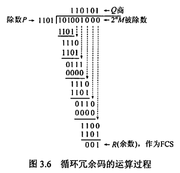
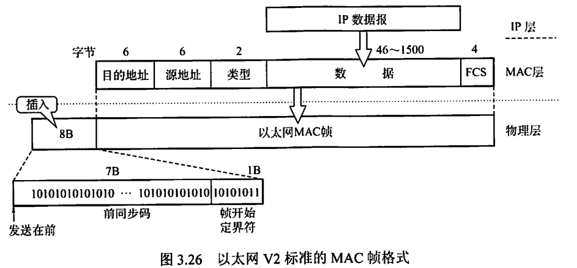
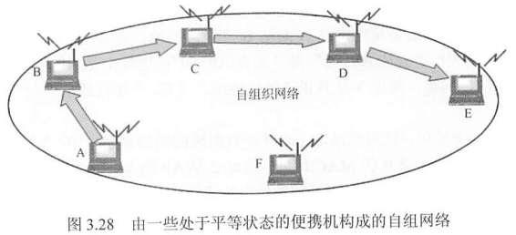
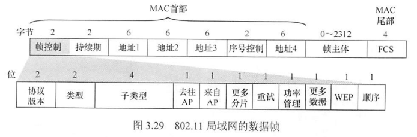
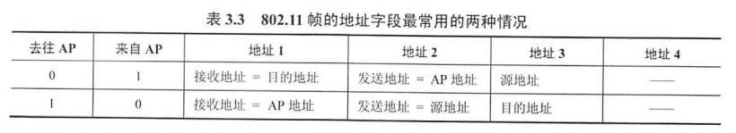
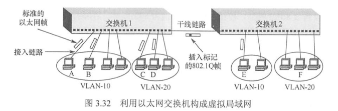
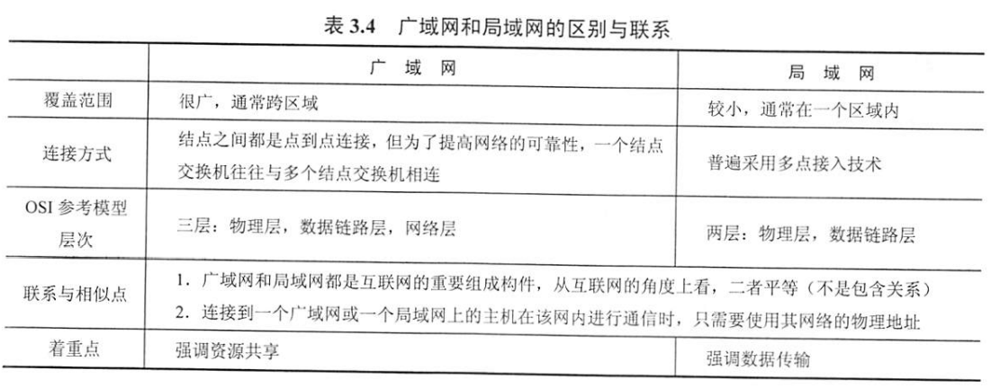

# 0x03 数据链路层

## 一、数据链路层的功能

### 1.1 基本概念

#### 协议数据单元——帧

为网络层交付下来的网络层协议数据单元（在互联网中就是 IP 数据报）**添加首部和尾部**，就构成了**帧**。

#### 数据链路 链路

- 链路：一段点到点的物理线路，中间没有任何其他节点。主机与主机之间通信的路径通常由许多条这样链路构成。
- 数据链路：具备实现通信协议的硬件和软件（如网络适配器）的链路。

### 1.2 功能1：为网络层提供服务

- 无确认的无连接服务
  - 发送时不需要建立链路连接
  - 接收时不需要发回确认
  - 丢失帧不负责重发
  - 适用：实时通信或误码率较低的信道，如以太网
- 有确认的无连接服务
  - 发送时不需要建立链路连接
  - 接收时必须发回确认
  - 规定时间内未收到确认信号，自动重传，提高传输可靠性
  - 适用：误码率较高的信道，如无线通信
- 有确认的面向连接服务
  - 建立数据链路、传输帧、释放数据链路
  - 收到的每一帧都要发回确认，发送方收到确认才发下一帧，可靠性最高
  - 适用：通信要求较高的场合

### 1.3 功能2：链路管理

数据链路层连接的建立、维持、释放的过程，主要用于面向连接的服务。

确认就绪状态、交换必要信息、初始化帧序号、在物理信道共享的情况下对物理信道的分配与管理

### 1.4 功能3：流量控制

限制发送方的数据流量，使其发送速率不超过接收方的接受能力。

（注：OSI中数据链路层有流量控制功能，而TCPI/IP中传输层才有）

### 1.5 功能4：组帧

将来自网络层的分组数据封装成帧，即加上首部和尾部的控制信息。

作用：

- 帧定界：首部和尾部可标识一个帧的起始和结束
- 控制信息

当数据为可打印的 ACSII 码构成的文本文件时，帧定界使用特殊的帧定界符：SOH 和 EOT。

### 1.6 功能5：透明传输

当数据为非 ACSII 码构成的文本文件时（如程序和图像），数据中可能包含与帧定界符相同的二进制代码，导致数据链路层错误识别。而数据链路层应实现**透明传输**，即需要保证无论什么样的数据都可以传输，所以对于上述情况，数据链路层必须采取措施使得数据同样可以传输（而不是直接拒绝这种数据）。

### 1.7 功能6：差错控制

传输中的错误分为位错和帧错。

**位错：帧中某些位出现差错**

- 检错编码
  - 奇偶校验码
  - 循环冗余码CRC

- 纠错编码
  - 海明码

**帧错：帧丢失、重复、失序**

- 解决：引入定时器和编号机制

## 二、组帧

组帧主要解决帧定界、帧同步、透明传输等问题

帧是网络中信息传输的最小单位，因此组帧时既要加首部又要加尾部，以便确定该帧从哪里开始到哪里结束。

#### **字符计数法**

在帧头部适用一个计数字段来表明帧内字节数，从而可以确定帧结束的位置

若计数字段出错，即失去了帧定界，收发双方失去同步

#### **字符填充的首尾定界符法**

适用特定字符来界定一帧的开始或结束：SOH（开始） 和 EOT（结束）。

发送端在数据中的 SOH / EOT 字符前面插入一个转义字符“ESC”（注意是ASCⅡ里的ESC，不是“E”“S”“C”三个字符），使得数据不会被错误解释。

接收端删除这些转义字符后再将数据上交给网络层。

如果数据中也有 ESC 字符，则同样在前面再插入一个 ESC 字符。

#### **零比特填充的首尾标志法**（常用）

以01111110来标志一帧的开始或结束

为了避免误判，发送方在信息位上每遇到五个连续的1就自动在后面插入一个0；而接收方做逆操作，以恢复原信息

很容易由硬件来实现，性能优于字符填充法

#### **违规编码法**（常用）

即用编码方式中不允许的电平组合来界定帧的起始和终止。

如曼彻斯特编码中，数据比特“1”编码为“高-低”电平对，数据比特“0”编码为“低-高”电平对，而不会出现“高-高”电平对和“低-低”电平对。因此可以用“高-高”电平对和“低-低”电平对来作为帧界定编码序列。

只适用于采用冗余编码的特殊编码环境

##  三、差错控制

#### **奇偶校验码**

由n-1位信息元和1位校验元组成。

若采用奇校验码，则添加校验元后的n位比特中应有奇数个1

若采用偶校验码，则添加校验元后的n位比特中应有偶数个1

奇偶校验码<u>只能检测奇数位的出错情况</u>，不能发现偶数位的出错情况，也不知道具体是哪个位出错

#### **循环冗余码CRC**

将数据划分成组，每组 k 个比特，用 M 表示其中一组

1. 双方事先约定一个 n+1 位的除数 P （生成多项式），在 M 后面添加 n 个 0，扩充至 k+n 位

2. 计算 M 对 P 取模（过程如下图所示），所得余数 R （**帧检测序列（FCS）**） 一定为 n 位，将 R 与 M 做二进制加法，最终得到 k+n 位的 M'，发送。

   

3. 接收方以帧为单位进行 CRC 检验，将收到的每个帧除以 P 。若帧无差错，则所得余数必为 0，若不为 0 则表示帧存在差错。注意，当帧存在差错时，所得余数也有可能为 0 ，但只要 P 经过认真挑选，这种概率是非常非常小的。

#### **海明码**

- 什么是海明码

  给定一个二进制串，按海明码编码规则，向若干个特定位置插入校验位后所构成的新的二进制串即海明码。既包含了数据本身，又包含了校验位。

  海明码可以检测原二进制数据串中存在的最多2个出错位，并纠正1个出错位（如果出现3个位错则失效）

- 海明码检错、纠错的基本思想

  将海明码按某种规律分为若干组，每组中的位由1个校验码负责偶校验（默认偶校验）（各校验码所负责的位可以部分重叠，并且包含自己所在的位），从而产生多组检测信息，相互之间交叉排查（计算机中是直接进行异或运算）可确定出错的具体位，从而进行纠错

- 如何构造海明码

  以有效信息串`1100`为例。

  1. 根据公式确定该串对应的海明码的长度$h$

     $h=n+k≤2^k-1$，其中n为有效信息串的位数，k为校验位的位数。已知n=4，则k=3时满足上式（取能满足的最小的k），因此确定校验位个数为3个，海明码长度h=7

  2. 确定各校验位需要插入的具体位置

     记最低位为H1，则7位海明码共有H7、H6、H5、H4、H3、H2、H1这7个位置。

     校验位必须位于$H2^k$的位置上，即3个校验位分布在H1、H2、H4这三个位置。

     将有效信息串`1100`按原顺序放入，如下表所示

     | H7   | H6   | H5   | H4     | H3   | H2     | H1     |
     | ---- | ---- | ---- | ------ | ---- | ------ | ------ |
     | 1    | 1    | 0    | 校验位 | 0    | 校验位 | 校验位 |

  3. 确定各校验位负责校验哪些位置

     简单地说，由校验位所在的位置可直接确定负责校验哪些位置。

     对于上述3个校验码，写出其位置所对应的k位二进制数，并将二进制数中的0用通配符"*"替换。

     | 位置            | H1    | H2    | H4    |
     | --------------- | ----- | ----- | ----- |
     | 对应k位二进制数 | 001   | 011   | 100   |
     | 对应通配符      | \*\*1 | \*1\* | 1\*\* |

     其中：

     \*\*1 可匹配 001、011、101、111，即H1、H3、H5、H7

     \*1\* 可匹配 010、011、110、111，即H2、H3、H6、H7

     1\*\* 可匹配 100、101、110、111，即H4、H5、H6、H7

     由此确定：

     H1校验位负责校验H1、H3、H5、H7

     H2校验位负责校验H2、H3、H6、H7

     H4校验位负责校验H4、H5、H6、H7

  4. 根据偶校验确定各校验位的具体值

     偶校验：确定校验位的值，使它所负责的位（由上文可知这包括它自己）中包含偶数个1

     由上述规则可以确定最终的7位海明码：

     | H7   | H6   | H5   | H4   | H3   | H2   | H1   |
     | ---- | ---- | ---- | ---- | ---- | ---- | ---- |
     | 1    | 1    | 0    | 0    | 0    | 0    | 1    |

- 海明码如何检错

  检查海明码中各组是否都具有偶数个1

  由上文，H1、H3、H5、H7为1组，H2、H3、H6、H7为1组，H4、H5、H6、H7为1组

  以H5出错为例，出错意味着由原文的0变为1，如下表所示：

  |              | H7   | H6   | H5   | H4   | H3   | H2   | H1   |
  | ------------ | ---- | ---- | ---- | ---- | ---- | ---- | ---- |
  | 原文信息     | 1    | 1    | 0    | 0    | 0    | 0    | 1    |
  | 接收到的信息 | 1    | 1    | 1    | 0    | 0    | 0    | 1    |

  检查各组是否具有偶数个1

  - 第一组 H1、H3、H5、H7组：×，奇数个1
  - 第二组 H2、H3、H6、H7组：√，偶数个1
  - 第三组 H4、H5、H6、H7组：×，奇数个1

  说明接收到的信息有出错位。

- 海明码如何确定出错位并纠错

  对检错结果做进一步计算，交叉排查，即可定位具体出错位

  由第二组结果可以确认H2、H3、H6、H7这四个位置正确，可疑出错位置是H1、H5、H4，

  - 假设H1出错，则H5、H4正确，那么第三组应该有偶数个1，与检错结果矛盾，因此H1一定是正确的
  - 假设H4出错，则H5正确，又因为H1一定正确，那么第一组应该有偶数个1，与检错结果矛盾，因此H4也一定是正确的
  - 排除了H1、H4出错的可能性，最终确定是H5出错。

  纠错：对出错位直接取反即可。

- 计算机构造海明码并确定出错位

  以上都是手算，计算机里所有步骤都是用逻辑计算完成的。

  设原二进制串为$D_4D_3D_2D_1$，校验位为$P_3P_2P_1$，海明码为$H_7H_6H_5H_4H_3H_2H_1$

  - 逻辑计算确定校验位取值

    对校验位所负责的位进行异或
    $$
    P_1=D_1\bigoplus D_2\bigoplus D_4\\
    P_2=D_1\bigoplus D_3\bigoplus D_4\\
    P_3=D_2\bigoplus D_3\bigoplus D_4\\
    $$

  - 逻辑计算确定出错位

    将各校验位与它们所负责的位一起异或
    $$
    S_1=P_1\bigoplus D_1\bigoplus D_2\bigoplus D_4\\
    S_2=P_2\bigoplus D_1\bigoplus D_3\bigoplus D_4\\
    S_3=P_3\bigoplus D_2\bigoplus D_3\bigoplus D_4\\
    $$
    $S_3S_2S_1$即出错位号，如$S_3S_2S_1=000$时表示无错，$S_3S_2S_1=101$时表示海明码中位置$H_5$出错
  
- 海明距离

  - 两个等长字符串的海明距离，是字符串中字符不同的位置个数。如10011、10010，只有最后一位不同，海明距离为1

  - 海明码纠错d位，需要码距为 2d+1 的编码方案

    海明码检错d位，需要码距为 d+1 的编码方案

#### 局限

​		若数据链路层仅采用 CRC ，那么只能保证对帧的**无差错接受**，即被接受的帧可以认为几乎没有差错，有差错的帧都已经被丢弃了，没有接受。注意，这没有实现可靠传输，因为它仅仅检测了比特差错这一种情况。传输过程还会出现其他差错，如帧失序、帧重复、帧丢失等，必须都具有应对手段才能说提供了可靠传输服务。

​		对于通讯质量良好的有线传输链路，数据链路层**不向上提供可靠传输服务**；对于通讯质量较差的无线传输链路，数据链路层**向上提供可靠传输服务**。这样的区别对待可以提高通信效率。

## 四、流量控制与可靠传输机制

#### 流量控制

- 停止-等待流量控制

  发送方每发送一帧，需要等待接收方的应答信号才能发送下一帧

  传输效率很低。

- 滑动窗口流量控制

  发送窗口：由发送方维持的一组连续的允许发送的帧的序号

  接收窗口：由接收方维持的一组连续的允许接收的帧的序号

  发送端每收到一个来自接收方的确认帧，发送窗口就向前滑动一个帧的位置。当发送窗口内的帧已经全部发送，但还未收到确认帧时，发送方停止发送，直到收到确认帧为止。

  接收端收到帧后，将接收窗口向前滑动一个帧的位置，并发回确认帧。如果收到的帧序号在接收窗口允许的序号之外，则一律丢弃。

  滑动窗口的特性：

  - 只有接收窗口发送了确认帧并向前滑动，发送窗口才有可能向前滑动
  - 从滑动窗口的角度来看：
    - 停止-等待协议：发送窗口=1，接收窗口=1
    - 后退N帧协议：发送窗口＞1，接收窗口=1
    - 选择重传协议：发送窗口＞1，接收窗口＞1
  - 当接收窗口大小为1时，可保证帧的有序接收
  - 数据链路层的滑动窗口协议中，窗口大小在传输过程中固定。与传输层的滑动窗口协议有区别

#### 可靠传输机制

- 两种机制：<u>确认</u>和<u>超时重传</u>
  - 确认：无数据的控制帧，可以捎带在回复帧中以提高传输效率，称为捎带确认
  - 超时重传：发送方在发送某个数据帧后就开启一个计时器，若在一定时间内未收到所发帧的确认帧，则重发该帧
- 自动重传请求（ARQ）
  - 接收方请求发送方重传出错的数据帧
  - 分为三种：停止-等待ARQ、后退N帧ARQ、选择性重传ARQ。后两种又称为连续ARQ协议

#### 停止-等待协议

- 情况一：发送帧丢失或错误

  发送方设置计时器，超时自动重传

- 情况二：发送帧正确到达，但确认帧被破坏

  发送方一直收不到确认帧，自动重传，导致接收方会收到重复数据帧。

  接收方丢弃重复数据帧，并重发该帧的确认帧。

- 若连续出现相同发送序号的数据帧：发送端进行了超时重传

  若连续出现相同序号的确认帧：接收端收到了重复帧

- 发送方和接收方都须设置一个帧缓冲区

  发送端在发送完数据帧后，在缓冲区中保留该帧副本以备重传。收到该帧确认帧后才清除副本

#### 后退N帧协议GBN

发送方连续发送帧（在发送窗口允许的范围内），接收方可以连续接收多个正确的帧后，再对收到的最后一个正确数据帧发送确认信息，表示该帧及之前的帧都已经正确收到。

若接收方收到乱序或出错的帧，则要求接收方重发最后一个被正确接收的数据帧后所有未被确认的帧，并且<u>重新发送最近发送的一个确认帧</u>。

如接收方收到1号、2号帧后，对2号帧发回确认，表示这两个帧都已正确收到。随后接收方收到了3号、4号、6号数据帧，出现乱序，则丢弃这三个帧，并要求接收方重新从3号帧开始传输，且<u>还要再发送一次对2号帧的确认</u>。

**编号与窗口大小问题：**

- 接收窗口为1，以保证按序接收数据帧。
- <u>**若采用n比特对帧编号，则发送窗口的大小最大可以为2^n-1**</u>。如果超过该值，则会造成接收方无法分辨新帧和旧帧。
  - 如，使用3bit对帧编号，则编号为0~7。假设发送窗口为8，发送方A一口气将发送窗口内的0~7帧全部发送给B。若B全部成功接收，则会发回对帧7的确认报文，并期待收到第二批帧（编号也是0~7）。然而确认报文丢失了，A自动重传了第一批的0~7帧，则B会错误认为是第二批帧而接收，数据传输出错。
  - 假设发送窗口为7，发送方A同样一口气将0~6帧全部发送给B，B发回对帧6的确认报文，并期待收到从帧7开始的第二批帧。确认报文丢失，A自动重传了0~6帧，而B期待的是帧7，从而重传的这些帧会被自动丢弃，不会导致数据传输出错。

传送效率分析：

- 能够连续发送数据帧，提高信道利用率
- 即使仅有一个帧出错，也要将未确认帧全部重传，又降低了信道利用率
- 综上，若信道传输质量很差导致误码率较大时，后退N帧协议不一定优于停止-等待协议。

#### 选择重传协议SR

设法只重传那些出错或者计数器超时的数据帧。

这要求接收窗口必须足够大，以便能先暂存发送序号不连续但仍处于接收窗口中的帧。等到所缺帧全部收到后再一并送交主机。

一旦接收方怀疑帧出错，就会发送一个否定帧NAK给发送方，要求发送方重传NAK中的指定帧。

**编号与窗口大小问题：**

- **发送窗口和接收窗口大小相同**，且为序号范围的一半。
- 如采用2bit对帧编号，则序号范围为4，发送窗口和接收窗口的大小应为2.

#### 信道利用率与信道吞吐率

- 信道利用率：是对发送方而言的，指发送方在一个发送周期内，有效地发送数据所需要的时间占整个发送周期的比率。

  发送周期T：从开始发送数据到收到第一个确认帧，所经历的时间

  发送方在T时间内发送L比特数据，发送方数据传输速率为C，则发送方用于发送有效数据的时间为L/C，信道利用率为 (L/C)/T。

- 信道吞吐率：信道利用率×发送方的发送速率

## 五、介质访问控制

多个结点共用同一条信道时，介质访问控制为使用介质的每个结点隔离来自同一信道上其他结点所传送的信号，以协调活动节点的传输

信道分配协议属于数据链路层的一个子层——介质访问控制（MAC）子层

### 5.1 信道划分介质访问控制

#### 频分多路复用（FDM）

将物理信道的总带宽分割成若干与传输单个信号带宽相同（或略宽）的子信道，每个子信道传输一种信号。

子信道的带宽可以不同，但总和必须不超过信道的总带宽。实际应用中为了防止子信道之间的干扰，相邻信道之间需要加入”保护频带“

优点：

- 充分利用了带宽，系统效率较高
- 技术比较成熟，实现也较容易
- <u>更适合传输模拟信号</u>

#### 时分多路复用（TDM）

<u>更适合传输数字信号</u>

所用传输介质的性质：介质的位速率大于单个信号的位速率

将一条物理信道按时间划分为多个时间片，轮流分配给多个信号使用。

在某个时刻，时分多路复用信道上传送的仅是某一对设备之间的信号。在某段时间内，传送的是按时间分割的多路复用信号。

改进：统计时分多路复用，时间片按需动态分配，只有当终端有数据要传送时，才会分配到时间片，可以提高线路利用率

#### 波分多路复用（WDM）

光的频分多路复用，在一根光纤中传输多种不同波长（频率）的光信号。

#### 码分多路复用（CDM）

采用不同的编码来区分各路原始信号。既共享信道的频率，又共享时间。

即数据混在一起传输，到达后再进行区分。

- 码分多址（CDMA）

  - 共用物理信道的每个站点被分配一个唯一的m位的码片序列。若站点需要发送1，则发送该码片序列；若站点需要发送0，则发送该码片序列的反码。

  - 当有两个或多个站点同时发送时，各路数据在信道中线性相加

  - 要求各站点的码片序列相互正交，以便分离信号

  - 规格化内积：两个向量的内积除以向量的分量个数

  - 码片向量与自身的规格化内积都是1，码片向量与自身反码的规格化内积是-1，不同站点的码片向量相互正交，规格化内积为0.

  - eg：站点A的码片序列被指派为S：00011011（按惯例将0写为-1，将1写为+1，即-1 -1 -1 +1 +1 -1 +1 +1），站点B的码片序列被指派为T： -1 -1 +1 -1 +1 +1 +1 -1

    站点A向站点C发送1，同时站点B向站点C发送0，则信道上的向量为S-T：0 0 -2 2 0 -2 0 2

    C站要从中分离来自A站的向量，需要先知道A站的码片序列S，然后让S与S-T做规格化内积，得到（2+2+2+2）/8=1，因此知道A站发送的信号是1

    同理，分离来自B站的向量，让T与S-T做规格化内积，得到(-2-2-2-2)/8=-1，因此知道B站发送的信号是0

优点：

- 频谱利用率高、抗干扰能力强、保密性强、语音质量好
- 减少投资和降低运行成本，主要用于无线通信系统，特别是移动通信系统

### 5.2 随机访问介质访问控制

#### ALOHA协议

- 纯ALOHA协议
  - 站点想发就发，不需要任何检测。过一段时间没收到确认就认为发生了冲突，等一段时间后再发，知道发送成功
  - 重传策略：各站等待一段随机的时间后再重传
  - 吞吐量很低
- 时隙ALOHA协议
  - 将各站在时间上同步起来，并将时间划分为一段段等长的时隙，规定时隙开始时才能发送一个帧，且时隙的长度能保证一个帧恰好在一个时隙内发送完毕
  - 减少了冲突的可能性，提高信道利用率
  - 较纯ALOHA协议相比，吞吐量扩大了一倍

#### CSMA协议

在ALOHA协议上改进，增加了载波侦听装置，以便在发送之前侦听信道是否空闲。

- 1-坚持CSMA
  - 要发送数据时先侦听信道，若信道空闲则立即发送，否则等待并继续侦听直到信道空闲
  - 若发生冲突，则随机等待一段时间后再侦听信道
  - ”1-坚持“：即侦听到信道忙后仍坚持侦听，且侦听到信道空闲时发送数据的概率为1，即立即发送数据。
  - <u>传播延迟</u>对1-坚持CSMA的性能影响较大。
  - 即使不考虑传播延迟，也可能发生冲突。如有两个站点同时在等待信道空闲时
- 非坚持CSMA
  - 要发送数据时先侦听信道，若信道空闲即立即发送，否则放弃侦听，等待一个随机的时间后再重复以上过程
  - 降低了冲突概率，但增加数据在网络中的平均延迟
- p-坚持CSMA
  - 要发送数据时先侦听信道，若信道忙则坚持侦听，若信道空闲，则以概率p发送数据，以概率1-p推迟到下一个时隙。该概率固定。
  - 是非坚持CSMA与1-坚持CSMA的折中方案

#### CSMA/CD协议

- 前置概念
  - 多点接入：<u>总线型网络</u>，所有计算机连接在一根总线上
  - 载波监听：实质上是媒介监听，即发送数据前和发送数据中都不停地检测信道是否有其他主机发送数据（注意，没有发送完毕之后的检测，这会造成问题，具体见下），如果有，立即中止本站的发送

  - 碰撞检测

- 争用期

  **至多**经过多久后站点得知自己发送的数据是否发生碰撞。最坏情况下，两站点位于总线的两端（距离最远），站点发出的数据帧在将到达目的站点时（此时已经过了时间$\tau$，$\tau$为总线传播时延），目的站点恰好发出数据，发生碰撞，碰撞信息再经过时间$\tau$回传给站点。故从站点发送数据开始计时，最多经过时间$2\tau$，站点可得知自己发送的数据是否发生碰撞。

  这个时间$2\tau$即争用期/碰撞窗口。一个站点发出的数据要经过争用期的“考验”，才能确定是否到达目的站点，若过了争用期还没有发生碰撞，则本次传输的数据都不会发生碰撞。

- 如果碰撞，何时重传？

  - <u>截断二进制指数退避算法</u>，使得发生碰撞的站在等待一个随机的时间后再发送数据。

  - 算法规定，基本退避时间为争用期$2\tau$，具体的争用期时间为$51.2\mu s$，对于速率为10Mbit/s的以太网，在争用期内可发送512bit，即64字节（如果一切顺利没有发生碰撞）
  - 定义重传次数k，**但k=min[重传次数，10]，即当重传次数达到10次后，k一直为10，不再增大**
  - 从离散的整数集合[0,1,...,2^k-1]中随机取出一个数r，则重传所需要退避的时间为$2r\tau$
  - 若重传16次仍未成功，说明网络太拥挤，<u>抛弃此帧并向高层报告出错</u>。

- 无效帧

  - 问题：上述假设的情况有一个前提：在发生碰撞时，站点仍在发送数据。这种情况下，发送站能检测到碰撞。但如果数据量非常小，且发送完毕前没有检测到碰撞，在发送完毕之后，这个数据量很小的帧又在传播过程中发生了碰撞，则发送站无从知晓（因为已经发送完了，不检测）这个帧是否正确到达了目的站点。
  - 解决：规定一个最短帧长64字节，若数据量小于64字节则进行填充以达到要求。根据前文，争用期内可发送64字节，若发生碰撞，一定会在前64字节内。将最短帧长规定为64字节，即可保证发生碰撞时站点仍在发送数据，从而站点可检测到碰撞。
  - 站点一旦检测到碰撞立即终止发送，则已经发送的数据一定小于64字节，那么根据最短帧长限制，可以认为小于64字节的数据都是发生了碰撞的无效数据，即**无效帧**，直接丢弃即可

- 以太网的实际端对端长度

  争用期时间51.2$\mu s$是个规定值，这意味着投入使用的以太网总线的传播时延应该小于争用期的一半25.6$\mu s$。已知信号在以太网上传播1km需要5$\mu s$，要符合上述传播时延要求，以太网的最大端对端长度应不大于5km。而实际投入使用的以太网覆盖范围远远没有这么大，即使算上转发器等造成的时延，也是能符合争用期时间要求的。

- 强化碰撞
  - 目的：当发送碰撞时，除了发送站能检测到发生碰撞，也要使总线上的其他站点也能检测到发生碰撞
  - 方法：发送站检测到发生碰撞，立即停止发送数据，转而发送人为干扰信号（32bit或48bit，对于速率为10Mbit/s的以太网，发送时间为3.2$\mu s$或4.8$ \mu s$）
  - 信道占用时间：假设发送数据后经过时间$T_B$检测到发生碰撞并停止发送，再经过时间$T_J$将人为干扰信号发送完毕，人为干扰信号再经过传播时延$ \tau$传播到整个总线，因此总的占用时间为$T_B+T_J+\tau$

- 帧间最小间隔
  - 目的：留给接收站处理帧数据的时间
  - 值：9.6$ \mu s$

- CSMA/CD 协议要点

  1. 准备发送

     适配器按数据链路层要求将网络层数据封装成以太网帧（以太网帧格式见后文），放入适配器缓存，并检测信道。

  2. 检测信道

     检测到信道忙，则一直检测直至信道空闲，由于帧间最小间隔的存在，在检测到信道空闲后还需要继续确认持续9.6$\mu s$的空闲状态，然后再发送数据。

  3. 边发送边监听

     - 情况1：争用期内未检测到碰撞，视为数据发送成功，什么都不做，回到1

     - 情况2：争用期内检测到碰撞，立即中止发送，并发送人为干扰信号。然后执行指数退避算法，回到2尝试重传。若重传达16次仍未成功，则停止重传，向上报错。

#### CSMA/CA协议

- 应用于无线局域网。与CSMA/CD相比，还需要解决两个问题：
  - 接收信号的强度往往远小于发送信号的强度，且信号强度动态变化范围很大，碰撞检测实现成本高
  - 并非所有的站点都能听见对方，即存在”隐蔽站“的问题
- CA意指”碰撞避免“，表明协议应尽量降低碰撞发生的概率。

#### 轮询访问：令牌传递协议

- 设置一个集中控制的监控站，该站轮询每个结点，再决定信道的分配。
- 在令牌传递协议中，一个令牌（Token）沿着环状总线在各结点计算机间依次传递。令牌是一个特殊的MAC控制帧，它本身不包含信息，仅控制信道的使用
- 传输过程：
  - 收到令牌的站点才可以启动发送帧，即修改令牌的标志位，并在令牌中附加自己需要传输的数据及目的站点地址，使令牌变成一个数据帧再发送出去
  - 目的站点地址复制该数据帧以便进一步处理
  - 数据帧继续传输，直到到达源站点。源站点不再转发该数据帧，同时检查返回的帧以确定是否出错。
  - 源站点重新产生一个令牌，并传递给下一个站点。
  - 若站点都不需要发送数据，则令牌在环形网上游荡。
- 要求多个站点之间的传递通路在逻辑上是一个环（物理上不必是）
- 非常适合负载很高的广播信道（即多个结点在同一时刻发送数据概率很大的信道）
- 既不共享时间、也不共享空间

## 六、局域网

### 6.1 局域网的基本概念和体系结构

#### 局域网的定义

- 网络为一个单位所拥有，且地理范围和站点数目均有限
- 具有**广播功能**，局域网上的主机可以共享连接在局域网上的各种硬件和软件资源

#### 局域网的特性

- 局域网的特性由三个要素决定：拓扑结构、传输介质、介质控制方式。其中最重要的是介质控制方式，决定着局域网的技术特性
- 常见拓扑结构：星形网（使用集线器）、环形网、总线网、星形和总线形结合的复合型结构
- 常用传输介质：双绞线（主流）、铜缆、光纤等
- 介质访问控制方法：CSMA/CD、令牌总线、令牌环。其中前两种方法用于总线形局域网，令牌环用于环形局域网

### 6.2 以太网与IEEE 802.3

#### 以太网的网络拓扑

- 以太网使用集线器（hub）构成星形拓扑，<u>在物理上是个星形网</u>。集线器使用电子器件模拟实际电缆的工作，使得<u>在逻辑上是个总线网</u>，各站共享逻辑上的总线。
- 各站中的适配器执行CSMA/CD协议。同一时刻至多允许一个站发送数据。
- 集线器有许多端口，每个端口用 2 对双绞线与一台计算机的适配器相连
- **集线器工作在物理层**，每个端口仅仅是简单地转发比特，不进行碰撞检测。
- 光纤主要用于集线器之间的远程连接

#### 以太网的简化通信措施

1. 采用无连接工作方式，不对数据帧编号、不要求确认，尽最大努力交付
2. 发送数据使用曼彻斯特编码，每个码元中间出现一次电压转换，接收端利用这种电压转换提取位同步信号

#### 以太网的传输介质与网卡

以太网的传输介质有4种：粗缆、细缆、双绞线和光纤

（下表必背！！）

| 参数       | 10BASE5        | 10BASE2        | 10BASE-T     | 10BASE-FL    |
| ---------- | -------------- | -------------- | ------------ | ------------ |
| 传输媒体   | 同轴电缆－粗缆 | 同轴电缆－细缆 | 非屏蔽双绞线 | 光纤对       |
| 编码       | 曼彻斯特编码   | 曼彻斯特编码   | 曼彻斯特编码 | 曼彻斯特编码 |
| 拓扑结构   | 总线形         | 总线形         | 星形         | 点对点       |
| 最大段长   | 500m           | 185m           | 100m         | 2000m        |
| 最多结点数 | 100            | 30             | 2            | 2            |

- 计算机与外界局域网的链接通过适配器，即网卡实现。网卡是工作在链路层的网络组件。另外，网卡控制着主机对介质的访问，因此网卡也工作在物理层。
- 适配器的一个重要功能是进行数据串行传输和并行传输的转换（对内通过I/O总线并行传输，对外通过电缆、双绞线串行传输）
- 计算机的**硬件地址**存储在适配器的ROM中，IP存储在计算机存储器中

#### 以太网的信道利用率 

（1）提高信道利用率所要做到的

假设发送一个帧所需的时间为$T_0$，则成功发送一个帧（即对方成功收到）需要占用信道的时间为$T_0+\tau$。
$$
a = \frac{\tau}{T_0}
$$
当$a\rightarrow0$时，只要一发生碰撞就会被立即检测到。$a$越大，则争用期占比越大，只要发生一次碰撞就会浪费不少的信道资源。因此$a$应该尽量小。

为使得$a$尽量小，一方面要使得$\tau$尽量小，即数据率一定时，**以太网的连线的长度有限**（减小传播时延）；另一方面要使得$T_0$尽可能大，即**以太网的帧长不能太短**。

（2）极限信道利用率

最理想化情况下，以太网上的数据不会发生碰撞，且一有空闲立即发送数据，那么此时的信道利用率为
$$
S_{max} = \frac{T_0}{T_0+\tau} =\frac{1}{1+a}
$$
上式表明，只有当$a$远小于1时，极限信道利用率才会尽可能高。

#### 以太网的MAC帧格式

（1）MAC地址

- 48位（6字节），固化在适配器的ROM中
- 最低第1位为I/G位（Individual/Group），为0时，该地址表示单个站地址；为1时表示组地址
- 最低第2位为G/L位（Global/Local），为0时，全球管理，保证全球唯一；为1时本地管理，用户可任意分配
- 全1，广播地址

（2）帧格式

- 不算MAC帧的部分：硬件生成的8个字节，前7个为前同步码，用于接收方适配器调整时钟频率；最后1个为帧开始定界符，值为10101011，前六位作用与前同步码一样，最后两个1通知适配器MAC帧即将到达。
- 首部字段1：6字节，目的地址
- 首部字段2：6字节，源地址
- 首部字段3：2字节，类型，标志上一层使用的协议类型
- 数据字段：<u>长度范围[46，1500]</u>；<u>最小值46字节=最小总帧长64字节-14字节的首部-4字节的尾部</u>；<u>最大值即MTU值</u>。当数据字段过短导致总帧长小于64字节时，在数据字段的末尾填充。
- 尾部字段：4字节，CRC检验得出的帧检验序列FCS，其检验范围从目的地址字段开始，到FCS本身结束。
- 注意，MAC帧不需要帧结束符，因为以太网在传输帧时，要求各帧之间必须有一定的间隙。

（3）无效MAC帧

- 数据字段的长度与长度字段的值不一致；
- 帧的长度不是整数个字节；
- 用收到的帧检验序列 FCS 查出有差错；
- 数据字段的长度不在 46 ~ 1500 字节之间。
- 有效的 MAC 帧长度为 64 ~ 1518 字节之间。

（4）无效MAC帧的处理方式

**直接丢弃。**

#### 高速以太网

速率≥100Mbit/s的以太网称为高速以太网

- 100BASE-T以太网（快速以太网）：
  - 在双绞线上传送 100 Mbit/s 基带信号的星形拓扑以太网，仍使用 IEEE 802.3 的 CSMA/CD 协议。
  - 既支持全双工，又支持半双工，可以在全双工方式下工作而无冲突发生。
- 吉比特以太网/千兆以太网： 
  - 1Gbit/s 
  - 全双工和半双工两种方式
  - 适用802.3协议规定的帧格式。在半双工下使用CSMA/CD协议，而全双工下不需要使用该协议
- 10吉比特以太网：
  - 不再使用铜线而只使用光纤
  - 只工作在全双工方式，没有争用问题，也不使用CSMA/CD

### 6.3 IEEE 802.11 无线局域网

#### 无线局域网的分类

- 有固定基础设施的无线局域网
  - 星型拓扑，其中心称为接入点AP
  - 在MAC层使用CSMA/CA协议
  - 最小构件：基本服务集BSS
    - 包含一个AP和若干移动站
    - 各站在BSS内之间的通信，或与外部站之间的通信，都必须通过本BSS的AP
    - AP具有一个不超过32字节的服务集标识符和一个信道。
  - 一个基本服务集覆盖的地理范围称为一个基本服务区BSA，一般直径不超过100m
  - 一个基本服务集可以是孤立的，也可通过AP连接到一个分配系统，再连接到另一个基本服务集从而构成扩展服务集ESS。
  - ESS可以通过一种叫门户的设备接入到有线以太网
- 无固定基础设施的移动自组织网络
  - 没有AP，各结点之间地位平等，中间结点都为转发结点，都具有路由器功能
  - 
  - 可以具有自己特定的路由选择协议，可以不与因特网相连

#### 802.11局域网的MAC帧

分为数据帧、控制帧和管理帧。下面只介绍数据帧

- 帧结构
  
  
  
  - MAC首部，30字节
    - 2字节帧控制字段，包含“去往AP”位和“来自AP”位
    - 2字节持续期字段，2字节序号控制字段
  - 4个6字节地址字段，均为MAC地址，其中地址4用于自组网络。地址1总是为帧的接收地址，地址2总是为帧的发送地址，而地址3根据帧的去向变化，若帧去往AP，则地址3为目的地址；若帧去往目的站，则地址3为源地址
  - 帧主体，不超过2312字节，比以太网的最大长度长很多
  - FCS尾部，4字节
  
- 同一个BSS内的转发流程

  

  1. 假设站A和站B在同一个基本服务集中，则它们相互之间的通信都要经过该基本服务集的AP

  2. 站A向站B发送数据帧。该帧首先会发往AP。此时帧的首部中，“去往AP”=1，“来自AP”=0，地址1是AP的MAC地址，地址2是A的MAC地址，地址3是B的MAC地址。

     此时该帧的【接收地址】为AP的MAC地址；而【目的地址】为B的MAC地址

  3. AP将该帧转发给站B。此时帧的首部中，“去往AP”=0，“来自AP”=1，地址1是B的MAC地址，地址2是AP的MAC地址，地址3是A的MAC地址。

     此时该帧的【接收地址】为B的MAC地址；而【目的地址】也为B的MAC地址

- 不同BSS、经过路由器的转发流程

  1. 假设站A在BSS1中，站B在BSS2中，两个BSS的AP通过有线连接到路由器。
  2. 路由器要向站A发送数据。它从IP数据报中获知A的IP地址，从而使用ARP获取站A的MAC地址。
  3. 路由器接口R1（连接AP1）将该IP数据报封装成802.3帧（因为路由器与AP之间是有线以太网连接），其源地址为R1的MAC地址，目的地址为A的MAC地址.
  4. AP将该帧转换为802.11帧，并将帧首部设置如下：“去往AP”=0，“来自AP”=1；地址1为A的MAC地址（接收地址），地址2为AP的MAC地址（发送地址），地址3为R1的MAC地址（源地址）。

### 6.4 虚拟局域网

（1）VLAN 标签

- 在以太网帧格式，源地址字段之后、类型字段之前插入一个4字节的字段，作为VLAN标识符。
- 拥有VLAN标识符的以太网帧称为802.1Q帧
- VLAN标识符前2字节为固定的0x8100，后2个字节的前4位无用，后12位为VID
- 插入VLAN标签后，需要重新计算FCS
- 由于多加了VLAN标识符，802.1Q帧的最大帧长变为1522字节（18字节首部+4字节尾部+1500数据部分）

（2）工作过程

1. 假设主机A、主机E分别接入两个交换机#1和#2，同属一个虚拟局域网VLAN10.
2. 当主机A向主机E送以太网帧时，#1给来自主机A的以太网帧插入VLAN标签，通过汇聚链路发送到#2；#2收到带有VLAN标签的以太网帧，取走VLAN标签后再转发给主机E。

（3）细节

1. **既可以隔离冲突域，也可以隔离广播域**
2. VLAN只是局域网给用户提供的一种服务，并不是一种新型局域网
3. 主机与交换机之间交互的都是标准以太网帧，VLAN标签由交换机插入，也由交换机取走。
4. 各主机并不知道自己的VID值，交换机必须知道。

## 七、广域网

### 7.1 广域网基本概念

#### 广域网的定义与任务

- 广域网是覆盖范围很广（远超一个城市）的长距离网络。
- 是因特网的核心部分
- 任务是长距离运送主机所发送的数据
- 首要考虑问题：足够大的通信容量

#### 广域网与互联网的区别

- 互联网可以连接不同类型的网络，包括局域网和广域网，通过路由器连接
  - 路由器在多个网络构成的互联网中转发分组
- 广域网由一些结点交换机及连接这些交换机的链路组成
  - 结点交换机在单个网络中转发分组
  - 结点之间是点到点连接，但为了提高网络可靠性，一个结点交换机往往与多个结点交换机连接

#### 广域网与局域网的区别

### 7.2 点对点协议 PPP

#### PPP 协议特点

（1）应满足的需求

- 简单
- 封装成帧
- 透明传输
- 差错检测
- 多种网络层协议
- 多种类型链路（串行的或并行的，同步的或异步的，电的或光的，低速的或高速的点对点链路）
- 检测连接状态：PPP 需要具备对链路工作状态的及时检测功能
- 最大传输单元
- 网络层地址协商：必须提供一种机制使得两个网络层的实体可以互相知道网络层地址
- 数据压缩协商：必须提供一种机制协商数据压缩算法

（2）组成

- 一个将IP数据报封装到串行链路的方法
- 链路控制协议LCP，用于建立、配置和测试数据链路连接
- 网络控制协议NCP，用于支持不同的网络层协议

（3）其他

- PPP没有纠错功能，只保证无差错接收。是不可靠的传输协议，不使用序号和确认机制。
- 仅支持点对点的链路通信，不支持多点线路
- 只支持全双工链路
- PPP的两端可以运行不同的网络层协议，但仍然可使用同一个PPP进行通信。

#### PPP 协议格式

（1）信息部分

- 通常为网络层交付的IP数据报
- 长度可变但有上限，上限称为MTU，默认1500字节。
- PPP是点对点而非总线形，因此不采用CSMA/CD协议，从而没有最短帧的规定，<u>因此信息部分的字节数最小可以是0</u>

（2）首部

首部的第1个字段（1字节）为标志字段，表示一个帧的开始，值规定为0x7E

首部的第2、3个字段（各1字节）为地址字段和控制字段，值分别规定0xFF和0x03，保留字段，无意义

首部的第4个字段（2字节）为协议字段，表示该帧信息字段的协议类型

（3）尾部

尾部的第1个字段（2字节）为使用CRC的帧检验序列FCS

（4）填充

<u>异步传输时，使用**字节填充**</u>。转义符为0x7D，填充方法如下：

- 信息字段中的0x7E字节转变为0x7D,0x5E
- 信息字段中的0x7D字节转变为0x7D,0x5D
- 其他ASCII码的控制字符，在前面加入0x7D，同时该字符编码改变

<u>同步传输时，使用**零比特填充**</u>。发送端扫描整个信息字段（通常用硬件实现），在每五个连续的1后填入一个0，使信息字段中不会出现连续的六个1。

#### PPP协议工作过程

**（链路静止状态）**用户拨号接入ISP → 建立物理连接**（链路建立状态）**

**（链路建立状态）**用户发送LCP分组（被封装为多个PPP协议帧） →　建立LCP连接**（鉴别状态）**

**（鉴别状态）**只允许传送LCP协议分组、鉴别协议分组、监测链路质量的分组；口令鉴别协议PAP与更复杂的口令握手鉴别协议CHAP。鉴别失败则转入**（链路终止状态）**，成功则转入**（网络层协议状态）**

**（网络层协议状态）**根据PPP链路上运行的协议类型，使用NCP中的对应支持协议进行配置，如IP协议对应的是IP控制协议IPCP，配置双方的IP协议模块（如分配IP地址） **（链路打开状态）**

**（链路打开状态）**关闭请求或链路故障**（链路终止状态）**

**（链路终止状态）**LCP链路终止，即调制解调器的载波停止**（链路静止状态）**

## 八、数据链路层设备

### 8.1 网桥

- 通过网桥连接的多个以太网各自成为一个网段
- 网桥工作在数据链路层的MAC子层，可以使各网段成为隔离开的碰撞域
- 网桥具备路径选择功能。网桥接收来自网段1的数据帧，检查帧中地址，若是网段2的地址，则转发到网段2；若是网段1的地址，则直接丢弃，因为目标站可以直接收到该帧，不需要网桥

### 8.2 局域网交换机

#### 工作原理与特点

- 交换机是一个多端口网桥，工作在数据链路层
- 在有N个用户的使用交换机的10Mb/s的共享式以太网中，每个用户在通信时是独占，因此拥有N对端口（注意是<u>对</u>不是<u>个</u>）的交换机的总容量为N×10Mb/s
- 对工作站透明，管理开销低廉。
- 可以方便地实现虚拟局域网VLAN。
- 特点：
  - 每个端口都直接与单台主机相连（而不是一个网段），一般工作在全双工方式
  - 能同时连通多对端口，使每对相互通信的主机能无碰撞地传输数据
  - 是一种即插即用设备，内部的帧转发表通过自学习算法自动建立
  - 使用专用的交换结构芯片，交换速率较高
  - 以太网交换机独占传输媒体的带宽
- 交换模式：
  - 直通式交换机，只检查帧的目的地址，帧在接收后几乎马上被传出去。但无法支持具有不同速率的端口的交换
  - 存储转发式交换机，先将接收到的帧缓存在高速缓存器中，并检查数据是否正确，正确则转发，否则丢弃。可靠性高，能支持不同速率端口间的转换，缺点是延迟较大

#### 自学习功能

交换表：表项包含MAC地址、连通该MAC地址的交换机接口。

交换表的每个表项都设有一定的有效时间，过期表项自动删除，以保证交换表中数据符合当前网络的实际状况。

自学习过程：

1. 初始时交换表为空。
2. 连接交换机接口1的主机A向连接交换机接口3的主机B发送一帧，该帧从接口1进入交换机。
3. 交换机查找交换表，找不到主机B的对应表项，向除了接口1以外的所有接口广播这个帧
4. 其他接口丢弃该帧，而B收下该帧
5. 交换机将（A，1）写入交换表，表示发往主机A的帧都应从接口1转发出去。

### 8.3 冲突域和广播域

物理层设备（如集线器）既不能隔离冲突域，也不能隔离广播域

数据链路层设备（如交换机）可以隔离冲突域，但不能隔离广播域

网络层设备（如路由器）既可以隔离冲突域，又可以隔离广播域