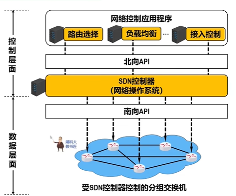
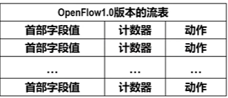
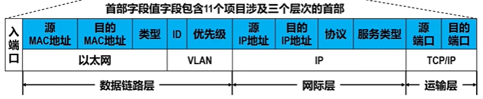
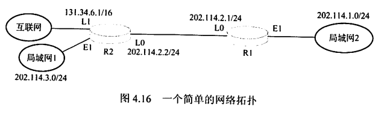
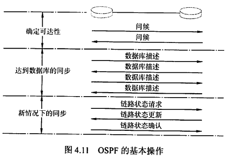
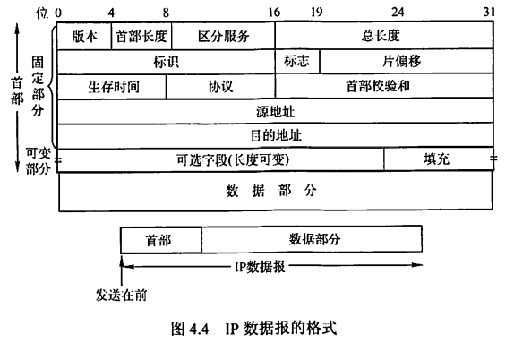
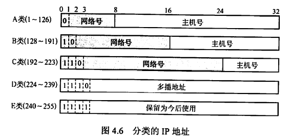
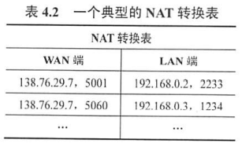
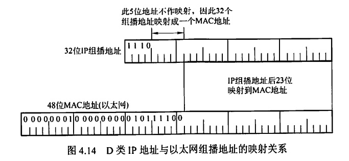

# 0x04 网络层

## 一、网络层功能

### 1.1 异构网络互联

网络互联：指用路由器进行网络互联和路由选择。

虚拟IP网络：使用相同IP协议参加互联的计算机网络，屏蔽了各物理网络的异构性，看上去好像是一个统一的网络。

### 1.2 路由与转发

路由选择：按照复杂的分布式算法，根据从各相邻路由器所得到的关于整个网络拓扑的变化情况，动态地改变所选择的路由

分组转发：路由器根据转发表将用户的IP数据报从合适的端口转发出去

### 1.3 SDN

- 传统互联网：路由器既有转发表（数据层面）又有路由选择软件（控制层面），即路由器既要负责与其他路由器交换路由信息、动态改变路由，又要负责转发数据
- SDN是一种新型网络体系结构

#### SDN（软件定义网络）

在网络的控制层面设置一个逻辑上的远程控制器，掌握各主机和整个网络的状态，并为每个分组计算出最佳路由，再将**转发表下发**给路由器。从而，路由器只需要负责数据层面的工作，即收到分组、查找转发表、转发分组。

- 在这种模式下，网络变成了集中控制的，但这并不意味着SDN要将整个互联网改造成集中控制的。SDN适用于一些大型数据中心之间的广域网，可以提高网络运行效率。
- 基于流的转发
- 数据层面与控制层面分离
- SDN具有很好的可编程性

#### OpenFlow

是SDN体系结构中控制层面和数据层面之间的通信接口，使得控制层面的控制器可以对数据层面中的物理设备进行直接访问和控制。

SDN并未规定必须使用OpenFlow，只是大多数SDN都使用OpenFlow

OpenFlow交换机可处理的帧：数据链路层的帧、网际层的IP数据报、传输层的TCP/UDP报文

#### 流表

对应传统路由器的路由表，但与路由表有区别。

- 流：穿过网络的一种分组序列，每个分组都共享首部某些字段的值，如某个流可以是具有相同源IP地址和目的IP地址的一连串分组

- 流表：SDN远程控制器来管理的

- 每个OpenFlow交换机有一个或多个流表，每个流表可以包含多个流表项

  

  - 首部字段值包含一组字段，用于匹配分组

  - 既有MAC首部，又有IP首部，还有TCP/IP首部

    

  - 交换机可采用的动作有

    - 将分组从对应端口转发出去
    - 丢弃分组
    - 复制分组并从多个端口转发出去
    - 重写分组的首部字段（三层协议的首部都可重写）

#### 优点

- 全局集中式控制和分布式高速转发，既利于控制层面的全局优化，又利于高性能的网络抓饭
- 灵活可编程与性能的平衡，控制和转发功能分离后，使得网络可以由专有的自动化工具以编程方式配置
- 降低城北，实现了网络设备的制造与功能软件的开发相分离

#### 问题

- 集中管理易受攻击，若崩溃则整个网络都受影响
- 瓶颈问题，网络规模扩大，控制器可能称为网络性能的瓶颈

### 1.4 拥塞控制

拥塞判断：观察网络吞吐量与网络负载

- 轻度拥塞：随着网络负载的增加，网络吞吐量明显小于正常吞吐量
- 拥塞状态：网络吞吐量随着网络负载的增大而下降
- 死锁状态：网络吞吐量下降到零

拥塞控制：

- 开环控制：设计网络时事先将有关因素考虑周到。是一种静态预防方法。在做决定时不考虑当前网络状态
- 闭环控制：采用检测网络系统监视并及时检测哪里发生了拥塞，将拥塞信息传到合适的地方以便调整网络系统的运行。是基于反馈环路的概念，是一种动态的方法。

拥塞控制与流量控制的区别：

- 流量控制是指发送端与接收端之间点对点通信量的控制，只需要抑制发送方的发送速率
- 流量控制必须要确保通信子网能够传送待传送的数据，是一个全局性的问题，涉及网络中所有的主机、路由器及导致网络传输能力下降的所有因素

## 二、网络层设备

### 2.1 冲突域与广播域

- 冲突域：连接到同一物理介质上的所有结点的集合，结点之间存在介质争用的现象。
  - 集线器、中继器等不能划分冲突域
  - 网桥、交换机、路由器等可以划分冲突域
- 广播域：接收同样广播消息的结点集合。
  - 集线器、交换机等设备所连接的结点都属于同一个广播域
  - 路由器可以划分广播域

### 2.2 路由器的组成和功能

#### 路由器

- 路由器是一种具有多个输入/输出端口的专用计算机，用于连接异构网络并完成路由转发。多个广播域互联时必须使用路由器。
- 路由器的功能：路由选择、分组转发
  - **一个存储转发设备实现了某一层功能，则意味着它可以互联该层及该层以下使用不同协议的两个网段。**
  - 路由器实现了网络层功能，意味着路由器可以<u>互联两个网络层、数据链路层、物理层协议都不同</u>的网段。
  - 网桥实现了数据链路层功能，意味着网桥可以<u>互联两个数据链路层、物理层协议都不同的网段</u>，但要求网络层及以上层次的协议要相同。
  - 中继器实现了物理层功能，但它不是存储转发设备，互联的两个网段物理层协议必须相同。
- 直接交付：若目的主机和源主机位于同一个网络上，则数据报无须经过路由器
- 间接交付：目的主机和源主机位于不同网络上，数据报需要经过路由器选择路由转发给下一个路由器
- 路由器是面向协议的，依据网络地址进行操作，一般提供对多种协议的支持，如OSI、TCP/IP、IPX等。而网桥与高层协议无关。

#### 路由选择与分组转发

- 路由选择部分也称为<u>控制部分</u>
  - 构成：路由选择处理机、路由表、路由选择协议
  - 核心构件：路由选择处理机
  - 任务：根据所选定的路由选择协议构造路由表，定时或经常地与相邻路由器交换路由信息而不断更新和维护路由表
- 分组转发部分
  - 构成：交换结构、一组输入端口、一组输出端口
  - 处理流程：
    - 输入端口从在物理层接收到的比特流中提取出数据链路层帧，进而从帧中提取出网络层数据报
    - 输出端口与输入端口操作相反
    - 交换结构根据转发表对分组进行处理，将来自输入端口的分组从一个合适的输出端口转发。有三种常用交换方法：通过存储器交换、通过总线交换、通过互联网络交换
  - 交换结构本身就是一个网络

### 2.3 路由表与转发表

#### 路由表

路由表根据路由选择算法得出，通常具有4个项目：目的网络IP地址、子网掩码、下一跳IP地址、接口.

例如，对于图中的网路拓扑：

R1的路由表如下：

| 目的网络IP地址 | 子网掩码      | 下一跳IP地址 | 接口 |
| -------------- | ------------- | ------------ | ---- |
| 202.114.1.0    | 255.255.255.0 | Direct       | E1   |
| 202.114.2.0    | 255.255.255.0 | Direct       | L0   |
| 202.114.3.0    | 255.255.255.0 | 202.114.2.2  | L0   |
| 0.0.0.0        | 0.0.0.0       | 202.114.2.2  | L0   |

路由表的结构追求对网络拓扑变化的计算最优化.

#### 转发表

转发表由路由表得出，其表项与路由表项有直接对应关系。

转发表格式与路由表格式不同，且其结构追求使查找过程最优化。

表项：目的地址、下一跳MAC地址

默认路由：用于代替所有具有相同“下一跳”MAC地址的项目，从而减少转发表的重复项目。默认路由设置得比其他项目的优先级低。

| 目的站 | 下一跳 |
| ------ | ------ |
| 1      | 直接   |
| 3      | MAC1   |
| 默认   | MAC2   |

分组的实际转发是靠直接查找转发表，而不是直接查找路由表。

## 三、路由算法

### 3.1 静态路由与动态路由

#### 静态路由

由网络管理员手工配置的路由信息，不能及时适应网络状态的变化，适用于简单的小型网络

- 优点：简便、开销较小

#### 动态路由

路由器上的路由表项通过相互连接的路由器之间彼此交换信息，然后按照一定的算法优化得到。这些路由信息会在一定时间内不断更新，以适应不断变化的网络。

- 优点：能改善网络性能并有助于流量控制
- 缺点：算法复杂，会增加网络的负担。

### 3.2 距离-向量路由算法

- 路由选择表：每条路径的目的地（另一个结点）、路径的代价（距离）
- 所有结点定期将它们的整个路由选择表传送给所有与之直接相邻的结点
- 所有结点都监听从其他结点传来的路由选择更新信息，并在以下情况下更新自己的路由选择表
  - 更新信息中包含了自己路由表中不存在的路由，新增该路由
  - 更新信息中包含一条已有的但距离更短的路由信息，替换该路由
- 网络中结点数越多，更新报文越大
- 可能遇到路由环路等问题
- 最常见的距离-向量路由算法是RIP算法，采用“跳数”作为距离的度量

### 3.3 链路状态路由算法

- 每个结点都具有完全的网络拓扑信息。
- 每个结点检查自己所有直接链路的状态，并将链路状态信息发送给网络中的其他所有结点
- 结点收到链路状态信息后，更新自己的网络拓扑和状态“视野图”，若链路状态发生变化，则结点对更新的网络图利用Dijkstra最短路径算法重新计算路由。

- 特征：
  1. 向本自治系统中所有路由器发送信息，使用泛洪法，即通过所有端口向所有相邻路由发送信息，收到信息的相邻路由器又将此信息发往其所有相邻路由器（但不再发送给发来信息的那个路由器）
  2. 发送的信息是路由器的直接链路状态
  3. 只有当链路状态发生变化时，路由器才向所有路由器发送此信息。
- 优点：
  - 每个路由结点使用同样的原始状态数据独立地计算路径，不依赖中间结点地计算
  - 链路状态报文仅包含单个结点的直接链路信息，其大小与网络中路由结点数量无关，因此具有更好的规模可伸展性。

### 3.4 层次路由

是OSPF路由协议所采用的，即将一个AS再划分为若干区域，每个路由器知道在本区域内的转发路由，而不必知道其他区域的内部结构。

## 四、路由协议

### 4.1 自治系统

自治系统（AS）是指单一技术管理下的一组路由器。

- 对于AS内部的分组转发，这些路由器使用AS内部的路由选择协议和共同的度量来确定转发路由
- 对于AS之间的分组转发，这些路由器使用AS之间的路由选择协议来确定转发路由

一个自治系统内的所有网络由一个行政单位管辖

一个自治系统的所有路由器必须是连通的

域内路由：AS内部的路由

域外路由：AS之间的路由

### 4.2 内部网关协议 IGP

#### 路由信息协议 RIP

- RIP是内部网关协议中最先得到广泛应用的协议，其最大优点是简单
- RIP规定
  - 网络中的每个路由器都要维护从**它自身**到**其他每个目的网络**的距离记录（距离向量）
  - 距离/跳数：规定一个路由器到其直接连接网络的距离为1，每经过一个路由器，距离+1
  - 优先选择跳数少的路径
  - 一条路径最多只能包含15个路由器，当距离为16时，表示网络不可达。因此RIP只适用于小型互联网。最高跳数的设置可以防止数据报不断循环在环路上
  - 默认任意两个使用RIP的路由器之间每30秒广播一次RIP路由更新信息，以自动建立并维护路由表
  - RIP中每个网络的子网掩码必须相同。但在新的RIP2中，支持变长子网掩码和CIDR。
- RIP特点
  - 仅与相邻路由器交换信息
  - 交换的信息是当前路由器所知道的全部信息，即自己的路由表
  - 按固定的时间间隔交换路由信息
  - **RIP是应用层协议**，使用UDP传送数据（端口520）. RIP选择的路径不一定是时间最短的，但一定是具有最少路由器的路径。
- **算法流程（即距离-向量路由算法）**
  1. 收到来自路由器X的RIP报文，先修改此报文中的所有项目：将“下一跳”字段都修改为X，并将“距离”字段的值+1
  2. 对于修改后的报文中的每个项目：
     - 本路由表中没有该项目的目的网络N，将该项目添加到本路由表中
     - 本路由表中有该项目的目的网络N，且对应下一跳地址也为X，用收到的项目替换原项目
     - 本路由表中有该项目的目的网络N，但对应下一跳地址不是X，则比较距离大小。若收到的项目距离更小，则用收到的项目替换原项目，否则什么也不做。
  3. 如果180秒后还没有收到相邻路由器的RIP报文，则把该路由器标记为不可达路由器（即把距离设置为16）
- RIP优点
  - 实现简单
  - 开销小
  - 收敛过程较快
- RIP缺点
  - 限制了网络规模，最大距离为15
  - 路由器之间交换的是完整路由表，因此网络规模越大，开销越大
  - 网络出现故障时，会出现慢收敛现象，即坏消息传得慢，使得更新过程的收敛时间长

#### 开放最短路径优先协议 OSPF

- OSPF是使用分布式链路状态路由算法的典型代表

- OSPF特点

  - 向本自治系统中的所有路由器发送信息，使用泛洪法
  - 交换的信息是当前路由器所知道的部分信息，即与本路由器相邻的所有路由器的链路状态
  - 只有当链路状态发生变化时，路由器才用泛洪法向所有路由器发送此信息，并且更新过程收敛快，不会出现RIP算法中“坏消息传得慢”的问题。
  - **OSPF是网络层协议**，不使用UDP或TCP，而直接用IP数据报传送（首部协议字段89）.
  - 对不同链路可根据IP分组的不同服务类型设置为不同的代价，从而对不同的业务可计算出不同的路由，灵活性强
  - 多路径间的负载平衡：若到同一目的网络有多条相同代价的路径，则将通信量分配给这几条路径
  - 分组具有鉴别功能，保证了仅在可信赖的路由器之间交换链路状态信息
  - 支持可变长度的子网划分和无分类编址CIDR
  - 每个链路状态都带上一个32位的序号，序号越大，状态就越新

- OSPF工作原理

  - 所有路由器上都能建立一个链路状态数据库/全网的拓扑结构图
    - 为确保链路状态数据库全网同步，规定每隔一段时间刷新一次数据库的链路状态
  - 每个路由器根据这个拓扑结构图，使用Dijkstra最短路径算法计算从自己到各目的网络的最优路径，从而构造自己的路由表
  - 为了使OSPF能应用于规模很大的网络，OSPF将一个自治系统划分为若干个更小的“区域”
    - 泛洪法交换链路信息的范围局限在每个“区域”上，从而减少整个网络上的通信量。
    - 一个区域内的路由器只知道自己区域的网络拓扑
    - 区域有层次划分，处于上层的区域称为“主干区域”，负责连通其他下层区域，有时还连接其他自治域

- OSPF分组类型

  - 问候分组：用于发现和维持邻站的可达性

    - 每隔10秒，每两个相邻路由器要交换一次问候分组

  - 数据库描述分组：向邻站给出自己的链路状态数据库中所有链路状态项目的摘要信息

    - 路由器刚开始工作时，相邻路由器需要用数据库描述分组交换摘要信息，以同步数据库

  - 链路状态请求分组：向对方请求发送某些链路状态项目的详细信息

  - 链路状态更新分组：用泛洪法对全网更新链路状态

  - 链路状态确认分组：对链路更新分组的确认

    

- OSPF优点

  - 适用于网络规模很大的情况，没有“坏消息传得慢”的问题

### 4.3 外部网关协议 EGP

#### BGP定义

- 边界网关协议（BGP）是一种外部网关协议，用于不同自治系统的路由器之间交换路由信息。
- 力求找到一条能够到达目的网络且比较好的路由（不能兜圈子），而不是最佳路由
- 采用路径向量路由选择协议，与距离向量协议和链路状态协议有很大区别
- **BGP是应用层协议**，**使用TCP报文传送**

#### BGP要解决的问题

- 自治系统之间路由选择困难
- 对于自治系统之间的路由选择，要寻找最佳路由是很不现实的
- 自治系统之间的路由必须考虑有关策略

#### BGP工作原理

- 自治系统管理员选择一个或多个路由器作为该自治系统的“BGP发言人“
- BGP发言人负责与其他自治系统的BGP发言人交换路由信息
  1. 交换路由信息时，首先要建立TCP连接
  2. 在TCP连接上交换BGP报文以建立BGP会话
  3. 利用BGP会话交换路由信息
  4. 所有BGP发言人都相互交换网络可达性信息后，即可找出到达各自治系统的较好路由
- BGP发言人既要运行BGP，也要运行自己所属AS所用的内部网关协议

#### BGP特点

- BGP交换路由信息的结点的数量级是自治系统的数量级，比自治系统中的网络数少很多
- 每个自治系统中BGP发言人数量很少，使得路由选择不至于过分复杂
- BGP支持CIDR
- 路由表表项既包含目的网络前缀、下一跳路由器，还要包括到达该目的网络所要经过的<u>各个自治系统序列</u>
- 在BGP刚开始运行时，BGP的邻站交换整个BGP路由表；随后只在发生变化时更新有变化的部分。节省网络带宽和处理开销。

#### BGP报文

- 打开报文：用来与相邻的另一个BGP发言人建立关系
- 更新报文：用来发送某一路由的信息，以及列出要撤销的多条路由
- 保活报文：用来确认打开报文并周期性地证实邻站关系
- 通知报文：用来发送检测到的差错

|                                | **RIP**                                      | **OSPF**                                           | BGP                                  |
| ------------------------------ | -------------------------------------------- | -------------------------------------------------- | ------------------------------------ |
| 类型                           | 内部网关协议                                 | 内部网关协议                                       | 外部网关协议                         |
| 路由算法                       | 距离-向量                                    | 链路状态                                           | 路径-向量                            |
| 路径选择                       | 跳数最少                                     | 代价最低                                           | 较好，非最佳                         |
| **信息交换范围**               | 仅与相邻路由器                               | 洪泛法向全网路由器发送                             | 仅与相邻路由器                       |
| **交换的信息内容**             | 自己的路由表                                 | 与本路由器相邻的链路状态                           | 首次：整个路由表非首次：有变化的部分 |
| **交换时机**                   | 按固定时间间隔交换                           | 仅在链路状态更新时交换                             | /                                    |
| **所在层次**                   | 应用层（端口520），UDP数据报传送             | 网络层，IP数据报传送                               | 应用层，TCP数据报传送                |
| **对变长子网掩码和CIDR的支持** | 不支持，要求每个网络子网掩码都相同           | 支持                                               | 支持CIDR                             |
| **距离的定义**                 | 规定一个路由器到其直接连接网络的距离为1      | 可为不同服务给出不同定义，灵活性强                 | /                                    |
| **优点**                       | 实现简单；开销小                             | 适用于网络规模很大的情况，没有“坏消息传得慢的问题” | /                                    |
| **缺点**                       | “坏消息传得慢”、网络规模有限（最大距离为15） | /                                                  | /                                    |

## 五、IPv4

### 5.1 IPv4分组格式

IPv4的首部分为固定部分和可变部分。

- 固定部分：长度固定，共20B，所有IP分组都具有，因此IPv4的首部至少为20B
- 可变部分：包含一些可选字段，其长度可变

**首部的重要字段**

- 版本：IP协议的版本
- 首部长度：4bit，最多可表示15个单位，而***<u>单位为4B</u>***。因此该字段可表示的最长首部长度为15×4B=60B，即一个IP数据报的首部至少为20B，至多为60B，且首部长度必须为4B的整数倍
- 总长度：16bit，最多可表示2^16个单位，而***<u>单位为1B</u>***。指首部和数据之和的长度。因此一个IP数据报的最大长度为65535B。然而，IP数据报交到数据链路层作为以太网帧的数据部分时，由于以太网帧的MTU值为1500B，若一个IP数据报的总长度超出该值，则需要分片封装成多个以太网帧。
- 标识：16bit，是一个计数器，每产生一个数据报就+1，但不是序号。IP数据报分片时，每个分片的标识都相同
- 标志：3bit
  - 最低位为MF（More Fragment），MF=1时表示后面还有分片，MF=0时表示最后一个分片
  - 中间一位为DF（Don't Fragment），DF=0时才允许分片
- 片偏移：13bit，最多可表示2^13个单位，而***<u>单位为8B</u>***。指出一个分片在原数据报中的相对位置。
  - 这个相对位置不含首部。即记数据部分的开头为相对位置0.
  - **每个分片（除最后一个分片外）的数据部分长度一定是8B的整数倍**
- 生存时间（TTL）：8bit，数据报在网络中可通过的路由器的最大值，每通过一个路由器，TTL-1，当TTL被减为0时丢弃该分组，以免分组在网络中永远循环
- 协议：8bit，指出此数据报携带的数据使用何种协议，即应该上交给传输层的哪个协议进行处理。6表示TCP，17表示UDP
- 首部校验和：16bit，只校验数据报的首部，不校验数据部分
- 源地址字段：4B，发送方的IP地址
- 目的地址字段：4B，接收方的IP地址

**必须记住的内容**

首部长度字段的单位是4B

总长度字段的单位是1B

片偏移字段的单位是8B

每个分片（除最后一个分片外）的数据部分长度一定是8B的整数倍

### 5.2 IP数据报的分片与重组

#### 如何分片

IP数据报下发给数据链路层进行封装时，由于数据链路层的各个协议都有MTU限制（如以太网帧为1500字节），可能需要将一个IP数据报分片并封装成多个帧，以符合MTU要求。

- 每个片都是一个IP数据报。
- 每个片都具有与原数据报基本相同的首部（个别字段不同）。

#### 分片计算

例，一个长4000B（首部20B，数据部分3980B）的IP数据报需要转发到一条MTU为1500B的链路上。则：

- 一个分片中可包含20B首部和1480B数据部分，又总数据部分为3980B，所以需要为分为3个分片
- 每个分片的首部标识字段与原数据报的首部标识字段相同
- 第1个分片的MF=1，DF=0，片偏移=0
- 第2个分片的MF=1，DF=0，片偏移为185，即从原数据报的第185×8=1480字节开始，因为第1个分片已包含了数据部分的前1480字节。
- 第3个分片的MF=0，DF=0，片偏移为370，即从原数据报的第2960字节开始。

#### 重组

- 分片在目的主机的网络层被重新组装
- 目的主机检查数据报的标识号，具有同一标识号的数据报即属于同一个原始数据报的分片。然后根据片偏移字段确定分片的先后顺序。

#### 不需要分片的情况

广域网中的分组不必分片。

因为广域网所能通过的分组最大长度是广域网中的所有结点都事先知道的，源结点不会发送网络不支持的过长分组。

### 5.3 IPv4地址与NAT

#### IPv4地址

IP地址分为网络号和主机号两部分

- 网络号：标识主机或路由器所连接的网络，在整个因特网范围内唯一
- 主机号：标识主机或路由器，必须在所属网络中唯一

特殊用途的IP地址：

- 主机号全0：表示本网络本身
- 主机号全1：表示本网络的广播地址
- 127.x.x.x：保留为环回自检地址，表示任意主机本身。以此类IP地址位目的地址的IP数据报永远不会出现在任何网络上（只会占用A类地址的网络号）
- 32位全0（0.0.0.0）：表示本网络上的本主机（只会占用A类地址的网络号）
- 32位全1（255.255.255.255）：表示整个TCP/IP网络的广播地址，由于存在路由器对广播域的隔离，一般等效位本网络的广播地址（只会占用E类地址的网络号）

IP地址特点：

- 是分等级的地址结构，由网络号和主机号两部分组成
  - IP地址管理机构在分配IP地址时只分配网络号，而主机号则由对应单位自行分配，方便管理
  - 路由器仅根据目的主机所连接的网络号来转发分组，减小了路由表所占存储空间
- IP地址是标识一台主机和一条链路的接口。当一台主机同时连接到两个网络时，该主机必须同时具有两个相应的IP地址。因此路由器都至少有两个IP地址
- 用转发器或桥接器连接的若干LAN仍然是同一个网络
- 所有分配到网络号的网络（无论是LAN还是WAN）都是平等的
- 在同一个局域网上的主机或路由器的IP中的网络号必须相同。

IP地址分类：

| 网络类别 | 最大可用网络数 | 第一个可用网络号 | 最后一个可用网络号 | 一个网络中的最大主机数 |
| -------- | -------------- | ---------------- | ------------------ | ---------------------- |
| A        | $2^7-2$        | 0                | 126                | $2^{24}-2$             |
| B        | $2^{14}$       | 128.0            | 191.255            | $2^{16}-2$             |
| C        | $2^{21}$       | 192.0.0          | 223.255.255        | $2^8-2$                |

#### 网络地址转换 NAT

- 作用：将专用网络地址转换为公用地址，从而对外隐藏内部管理的IP地址。
- 好处
  - 整个专用网络只需要一个全球IP地址就可以与因特网连通。
  - 隐藏了内部网络结构，降低了内部网络收到攻击的风险

- 私有IP地址/可重用地址

  - 只用于LAN，不用于WAN
  - 必须通过NAT转换成公用地址后才能用于因特网的地址。
  - 路由器收到目的地址为私有地址的数据报时，一律不进行转发。
  - 网段：
    - 1个A类网段，即**10**.0.0.0~**10**.255.255.255
    - 16个B类网段，即**172.16**.0.0~**172.31**.255.255
    - 256个C类网段，即**192.168.0.**0~**192.168.255**.255

- NAT转换表

  - 表项：{本地IP地址:端口} {全球IP地址:端口}
  - 多个私有IP地址可以映射到同一个全球IP地址

  

- 普通路由器转发IP数据报时，不改变其源IP地址和目的IP地址，仅工作在网络层

  NAT路由器转发IP数据报时，一定要更换其IP地址（转换源IP地址或目的IP地址），还需要查看和转换端口号（传输层）

### 5.4 子网划分、子网掩码、CIDR

#### 子网划分

- 子网划分是一个单位内部的事情，对外表现为没有划分子网的网络
- 子网号占用了原本两级结构中主机号的一部分
- 划分子网后的IP地址，其网络号不改变
- 分类地址中，子网号不能为全1或全0；CIDR中，子网号可以为全1或全0

#### 子网掩码

若使用子网掩码，则

1. 一台主机在设置IP地址信息时，必须设置子网掩码
2. 同属于一个子网的所有主机及路由器的相应端口，必须设置相同的子网掩码
3. 路由器的路由表中，所包含信息的主要内容有目的网络地址、子网掩码、下一跳地址

#### 无分类编址CIDR

采用CIDR时，IP地址的记法为：IP地址/网络前缀所占比特数。如128.14.32.5/20，表示IP地址前20位是网络前缀，后12位是主机号

CIDR没有在32位地址中指明若干位作为子网字段，但单位内部仍可按照需要划分子网。如对地址块/20，可再从主机号中借用3位，从而划分出8个子网，此时单位内部的IP地址为IP地址/23

CIDR地址块：

- 网络前缀都相同的连续IP地址组成CIDR地址块
- 一个CIDR地址块可以表示很多地址，称为路由聚合/构成超网
- 有利于减少路由器之间的信息交换，提高网络性能
- 地址数一定是2的整数次幂，实际可指派地址为$2^N-2$，主机号全0和全1的地址都不使用

CIDR优点：

- 网络前缀长度灵活。上层网络前缀长度较短，路由表项目少；网络内部又可自行延长网络前缀划分子网

最长前缀匹配（最佳匹配）：

- 使用CIDR时，路由表的每个项目构成：网络前缀+下一跳地址，可能不止一个结果
- 从匹配结果中选择具有最长网络前缀的路由
- 最常用的数据结构：二叉线索

#### 计算技巧

192 = 1100 0000

168 = 1010 1000

96 = 0110 0000

240 = 1111 0000

224 = 1110 0000

### 5.5 网络层转发分组

#### 转发表

分组转发是基于目的主机所在网络的。

转发表必包含两条信息：目的网络-下一跳地址

特殊路由：

- 主机路由：对特定目的主机的IP地址专门指明一个路由，以便控制和测试网络。如a.b.c.d/32
- 默认路由：用特殊前缀0.0.0.0/0表示默认路由，只要目的网络是不在转发表中的其他网络，一律选择默认路由

#### 分组转发算法

1. 从收到的IP数据报的首部提取目的主机的IP地址D
2. 若查找到特定主机路由，则按照这条路由的下一跳转发，否则按前缀长度从长到短的顺序开始检查
3. 对于检查到的每一条路由信息，将路由信息的子网掩码与D进行与运算，若所得结果与路由信息的前缀匹配，则查找结束，按照下一跳转发；否则继续检查下一条路由信息
4. 全部检查完毕仍未转发，此时若还存在默认路由，则按默认路由转发；如果没有默认路由，报告转发分组出错

在IP数据报的转发过程中，会修改其MAC帧首部的MAC地址信息。在不同网络中传送时，MAC帧中的源地址和目的地址会变化；而网桥转发帧时，不改变帧的源地址

### 5.6 ARP、DHCP、ICMP

#### IP地址与硬件地址

为什么不直接使用硬件地址进行分组转发：

- 由于路由器的隔离，IP网络中无法通过广播MAC地址来完成跨网络的寻址
- 通过路由器转发分组时，IP分组在每个网络中都由路由器拆封和重新封装，其MAC帧首部的源地址和目的地址会不断改变，这决定了无法使用MAC地址跨网络通信
- 互联在一起的网络的硬件地址体系各不相同，而在IP层抽象的互联网中能够使用统一的、抽象的IP地址研究通信

#### 地址解析协议 ARP

- 负责IP地址到MAC地址的映射。<u>工作在网络层</u>.

- ARP表：存放本局域网上各主机和路由器的IP地址到MAC地址的映射表
  
- 每台主机都设有一个ARP高速缓存，用于存储ARP表
  
- ARP的工作原理

  - 主机A准备向本局域网内的主机B发送IP数据报。A首先查找自己的ARP高速缓存，看有无主机B的IP地址。
  - 若有，则查出主机B对应硬件地址，写入MAC帧的目的地址并发送；若没有，则将FF-FF-FF-FF-FF-FF写入MAC帧的目的地址，并广播ARP请求分组，使局域网内所有主机都收到此ARP请求
  - 主机B收到ARP请求后，向主机A（而不是广播）发送ARP响应分组，分组中包含主机B的IP与MAC地址的映射关系
  - 主机A收到ARP响应分组后，将映射写入自己的ARP缓存，然后按照查询到的硬件地址发送MAC帧

  若需要向其他局域网的主机发送IP数据报，则要查找的硬件地址为本局域网路由器的硬件地址。

#### 动态主机配置协议（DHCP）

- 给主机动态分配IP地址。允许一台计算机加入新的网络和获取IP地址而不用手工参与
- 应用层协议，基于UDP，以客户端/服务器模式工作
- 服务器端口67，客户端端口68
- 工作原理：
  1. 客户机广播”DHCP DISCOVER“消息，寻找网络中的DHCP服务器。该消息源地址为0.0.0.0，目的地址为255.255.255.255
  2. 服务器收到消息，广播”DHCP提供“消息，其中包含提供给客户机的IP地址。该消息源地址为服务器地址，目的地址为255.255.255.255
  3. 客户机收到消息，若接受该IP地址，则广播”DHCP请求“消息。该消息源地址为0.0.0.0，目的地址为255.255.255.255
  4. 服务器广播”DHCP确认“消息，将该IP地址分配给客户机。该消息源地址为服务器地址，目的地址为255.255.255.255
- DHCP分配的IP地址是临时的，存在时间限制，即租用期。租用期由服务器决定，客户机也可在报文中提出要求
- 客户机与服务器之间需要通过广播方式进行交互，因为客户机尚未有IP地址

#### 网际控制报文协议（ICMP）

- IP层协议
- ICMP差错报文：目标主机或到目标主机路径上的路由器向源主机报告差错和异常情况
  - 终点不可达：路由器或主机不能交付数据报
  - 源点抑制：路由器或主机由于拥塞而丢弃数据报时，发送抑制报文使源点放慢发送速率
  - 超时：路由器收到TTL=0的数据报时向源点发送该报文，或终点没有在预先规定的时间内收到一个数据报的全部分片时发送该报文，并丢弃已收的分片
  - 参数问题：路由器或目的主机收到的数据报首部存在不正确的字段
  - 改变路由（重定向）：路由器发给源主机，让源主机知道下次应该将报文发给另外的路由器
- 不应发送ICMP差错报文的情况：
  - ICMP差错报文发送过程出错，不再发送差错报文
  - 对具有组播地址的数据报都不发送差错报文
  - 对具有特殊地址（如127.0.0.0或0.0.0.0）的数据报不发送差错报文
- ICMP询问报文
  - 回送（echo）请求和回答报文
  - 时间戳请求和回答报文
  - 地址掩码请求和回答报文
  - 路由器询问和通告报文
- ICMP两个最常见的应用
  - Ping
    - 使用ICMP回送请求和回答报文
    - 工作在应用层，但直接使用网络层的ICMP，不适用TCP或UDP
  - Traceroute/Tracert
    - 使用ICMP超时报文
    - 工作在网络层

## 六、IPv6

### 6.1 IPv6特点

#### 主要特点

- 更大的地址空间，128位地址
- 扩展的地址层次结构
- 灵活的首部格式
- 改进的选项
- 允许协议继续扩充
- 支持即插即用（即自动配置）
- 支持资源预分配
- IPv6只有在包的源结点才能分片，在传输路径的路由器上不能再分片。所以从一般意义上说，IPv6不允许分片
- **取消了校验和字段**
- **IPv6首部长度必须是8B的整数倍，而IPv4首部是4B的整数倍**
- 增大了安全性。<u>身份验证和保密功能是IPv6的关键特征</u>

#### 相对于IPv4的改进

- 大大扩充了地址空间
- 简化了IP数据报首部，包含8个域。使路由器能够更快地处理分组，从而可以改善吞吐率
- 更好地支持选项。一些之前必要的字段现在变成了可选字段，此外，表示选项的方式的改变还能加快分组的处理速度。

### 6.2 IPv6数据报

#### 目的地址类型

- 单播：即传统的点对点通信
- 多播：一点对多点的通信
- 任播：IPv6新增的类型，目的站是一组计算机，但数据报在交付时只交付其中的一台计算机，通常是距离最近的计算机

#### 地址表示法

地址中的每4位用一个十六进制数表示，并用冒号分隔每16位。

紧凑处理：

- 当一个16位域中的开头存在一些连续的0时，直接省略不写；若整个16位域都是0，则用一个0来表示

- 有相邻的0值域时，还可以用双冒号缩写，如4BF5:0000:0000:0000:BA5F:xxxxxx可缩写为4BF5::BA5F:xxxxxx

  由于双冒号代替的是不定个数的0值域，为了能够从总值域数推算被省略的0值域的个数，双冒号在IP地址中只能出现一次

#### 分级概念扩展

使用三个等级，以便路由器能够更快地查找路由

- 第一级（顶级）：指明全球都知道的公共拓扑
- 第二级（场点级）：指明单个场点
- 第三级：指明单个网络接口

#### 兼容与过渡

- IPv6系统必须能够接受和转发IPv4数据报，并且能够为IPv4数据报选择路由
- 双协议栈：在一台设备上同时装有IPv4和IPv6协议栈。若这台设备是计算机，则该计算机既有IPv4地址，又有IPv6地址，并具备同时处理这两个协议地址的功能。若该台设备是路由器，则可能分别连接了IPv4网络和IPv6网络
- 隧道技术：将整个IPv6数据报封装到IPv4数据报的数据部分，从而使得IPv6数据报可以在IPv4网络的隧道中传输

## 七、IP组播

### 7.1 组播的概念

- 组播：发送方把单个分组发送给一个组播地址，该组播地址标识一组地址。而后由网络负责把这个分组的副本（仅在传送路径出现分岔时复制）投递给该组中的每一台主机。一台主机可以同时属于多个组。
- 主机如何加入组播组：使用IGMP协议，通知本地网络上的路由器。
- 硬件支持：能够运行组播协议的路由器。
- 组播一定仅应用于UDP，不可能用TCP。
- 组播的应用：视频点播、视频会议等，发送方需要将一个分组发送给多个目的主机的场合
- 以多个单播仿真组播的缺陷：引起主机上大量的处理开销和增大网络负载

### 7.2 IP组播地址

- D类地址格式。前四位为1110，范围224.0.0.0~239.255.255.255，每个D类地址标识一个组播组。

- 组播数据报

  - 使用D类地址作为目的地址，且协议字段为2，表示使用IGMP
  - 尽最大努力交付，不提供可靠交付
  - 组播地址只用于目的地址，不能用于源地址
  - 不产生ICMP报文。Ping一个组播地址不会有响应。
  - 不是所有的D类地址都是组播地址

- 硬件组播

  - 在因特网上进行组播的最后阶段，还是要把组播数据包在局域网上通过硬件组播交付给组播组的所有成员
  - 以太网组播地址的范围：01-00-5E-00-00-00 到 01-00-5E-7F-FF-FF，即前9位固定，只有后23位用于组播。而D类IP地址中前4位固定，有28位可用于组播。由于以太网组播地址中的后23位与D类IP地址的后23位有对应关系，D类IP地址中有5位不参与映射。不参与映射的位，无论值如何，在映射时都视为0处理。
- 例如，IP地址224.215.145.230，其中215=1101 0111，最高位即从右往左第24位，是不参与映射的位，视为0处理，故这一个字节对应的MAC地址字段应为57H，完整MAC地址位01-00-5E-57-91-E6
  

  - 两个不同的IP组播地址可能会转换成同一个以太网硬件组播地址。收到组播数据报的主机，还要在IP层利用软件进行过滤

### 7.3 IGMP与组播路由算法

- IGMP是网际协议IP的一个组成部分
- IGMP不是在因特网范围内对所有组播组成员进行管理的协议。IGMP不知道组播组包含成员数，也不知道成员分布在哪些网络上，IGMP仅让本地局域网的组播路由器知道本局域网上是否有主机参加或退出了某个组播组
- 工作流程
  - 第一阶段：某台主机要加入新的组播组，该主机向组播组的地址发送一个IGMP报文，声明自己要成为该组成员。本地局域网的组播路由器首先收到该报文，再将组成员关系转发给因特网上其他组播路由器
  - 第二阶段：本地组播路由器需要周期性询问局域网内主机，以确定这些主机是否仍是某个组的成员。如果对于某个组，在经过几次探询后仍未有主机响应，则不再将该组的成员关系转发给其他组播路由器
- 组播路由算法
  - 实际上是要找出**以源主机为根结点的组播转发树**，从而每个分组在每条链路上只传送一次。
  - 不同的多播组对应不同的多播转发树
  - 同一个多播组，对不同的源点也会有不同的多播转发树
  - 主要实现：基于链路状态的路由选择、基于距离-向量的路由选择、可以建立在任何路由器协议之上的协议无关的组播（PIM）

### 7.4 广播帧与组播帧的过滤区别

主机可能会收到目的地不是自己的广播帧或组播帧，需要对这些帧进行识别并丢弃。但处理部件是不同的。

广播帧：通过网卡NIC接收广播帧，然后网卡将帧传递给操作系统。CPU执行协议软件，来界定是否接收或处理该广播帧

组播帧：由网卡直接界定是否接收或处理该组播帧，不由CPU处理。CPU仅对网卡进行相关配置。

## 八、移动IP

### 8.1 移动IP基本概念

- 移动结点：把其连接点从一个网络或子网改变到另一个网络或子网的主机
- 移动IP：移动结点以固定的网络IP地址实现跨越不同网段的漫游功能，并保证基于网络IP的网络权限在漫游过程中不发生任何改变
- 本地代理：在一个网络环境中，一个移动结点的永久居所称为<u>归属网络</u>，归属网络中代表移动结点执行移动管理功能的实体称为<u>归属代理/本地代理</u>。本地代理根据移动用户的转交地址，采用隧道技术转交移动结点的数据报
- 外部代理：在外部网络中帮助移动结点完成移动管理功能的实体称为<u>外部代理</u>
- 移动IP与移动自组网络的区别
  - 移动IP使漫游主机以多种方式连接到因特网，网络功能仍基于固定互联网中使用的各种路由选择协议
  - 移动自组网络是将移动性扩展到无线领域中的自治系统，有自己独特的路由选择协议，可以不和因特网连接
- 移动IP和动态IP是完全不同的两个概念

### 8.2 移动IP通信过程

- 每个移动结点具有唯一的本地地址，在移动过程中本地地址不变。本地网络上有一个本地代理维护移动结点当前的位置信息
- 当移动结点连接到外地网络上时，以转交地址标识移动结点当前所处位置，以便进行路由选择。
- 移动绑定/绑定：移动结点的本地地址与当前转交地址的联合
- 移动结点得到一个新的转交地址后，通过绑定向本地代理进行注册。
- 基本通信流程：
  1. 移动结点在本地网络时，按传统方式进行通信
  2. 移动结点漫游到外地网络时，仍用本地地址进行通信，但需要向本地代理注册当前的转交地址，以便收到转发给它的IP分组
  3. 本地代理收到注册后，会构建一条通向转交地址的隧道，将截获的发给移动结点的IP分组通过隧道送至转交地址（外部代理）
  4. 在转交地址处解封，最后送到移动结点
  5. 位于外地网络的移动结点发送数据报，需要通过外网的路由器或外部代理
  6. 移动结点更换外地网络时，只需要向本地代理更新转交地址
  7. 移动结点回到本地网络时，向本地代理注销转交地址
- 在移动IP中，一个移动结点具有两个IP地址，即本地地址和转交地址。本地地址是始终不变的，而转交地址根据移动结点所在的外网改变