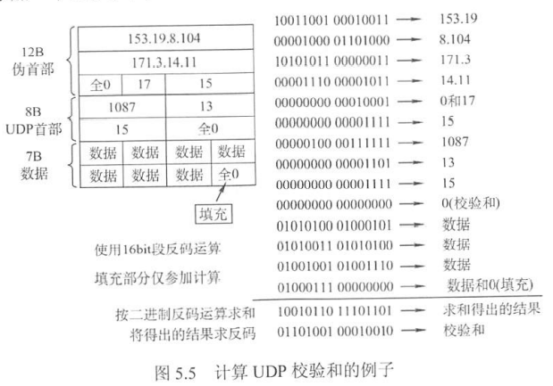
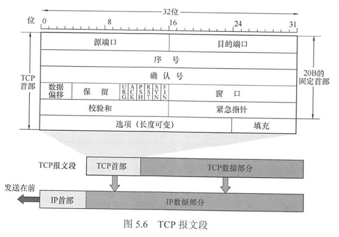
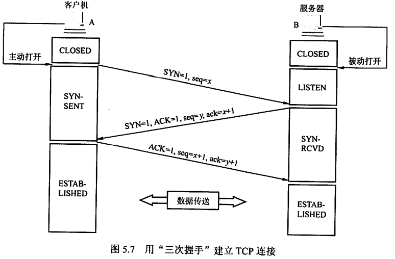
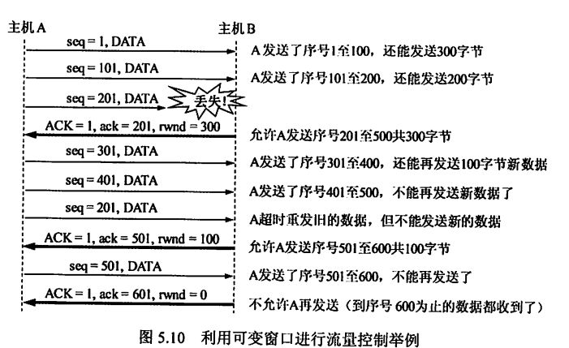
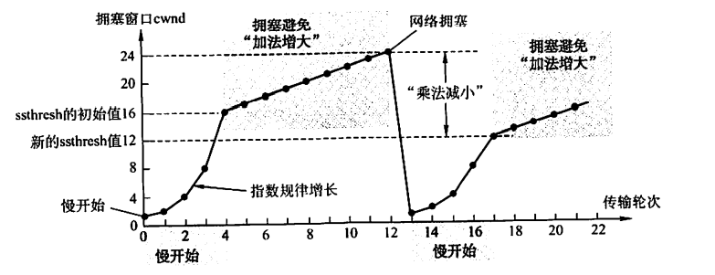
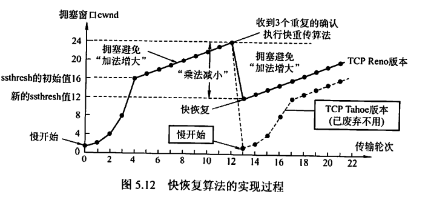

# 0x05 传输层

## 一、传输层概述

### 1.1 传输层功能

传输层是面向通信部分的最高层，也是用户功能中的最低层。

- 传输层为运行在<u>不同主机上的进程</u>之间提供逻辑通信/端对端通信。
- 复用与分用（不是传输层特有的，网络层也有）
  - 复用：发送方不同的应用进程可使用同一个传输层协议传送数据
  - 分用：接收方的传输层在剥去报文首部后能够把这些数据正确交付到目的应用进程
- 对首部和数据部分进行差错检测。
- 提供两种不同的传输协议，即面向连接的TCP和无连接的UDP

### 1.2 传输层的寻址与端口

#### 端口

端口是传输层服务访问点（SAP），标识主机中的应用进程。

对应地，网络层SAP是IP地址，标识主机；数据链路层SAP是MAC地址，标识主机。

传输层的端口是软件端口，而不是硬件端口。

#### 端口号

端口号长度为16bit，能表示65536个不同的端口号。

端口分类：

- 服务器端端口号

  - 熟知端口号，0~1023。

    | 应用程序   | FTP  | TELNET | SMTP | DNS  | TFTP | HTTP | SNMP |
    | ---------- | ---- | ------ | ---- | ---- | ---- | ---- | ---- |
    | 熟知端口号 | 21   | 23     | 25   | 53   | 69   | 80   | 161  |

  - 登记端口号，1024~49151.

    供没有熟知端口号的应用程序使用，使用此类端口号必须在IANA登记，以防重复

- 客户端端口号

  - 49152~65535
  - 仅在客户进程运行时才动态选择，又称为临时端口。通信结束后端口号可供其他客户进程继续使用。

#### 套接字

套接字唯一地标识网络中的一台主机和其上的一个进程，即（IP地址:端口号）

### 1.3 无连接服务与面向连接服务

无连接服务：两个实体之间的通信不需要预先建立连接，通信时，直接将信息发送到网络上，由网络尽力而为地向目的地传送

面向连接服务：两个实体之间地通信需要预先建立连接，通信时，整个连接的情况被实时监控和管理。通信结束后需要释放连接。

**TCP**

- 提供面向连接服务
- 提供可靠传输服务，以增大分组首部长度及处理开销为代价。
- 不提供广播或组播服务，是点对点的
- 适用场合：文件传输协议（FTP）、超文本传输协议（HTTP）、远程登录（TELNET）

**UDP**

- 提供无连接、不可靠服务
- 仅在IP之上附加了两个服务：多路复用和对数据的错误检查
- 接收方不需要对UDP报文给出确认
- 简单、执行速度快、实时性好
- 使用场合：小文件传输协议（TFTP）、DNS、SNMP、实时传输协议（RTP）

**TCP和网络层虚电路的区别**

- TCP报文在传输层抽象的逻辑信道中传输，对路由器不可见
- 虚电路经过的交换结点都必须保存虚电路状态信息
- 若网络层采用虚电路方式，则无法提供无连接服务；而传输层采用TCP不影响网络层提供无连接服务。

## 二、UDP

### 2.1 UDP特点

- **无连接**，也不需要维护连接状态，能支持更多的活动客户机
- **尽最大努力交付**，不保证可靠交付
- **面向报文**：不合并不拆分，对于应用层交下来的报文，只添加首部就下交给网络层。报文是UDP数据报处理的最小单位。
- **无拥塞控制**：适用于一些要求以稳定速度发送、能容忍一些数据丢失但不允许有较大时延的应用
- **首部开销小**：TCP有20B的首部开销，UDP仅有8B开销
- **支持一对一、一对多、多对一、多对多通信**
- 常用于一次性传输较少数据的网络应用、多媒体应用

### 2.2 UDP首部格式

首部长度固定8B，由4个字段构成，每个字段占2B

- 源端口：源端口号。在需要对方回应时选用，不需要时可以为全0
- 目的端口：目的端口号。在终点交付报文时必须使用
- 长度：UDP数据报的长度（包括首部和数据），其最小值是8（即仅有首部而无数据时）
- 校验和：检测UDP数据报在传输中是否有错，有错则丢弃。是可选字段，若源主机不想计算校验和，可以为全0.

若接收方发现报文目的端口号不正确，则丢弃该报文，并通过ICMP发送“端口不可达”差错报文给发送方。

### 2.3 UDP校验

#### 伪首部

在计算校验和时，要在UDP数据报前增加12B的伪首部参与计算。伪首部仅用于计算校验和，不向上递交也不会向下传送。

伪首部内容包括：

- 源IP地址（4B）
- 目的IP地址（4B）
- 固定值为0的字段（1B）
- 固定值为17的字段（1B）
- UDP长度（2B）

由于伪首部参加了校验和的计算，故UDP校验还可以检查IP数据报的源IP地址和目的IP地址。

#### 发送方计算过程

UDP校验既检查首部也检查数据部分。

1. 发送方将校验和字段置为全0，并添加伪首部
2. 将添加伪首部后的UDP数据报每16位划分一段，若不能被划分为整数个段（即数据报长度为奇数个字节），则在数据部分的末尾填入1个全0字节（仅用于校验和计算，不会实际发送出去）。
3. 按二进制反码计算出这些16位字的和，将此和的二进制反码写入校验和字段
4. 去掉伪首部和数据部分末尾填充的全0字节，发送。

#### 接收方校验过程

1. 接收方将收到的UDP数据报添加伪首部
2. 将添加伪首部后的UDP数据报每16位划分一段，若不能被划分为整数个段，则在数据部分的末尾填入1个全0字节。
3. 按二进制反码求这些16位字的和。
4. 若无差错，和应该为全1，否则表明有差错，应该丢弃。

#### 效果

校错能力不强，但是简单、处理速度快。

## 三、TCP

### 3.1 TCP特点

- **面向连接**。TCP连接是一条逻辑连接，每条TCP连接只能有两个端点，是端对端的（进程对进程）。
- **可靠传输**。TCP能保证传送的数据无差错、不丢失、不重复且有序
- **全双工通信**。允许通信双方的应用进程在任何时候都能发送数据，为此TCP连接的两端都设有发送缓存和接收缓存，用于临时存放双向通信的数据。
  - 发送缓存暂时存放：①应用程序给TCP准备发送的数据；②TCP已发送但尚未收到确认的数据
  - 接受缓存暂时存放：①按序到达但尚未被接收应用程序读取的数据；②不按序到达的数据
- **面向字节流**。TCP仅把应用程序交下来的数据视为一串无结构的字节流。
- **报文长度**：根据接收方给出的窗口值和当前网络拥塞程度来决定。如果应用进程传送到TCP缓存的数据块太长，则TCP会划分为合适的长度；若数据块太短，则TCP可以等到积累足够多的字节后再构成报文段发送。

### 3.2 TCP报文段与首部格式

TCP传送的数据单元称为报文段。报文段既可以用来运载数据，又可以用来建立连接、释放连接、应答。

TCP首部有固定20B，另有4NB的可选字段。TCB首部的总长度为4B的整数倍。

- <u>源端口和目的端口</u>：各占2B。

- <u>序号</u>：占4B，共2^32个序号。TCP需要给字节流中的每个字节编号，而序号字段的值用于标识本报文段所发送的数据的第一个字节的序号。

  如，一个报文段的序号字段值为301，共携带100B数据，则下一个报文段的序号字段值应为401

- <u>确认号</u>：占4B，标识期望收到的对方下一个报文段的序号值。若确认号为N，则表明到序号N-1为止的所有数据都已正确收到，希望收到序号为N的报文段。

- <u>数据偏移（即首部长度）</u>：占4bit。单位为4B。因此报文段首部最大长度为60B。“偏移”是指数据部分距离报文段的起始偏移了多少个单位。

- <u>保留</u>：6bit，保留为以后使用，一般置为全0

- <u>紧急位URG</u>：URG=1时，表示紧急指针字段有效。表示该报文段有紧急数据需要尽快传送。与紧急指针字段配合使用。

- <u>确认位ACK</u>：仅当ACK=1时确认号字段有效。TCP规定，在连接建立后所有传送的报文段都必须把ACK置为1.

- <u>推送位PSH</u>：PSH=1时，表明报文段需要尽快交付给应用进程，而不再等到整个缓存满了再交付。

- <u>复位位RST</u>：RST=1时，表明TCP连接出现严重差错，必须释放连接，然后再重新建立连接

- <u>同步位SYN</u>：SYN=1时，表明这是一个连接请求或连接接受报文，与ACK字段配合使用。

  SYN=1，ACK=0：这是一个连接请求报文

  SYN=1，ACK=1，这是一个连接接受报文

- <u>终止位FIN</u>：用于释放一个连接。FIN=1时表明该报文段的发送方请求释放连接。

- <u>窗口</u>：占2B，范围为0~2^16-1（65535）。接收方使用，用于告知发送方自己还有多少字节的接受缓存空间。

- <u>校验和</u>：占2B。校验包括首部和数据。计算校验和方式与UDP基本一致，只有伪首部的协议字段要改为6.

- <u>紧急指针</u>：占2B。仅在URG=1时才有意义，指出本报文段中紧急数据共有多少字节。由于紧急数据总是位于报文段数据的最前面，因此紧急指针可以直接指出紧急数据的范围。

- <u>选项</u>：长度可变。最初只规定了一种选项：MSS（最大报文段长度），用于标识报文段中<u>数据字段的最大长度</u>。

- <u>填充</u>：用于保证TCP首部长度是4B的整数倍。

### 3.2 TCP连接管理 

TCP连接的三个阶段：连接建立、数据传送、连接释放

TCP连接建立要解决的问题：

1. 要使每一方能够确知对方的存在
2. 要允许双方协商一些参数（如最大窗口值、是否使用窗口扩大选项、时间戳选项及服务质量等）
3. 能够对运输实体资源（如缓存大小、连接表中的项目等）进行分配

TCP连接唯一地由通信的两个套接字确定。

TCP连接的建立采用客户/服务器模式。主动发起连接建立的应用进程称为客户；被动等待连接建立的应用进程称为服务器。

#### TCP连接的建立

通常称为三次握手。

1. 连接建立前，服务器处于<u>LISTEN</u>状态

2. 第一次握手：客户机向服务器发送<u>连接请求报文段</u>。该报文段SYN=1，并选择一个初始序号seq=x。规定该SYN报文段不能携带数据，但消耗一个序号。

   客户进入SYN-SENT状态

3. 第二次握手：服务器收到连接请求报文段，若同意建立连接，则发回连接确认报文段，并为该TCP连接分配缓存和变量。该报文段中SYN=1，ACK=1，确认号ack = x+1，同时也为自己选择一个初始序号seq=y。规定该SYN报文段不能携带数据，但消耗一个序号。

   服务器进入SYN-RCVD状态

4. 第三次握手：客户机收到连接确认报文段，再发回确认报文段，并为该TCP连接分配缓存和变量。该报文段中ACN=1，确认号ack = y+1，序号seq=x+1。该报文段可以携带数据，若不携带数据则不消耗序号。

   客户端进入ESTABLISHED状态

5. TCP连接建立完成。

#### TCP连接的释放

通常称为四次挥手。通信的任意一方都可以主动发起关闭连接请求。

1. 若客户机打算关闭连接，向服务器发送连接释放报文段，并停止发送数据，主动关闭TCP连接。该报文段FIN=1，序号seq=u，不携带数据但消耗一个序号。

   客户机进入WAIT-1状态。此时服务器仍能向客户机发送数据。

2. 服务器收到连接释放报文段后，发回确认。ACK=1，确认号ack=u+1，序号seq=v

   服务器进入CLOSE-WAIT状态。此时释放了客户机→服务器方向的TCP连接，而服务器→客户机方向的TCP连接仍处于半关闭状态。此时服务器仍能向客户机发送数据。

3. 服务器已无数据需要发送，发出连接释放报文段，FIN=1，ACK=1。设该报文段的序号为w，还需重复上次已发送的确认号ack=u+1。

   服务器进入LAST-ACK状态。

4. 客户机收到连接释放报文段，发回确认。ACK=1，确认号ack=w+1，序号seq=u+1。

   此时TCP连接还未释放，必须等待2MSL（最长报文段寿命）后，客户机才进入CLOSED状态。

#### 总结

- 连接建立
  - SYN=1，seq=x
  - SYN=1，ACK=1，seq=y，ack=x+1
  - ACK=1，seq=x+1，ack=y+1
- 连接释放
  - FIN=1，seq=u
  - ACK=1，seq=v，ack=u+1
  - FIN=1，ACK=1，seq=w，ack=u+1
  - ACK=1，seq=u+1，ack=w+1
- 除了首次发送外，其他报文段的ACK=1
- 确认报文的确认号ack应与要响应的报文的序号对应，所以总是将要响应的报文的序号+1作为确认报文的确认号
- 连接释放过程中，第二次挥手由服务器进行，报文序号为n，第三次也由服务器进行，但报文序号不一定为n+1，可以是n+5，n+100等等，因为第二次挥手和第三次挥手之间服务器可能还发送了一些数据，消耗了序号。

### 3.3 TCP可靠传输

TCP需要保证数据无差错、无丢失、不重复、有序到达。

为保证无差错，TCP采用了与UDP相同的校验机制。而无丢失、不重复和有序则是使用序号、确认、重传等机制实现的。

#### 序号

TCP将应用层交付的数据视为字节流，并为字节流中的每一个字节编号。

TCP报文段首部中的序号字段的值，是指本报文段所发送数据的第一个字节的序号。

#### 确认

TCP报文段首部中的确认号字段的值，是指期望收到的对方的下一个报文段的数据的第一个字节的序号。

TCP默认使用累积确认，只确认数据流中至第一个丢失字节为止的字节。如接收方B收到了A发送的包含字节0~2及字节6~7的报文段，而未能收到字节3~5的报文段，则B发送的确认报文段中的确认号应为3.

#### 重传

两种情况会触发重传：超时、冗余ACK

- 超时
  - 对每一个发送的报文段设置一个计时器（重传时间）。若计时器到期而还未收到确认，则自动重传该报文段。
  - 重传时间是动态变化的。算法如下：TCP记录一个报文段发出的时间，及收到相应确认的时间，计算差值，记为RTT（往返时间）。并根据多个RTT值计算一个加权平均往返时间$RTT_S$。重传时间被设置为略大于$RTT_S$。不能大太多，否则报文段丢失时，TCP不能很快重传，导致数据传输时延大。
- 冗余ACK
  - 设想以下情况：接收方收到了包含字节1的报文段，并发回确认号2的确认报文段。然而，由于包含字节2~4的报文段在传输过程中丢失，而包含字节5~7的报文段顺利到达了，则接收方再重发确认号2的确认报文段，导致冗余ACK的出现
  - 冗余ACK让发送方知道，包含字节2~4的报文段丢失，需要重传。此时发送方可以立即执行重传，这种技术称为**“快速重传”**。

### 3.4 TCP流量控制

为了使发送方速率和接收方读取速率相匹配，需要由接收方根据自己接收缓存的大小，来动态调整发送方的发送窗口大小，实现流量控制。

#### 接收窗口、拥塞窗口、发送窗口

**接受窗口rwnd**：不是接收方的窗口，而是对发送方发送窗口大小的一个限制值。这个值是根据接收方缓存大小确定的，并通过TCP报文段首部中的“窗口”字段告知发送方。单位为字节。

**拥塞窗口cwnd**：也是对发送方发送窗口大小的一个限制值。这个值是发送方根据网络带宽和时延自己确定的，单位为字节。

**发送方的发送窗口 = min{rwnd，cwnd}**

#### 通信过程中rwnd的动态调整过程

假设通信中数据仅由A发往B，B仅发回确认报文。

B发回的确认报文的“窗口”字段需要与“确认号”字段结合理解。如ack=201，rwnd=300，即告知A可以发送序号201到序号500的这300个字节。

#### 与数据链路层流量控制的区别

- 传输层定义端到端用户之间的流量控制，数据链路层定义两个中间的相邻结点的流量控制
- 传输层的窗口大小可以动态变化，而数据链路层的窗口大小固定。

### 3.5 TCP拥塞控制

拥塞控制防止过多数据注入网络，避免网络中的路由器或链路过载。

在讨论拥塞控制时，总是假设接收方有足够大的缓存空间，即发送窗口大小可以直接视为拥塞窗口cwnd大小。

#### 慢开始

- cwnd从一个很小的初始值开始，<u>快速增长</u>（指数型）到给定的阈值**ssthresh**（慢开始门限）
- cwnd初始值的设定
  - 基准：发送方最大报文段大小SMSS（Sender Maximum Segment Size）
  - 若 SMSS > 2190 字节，则 cwnd = 2 $\times$ SMSS 字节，且不得超过2个报文段
  - 若 1095 < SMSS ≤ 2190 字节，则cwnd = 3 $\times$ SMSS 字节，且不得超过3个报文段
  - 若 SMSS ≤ 1095 字节，则cwnd = 4 $\times$ SMSS 字节，且不得超过4个报文段
- **为了方便讨论（考研也貌似没要求这么细），cwnd初始值为1个报文段，即cwnd=1。此后的讨论中也以报文段为单位。但cwnd本身的单位其实是字节。**

- 慢开始过程：

  1. 发送方A设置cwnd=1，并发送第一个报文段
  2. A收到B对第一个报文段的确认，将cwnd增大到2；并发送第二、第三个报文段
  3. A收到B对这两个报文段的确认，将cwnd增大到4，并发送第四到第七个报文段。

  4. 依次类推，每经过一个RTT时间，cwnd就会翻倍，直到cwnd增大到慢开始门限

- 慢开始门限ssthresh：一个阈值，当cwnd增大到该阈值时，转入拥塞避免算法

#### 拥塞避免

- 使cwnd在达到阈值之后继续缓慢增长（线性的）
- 每经过一个RTT时间，cwnd+1
- 拥塞避免并不能完全避免拥塞，它只是使网络比较不容易出现拥塞。

#### 拥塞处理

在慢开始阶段和拥塞避免阶段，若发送方判断网络出现拥塞（未按时收到确认），执行以下处理：

1. 慢开始门限设置为当前cwnd值的一半（但不能小于2）
2. 将cwnd重新设置为1，执行慢开始算法。

如此可在发生拥塞时迅速减小发送方发送到网络的分组数，让发生拥塞的路由器有足够的时间处理积压的分组。

#### 快重传

快重传要求接收方立即发送确认，如果发生失序也立即确认最后一个有序报文段，让发送方尽早知道（在超时之前）有报文段丢失。否则一旦超时，发送方会误以为网络拥塞而采用拥塞避免算法，降低网络传输效率。

当发送方收到连续三次重复ACK时，立即重传丢失的报文段。

#### 快恢复

当发送方收到连续三个重复ACK时，除立即重传外，还执行以下处理：

1. 慢开始门限设置为当前cwnd值的一半
2. 将cwnd设置为慢开始门限的值（不是1！），执行拥塞避免算法，使拥塞窗口线性增大

因为cwnd并非从1开始，所以称为快恢复。

