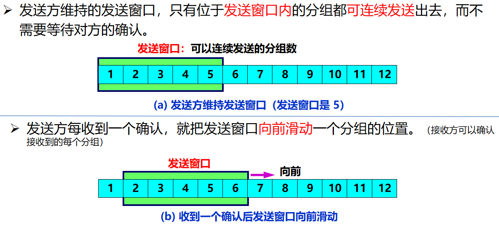

# 五、运输层

## UDP

（1）特点

- 无连接
- 尽最大努力交付，不保证可靠交付
- 面向报文：不合并不拆分，一次性交付一个完整的报文
- 无拥塞控制
- 支持一对一、一对多、多对一、多对多通信
- 首部开销小

## TCP

### 特点

- 面向连接
- 可靠交付
- 全双工
- 面向字节流

套接字

每一条 TCP 连接有两个端点。TCP 连接的端点叫做套接字 (socket) 或插口。 套接字socket = (IP地址 : 端口号)  

### 可靠传输

- 停止等待协议

确认与重传机制：做到每发送一个分组就等待对方的确认，确认之后再发送下一个分组

> 如何实现？

显然需要对**分组**、以及**确认回复**进行**编号**，否则就不知道是收到了哪个分组

> 收不到确认怎么办？

设定一个时间，超过了这个时间还没有收到确认就自动重新发送，即**超时重传**

> 为啥会收不到确认？

情况一：发送的分组半路丢失了，接收方压根不知道有这个分组

情况二：接收方收到了分组，但校验之后发现分组有差错，这时接收方只会丢掉它，不会告知发送方

情况三：接收方收到了分组，校验无误，但发回的确认半路丢失了。

情况四：接收方收到了分组，校验无误，但发回的确认延迟了。

> 已经收到了分组，但发送方因为情况三、四而重传了，重复收到的分组怎么办？

接收方丢掉重复的分组，但也要发回对这个分组的确认

如果是因为情况四重传，则发送方会收到重复的确认，重复的确认也丢弃

> 超时重传的时间设定为多久？

应当比数据在分组传输的平均往返时间更长一些

- 自动重传请求ARQ

强调的是，超时重传是由发送方自动进行的，而不是等到接收方发出一个重传的请求之后发送方才重传

- 停止等待协议的优缺点

优点：简单

缺点：信道利用率太低。假设发送分组所用时间为$T_D$，发送确认所用时间为$T_A$（注意，是从第一个比特离开发送方到最后一个比特离开发送方的时间，不包括在信道上的传播时间），往返时间为$RTT$，那么信道利用率为
$$
U=\frac{T_D}{T_D+RTT+T_A}
$$
一旦$RTT$比较大，信道利用率就会大大降低

> 如何提高信道利用率？

连续发分组，即流水线传输。而不是发一个、等确认、再发一个

- 连续ARQ协议

> 连续发多少个分组才好？一口气全部发完吗？

容易想到的方法是发一批，等一批确认，再发下一批。

实际解决方法是**滑动窗口**，更加灵活。这种方式下，如果一直收不到确认，则发送出去的分组数量是有限的；如果一直都能收到确认，则会一直发送。

> 接收方收到一系列分组，需要逐个确认吗？

情况一：这一系列分组都按序到达了，对最后一个分组发回确认就好了

情况二：这一系列分组部分乱序了，就只对按序（从收到的第一个开始排）的最后一个分组发回确认

> 既然不是逐个确认，接收方应等到收到多少个分组的时候才开始进行这样的确认呢？

接收方也维护一个**接收窗口**，对窗口内的分组进行确认（可以累积确认也可以逐个确认），根据分组的正确数量向前滑动窗口

- 选择确认SACK

> 接收到的字节流序号不连续，怎么办？

如果是因为缺少了中间的某些数据，那么只请求传输缺失的数据而不是整段重传，效率更高

### 流量控制

### 拥塞控制

**发送方**动态维护一个拥塞窗口cwnd，并使发送窗口等于拥塞窗口

#### 慢开始

概括：cwnd从一个很小的初始值开始，快速增长到给定的阈值**ssthresh**

（1）cwnd初始值的设定

基准：发送方最大报文段大小SMSS（Sender Maximum Segment Size）

若 SMSS > 2190 字节，则 cwnd = 2 $\times$ SMSS 字节，且不得超过2个报文段

若 1095 < SMSS ≤ 2190 字节，则cwnd = 3 $\times$ SMSS 字节，且不得超过3个报文段

若 SMSS ≤ 1095 字节，则cwnd = 4 $\times$ SMSS 字节，且不得超过4个报文段

（2）发送方每收到一个对新的报文段（大小为N）的确认：
$$
cwnd += min(N, SMSS)
$$
（3）注意：当cwnd增大后，意味着**一次往返**中，发送方会连续发送共计cwnd字节的多个报文段，在得到反馈增加时也是多次增加，因此cwnd的增长曲线是**指数型**的

（4）慢开始门限：一个阈值，当cwnd增大到该阈值时，转入拥塞避免算法

#### 拥塞避免

概括：使cwnd在达到阈值之后继续缓慢增长（线性的）

（1）发送方每收到**一次**对新的报文段的确认（连续收到若干个报文段只算一次）：
$$
cwnd += 1个报文段大小
$$
（2）发送方某一次发送出现超时重传：
$$
阈值ssthresh = cwnd/2
$$
同时，
$$
cwnd = 1个报文段大小
$$
然后再执行慢开始算法

（3）收到连续三次ACK（快重传算法要求接收方这么做），进入快重传

#### 快重传

快重传要求接收方立即发送确认，如果发生失序也立即确认最后一个有序报文段，让发送方尽早知道（在超时之前）有报文段丢失。否则一旦超时，发送方会误以为网络拥塞而采用拥塞避免算法，降低网络传输效率。

当发送方收到连续三次ACK时，立即重传丢失的报文段。

#### 快恢复