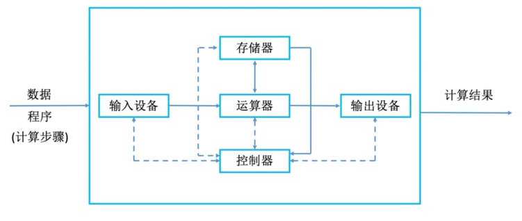
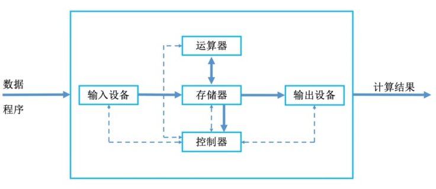
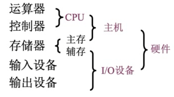
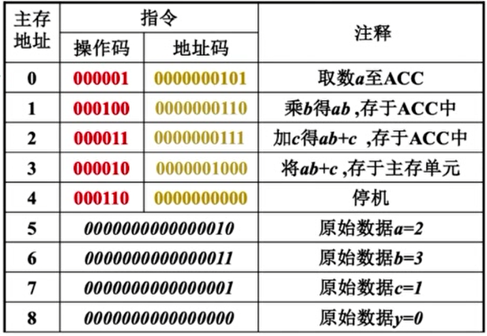

# 第一章 计算机系统概述

## 1.1 计算机硬件的基本组成

### 冯·诺依曼机

- “存储程序”概念

  将程序包含的所有指令都预先存储在计算机中，并只给出第一条指令所在的存储位置，让计算机自动顺序执行。

- 冯·诺依曼结构

  

  * 以运算器为核心。输入的数据哪怕不需要运算器执行运算，也需要经由运算器中转才能送入存储器或输出设备。
  * 控制器控制所有组成部件，各部件也会将信息反馈给控制器。

- 冯·诺依曼计算机的特点

  * 计算机由五大部件组成:输入设备、输出设备、运算器、存储器、控制器
  * 指令和数据以同等地位存于存储器，可按地址寻访
  * 指令和数据用二进制表示
  * 指令由操作码和地址码组成
  * 存储程序
  * **以运算器为中心**

### 现代计算机结构

- 现代计算机结构

  

- 现代计算机结构特点

  - **以存储器为中心**

- CPU=运算器+控制器

- 存储器又称为主存，即通常说的内存/运行内存；而机械硬盘、固态硬盘等不是主存，而是辅存，归为I/O设备

- 

## 1.2 主机中的各硬件部件概述

### 主存储器

- 存储体

  存储数据，按地址存储。

  * 存储元：存储二进制的电子元件，每个存储元可存1bit

  * 存储单元：每个存储单元存放一串二进制代码
  * 存储字长：单个存储单元中存储的二进制代码的位数（8bit的整数倍）
  * 存储字：存储单元中二进制代码的组合

- 地址寄存器（Memory Address Register）

  - 存储数据存放的地址，其**位数反映了存储体中存储单元的个数**。

- 数据寄存器（Memory Data Register）

  - 存储要存取的数据，其**位数反映了存储字长。**

### 运算器

- 累加计数器（ACC）：存放操作数、运算的结果
- 乘商寄存器（MQ）：进行乘、除法时使用
- 通用寄存器（X）：存放操作数
- 算术逻辑单元（ALU）：用电路实现各种算术运算、逻辑运算

### 控制器 

- 控制单元（Control Unit, CU）
  - 分析指令，给出控制信号

- 指令寄存器（Instruction Register, IR）
  - 存放当前执行的指令
- 程序计数器（Program Counter, PC）
  - 存放下一条指令的地址，有自动加1功能

### 计算机的工作过程

```c
int a = 2, b = 3, c = 1, y = 0;
void main(){
	y = a * b + c;
}
```



*以下操作描述中的小括号“()”表示其中存储的内容，如`(PC)`指的是PC中存储的内容；M（MAR）中的M表示主存储器，M（MAR）表示MAR中存储的地址所对应的存放在主存储器的那一条数据/指令


- 初始状态：(PC)=0，即第一条指令的存储地址
- step 1：（PC）→MAR，使得（MAR）=0
- step 2：M（MAR）→MDR，使得（MDR）= 000001 0000000101
- step 3：取出的是指令，因此需要送到指令寄存器。（MDR）→IR，使得（IR）= 000001 0000000101
- step 4：OP（IR）→CU，即将指令中的**操作码**部分送入控制单元，控制单元分析知`000001`是取数指令，要按地址码指明的地址从主存储器中取数并送入ACC.
- step 5：AD（IR）→MAR，即将指令中的**地址码**送入MAR，使得（MAR）=5（0000000101）。表明取数是从主存储器上的这个地址取数。
- step 6：M（MAR）→MDR，使得（MDR）=0000000000000010=2。按地址从主存储器中取得对应的数。
- step 7：MDR→ACC，使得（ACC）=2。送入到ACC
- step 8：PC自动+1，使得（PC）=1

## 1.3 计算机系统的层次结构

### 微程序机器 M0

由硬件执行微指令。微指令中特定位的二进制数对应特定电路逻辑门的开关。

一条微指令可实现如存储器读、写等硬件操作。

### 传统机器 M1

使用机器语言。一条机器语言指令即一段微程序，由多条微指令组成。

如取数指令000001 0000000101，功能为从主存储器的指定地址中取数并送入ACC，则可能包括读入地址码+存储器读+送入总线+ACC写等多条微指令。

### 虚拟机器/操作系统机器 M2

向上层提供“广义指令”（系统调用）

### 虚拟机器/汇编语言机器 M3

**汇编语言指令与机器语言指令是一一对应的**，只不过用人类可以看懂的字母符号（助记符）代替了二进制数。

如汇编语言指令`LOAD 5`对应的即机器语言取数指令000001 0000000101。

程序员使用汇编语言编写程序后，再通过汇编程序转换为对应的机器语言，才会被计算机识别执行。

### 虚拟机器/高级语言机器 M4

与汇编语言相比更加可读，如一行高级语言代码`y=a*b+c`，需要编写前文图中所示的多条汇编语言指令/机器指令才能等效实现。

程序员使用高级语言编写程序后，需要通过**编译程序**（编译器）来将高级语言转换成汇编语言，再经过**汇编程序**最终翻译成计算机可识别可执行的机器语言。

有些编译程序可以直接完成高级语言→机器语言的转换。

另外，还有常见的高级语言如Python、JavaScript等，不通过编译程序进行翻译，而是通过解释程序（解释器）完成高级语言→机器语言的转换。

编译程序和解释程序的异同：

- 编译程序将源程序一次性全部翻译好再执行机器语言程序，只需翻译一次
- 解释程序一次只翻译源程序的一条语句并立即执行，然后再翻译下一条语句。

## 1.4 计算机的性能指标

### 存储器的性能指标

- 总容量
  - 存储单元个数×存储字长，单位是bit
  - 存储单元个数×存储字长/8，单位是Byte
  - 若MAR为32位，MDR为8位，则总容量为$2^{32}\times8 （bit）=4\times2^{30}（Byte）=4GB$
- $1KB=2^{10}Byte$，$1MB=2^{20}Byte$，$1GB=2^{30}Byte$，$1TB=2^{40}Byte$

### CPU的性能指标

- CPU时钟周期：CPU内一个完整数字脉冲所需的时间。单位：微秒或纳秒。

- CPU主频：CPU内数字脉冲信号振荡的频率，即数电中的时钟频率，为CPU时钟周期的倒数。单位：赫兹Hz（注意，GHZ代表$10^9$赫兹）

- CPI（Clock cycle Per Instruction）：执行一条机器指令所需的时钟周期数。

  执行一条机器指令所需的时钟周期数是波动的，不同的机器指令会需要不同的时钟周期数，同一条机器指令两次执行所需的时钟周期数也可能不同，这是受其他部件及机器状态影响的。

  因此CPI代表的是一个平均值。

- IPS（Instructions Per Second）：每秒执行多少条指令。

  ​	$IPS=\frac{主频}{平均CPI}$

- FLOPS（Floating-point Operations Per Second）：每秒执行浮点运算的次数

### 系统总体的性能指标

- 数据通路带宽：数据总线一次所能并行传送的信息位数
- 吞吐量：系统在单位时间内处理请求的数量
- 响应时间：从用户向计算机发送一个请求到计算机响应并反馈结果的时间

### 常用数量单位

- 描述存储容量、文件大小时：$K=2^{10}$，$M=2^{20}$，$G=2^{30}$，$T=2^{40}$
- 描述频率、速率时：$K=10^{3}$，$M=10^{6}$，$G=10^{9}$，$T=10^{12}$
