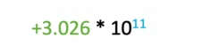
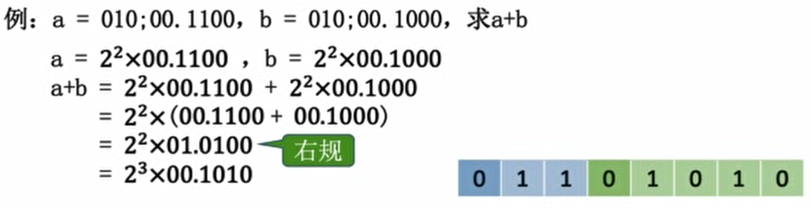
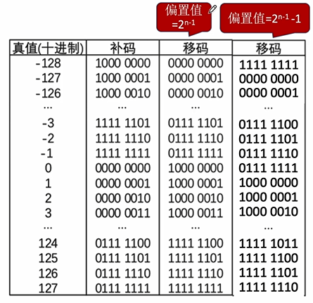

# 第二章 数据的表示和计算

## 2.1 定点数的表示

定点数即小数点位置固定。如一个8位的存储单元，规定右边数起第2位为小数点所在位，则存储的二进制数必然是`xxxxxx.x`的形式。若直接转换成十进制，则可表示的最大值为63.5（`111111.1`），最小值为0.0。

### 无符号数的表示

无符号数即整个机器字长的全部二进制位均为数值位，没有符号位，相当于数的绝对值。

对于8位二进制，视为无符号数，则对应的十进制数有$2^8=256$种，最小值为0（`0000 0000`），最大值为$2^8-1=255$（`1111 1111`）。

无符号数必然是非负整数，没有无符号小数的说法。

### 有符号数的定点表示

有符号数即专门指定了一个位（最高位）来存储并表示正负号，从而可以表示负数。

有符号数的定点表示方式有原码、反码、补码、移码等方式。

注意，虽然以上表示方式都可以表示负数，但采用的方法是不同的：如原码用最高位的0/1直接表示数的正/负，而补码是将最高位的权值视为负数

#### 原码

- 定点整数的原码

  以8位二进制为例，最高位为符号位（0为正，1为负），所定的小数点视为隐含在最低位的右侧（也就是不占位置）。如`1000 0001`即-1，`0000 0005`即+5.

  在这种规则下，0有两种表示方式，即`1000 0000`和`0000 0000`

  范围：对于8位二进制，最大值127（`0111 1111`），最小值-127（`1111 1111`）

- 定点小数的原码

  最高位为符号位（0为正，1为负），所定的小数点视为隐含在符号位的右侧（但不占位置）。也就是说，二进制定点小数转换为十进制后都是`0.xxxxx...`

  如`1100 0000`即-0.5，`0110 0000`即+0.75

  范围：对于8位二进制，最大值+0.9921875（`0111 1111`），最小值-0.9921875（`1111 1111`）

  简单推导：可表示的最大值加上最低位所代表的权值后一定等于1，因此最大值=1-最低位所代表的权值；可表示的最小值即最大值的相反数

#### 反码

反码根据原码得到。

- 若原码的符号位为0，则反码与原码相同
- 若原码的符号位为1，则将原码的数值位全部取反即得到反码。

eg：

- x=+19，$[x]_原=0001 0011$，$[x]_反=0001 0011$
- x=-19，$[x]_原=1001 0011$，$[x]_反=1110 1100$

反码只是原码转换到补码的一个中间状态，实际中很少应用。

#### 补码

原码表示正负数虽然直观，但用原码进行加法运算无法直接得到正确结果；而补码得益于其特殊的表示方法，解决了这一问题。

补码不再直接将最高位用于正负号表示，而是给予一个负的权值。

与无符号数相比较，在8位无符号数中，最高位的权值为$2^7$；而在8位补码（定点整数）中，最高位的权值为$-2^7$。同理，若用于表示定点小数，则最高位的权值为$-2^0$。

举个例子，-1的8位补码表示为`1111 1111`，即$-2^7+2^6+2^5+2^4+2^3+2^2+2^1+2^0$。

这种规则下，0只有一种表示方式，即`0000 0000`

- 原码转换为补码
  - 若原码为正数（这里我们把+0排除在外），则补码与原码相同
  - 若原码为负数（这里我们把-0排除在外），则将原码转换为反码后末位+1即得到补码。
- 补码转换为原码：方法与上述一致。
- 定点整数的补码
  - 最大值：$2^8-1=255$（`0111 1111​`）
  - 最小值：$-2^8=-256$（`1000 0000`）
- 定点小数的补码
  - 最大值：$1-2^{-7}$（`0111 1111`）
  - 最小值：$-1$（1000 0000）

#### 移码

移码根据补码得到。直接对（整数）补码的符号位取反就得到移码。

移码的符号位含义与补码相反，1表示正数，0表示负数。且移码只能用于表示整数。

移码的特点是，随着移码所表示的实际数值的增大，其二进制表示直观上（也就是当作无符号数来看）也是增大的。这使得移码之间可以直接按位比较大小，不需要额外进行运算。

### 移位运算

- 算数移位

  符号位保持不变，仅对数值位进行移位。

  - 对于原码：右移时高位补0，左移时低位补0.
  - 对于反码：右移时高位补符号位的值，左移时低位补符号位的值。
  - 对于补码：**对于正数，补位方式与原码相同**；**对于负数**，由于负数的补码来源是反码取反+1，+1操作导致从最低位开始连续的1会全部翻转成0，最后将碰到的第一个0翻转为1，因此负数的补码在形式上，以碰到的第一个0为界，左侧部分实质与反码一致，右侧（包括它自己）与原码一致。所以**在右移补位时，遵循反码的规则高位补1；在左移补位时，遵循原码的规则低位补0**.

  在比较简单的情况下可以用左移右移代替乘2和除以2的操作。但右移必定导致精度丢失。

  如7（0111），除以2应得3.5，用右移一位来代替只能得到3（0011），与真实值3.5相比不够精确。

- 逻辑移位

  把整一个二进制数看作无符号数，整体移位。无论左移右移都补0。

- 循环移位

  用于大端存储、小端存储之间的转换。

### 加减运算和溢出判断

#### 加减运算

补码的特性就是在进行加减运算时不必单独考虑符号位如何处理，可以带着符号位一起整体进行运算。

> 设机器字长为8位（含1位符号位），$A=15，B=-24，$求$[A+B]_补$和$[A-B]_补$

解：

$A_补 = 00001111， B_补 = 11101000$，直接按位相加得$[A+B]_补=11110111$

$[-B]_补=00011000$，直接按位相加得$[A-B]_补=00100111$

#### 溢出判断

- 上溢和下溢

  - 只有”正数+正数“的时候才会上溢，上溢的表现为”正+正=负“（因为进位进到符号位里去了）
  - 只有”负数+负数“的时候才会下溢，下溢的表现为”负+负=正“

- 判断方法

  - 方法一：采用一位符号位，对运算前和运算后的符号位进行逻辑判断.设$A$的符号位为$A_S$，$B$的符号位为$B_S$，运算结果的符号为$S_S$，溢出判断符号为$V$，无溢出时$V=0$，有溢出时$V=1$，则真值表如下：

    | $A_S$ | $B_S$ | $S_S$ | $V$  |
    | ----- | ----- | ----- | ---- |
    | 0     | 0     | 1     | 1    |
    | 1     | 1     | 0     | 1    |
    | ...   | ...   | ...   | 0    |

    逻辑表达式即$V=A_SB_S\overline{S_S}+\overline{A_S}\overline{B_S}S_S$

  - 方法二：采用双符号位。正常情况下正数符号位为$00$，负数符号位为$11$。发生上溢时运算结果符号位为$01$，发生下溢时运算结果符号位为$10$，即符号位两位数值相异则一定有溢出。做异或运算即可判断。

#### 符号扩展

如8位二进制数扩展为16位二进制数。

- 对于正整数，其原码、反码、补码表示都是一样的，扩展只需在高位补0
- 对于负整数
  - 原码：符号位保持在最高位，在数值位的高位补0
  - 反码：符号位保持在最高位，在数值位的高位补1
  - 补码：与反码相同（因为补码中右起第一个1往左的部分总是与反码一致）
- 对于正小数，为使权值不变，应在低位补0
- 对于负小数
  - 原码：低位补0
  - 反码：低位补1
  - 补码：与原码相同，低位补0（因为补码中右起第一个1往右的部分总是与原码一致）

### 乘除运算

#### 乘法

回忆一下十进制的竖式乘法，其实质是把乘数按位权拆开后再逐位与被乘数相乘，最后相加。二进制的竖式乘法同理，且比十进制更简单。将乘数按位权拆开后，若某位为0，则与被乘数相乘后所得的必为全0；若某位为1，则与被乘数相乘后得到被乘数本身。

- 机器实现二进制乘法需要解决的问题

  - 如何处理符号位
  - 最终结果的位数是两个乘数位数之和，如果超出了寄存器一次能保存下来的位数，如何处理？
  - 如何把所有乘积保存下来再统一相加

- 原码一位乘法

  - 如何处理符号位：符号位异或运算得到运算结果的符号位
  - 如何处理位数翻倍：两个寄存器，ACC存放乘积高位，MQ存放乘积低位
  - 如何相加:一边乘一边加

  > 设机器字长为5位（含1位符号位），$[x]_原=1.1101，[y]_原=0.1011$，采用原码一位乘法求$x\times y$

  - 初始：ACC清零，(ACC)=<u>00000</u>，(X)=01101，(MQ)=01011。MQ中参与乘法运算的位始终是MQ的最低位。

  - #1：MQ最低位为1，所以让ACC加上(X)，(ACC)=<u>01101</u>

  - #2：ACC和MQ同时逻辑右移一位，(ACC)=<u>00110</u>，

    ​	原最低位上的1移到MQ的最高位，(MQ)=<u>1</u>0101；

    ​	MQ最低位为1，所以让ACC加上（X），(ACC)=<u>10011</u>

  - #3：ACC和MQ同时逻辑右移一位，(ACC)=<u>01001</u>，

    ​	原最低位上的1移到MQ的最高位，(MQ)=<u>11</u>010；

    ​	MQ最低位为0，所以让ACC加上0，(ACC)=<u>01001</u>

  - #4：ACC和MQ同时逻辑右移一位，(ACC)=<u>00100</u>，

    ​	原最低位上的1移到MQ的最高位，(MQ)=<u>111</u>01；

    ​	MQ最低位为1，所以让ACC加上(X)，(ACC)=<u>10001</u>

  - #5：ACC和MQ同时逻辑右移一位，(ACC)=<u>01000</u>，

    ​	原最低位上的1移到MQ的最高位，(MQ)=<u>1111</u>0；

    ​	MQ最低位为0，所以让ACC加上0，(ACC)=<u>01000</u>

  - #6：至此MQ上原二进制数的各位都已计算完毕，又乘积的符号位应为1，故（ACC）=<u>11000</u>。

  - (ACC)=<u>11000</u>是**乘积的高位部分**，(MQ)=<u>1111</u>0中的**下划线部分是乘积的低位部分**，因此得到最终乘积为<u>1.10001111</u>

### 除法 

- 原码除法：恢复余数法
- 原码除法：加减交替法
- 补码除法：加减交替法
  - 被除数与除数同号，则被除数-除数；异号则被除数+除数
  - 余数和除数同号，商1，余数左移一位然后-除数
  - 余数和除数异号，商0，余数左移一位然后+除数
  - 当余数左移的次数等于补码数值位的位数后结束
  - 商的末位恒置为1

### 数据的存储和排列

- 大端模式：内存的低地址存储数据的高字节，符合阅读习惯
- 小端模式：内存的低地址存储数据的低字节，便于机器处理（因为机器读取是从内存低地址开始往高地址读的）

### 边界对齐

计算机按字节编址，一个字节对应一个地址

通常支持按字、按半字、按字节寻址

假设访存每次读/写1个字，若数据按边界不对齐方式进行存储，则数据可能跨越边界，导致机器需要访存两次才能拼接出完整的数据。

边界对齐方式可能会浪费一些空间，但能保证每次读数据都只需要1次访存。

## 2.2 浮点数的表示

### 浮点数的表示

对于固定的8位二进制数据，若采用定点表示，则数据可表示的范围始终是有限且比较小的；浮点数则解决了这个问题。

回忆科学计数法，它由三部分组成：

即尾数（绿色）、阶数（青色）和底数（黑色）

#### 浮点数表示法

浮点数也是用同样的方法表示，阶数部分称为阶码，作为浮点数据的前半段；尾数部分就是尾数，作为浮点数据的后半段；底数默认为2，省略。

- 阶码

  阶符+阶码的数值部分。是常用补码或移码表示的定点整数。

  反映了数据中的小数点要往前/往后浮动多少位

- 尾数（未规格化）

  数符+尾数的数值部分。是常用原码或补码表示的定点小数。

  注意是定点小数，即整数部分总为0，这一点与十进制的科学计数法不同。

  尾数的数值部分的位数n反映浮点数的精度。

#### 浮点数的表示范围

浮点数表示范围关于原点对称。

正上溢：运算结果大于最大整数

负上溢：运算结果小于最小负数

正上溢和负上溢统称为上溢。

正下溢：运算结果在0和最小正数之间

负下溢：运算结果在0和最大负数之间

正下溢和负下溢统称为下溢。

发生下溢时，浮点数值趋近于0，计算机直接当作机器零处理

### 浮点数尾数的规格化

#### 概念

规格化是对尾数存储方式的一种优化，使浮点数能表示尽可能高的精度。

- 左规：尾数算术左移，从而舍弃尾数部分高位连续的0（注意，如果是补码表示的尾数则是连续的1），同时阶数也相应调整。如$2^2\times(+0.01001)$对尾数规格化后得到$2^1\times(+0.10010)$。

- 右规：尾数算术右移，处理浮点数运算结果尾数出现溢出时的情况。

  

#### 细节

1. 对于原码表示的尾数（基数为2），①0.011（0.25+0.125=0.375），规格化后为0.110（这里省略阶码部分的调整）；②1.011（-0.25-0.125=-0.375），规格化后为1.11

   形式上的规律就是，**原码表示的小数规格化后，其小数点后第一位一定为1，而整数部分可以为1也可以为0，是符号位**（注意这一点与IEEE754不同，IEEE754格式要求小数表示为$(-1)^S\times1.M\times2^{E-bias}$的形式，即整数部分一定为1，且是一个有效位而不是数值位，并且默认不存储，只存储$M$）

2. 对于补码表示的尾数（基数为2），如1.101（-1+0.5+0.125=-0.375），规格化后为1.010（这里省略阶码部分的调整）

   形式上的规律就是，**补码表示的小数规格化后，小数点前后两位一定不相同。**

3. 如果基数改变，如基数为4，则**原码表示的小数规格化后，小数点后两位一定不全为0**

4. 总结：原码表示的规格化小数中的尾数M（即小数点后面的部分，小数点后位的权值为$2^{-1}$、$2^{-2}$...以此类推）的绝对值满足 $1/R≤|M|≤1$，其中$R$为基数。

   如，当基数为2时，原码小数1.101中的尾数101的绝对值为$2^{-1}+2^{-3}=0.375＜1/2$，因此1.101不是规格化小数；而原码小数0.11中的尾数11的绝对值为$2^{-1}+2^{-2}=0.75$，$1/2≤0.75≤1$，因此0.11是规格化小数。

### IEEE754

移码，形式上看是直接将补码的符号位取反，从数值上看则是补码（真值）加上一个**固定的偏置值**得到。

如8位移码，就是将8位补码加上128D（$2^{8-1}$）的偏置值得到。

IEEE754对浮点数阶码部分的规定为，对于8位阶码，为补码（真值）加上偏置值（$2^{8-1}-1$）所得。这样规定使得阶码最小值和阶码次小值都对应特殊的二进制数：全1和全0.

#### 对数符的规定

数符位于浮点数的最高位。0/1表示数的正负。

#### 对阶码的规定

- 用移码表示，但使用的偏置值为$2^{n-1}-1$而非$2^{n-1}$，其中$n$为阶码部分的位数。
- 采用上述偏置值使得阶码部分可表示的最小值和次小值分别为全0和全1，这两个数用作特殊用途（见下文”表示范围“一节），而不用于表示浮点数的阶数。
- 因此，对于8位阶码，能表示的阶数范围为$-126 到 +127$

#### 对尾数的规定

- 用原码表示
- 完整的小数是$1.M$，但1省略不存储，只存储M。

#### 浮点数的真值计算

| 类型        | 数符S | 阶码E | 尾数数值M | 总位数 | 偏置值 |
| ----------- | ----- | ----- | --------- | ------ | ------ |
| float       | 1     | 8     | 23        | 32     | 127    |
| double      | 1     | 11    | 52        | 64     | 1023   |
| long double | 1     | 15    | 64        | 80     | 16383  |

- float浮点数的真值

  $(-1)^S\times1.M\times2^{E-127}$

- double浮点数的真值

  $(-1)^S\times1.M\times2^{E-1023}$

#### 表示范围

- float浮点数的最小绝对值

  尾数全为0，阶码真值最小-126，整体真值$1.0B\times2^{-126}$

- float浮点数的最大绝对值

  尾数全为1，阶码真值最大127，整体真值$1.1111..11B\times2^{127}$

- 若要表示的数的绝对值比最小的绝对值还要小（如$0.001B\times2^{-126}$），令阶码全为0，要表示的数的小数部分直接作为尾数（此时整数部分一定为0，因为再规格化的话阶码无法表示）。

| 阶码 | 尾数    | 含义                                                     |
| ---- | ------- | -------------------------------------------------------- |
| 全0  | 不全为0 | 非规格化小数 （比规格化小数的最小绝对值还要小的数） |
| 全0  | 全0     | ±0                                                       |
| 全1  | 全0     | ±$\infin $                                               |
| 全1  | 不全为0 | NaN                                                      |

### 浮点数的运算

#### 浮点数的加减运算

1. 对阶（阶数小的数将阶数改为较大的，因为尾数是定点小数，这样做计算机处理方便）
2. 尾数加减
3. 规格化（左规or右规）
4. 舍入
   - 规则1：多出的直接砍掉，余下的尾数的最后一位恒置为1
   - 规则2：若砍掉的最高数值位为1，则向高位进1
   - 规则3：四舍五入
5. 判溢出
   - 阶码的溢出才是真正的溢出
   - 尾数的溢出可以进行规格化和舍入处理

#### 强制类型转换

- 无损转换
  - char→int→long→double
  - float→double
- 有损转换
  - int→float：可能损失精度（int32位，float的尾数24位）但不会溢出
  
    > 注：如，这个int类型的数是01FF FFFF（25个1，即2^25-1=33554431），转为float类型后值为3.35544×10^7，即33554400，最末尾的31被抹零了，丢失了精度
  
  - float→int：可能溢出也可能损失精度

