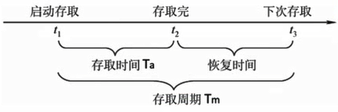
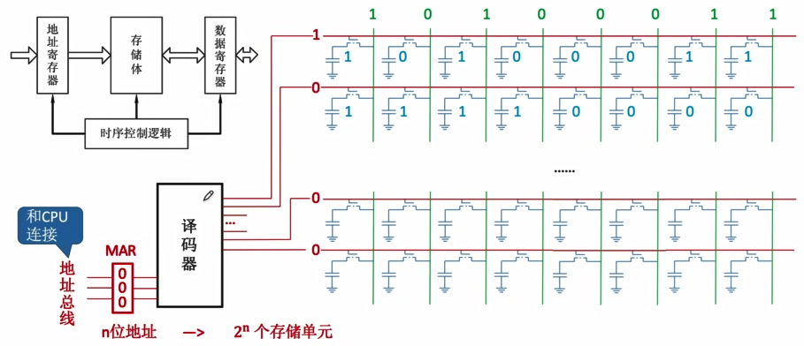
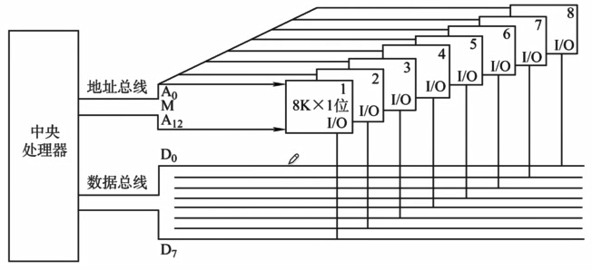
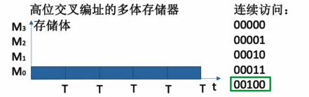
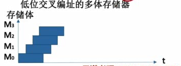
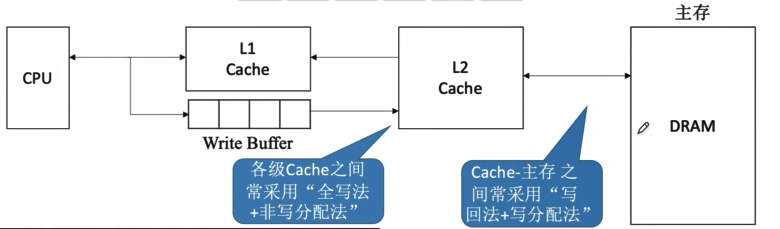
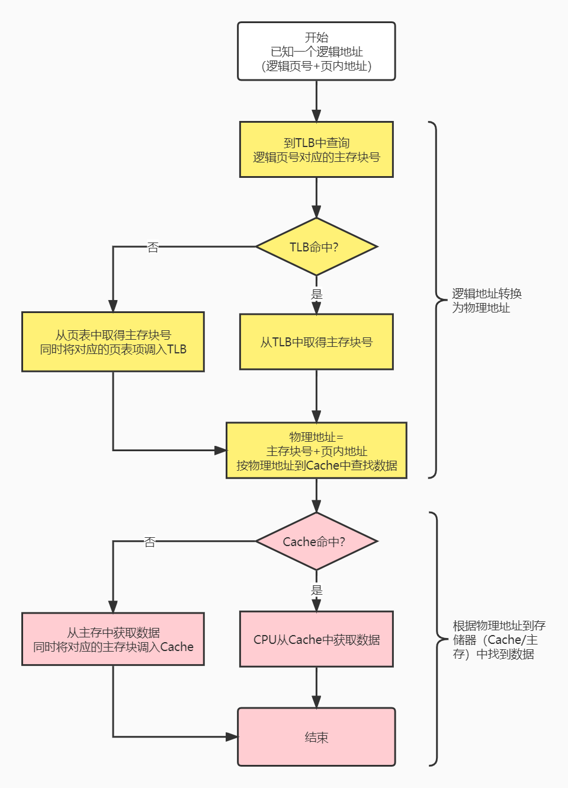
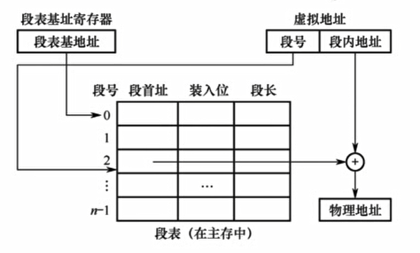

# 第三章 存储系统

## 3.1 存储系统基本概念

### 存储器的层次结构

- 高速缓存（Cache）
- 主存储器（主存）
- 辅助存储器（辅存、外存）

### 存储器的分类

- 存储介质
  - 半导体：如主存、Cache
  - 磁性材料：磁盘、磁带
  - 光：光盘
- 存取方式
  - 随机存取存储器（RAM）：读写任何一个存储单元所需时间都相同，与存储单元所在的物理位置无关。
  - 顺序存取存储器（SAM）
  - 直接存取存储器（DAM）：如磁盘。既有随机存取特性，又有顺序存取特性。
  - 相联存储器（CAM）：可以按照内容检索到存储位置进行读写，如快表
- 信息的可更改性
  - 读写存储器：既能读也能写
  - 只读存储器（ROM）：只能读、不能写，如CD-ROM，蓝光光碟
- 信息的可保存性
  - 易失性存储器（主存、Cache）：断电后，存储信息消失
  - 非易失性存储器（磁盘、光盘）
  - 破坏性读出：信息读出后，原存储信息被破坏，如DRAM，读出数据后要进行重写
  - 非破坏性读出，如SRAM、磁盘、光盘

### 存储器的性能指标

- 存储容量：存储字数（即存储单元的数量）×字长（如1M×8位）

- 单位成本：每位价格=总成本/总容量

- 存储速度：数据传输率=数据的宽度（存储字长）/存储周期

- 存取周期：

  

  - 存取时间：从启动一次存储器操作到完成该操作所经历的时间，分为读出时间和写入时间
  - 存取周期：存取时间+恢复时间。存储器进行一次完成的读写操作所需的全部时间

## 3.2 主存储器的基本组成

### 半导体元件&存储芯片的原理

- 存储元：电容（存储比特）+MOS管

- 根据地址读取/写入数据：

  

- $2^n$个存储单元 $\rightarrow $ $n$位地址 $\rightarrow $ $n$条地址线

- $n$位存储字长 → 一次可读出$n$比特数据 → $n$条数据线

### 如何实现不同的寻址方式

- 如一个存储单元字长为一字节，且按字节寻址，则$2^n$个存储单元对应$n$位地址
- 按字寻址，假设一字=四字节，将字节地址左移两位即得即字地址（字开头第一个字节的地址）

## 3.3 DRAM和SRAM

### 存储元件不同导致的特性差异

- DRAM芯片：使用**栅极电容**存储信息

  只有一根数据线，直接根据数据线上的电平判断输出的是0还是1

  读出一次后电容放电信息被破坏（破坏性读出），所以需要重写数据，也称为“再生”

  读写速度更慢

  单个存储元制造成本低，集成度高，因此单位成本低

  常用作主存

- SRAM芯片：使用**双稳态触发器**存储信息

  两根数据线，分别是BL和BLX，根据哪条线输出低电平来判断输出的是0还是1

  读出数据后，触发器状态保持稳定，无需重写

  读写速度更快

  单个存储元制造成本高，集成度低，因此单位成本高

  常用作Cache（更接近CPU）

- DRAM和SRAM都是易失性存储器，信息在断电后丢失

### DRAM的刷新

问题：DRAM中的电容即使不断电，经过2ms时间电容中的电荷就会流失，造成数据丢失，因此需要不断重写数据。

1. 多久需要刷新一次？刷新周期：2ms
2. 每次刷新多少存储单元？以行为单位，每次刷新一行存储单元

#### DRAM中的存储单元结构

在存储单元数量较多时（如百万级），如果只采用单个译码器进行选址，那么译码器的选通线也要有百万条，这在工程上实现难度很大。

为了避免这种情况，DRAM中存储单元排成矩形，译码器分为行地址译码器和列地址译码器两个，分别输出行地址选通信号和列地址选通信号，从而选中存储单元。

这样做可以减少选通线的数量，简化电路

#### DRAM刷新

- 如何刷新：硬件支持，每次读出一行信息后再重新写入，占用1个读/写周期

- 在什么时候刷新：

  假设DRAM内部结构为128×128，读/写周期为0.5μs

  **分散刷新**：每次读写完都刷新1行，则存取周期=2个读/写周期，前一个读/写周期用于正常读写，后一个读/写周期用于刷新某行。一方面，并非读写哪行就刷新哪行，而是只要发生了读写就刷新一行；另一方面，可以认为读写操作是一直都有的，不会出现没有读写导致没有刷新的情况。这种方式下，在电容保持时间2ms内能把全部128行刷新若干遍。

  **集中刷新**：2ms内集中安排一个时间全部刷新。不影响正常读写，因此存取周期=1个读/写周期；但在集中刷新的时间段内无法访问存储器，这段时间称为访存死区。

  **异步刷新**：2ms内每行只刷新1次即可。其实是将集中刷新的死时间平均分布在了2ms的时间段中。由于有128行，那么2ms内需要产生128次刷新，即每隔2ms/128=15.6μs一次，每次刷新需要1个读写周期，即每15.6μs中都存在0.5μs的死时间。

### DRAM的地址线复用技术

由于DRAM中存储单元数量大，即使分成两个译码器进行选址，单个译码器所需要的地址线仍然较多。为了进一步减少地址线，地址分两次送入，一次先送入行地址，另一次再送入列地址。

增设行地址缓冲器和列地址缓冲期，两次送入先送到缓冲器上，再由缓冲器送到译码器。

## 3.4 ROM

### ROM的分类

- MROM（掩模式只读存储器）：厂家在生产过程中直接写入信息，任何人不可重写
- PROM（可编程只读存储器）：用户可用专门的写入器写入信息，写一次后不可更改
- FPROM（可擦出可变成只读存储器）：允许用户写入信息，并用某种方式擦除数据，多次重写
  - UVEPROM（紫外线擦除）：紫外线照射，擦除所有信息
  - EEPROM（电擦除）：电擦除，擦除特定的字
- Flash Memory（闪存）：断电后也可保存信息，并可进行多次快速擦除重写（如U盘、SD卡）；写比读慢。
- SSD（固态硬盘）：多次快速擦除重写。和闪存的核心区别在于控制单元不一样。

### 计算机内的重要ROM

问题：主存RAM断电后数据全部丢失，而操作系统等又都存储在辅存里，那么刚开机的时候CPU从哪里得到指令来启动操作系统？

- 主板上有BIOS芯片，是ROM，存储了自举装入程序，负责引导装入操作系统。
- 主存=RAM+ROM，二者常统一编址

## 3.5 主存与CPU的连接

### 单块存储芯片与CPU的连接

### 多块存储芯片与CPU的连接

#### 位扩展法

解决的问题：单个存储芯片的字长（如8位）小于CPU能接收的最大字长（64位），没有充分利用CPU和主存间的数据传输能力

方法：

- eg：利用8片8K×1位（$8\times2^{10}\times 1\ bit$）的存储芯片，组成1个8K×8位的存储器，容量为$8\times2^{10}\times8=8KByte$

#### 字扩展法

- 线选：

  单独拿出某条地址线来对应某个芯片的选择；一条地址线只对一个芯片输出使能信号

  弊端：当多条片选地址线同时输出使能信号时，多个芯片同时被使能，造成数据输出冲突

- 片选

  增加一个译码器芯片，如2-4译码器，使得2条地址线信号产生4个不同组合信号对4个不同芯片使能（输出信号0001、0010、0100、1000）

  在实际中这2条地址线应该是相邻的，使得编址是连续的

  考试中可能会出现题目所给的片选地址线不相邻的情况，这是无法实际应用的

#### 字位扩展法

例如，有8个16K×4位的芯片，两两一组构成位扩展，则一组芯片为16K×8位，组内2个芯片共用使能信号，共4组。CPU使用2条地址线，通过2-4译码器输出4组使能信号，分别对4组芯片使能。从而8个芯片整体组成4×16K×8位的存储器，总容量为64KByte。

地址线总数计算：

- 位扩展不改变存储单元数量，一组位扩展的芯片寻址需要14条地址线（$16K=2^4×2^{10}=2^{14}$）
- 经过2-4译码器对4组芯片产生使能信号，需要2条地址线确定是4组芯片中的哪一组芯片
- 存储器总地址线数量/地址位长为16

## 3.6 双端口RAM和多模块存储器

### 双端口RAM

问题：多核CPU同时访问同一个主存储器，如何实现？

解决：

- 两组完全独立的数据线、地址线、控制线，分别接到CPU1、CPU2
- CPU、RAM中要有更复杂的控制电路

问题：两个端口的操作有以下4种情况：

1. 同时对不同的地址单元存取数据✓
2. 同时对同一地址单元读出数据✓
3. 同时对同一地址单元写入数据（×写入错误）
4. 同时对同一地址单元，一个写入数据，一个读出数据（×读出错误）

解决：

忙信号，当有一个端口正在进行操作时置忙信号

### 多模块存储器

一个存储器中可能有多个内存条（存储体），需要选择

- 高位交叉编址

  - 体号位于地址高位

  - 相邻的地址对应的存储单元基本上位于同一个存储体上

  - 这会导致，按地址连续访问数据时，操作都针对同一个存储体，而一次操作消耗一个存储周期。

    假设存储体的存取周期为T，存取时间为r，恢复时间为3r，1T=4r，意味着每次操作都要等待较长的恢复时间。

  

  - 采用高位交叉编址时，连续取n个存储字的总耗时为nT.

- 低位交叉编址

  - 体号位于地址低位

  - 相邻的地址对应的存储单元位于不同的存储体上

  - 按地址连续访问数据时，每次操作都在与上次操作不同的存储体上，一次操作只需要1r的存取时间，而不必等待3r的恢复时间。如果存储体恰好有4个，则对第4个存储体操作后第1个存储体恰好恢复完毕，存取操作之间可以无缝衔接。

  - 采用低位交叉编址时，连续取n个存储字的总耗时为nr+3r=T+(n-1)r（3r是最后一次存取操作后的恢复时间）

    

- 应该有多少个存储体？

  存取周期为T，存取时间为r，流水线不间断，应保证模块数m≥T/r

  m=T/r是最好的，m＞T/r会出现流水线中的气泡

## 3.7 Cache的基本概念和原理

问题：双端口RAM、多模块存储器虽然已经经过了优化，提高了存储器的工作速度，但和CPU的速度差距依然很大。

解决：根据程序的“局部性原理”，采用更高速的、容量更小（因为成本更高）的存储单元来作为CPU与存储器之间的中转可以缓解主存与CPU之间的速度矛盾，也就是Cache。Cache的读写速度是主存的60倍。

### Cache的工作原理

- 集成在CPU内部
- 使用SRAM（双稳态触发器、无需重写）实现，速度快，成本高
- 将当前正在访问的主存地址及邻近地址的数据全部放入Cache中

### 性能分析

设$t_c$为访问一次Cache所需时间，$t_m$为访问一次主存所需时间

- 命中率$H$：CPU欲访问的信息已在Cache中的比率

- 缺失率$M$：$M=1-H$

- Cache-主存系统的平均访问时间 $t$

  情况1：$t=Ht_c+(1-H)(t_c+t_m)$

  - 当访问命中时，CPU直接从Cache取出数据，耗时$t_c$

  - 当访问未命中时，浪费了访问Cache的时间$t_c$，还要继续耗费$t_m $时间从主存中取数据，总访问时间为$t_c+t_m$

  情况2：$t=Ht_c+(1-H)t_m$

  - 同时访问Cache和主存，若Cache命中则立即停止访问主存

### 哪些数据存入Cache

局部性原理

- 时间局部性：现在访问的地址，不久之后很可能被再次访问
- 空间局部性：现在访问的地址，其邻近的地址很可能即将被访问

如何决定哪些数据要被放入Cache中：

- 将CPU目前访问的地址“周围”的部分数据放到Cache中。
- 将主存和Cache的存储空间分块。如1KB一块，主存与Cache之间以块为单位进行数据交换。
- CPU当前访问地址所属的块被复制一份存入Cache。

主存/Cache的块：

- 主存的块又称**页/页框/页面**
- Cache的块又称**行**

### Cache和主存的映射方式

> 问题：如何区分Cache与主存的数据块对应关系？

#### 全相联映射

- 主存中任意一个块可以放入Cache中任意一行。
- 将Cache中的块配一个有效位和一个标记
- 标记说明这个Cache块中的数据来自主存中哪个块
- 有效位标明这个Cache块中的数据是否还有效（是否可以替换）

> 假设某计算机中的主存地址空间大小为256MB，按字节编址，数据Cache中有8个Cache行，行长为64B。说明全相联映射方案。

由于主存和Cache需要划分等大的块，主存需要按每64B一块进行分块。

按字节编址，则地址共有$256\times2^{20}=2^{28}$个，则地址位长为28位。

为块内64B数据编址需要占用其中6位，其余22位作为主存块号。

相应的，Cache中的标记也是22位长。

> 如何判断Cache是否命中？

若当前需要访问的主存地址为A，用A的前22位（块号）与Cache中的标记逐一匹配，若匹配成功且有效位为1则Cache命中。

#### 直接映射

- 主存中的一个块只能放在Cache中的固定位置

- 位置计算方式：主存块号%Cache总块数

- 优点：可以根据映射方式的特点，对标记的位长进行优化。假设Cache总块数为$2^3$，则主存块号的末尾3位就是它所对应的Cache行号。那么标记只需要存储主存块号的前19位。

  判断命中时，先根据当前访问的地址块号的后3位找到它固定存放的Cache块，再用前19位与该块标记进行匹配即可。

- 缺点：只能放在固定位置，若恰好该Cache行被占用了，即使其他Cache行还空着也不能利用。

#### 组相联映射

- 主存中的一个块放在Cache中的特定分组中的任意一行。
- 所属分组=主存块号%分块数
- 与直接映射类似，若Cache总组数为$2^2$，则主存块号的末2位就是它对应的Cache组号。此时标记位长只需要20位。
- 判断命中时，先根据当前访问的地址块号的后2位找到对应的Cache组，再用前20位与组内Cache块的标记逐个匹配。

### Cache替换算法

> 问题：Cache很小，主存很大。Cache满了怎么办？

#### 随机算法（RAND）

若Cache已满，则随机选择一块替换。

实现简单，但完全没考虑局部性原理，命中率低，实际效果很不稳定

#### 先进先出算法（FIFO）

若Cache已满，则替换最先被调入Cache的块

实现简单，但依然没考虑局部性原理，最先被调入Cache的块也可能是被频繁访问的

抖动现象：频繁的换入换出现象（刚被替换的块很快又被调入）

#### 近期最少使用算法（LRU）

为每一个Cache块设置一个**计数器**，用于记录该Cache块有多久未被访问。当Cache满时替换计数器最大的块。

具体方法：

- Cache块命中时，该块计数器清零，且比其先前计数还要低的块+1，其它不变。
- 未命中且还有空闲块时，新装入的块计数器置0，其他非空闲块+1
- 未命中且无空闲块时，计数器最大的Cache块被淘汰，新装入的块计数器置0，其他全部+1

上述方法造成的现象是，若Cache块总数为$2^n$，则计数器的数字一定只在$0到2^n-1$之间，使计数器可以用$n$位二进制数存储。且Cache装满后所有计数器的值一定不重复。

本算法基于“局部性原理”，实际运行效果优秀，Cache命中率高。

但若频繁访问的主存块数量＞Cache块数量，依然会发生抖动现象。

#### 最不经常使用算法（LFU）

为每一个Cache块设置一个**计数器**，记录每个Cache块被访问过几次。当Cache块满后替换计数器最小的块。若计数器最小的块有多个，可按刚好递增、或FIFO策略进行选择。

计数器数字可能会很大。

曾经最经常访问的主存块在未来不一定会用到，并没有很好地遵循局部性原理，实际运行效果不如LRU

### Cache写策略

> 问题：CPU修改了Cache里的数据副本，如何确保主存中数据母本的一致性？

### 写命中

CPU对某个主存地址对应的数据进行写操作，且该数据已经被调入Cache块。

#### 写回法

CPU对Cache块写命中时，只修改Cache中的内容，而不立即写入主存。当此块被换出时才写回主存。

为了节省时间，需要区分哪些块需要被写回而哪些块不需要。因此对每个Cache块增加一个**脏位**，用于标记Cache块内数据是否被修改过

减少访存次数，但存在数据不一致的隐患

#### 全写法

CPU对Cache块写命中时，同时修改Cache和主存中的内容。

访存次数增加，速度变慢，但更能保证数据一致性。

一般使用写缓冲（SRAM实现的FIFO队列），而不是由CPU分别修改Cache和主存的数据。具体是，CPU写命中时，同时修改Cache内容和写缓冲的内容（修改写缓冲比修改主存更快），CPU执行其他操作时，写缓冲再由硬件电路控制修改主存内容。

使用写缓冲，CPU写的速度很快，若写操作不频繁则效果很好；但若写操作很频繁，则会因为写缓冲饱和而发生阻塞，换句话说，此时写缓冲成为了读写速度的瓶颈。

### 写不命中

CPU对某个主存地址对应的数据进行写操作，但该数据不在Cache中。

#### 写分配法

将主存中的块调入Cache，CPU再在Cache中修改。通常搭配写回法使用。

#### 非写分配法

CPU直接向主存写数据，不调入Cache。搭配全写法使用。

### 多级Cache

离CPU越近的速度越快，容量越小

离CPU越远的速度越慢，容量越大

## 3.8 页式存储器

> 一个程序所需的内存空间可能很大（如1GB），但实际到CPU执行时可能只需要其中的一小部分信息（如1KB），若直接将程序全部装载到内存中会导致内存利用率不高。如何解决？

主存和Cache被划分为若干个等大的块，假设块大小为1KB（之前提到，主存块又被称为页/页面）。现有某程序大小为4KB，则程序会被分为4个**页**，每个页面的大小和主存块的大小相同。这四个页在主存中**分散存储**。

### 逻辑地址与物理地址

程序编写/执行时采用的机器指令中的地址是逻辑地址。

---

> 逻辑地址如何对应程序分页中的数据？

整个程序共$4KB=2^{12}B$，地址位长12，范围0x000~0xFFF

由于一页大小为1KB，按字节编码则需要10位地址，为页内地址；其余2位则为逻辑页号。

知道了数据的逻辑地址，则可以通过某种映射方式来找到对应的物理地址，即主存地址。这一步骤由操作系统完成。

---

> 逻辑地址具体如何映射到物理地址？

### 页表

页表保存了逻辑页号与主存块号之间的一一对应信息。形如下表：

| 逻辑页号 | 主存块号 |
| -------- | -------- |
| #0       | 2        |
| #1       | 4094     |
| ...      | ...      |

知道了逻辑页号，就可以通过页表找到对应的主存块号。

而页内地址就是块内地址（因为逻辑页和主存块大小是一样的），与主存块号拼接即得物理地址。

> 如何知道页表本身数据所在的物理地址？

有专门的**页表基址寄存器**负责保存页表在主存中的存放位置。

---

> 根据局部性原理，同样的逻辑页号可能会多次访问，每次都要去页表查找吗？

查询页表的速度是很慢的，所需时间相当于一次访存。

在实际中，会将近期访问的页表项放入更高速的存储器（使用SRAM），加快地址变换的速度，这个类似Cache的存储器就是快表。相对的，普通的页表就是慢表。

### 快表（TLB）

存储页表项的副本（也就是常用索引的副本）

使用SRAM实现，查询速度很快。

是一种相联存储器，即可以按数据内容访问（而不是按地址）。

### 访存流程总结

## 3.9 虚拟存储器

### 虚拟存储系统

主存——辅存之间的数据调度，解决主存容量不够的问题。

通过运行时才将所需的部分程序数据从辅存调入主存的方式，使得总数据量远大于主存容量的多个程序可以同时在计算机上运行，给用户一种主存非常大的错觉，因此是“虚拟”存储系统。

### 页式虚拟存储器

将原本位于辅存中的程序数据按页划分，每页大小相同。

当程序运行时，按页将所需数据从辅存调入到主存中，分散存储。

#### 页表所需要承担的功能

除了保存前文所述的存储逻辑页号与主存块号的映射关系以外，页表还存储了辅存-主存数据调度所需信息，包括类似于Cache中的有效位、脏位等。

| 逻辑页号 | 主存块号 | 外存块号 | 有效位 | 访问位 | 脏位 |
| -------- | -------- | -------- | ------ | ------ | ---- |
| #0       | 2        | a        | 1      | 13     | 0    |
| ...      | ...      | ...      | ...    | ...    | ...  |

首先，当逻辑页号对应的数据实际上还没有被调入到主存中时，逻辑页号-主存块号这一映射关系应该是无效的，反之映射关系有效。为了标记这一点，需要用到**有效位**。

其次，当逻辑页号对应的数据还在辅存中而未调入主存时，需要先到辅存中找到对应的数据。去哪里找？页表也保存了逻辑页号-**外存块号**这一映射关系，可以根据逻辑页号，通过页表去辅存中找到对应数据。

再次，主存很小而辅存很大，若主存已满，同样需要进行替换。主存的替换为**页面替换**。同样的，需要有相应的页面替换算法，**访问位**用于记录算法实现所需要的信息。

最后，CPU对主存数据有修改时，如何保证主存-辅存的数据一致性？**脏位**用于标记主存块中数据是否被修改。脏位结合写回算法实现主存-辅存的数据一致性。

### 段式虚拟存储器

将辅存中的程序数据按功能模块进行划分，每个模块为一段。如源代码段、库函数段、变量段等。

分段的方式会使得各段并不等长。使用**段表**来记录相关信息。

### 段页式虚拟存储器

将程序数据按逻辑结构先分段，段内再划分为固定大小的页。

主存空间也划分为等大的页。

主存-辅存之间的数据调入/调出仍以页为单位。

每个程序对应一个段表，每段对应一个页表。

虚拟地址=段号+段内页号+页内地址。