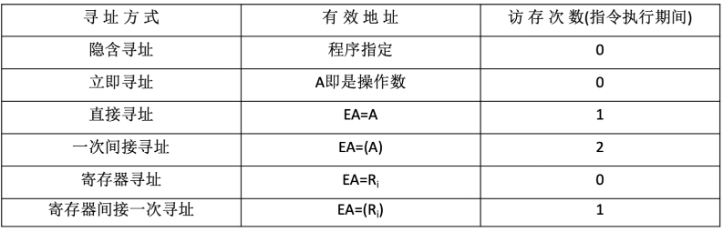
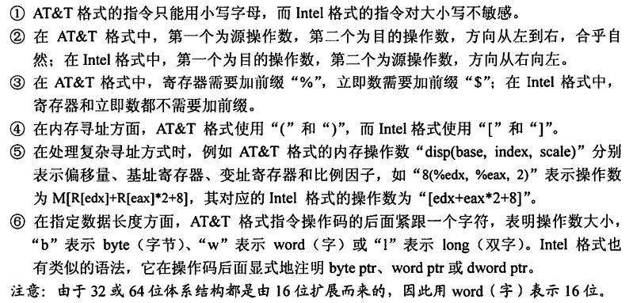
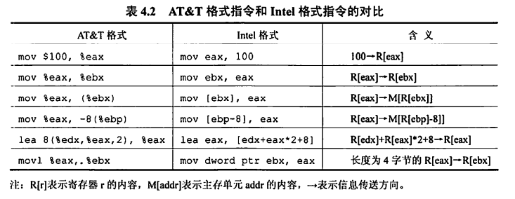
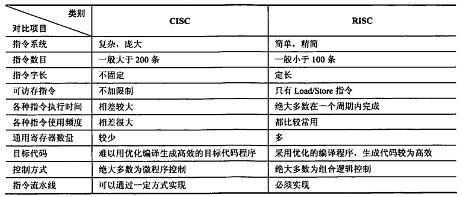

# 第四章 指令系统

## 4.1 指令格式

- 指令/机器指令：指示计算机执行某种操作的命令，是计算机运行的**最小功能单位**
- 指令系统/指令集：一台计算机的所有指令的集合
- x86架构（Intel）、ARM架构（手机）

### 指令格式-按指令地址数分类

**指令通常由操作码+地址码构成**。

#### 零地址指令

不需要操作数，如空操作、停机、关中断等命令

如堆栈计算机，两个操作数隐含放在栈顶和次栈顶，计算结果压回栈顶。

#### 一地址指令

1. 只需要单操作数，如加1、减1、取反、求补等
2. 需要两个操作数，但其中一个操作数在某个寄存器中（就不需要通过地址码来读出数据）

#### 二地址指令

需要两个操作数的算术运算、逻辑运算等，计算结果放回其中一个操作数的地址。

完成一条指令需要访存4次，取指$\rightarrow$读A1$\rightarrow$读A2$\rightarrow$写A1

#### 三地址指令

需要两个操作数的算术运算、逻辑运算等，计算结果放到不同于两个操作数的新地址。

#### 四地址指令

OP+$A_1$地址+$A_2$地址+$A_3$（结果）地址+$A_4$（下一条指令的地址）

执行指令后，将PC的值修改为$A_4$

### 指令格式-按指令长度分类

指令字长：一条指令的总长度（可能会变）

根据指令长度与机器字长的关系，分为半字长指令、单字长指令和双字长指令。

根据指令系统中所有指令的长度是否都相等，分为定长指令字结构和变长指令字结构

### 指令格式-按操作码长度分类

根据指令系统中所有指令的操作码长度是否都相等，分为定长操作码和可变长操作码。

对于定长操作码来说，操作码的位数决定了系统指令的种类数。

### 指令格式-按操作类型分类

1. 数据传送
   - LOAD：把存储器中的数据放到寄存器中
   - STORE：把寄存器中的数据放到存储器中
   - MOV：寄存器之间的数据传送
2. 算术逻辑操作
   - ADD：加
   - SUB：减
   - CMP：比较
   - MUL：乘
   - DIV：除
   - INC：加1
   - DEC：减1
3. 移位操作
   - 算术移位、逻辑移位、循环移位
4. 转移操作
   - JMP：无条件转移
   - BRANCH：条件转移
   - RET：调用和返回
   - TRAP：陷阱和陷阱指令
5. 输入输出操作
   - CPU寄存器与IO端口之间的数据传送

## 4.2 扩展操作码指令格式

扩展操作码指令格式：定长指令字结构+可变长操作码

> 如何扩展？

设指令字长为16位，每个地址码占4位。

考虑三地址码的情况，此时操作码位数为4位，则令0000～1110作为三地址指令的操作码，将1111留作扩展。则三地址指令为15条。

对于二地址码，此时操作码位数为8位，注意到高4位已经被三地址指令的操作码占用了15个，二地址码的高4位只能是1111。同样地，将1111 1111留作扩展，则二地址指令同样为15条。

对于一地址码，此时操作码位数为12位，高8位已经被三地址指令和二地址指令使用了255个，一地址码的操作码高8位只能是1111 1111。则一地址指令同样为15条。

**设计原则**

- 不允许短码是长码的前缀，这就是为什么高位一定要留下至少一个状态以作扩展。
- 各指令的操作码一定不能重复

> 设指令字长固定为16位，试设计一套指令系统满足：
>
> - 有15条三地址指令
> - 有12条二地址指令
> - 有62条一地址指令
> - 有32条零地址指令

高4位0000-1110作为三地址指令操作码，共15条，留1111扩展；

高8位1111 0000 - 1111 1011作为二地址指令操作码，共12条，留1111 1110、1111 1101、1111 1100、1111 1111扩展；

一地址指令对于高8位留下的4种前缀，其中3种均用满，共16*3=48条指令，最后一种使用1111 1111 0000 - 1111 1111 1101, 则共48+14=62条指令，留1111 1111 1110和1111 1111 1111作扩展；

零地址指令对于高12位留下的2种前缀均用满，则共16*2=32条指令。

**规律**：设地址长度为n，若上一层留出了m个状态，则本层可扩展出$m\times2^n$种状态。

## 4.3 指令寻址

### 顺序寻址

> 如何确定下一条指令的地址？PC+1的1是如何确定的？如果主存按字节编址，采用变长指令字结构怎么办？

读入一个字，CPU根据操作码判断这条指令的总字节数n，以此修改PC的值：（PC）+n$\rightarrow$(PC)。这样，就能使PC中的值为下一条指令的首字节地址。

根据操作码，CPU可能还会进行多次访存，每次访存读入一个字。

故，PC+1中的1其实是指1个指令字长。

### 跳跃寻址

**下一条指令的地址的计算方式**由转移指令给出。

给出的地址分为绝对地址和相对地址（相对于当前指令地址的偏移量）

跳跃的结果是当前指令修改PC值，故**下一条指令地址**仍通过PC给出

## 4.4 数据寻址

数据寻址解决的问题是，确定**本条指令**的**地址码指明的真实地址**。

数据寻址方式有多种，如隐含寻址、立即寻址、直接寻址、间接寻址、寄存器寻址、寄存器间接寻址、相对寻址、基址寻址、变址寻址、堆栈寻址。

转移指令中的地址，根据不同的数据寻址方式可以被解读为不同的真实地址。因此地址码又分为两部分，一部分为**寻址特征**，表明数值寻址方式，另一部分为**形式地址A**。

综上，数据寻址的指令格式为：操作码-寻址特征-形式地址

### 隐含寻址

指令字中隐含着操作数的地址（实际上指令字中不包含操作数的地址，而是默认了操作数在某处，如ACC，在执行指令的过程中自然会使用）

隐含寻址方式可以使得理论上的二地址指令缩短为一地址指令。如`ADD 地址1 地址2`，实际中是`ADD 地址1`

优点：有利于缩短指令字长

缺点：需增加存储操作数或隐含地址的硬件

### 立即（数）寻址

形式地址A就是操作数本身，又称为立即数，一般采用补码形式。寻址特征字段用#表示立即寻址。

优点：指令执行阶段不访问主存，指令执行时间最短

缺点：A的位数限制了立即数的范围。



### 直接寻址

指令字中的形式地址A就是操作数的真实地址EA，即EA=A

优点：简单，指令执行阶段仅访问一次主存，不需专门计算操作数的地址。

缺点：A的位数直接决定了该指令操作数的寻址范围，操作数的地址不易修改

不考虑结果的存储，则在直接寻址中，一条指令的执行需要在取指令、执行指令时各访存1次，共访存2次。

### 间接寻址

指令字中的形式地址A不是操作数的真实地址，而是操作数有效地址所在存储单元的地址，即EA=(A)。即，CPU根据形式地址A在主存中找到真实地址，再根据真实地址在主存中找到操作数。

不考虑结果的存储，则在间接寻址中，一条指令的执行需要在取指令阶段访存1次、执行指令时访存2次，共访存3次。

优点：可扩大寻址范围，即有效地址EA的位数大于形式地址A的位数；便于编制程序，可以方便地完成子程序返回

缺点：指令在执行阶段需要多次访存。

### 寄存器寻址

在指令字中直接给出操作数所在的寄存器编号，即$EA=R_i$，其操作数位于$R_i$寄存器中。

优点：指令在执行阶段不访问主存，只访问寄存器；指令字短且执行速度快

缺点：寄存器价格昂贵，计算机中寄存器个数有限

### 寄存器间接寻址

在指令字中给出一个寄存器编号，该寄存器中存储操作数真实地址，再根据真实地址到主存中读取操作数。

### 偏移寻址

基址寻址、变址寻址、相对寻址都可以归为偏移寻址，指令字中的形式地址A实际上是个偏移值，CPU需要根据偏移值进行相关计算得到真实地址。上述三种寻址方式的区别在于偏移的“起点”不一样。

- 基址寻址：以程序的起始存放地址作为“起点”，EA=(BR)+A
- 变址寻址：程序员自己决定从哪里作为“起点”，EA=(IX)+A
- 相对寻址：以程序计数器PC所指地址作为“起点”，EA=(PC)+A

#### 基址寻址

将CPU中基址寄存器（也就是OS中的重定位寄存器）的内容加上指令字中的形式地址A，形成操作数的有效地址，即EA=(BR)+A

既可以采用专用寄存器BR作为基址寄存器，也可以采用通用寄存器作为基址寄存器。对于后者，需要在指令字中指明要将哪个通用寄存器作为基址寄存器。

优点：便于程序“浮动”（指令的地址是偏移量，可以根据程序的起始地址灵活确定），方便实现多道程序并发运行。可以扩大寻址范围。

注意，基址寻址中的基址寄存器的内容由操作系统管理，程序员不能修改。

#### 变址寻址

将CPU中变址寄存器IX的内容加上指令字中的形式地址A，形成操作数的有效地址，即EA=(IX)+A。但在应用中，指令字中的形式地址A是固定的，IX中的内容才是变量。

例如，实现数组中的n个值累加，如果使用直接寻址方式，则需要n条指令，每条指令的地址码是数组中各元素的地址。这样的寻址方式未能充分利用数组元素地址连续的特性。

使用变址寻址方式，则可以将n条指令精简为可以循环执行的4条指令：ACC加法、IX加法、IX比较、条件跳转。**数组首地址作为固定的形式地址A**放在ACC指令中，CPU执行该指令时，使用变址寻址，让IX中的地址递增并比较，最后执行转移指令，即可循环执行实现数组的遍历及数组中n个值累加。

与基址寻址的区别是，变址寻址中的变址寄存器是面向用户的，变址寄存器的内容可由用户改变（由上述指令执行过程也可以看出）。

#### 基址&变址复合寻址

在前文所述的数组元素累加的例子中，注意到我们需要先给出数组首地址作为变址寻址的基地址。那么数组首地址又该以何种寻址方式给出呢？显然就该用到基址寻址了。

通过基址寻址的方式，数组首地址是由程序起始地址偏移后给出的（实际中程序存储会采用“分段”的方式，即程序段和数据段分开，所以数组首地址相对于程序起始地址的偏移量可以是固定的），保证了程序的“浮动”，并且相对固定地直接写在指令字中。而以数组首地址为基准的一系列变址寻址，使得CPU可以通过反复地执行几条指令来逐个访问数组元素。

上述方式就是基址&变址复合寻址。

#### 相对寻址

把程序计数器PC的内容加上指令字中的形式地址A，形成操作数的真实地址。其中A是相对于PC所指地址（也就是含A的这一条指令的下一条指令的地址）的偏移量，可正可负，补码表示。

在应用中，相对寻址可以实现条件跳转。如一段for循环，包含若干条指令，每次执行到末尾时要求跳转回循环的第一条指令。以直接寻址的方式可以实现跳转（直接将指令地址码写为第一条指令的地址），但当程序代码发生改动后，for循环第一条指令的地址可能也会改变，导致末尾跳转失败。

但我们知道，for循环中的这若干条指令的相对位置是固定的，如跳转指令往前数4个地址就是循环的第一条指令。显然我们可以以跳转指令所在的地址为基准，偏移-5得到第一条指令的地址。然而跳转指令所在的地址也不是绝对固定的，所以最佳方案就是等CPU执行到跳转指令时，再根据当前地址-4就可以计算出第一条指令的地址了。

要注意的是，相对寻址是**以PC中的地址**为基准，而在执行需要进行相对寻址的指令时，PC已经自动+1，指向了下一条指令。因此在上述的例子中，跳转指令的地址码应该写-5而非-4。

优点：操作数地址随PC值变化而变化，与指令所在的地址之间总是相差一个固定值，便于程序浮动（一段代码在程序内部的浮动）；相对寻址广泛应用于转移指令。

### 堆栈寻址

操作数存放在堆栈中，隐含使用堆栈指针（SP）作为操作数地址。

堆栈是一块专门的存储区域，实际可以是专用的寄存器组，也可以是在存储器中一块特定的、按“后进先出”方式管理的存储区。在该存储区中被读/写单元的地址是用一个特定的寄存器给出的，该寄存器称为堆栈指针（SP）。

## 4.5 程序的机器级代码表示

### 常用汇编指令

#### 寄存器

x86处理器中含8个32位通用寄存器

| 寄存器名 | 说明                                                         | 功能         |
| -------- | ------------------------------------------------------------ | ------------ |
| EAX      | 高2字节和低2字节可以独立使用，低2字节为AX，AX的高低两个字节又分别称为AH和AL | 累加器ACC    |
| EBX      | 高2字节和低2字节可以独立使用，低2字节为BX，BX的高低两个字节又分别称为BH和BL | 基址寄存器BR |
| ECX      | 高2字节和低2字节可以独立使用，低2字节为CX，CX的高低两个字节又分别称为CH和CL | 计数寄存器CR |
| EDX      | 高2字节和低2字节可以独立使用，低2字节为DX，DX的高低两个字节又分别称为DH和DL | 数据寄存器DR |
| ESI      |                                                              | 变址寄存器   |
| EDI      |                                                              | 变址寄存器   |
| EBP      |                                                              | 堆栈基指针   |
| ESP      |                                                              | 堆栈顶指针   |

#### 汇编指令格式 AT&T与Intel



主要需要注意：

1. AT&T中是前源后目的；Intel中是前目的后源
2. AT&T中 8(%edx,%eax,2) 表示操作数为 M[R[edx]+R[eax]*2+8]，即操作数在主存中的地址为R[edx]+R[eax]\*2+8
3. AT&T的后缀，b为字节，w为字，l为双字，这里一字都为16位



#### 常用指令

以下示例为Intel格式。

- mov

  - 寄存器和寄存器、寄存器和内存之间的数据复制。注意不能用于内存和内存之间

  - ```assembly
    mov eax, ebx # 将ebx的值复制到eax
    mov byte ptr [var], 5 #将数值5保存到地址为var的1字节内存单元中
    ```

- push/pop

  - 操作数入栈/出栈。栈顶指针由寄存器ESP保存，指令中不写。

  - 需要注意的是栈是向低地址方向增长的，新元素入栈时栈顶指针是减的

  - ```assembly
    push eax #将eax的值入栈
    push [var] #将内存地址为var处的4字节数据入栈
    ```

- add/sub

  - 将两个操作数相加/相减，结果保存到第一个操作数中

  - ```assembly
    sub eax, 10 # eax ← eax-10
    sub bx, ax # bx ← ax - bx
    add byte ptr [var], 10 # [var] ← [var] + 10
    ```

- inc/dec

  - ```assembly
    inc dword ptr [var] #内存地址var处的4字节值自增1
    dec eax #eax值自减1
    ```

- imul

  - 若指令中含两个操作数，则将两个操作数相乘，结果保存在第一个操作数中。且第一个操作数必须为寄存器

  - 若指令中含三个操作数，则将第二个和第三个操作数相乘，结果保存在第一个操作数中。且第一个操作数必须为寄存器

  - ```assembly
    imul eax, [var] # eax ← eax * [var]
    imul esi, edi, 25 #esi ← edi * 25
    ```

- idiv

  - 带符号数整数除法。指令中只写出除数，被除数保存在edx:eax（64位整数）中。商送到eax，余数送到edx

  - ```assembly
    idiv ebx
    ```

- and/or/xor

  - 逻辑与/逻辑或/逻辑异或
  - 操作结果放在第一个操作数中

- not

  - 取反，实际上是将所有位翻转

  - ```assembly
    not byte ptr [var] #将内存地址var处的一字节的所有位翻转
    ```

- neg

  - 取负值

- shl/shr

  - shl 逻辑左移；shr 逻辑右移

  - ```assembly
    shl eax, 1 #将eax值左移1位
    shr ebx, cl #将ebx值右移n位（n为寄存器cl中的值）
    ```

- jmp

  - 跳转到 label 所指示的地址

  - ```assembly
    jmp <label>
    ```

- jcondition

  - 条件转移指令，根据CPU状态字中的条件状态转移，由一系列指令构成

  - ```assembly
    je <label> #等于时跳转
    jne <label> #不等时跳转
    jz <label> #等于零时跳转
    jg <label> #大于时跳转
    jge <label> #大于等于时跳转
    jl <label> #小于时跳转
    jle <label> #小于等于时跳转
    ```

- cmp/test

  - cmp指令用于比较两个操作数的值。

  - test指令对两个操作数进行**逐位与**运算。

  - 根据运算结果改变CPU状态字中的条件码

  - ```assembly
    test eax, eax #测试eax是否为零
    ```

- call/ret

  - call指令执行时，首先将当前执行指令地址入栈（?），然后无条件转移到由标签指示的指令
  - ret弹出栈中保存的指令地址，然后无条件转移到该地址执行

  ```assembly
  call <label>
  ret
  ```

### 过程调用的机器级表示

- <u>被调用者保存</u>寄存器：
  - EBX、ESI、EDI
  - 寄存器内容由<u>被调用者</u>负责保存。如过程P调用了过程Q，Q为被调用者。过程P在调用Q之前在EBX中存储了一些数值，而Q在执行过程中又需要用到EBX，则Q需要先把EBX中属于P的数值存放在自己的栈帧中（内存），然后使用EBX。在Q退出时需要把属于P的数值从栈帧中取出放回到寄存器r。

- <u>调用者保存</u>寄存器：
  - EAX、ECX、EDX
  - 寄存器内容由调用者负责保存。过程P调用了过程Q，而P在调用Q之前在EAX中存储了一些数值，则P需要提前将这些数值存放到自己的栈帧中，再调用Q，因为Q可以随便修改寄存器EAX。

### 选择语句的机器级表示

#### 条件码/标志位

条件码/标志位保存在CPU的一组专门的寄存器中。它们表示了**最近**的算数或逻辑运算操作的属性。

- CF：进（借）位标志。最近的无符号整数加/减运算后进/借位的情况。若有则为1，无则为0。eg. FFE8H+7FE6H = (1)7FCEH 是有进位而无溢出的
- ZF：零标志。最近的操作的运算结果是否为0。若是则为1，否则为0
- SF：符号标志。最近的带符号数运算结果是否为负数。若为负则为1，否则为0
- OF：溢出标志。最近的带符号数运算结果是否溢出。若是则为1，否则为0

### 循环语句的机器级表示

#### do-while循环

```c
do
	body_statement
	while(test_expr);
```

```c
loop:
	body_statement
	t=test_expr;
	if(t)
		goto loop;
```

## 4.6 CISC和RISC

- CISC: Complex Instruction Set Computer

  - 设计思路：一条指令完成一个复杂的基本功能

  - 代表：x86架构

- RISC: Reduced Instruction Set Computer
  - 设计思路：一条指令完成一个基本“动作”；多条指令组合完成一个复杂的基本功能
  - 一定采用指令流水线，有较多的通用寄存器
  - 代表：ARM架构

