# 第五章 中央处理器

## 5.1 CPU的功能和基本结构

### CPU的功能

- 指令控制：完成取指令、分析指令和执行指令的操作，即程序的顺序控制

- 操作控制：管理并产生指令对应的操作信号，并把操作信号送往相应的部件，从而控制这些部件按指令的要求进行动作

- 时间控制：为每条指令按时间顺序提供应有的控制信号

- 数据加工：对数据进行算术和逻辑运算

- 中断处理：对计算机运行过程中出现的异常情况和特殊请求进行处理


### CPU的基本结构

CPU主要由运算器和控制器构成。

运算器：对数据进行加工

控制器：协调并控制计算机各部件执行程序的指令序列，基本功能包括取指令、分析指令（操作码译码）、执行指令、中断处理

#### 数据通路

- 专用数据通路：每个寄存器都分别向ALU的两个端口连线，端口处通过多路选择器或三态门控制通路的输出。
- CPU内部单总线：将所有寄存器的输入端和输出端都连接到一条公共的通路上。结构简单容易实现，但数据传输存在较多冲突现象，性能较低。

#### 运算器的基本结构

1. 算术逻辑单元：主要功能是进行算术/逻辑运算
2. 通用寄存器组：如AX、BX、CX、DX、SP等，用于存放操作数和各种地址信息。
3. 暂存寄存器：采用单总线结构，需要增加暂存寄存器，用于暂存从主存读来的数据。这样就不用先将主存读来的数据存储到通用寄存器中，避免对通用寄存器的占用和内容破坏。
4. 累加寄存器：也是单总线结构下的一种暂存寄存器，但暂存的是ALU的计算结果，避免同一次计算的输入信号和输出信号在总线上的冲突。
5. 程序状态字（PSW）寄存器：保留由算术逻辑运算指令或测试指令的结果而建立的各种状态信息，如溢出标志、符号标志、零标志、进位标志等。
6. 移位器：对运算结果进行移位运算（乘除法会大量用到）
7. 计数器：控制乘除运算的操作步数

#### 控制器的基本结构

1. 程序计数器：用于指出下一条指令在主存中的存放地址
2. 指令寄存器：用于保存当前正在执行的那条指令
3. 指令译码器：仅对操作码字段进行译码，向控制器提供特定的操作信号
4. 微操作信号发生器：根据IR的内容、PSW的内容及时序信号，产生控制整个计算机系统所需的各种控制信号，其结构有组合逻辑型和存储逻辑型两种
5. 时序系统：用于产生各种时序信号，它们都是由统一时钟（CLOCK）分频得到
6. 地址寄存器（MAR）（原本是主存的结构之一，但现在一般集成在CPU里面）：用于存放所要访问的主存单元的地址
7. 数据寄存器（MDR）（原本是主存的结构之一 ，但现在一般集成在CPU里面）：用于存放向主存写入的信息或从主存中读出的信息 

## 5.2 指令的执行过程

### 指令周期、机器周期、时钟周期

指令周期是指CPU从主存中每取出并执行一条指令所需的全部时间。

在一个指令周期中，CPU需要完成若干阶段的工作，其中一个主要阶段是取指令（也包含对指令译码，但译码时间相对来说非常短），另一个主要阶段是执行指令。取指令的耗时称为取指周期，执行指令的耗时称为执行周期。

除了取指令和执行指令这两个阶段外，不同的指令还会有其他阶段。

- 带有中断周期的指令，会在执行周期结束后开始中断周期，用于检查内部是否存在中断指令、保存程序断点；

- 指令为间接寻址，则还需要在取指周期结束后进行间址周期，在这期间访存以取得指令操作数的真实地址。

CPU周期/机器周期：CPU完成一个阶段工作的耗时

- 取指令和执行指令各占一个机器周期。
- **注意CPU周期/机器周期可以是定长的也可以是不定长的。**
- **通常由存取周期确定**

一个CPU周期/机器周期又包含若干时钟周期（也称为节拍/T周期/CPU时钟周期），时钟周期是CPU操作（微操作）的最基本单位，也就是CPU主频的倒数。

每个指令周期内机器周期数可以不等，每个机器周期内的时钟周期也可以不等。

### 指令周期的数据流

CPU内部设置了4个标志触发器 FE、IND、EX 和 INT，分别对应取指、间址、执行和中断周期，“1”表示有效。

#### 取指周期

1. 当前指令地址送至存储器地址寄存器，(PC)$\rightarrow$MAR
2. CU发出控制信号，经控制总线传到主存，要求读取，1$\rightarrow$R
3. 主存根据MAR中存储的地址找到相应的存储单元，将数据（指令）经由数据总线送入MDR，M(MAR)$\rightarrow$MDR
4. 将MDR中的内容（指令）送入IR，(MDR)$\rightarrow$IR
5. **CU发出控制信号，形成下一条指令地址，(PC)+1$\rightarrow$PC**

即取值周期结束后，PC+1

#### 间址周期

需要间接寻址的指令才有间址周期。

1. 将指令的地址码送入MAR，Ad(IR)$\rightarrow$MAR或Ad(MDR)$\rightarrow$MAR
2. CU发出控制信号，经控制总线传到主存，要求读取，1$\rightarrow$R
3. 主存根据MAR中存储的地址找到相应的存储单元，将数据（指令）经由数据总线送入MDR，M(MAR)$\rightarrow$MDR
4. 将操作数的真实地址送至指令的地址码字段，(MDR)$\rightarrow$Ad(IR)

#### 执行周期

1. 取操作数
2. 根据IR中指令字的操作码，通过ALU操作产生执行结果

#### 中断周期

**在执行周期结束后响应中断（如果有），进入中断周期**

中断：暂停当前任务去完成其他任务。为了能够恢复当前任务，需要保存断点。一般使用堆栈来保存断点，进栈时先修改SP再存入数据。

1. CU控制SP减1，再把修改后的SP中的地址送入MAR。(SP)-1$\rightarrow$SP,(SP)$\rightarrow$MAR
2. CU发出控制信号，经控制总线传到主存，要求写入，1$\rightarrow$W
3. 将断点（PC内容）送入MDR，(PC)$\rightarrow$MDR
4. CU控制将中断服务程序的入口地址（由向量地址形成部件产生）送入PC，向量地址$\rightarrow$PC

### 指令执行方案

#### 方案一：单指令周期

即指令周期是等长的，具体耗时长度由所有指令中耗时最长的指令决定。

指令之间串行执行

#### 方案二：多指令周期

对不同类型的指令选用个不同的执行步骤来完成。

指令之间串行执行；可选用不同个数的时钟周期来完成不同指令的执行过程。

需要更复杂的硬件设计。

#### 方案三：流水线方案

在每一个时钟周期启动一条指令，尽量让多条指令同时运行，但各自处在不同的执行步骤中。如同一时间，指令A正在执行阶段，指令B正在取指阶段。

指令之间并行执行。

## 5.3 数据通路

数据通路的基本结构有以下三种

- CPU内部单总线方式
- CPU内部三总线方式
- 专用数据通路方式

### CPU内部单总线结构

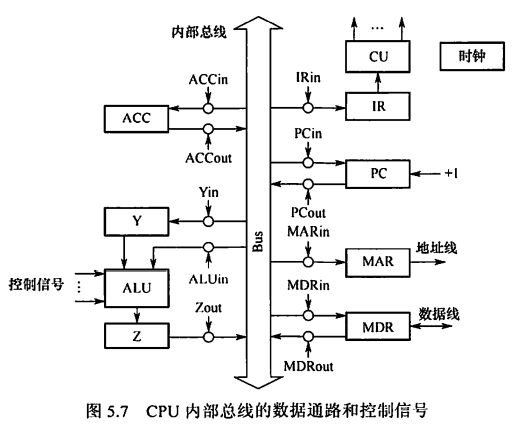

#### 寄存器之间的数据传送

描述清楚数据流向和控制信号，如把PC内容送到MAR，则实现传送操作的流程及控制信号为：

(PC)$\rightarrow$Bus，$PC_{out}$有效，PC内容送总线

Bus$\rightarrow$MAR，$MAR_{in}$有效，总线内容送MAR

#### 主存与CPU之间的数据传送

#### 执行算术或逻辑运算

ALU本身无存储功能，计算两个数时要求两个输入端同时有效。

一个操作数先送至暂存器保存，暂存器连接ALU的一个输入端并始终有效；另一个操作数通过总线直接送到ALU的另一个输入端。

运算结果暂存在另一个暂存器中

### 专用数据通路

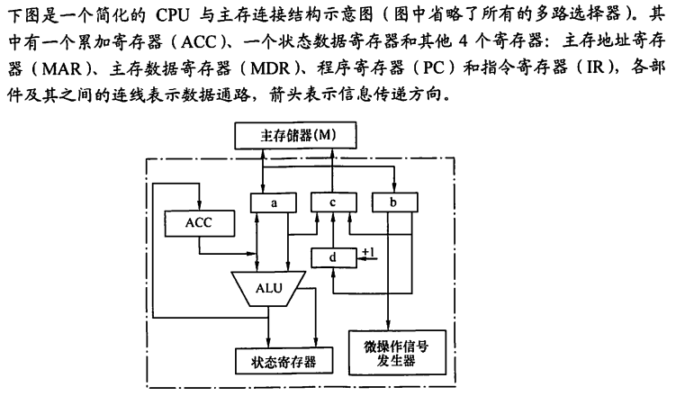

（1）d寄存器有+1标志，所以是PC；c寄存器单向指向主存，所以是MAR；b既指向PC又指向微操作信号发生器，所以是IR；a与主存、ALU是双向的，所以是MDR。

（2）(PC)到MAR，M(MAR)到MDR，MDR到IR，完成取指

（3）取：地址存储在MAR中，CPU向主存发出读控制命令，M(MAR)到MDR，(MDR)再到ALU再到ACC；存：ALU计算完毕后将结果打入ACC，(ACC)再到MDR，MAR存储要写入的地址，CPU向主存发出写控制命令，(MDR)到M(MAR)

## 5.4 硬布线控制器的设计

### CPU的控制方式

- 同步控制方式：
  - 系统有一个统一的时钟，所有的控制信号均来自这个统一的时钟信号，长度以最长的微操作序列和最繁琐的微操作为标准。
  - 采用完全统一的、具有相同时间间隔和相同数目的节拍作为机器周期
  - 控制电路简单，但运行速度慢
- 异步控制方式：
  - 各部件按自身固有的速度工作，通过应答方式进行联络
  - 运行速度快，但控制电路复杂
- 联合控制方式：
  - 介于同步、异步之间的一种折中。
  - 大部分采用同步控制、小部分采用异步控制

### 设计原理

根据**指令操作码**、**当前的机器周期**、**节拍信号**、**机器状态条件**，即可确定在目前这个节拍下应该发出哪些微命令。

- 指令操作码根据指令寄存器中的指令由操作码译码器产生

- 当前机器周期用四个触发器（集成在CU中）表示：FE（取指周期）、IND（间址周期）、EX（执行周期）、INT（中断周期）；四个触发器哪个为1，就表示当前处于哪个机器周期。
- 节拍信号由机器主频CLK经过节拍发生器产生
- 机器状态条件来源比较广泛，可能来自运算器的PSW、ACC的符号位等，也可能来自I/O设备、主存

CU内部电路综合上述输入信号，直接产生相应的控制信号，也即一个微命令。

> CU内部电路如何综合输入信息产生控制信号？

如微操作指令$M(MAR)\rightarrow MDR$，它会在以下情况出现：

- 取指阶段的$T_1$节拍（$T_0$节拍是$(PC)\rightarrow MAR$）；
- 间址阶段的$T_1$节拍（前提：要执行的操作是ADD、STA、LDA、JMP、BAN其中之一）
- 执行阶段的$T_1$节拍（前提：要执行的操作是ADD或LDA）

所以该微命令的逻辑表达式是：
$$
FE \cdot T_1\\+IND\cdot T_1(ADD+STA+LDA+JMP+BAN)\\+EX\cdot T_1(ADD+LDA)
$$

### 设计步骤

1. 分析每个阶段的微操作序列（取指、间址、执行、中断四个阶段）
2. 选择CPU的控制方式（定长机器周期还是不定长机器周期？每个机器周期安排几个节拍？）
3. 安排微操作时序（如，如何用3个节拍完成整个机器周期内的所有微操作？哪些微操作可以在同一个节拍内并行？）
   - 原则一：微操作的先后顺序不得随意更改
   - 原则二：被控对象不同的微操作尽量安排在一个节拍内完成
   - 原则三：占用时间较短的微操作尽量安排在一个节拍内完成，并允许有先后顺序（如被控对象是CPU内部寄存器之间时）
4. 电路设计（确定每个微操作命令的逻辑表达式，并用电路实现）
   1. 列出操作时间表
   2. 写出微操作命令的最简表达式
   3. 画出逻辑图

### 特点

指令越多，设计和实现就越复杂，一般用于RISC

如果扩充一条新的指令，则控制器的设计就需要大改，扩充指令困难

由于使用纯硬件实现控制，执行速度非常快，微操作控制信号由组合逻辑电路即时产生。

## 5.5 微程序控制器

### 微程序控制器的设计思路

一条机器指令对应一个微程序，一个微程序包含多条微指令，一条微指令完成系列微操作/微命令。

- 微命令/微操作：控制部件向执行部件发出的各种控制命令，是构成控制序列的最小单位。如打开或关闭某个控制门的电位信号等。微操作是微命令的执行过程
  - 相容微命令：可以同时产生、共同完成某一些微操作的微命令
  - 互斥微命令：机器中不允许同时出现的微命令
- 微指令：微指令是若干微命令的集合。一条微指令包含<u>操作控制字段</u>和<u>顺序控制字段</u>，前者用于产生各种操作控制信号，后者用于产生下一条要执行的微指令地址
- 微周期：从控制存储器中读取一条微指令并执行响应的微操作所需的时间
- 控制存储器：用于存放微程序，在CPU内部，用ROM实现
- 微程序：微程序是微指令的有序集合。一条机器指令对应一个微程序。

### 微程序控制器的组成和工作原理

> 微程序从哪来？当前执行的微指令的地址存放在哪里？取出的微指令又存放在哪里？

微程序由厂家在制造时编制好并写入到**控制存储器CM（可用ROM构成）**中。

微指令基本格式包括操作控制字段和顺序控制字段。操作控制字段表示微指令所需要完成的微操作有哪些；顺序控制字段指明下一条微指令（在CM中的）的地址。

**微地址寄存器CMAR/$\mu$PC**：用于接收微地址形成部件送来的微地址，为在CM中读取微指令作准备。

**地址译码器**：将地址码转化为存储单元控制信号

**微指令寄存器CMDR/$\mu$IR**：用于存放从CM中取出的微指令，它的位数与微指令字长相等。

**微地址形成部件**：产生初始微地址和后继微地址，以保证微指令的连续执行。

**顺序逻辑**：时钟信号、状态标志位等，还可以根据微地址中的寻址特征位判断是否要跳过间址周期

### 公用微程序

每条指令在取指周期、间址周期和中断周期中所要完成的微操作其实是相同的，因此这三个周期对应的微程序只在CM中存储一份即可。而不同指令在执行周期所要执行的微程序则可能不同，那么也为LDA、STA等指令对应的微程序各准备一份存储在CM中，不同指令只需要在公用的微程序结束后转到不同的执行周期微程序起始地址即可。

因此，如果某指令系统中有n条机器指令，则CM中微程序段的个数至少是n+1个。其中n为不同机器指令对应的不同执行周期微程序；1为公用的取指周期微程序。因为是“至少”，所以假设没有间址周期和中断周期。

一条机器指令实际上至少包含了取指周期微程序+执行周期微程序这2个微程序，但它们在逻辑上是一个整体，因此认为“**一条指令对应一个微程序**”也是正确的。

### 微指令的设计

#### 微指令种类

1. 水平型微指令

   一条微指令能定义多个可并行的微命令

   微程序短（微指令数量少），执行速度快；单条微指令长，编写微程序较麻烦。

2. 垂直型微指令

   一条微指令只能定义一个微命令，由微操作码字段规定具体功能

   微程序长，执行速度慢，工作效率低；单条微指令短、简单、规整，便于编写微程序

3. 混合型微指令

   在垂直型的基础上增加一些不太复杂的并行操作。

   微指令较短，仍便于编写；微程序也不长，执行速度加快。

#### 微指令的编码方式

1. 直接编码方式

   在微指令的操作控制字段中，每一位代表一个微操作命令

   优点：简单、直观，执行速度快，操作并行性好

   缺点：微指令字长过长，n个微命令就要求微指令的操作字段有n位，造成控存容量极大。

2. 字段直接编码方式

   将微指令的控制字段分成若干“段”，每段经**译码**后发出控制信号

   分段原则：

   - 互斥性微命令分在同一段内，相容性微命令分在不同段内
   - 每个小段中包含的信息位不能太多，否则将增加译码线路的复杂性和译码时间
   - **一般每个小段还要留出一个状态，表示本段不发出任何微命令**，因此，当某字段的长度为3位时，最多只能表示7个互斥的微命令。通常用000表示不操作

   优点：可以缩短微指令字长

   缺点：要通过译码电路后再发出微命令，因此比直接编码方式慢

3. 字段间接编码方式

   一个字段的某些微命令需由另一个字段中的某些微命令来解释，由于不是靠字段直接译码发出的微命令，故称为字段间接编码，又称隐式编码。

   优点：可进一步缩短微指令字长

   缺点：削弱了微指令的并行控制能力

#### 微指令的地址形成方式

- 方式一：由微指令的下一地址字段指出

  微指令格式中设置一个下一地址字段，由该字段直接指出后继微指令的地址。这种方式又称为断定方式

- 方式二：根据机器指令的操作码形成

  当机器指令取至指令寄存器后，微指令的地址由操作码经微地址形成部件形成

- 方式三：增量计数器法

  (CMAR)+1 → CMAR

- 方式四：分支转移

  此方式下微指令格式中有三个字段：操作控制、转移方式和转移地址，转移方式字段指明判别条件，转移地址指明转移成功后的去向

- 方式五：通过测试网络

  测试网络即一些逻辑电路，根据顺序逻辑等信号决定下一微地址

- 方式六：由硬件产生微程序入口地址

  第一条微地址和中断周期首地址由专门硬件产生（用专门的硬件存储取指周期微程序、中断周期微程序的首地址）

### 微程序控制单元的设计

1. 分析每个阶段的微操作序列

2. 写出对应机器指令的微操作命令及节拍安排

   （1）写出每个周期所需要的微操作

   （2）补充微程序控制器特有的微操作：

   - 取指周期：Ad(CMDR) → CMAR、 OP(IR) → CMAR（转入执行周期）
   - 执行周期：Ad(CMDR) → CMAR

3. 确定微指令格式

   根据微操作个数决定采用何种编码方式，以确定微指令的操作控制字段的位数；

   根据CM中存储的微指令总数，确定微指令的顺序控制字段的位数

   根据操作控制字段的位数和顺序控制字段的位数，确定微指令字长

4. 编写微指令码点

   根据操作控制字段每一位代表的微操作命令，编写每一条微指令的码点。

## 5.6 硬布线与微程序的比较

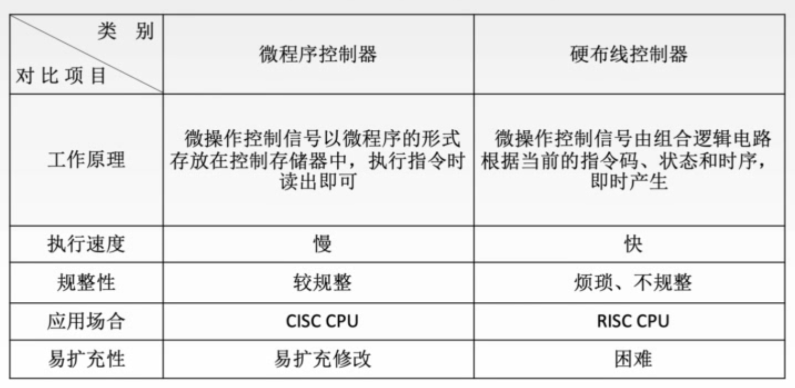

## 5.7 指令流水线

### 指令执行的方式

假设一条指令的执行构成由取指、分析、执行三个阶段构成，且耗时都相等，为$t$

1. 顺序执行方式

每条指令依次完成，即指令一完成取指、分析、执行后再开始指令二的取指、分析、执行……则顺序执行$n$条命令的总耗时$T=n\times 3t=3nt$

2. 一次重叠执行方式

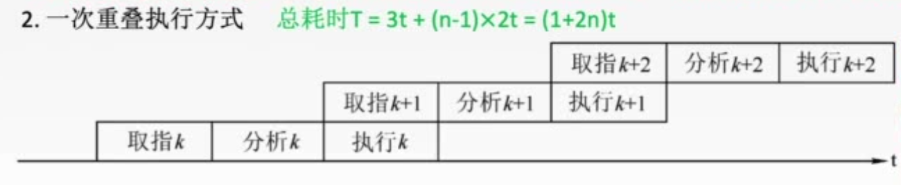

在指令一处于执行阶段时，指令二同时进行取指阶段。在时间轴上，指令与指令之间只有在这部分才会有时间上的重叠，所以是一次重叠。一次重叠执行方式的总耗时$T=3t+(n-1)\times2t$

3. 二次重叠执行方式

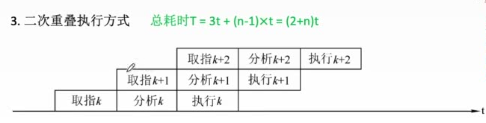

总耗时$T=3t+(n-1)\times t=(2+n)t$

### 流水线的表示方法

1. 指令执行过程图

   用于分析指令执行过程以及影响流水线的因素

   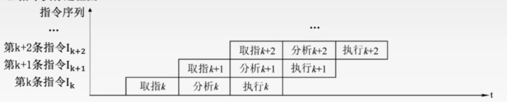

2. 时空图

   用于分析流水线的性能

   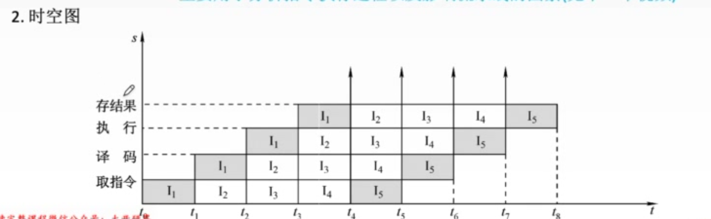

### 流水线的性能指标

1. 吞吐率

   单位时间内流水线所完成的任务数量，或是输出结果的数量

   设任务数为$n$；完成$n$个任务的总用时为$T_k$；则流水线吞吐率（TP）的最基本公式为
   $$
   TP=\frac{n}{T_k}
   $$
   设现有$n$条指令，指令周期都相等，都分为$k$个机器周期，其中一个机器周期只包含一个时钟周期$\Delta t$，则流水线的吞吐率为
   $$
   TP=\frac{n}{(k-1)\Delta t+n\Delta t}=\frac{n}{(k+n-1)\Delta t}
   $$
   其中$(k-1)\Delta t$是流水线装入阶段的耗时；在装入阶段结束后，每经过一个$\Delta t$都会完成一条指令，共会完成$n$条指令。

2. 加速比

   完成同样一批任务，不使用流水线所用的时间与使用流水线所用的时间之比。

   设$T_0$为不使用流水线时的耗时，$T_k$为使用流水线时的耗时，则流水线加速比($S$)的基本公式为
   $$
   S=\frac{T_0}{T_k}
   $$

3. 效率

   流水线的设备利用率。在时空图上，流水线的效率为完成$n$个任务占用的时空区有效面积与$n$个任务所用的时间与$k$个流水段所围成的时空区总面积之比。

   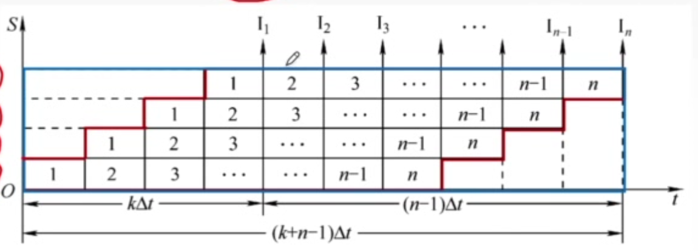

### 指令流水线的影响因素和分类

#### 机器周期的设置

MIPS架构下，指令周期分为取指、译码、执行、访存、写回共5个机器周期，即使某些指令实际上不需要其中的某些机器周期，也必须等待该机器周期的时间。

为方便流水线的设计，将每个阶段的耗时统一为以最长耗时为准。

流水线每一个功能段部件后都由一个缓冲寄存器，或称为锁存器，其作用是保存本流水线段的执行结果，提供给下一流水段使用。

Cache分为两个彼此独立的部件，指令Cache和数据Cache，由于Cache命中率相当高，在这里我们默认所需的指令/数据都可以直接从Cache取得。

指令Cache和数据Cache彼此独立，使得取指阶段和访存阶段可以并行。

在指令译码阶段，除了对操作码进行译码之外，还要将操作数从通用寄存器中取出放到锁存器里（RISC架构下，操作数从主存取出后先存储在通用寄存器）。若指令的寻址方式为立即寻址，则将立即数放到专门的Imm寄存器。

#### 影响流水线的因素

1. 结构相关（资源冲突）

   由于多条指令在同一时刻争用同一资源而形成的冲突。

   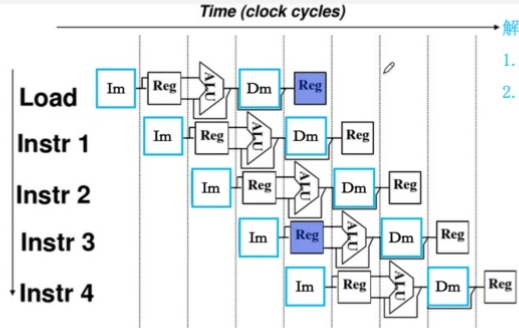

   解决方法：

   - 前一指令访存时，后一相关指令暂停一周期
   - 资源重复配置：如互相独立的指令Cache和数据Cache

2. 数据相关

   在一个程序中，存在必须等前一条指令执行完才能执行后一条指令的情况，则这两条指令即为数据相关

   - 写后读（RAW）相关：当前指令将数据写入寄存器后，下一条指令才能从该寄存器读取数据
   - 读后写（WAR）相关：当前指令读出数据后，下一条指令才能写该寄存器
   - 写后写（WAW）相关：当前指令写入寄存器后，下一条指令才能写该寄存器

   ```asm
   add r1,r2,r3
   sub r4,r1,r3
   and r6,r1,r7
   or r8,r1,r9
   xor r10,r1,r11
   ```

   如上述指令中，r1寄存器被相继使用，指令彼此之间数据相关。

   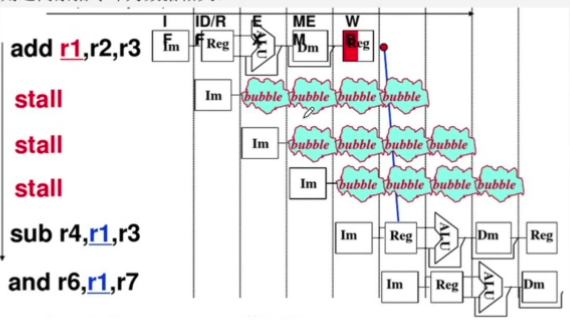

   解决办法：

   - 把遇到数据相关的指令及其后续指令都暂停一至几个时钟周期，直到数据相关问题消失后再继续执行。可分为硬件阻塞和软件插入（插入空指令）两种方法。

   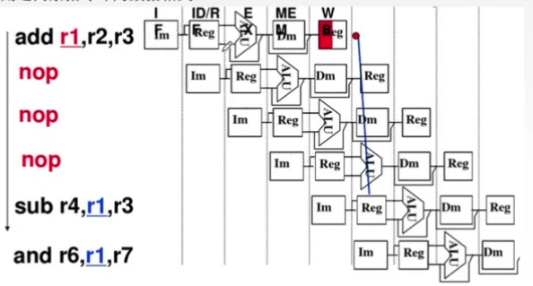

   - 数据旁路技术：例如，在同一个ALU内，将前一指令的结果直接送到另一个寄存器中，供下一条需要用到ALU的指令直接使用这个数据。
   - 编译优化：通过编译器调整指令顺序来解决数据相关。即把后续的无数据相关的指令提前执行。

3. 控制相关（控制冲突）

   当流水线遇到转移指令和其他改变PC值的指令而造成断流（导致已装入的指令实际上不应该执行）时，会引起控制相关

   解决方法：

   - 转移指令分支预测。简单预测（永远猜True或False）、动态预测（根据历史情况动态调整）
   - 预取转移成功和不成功两条控制流上的目标指令（也就是CS:APP上说的两边都执行，再根据转移方向对结果作取舍）
   - 加快和提前形成条件码（就像加法器里的超前进位）
   - 提高转移方向的猜准率

#### 流水线的分类

1. 部件功能级、处理机级和处理机间级流水线

   根据流水线使用的级别的不同分类。

   部件功能级流水线就是将复杂的算术逻辑运算组成流水线工作方式。如浮点加法分为求阶差、对阶、尾数相加和结果规格化4个子过程。

   处理机级流水就是把一条指令解释过程分为多个子过程。

   处理机间流水是一种宏流水，其中一个处理机完成某一专门任务，各个处理机所得到的结果存放在与下一个处理机所共享的存储器中。

2. 单功能流水线和多功能流水线

   按流水线可以完成的功能，流水线可分为单功能流水线和多功能流水线。

   单功能流水线指只能实现一种固定的专门功能的流水线。

   多功能流水线指通过各段间的不同连接方式可以同时或不同时地实现多种功能的流水线（如指令流水线）

3. 动态流水线和静态流水线

   按同一时间内各段之间的连接方式，流水线可分为静态流水线和动态流水线。

   静态流水线指同一时间内，流水线的各段只能按同一种功能的连接方式工作。如浮点加法流水线。

   动态流水线指同一时间内，当某些段正在实现某种运算时，另一些段却正在进行另一种运算。

4. 线性流水线和非线性流水线

   按流水线的各个功能段之间是否有反馈信号，流水线可分为线性流水线和非线性流水线

#### 流水线的多发技术

1. 超标量技术

   每个时钟周期内可并发多条独立指令，需要配置多个功能部件，不能调整指令的执行顺序。

   通过编译优化技术，把可并行执行的指令搭配起来。

   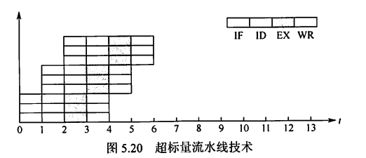

2. 超流水线技术

   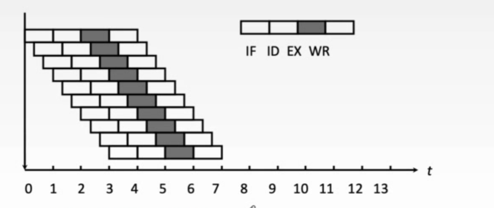

   通过提高流水线主频的方式提升流水线性能

   但级数越多，用于流水寄存器的开销就越大，所以不是越多越好

   在一个机器周期内再分段，在一个机器周期内一个功能部件使用多次（时分复用）。不能调整指令的执行顺序。

   超流水线CPU在流水线充满后，每个时钟周期还是完成一条指令，CPI=1.

   靠编译程序解决优化问题

3. 超长指令字技术

   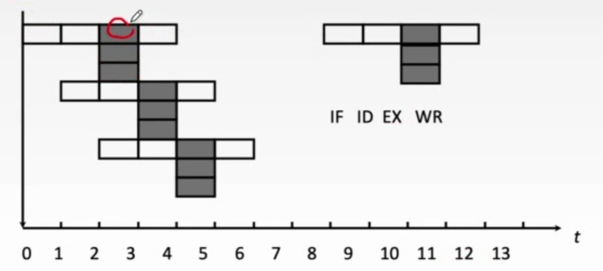

   由编译程序挖掘出指令间潜在的并行性，将多条能并行操作的指令组合成一条具有多个操作码字段的超长指令字（可达几百个比特）
   
   对Cache容量要求更大。

### 五段式指令流水线

要点总结：

- IF阶段有IF阶段的锁存器，用于存放取出的指令数据，并需要等待ID阶段开始来取走锁存器中的内容。
- ID阶段既取走IF段锁存器的指令进行译码，又从通用寄存器中取走需要的数据，并放到ID段锁存器
- 对于RISC处理器，只有LOAD指令和STORE指令才能访问主存。且从主存中取出的数据要等到WB阶段才会真正写入到寄存器中。
- 运算指令的运算结果也要等到WB阶段才会真正写入到寄存器中
- PC+1通常发生在IF段结束后
- **条件转移指令中对PC值的修改发生在M段**而非WB段
- **无条件指令中对PC值的修改发生在EX阶段**

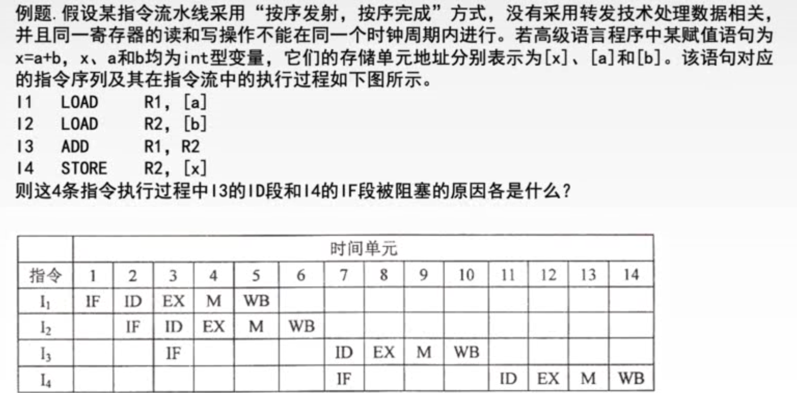

LOAD指令中，从主存取出的数需要等到WB阶段才会写入到寄存器中。ID阶段既完成指令译码工作，又要完成从寄存器取出相关数据的操作。因此I3的ID阶段需要等到I1和I2指令的WB阶段结束后才能开始。即，I3与I1和I2存在数据相关。

因为I3的ID阶段被推迟，则I3在IF阶段完成后I3指令数据仍占用着IF段锁存器，I4的IF阶段因此也无法紧接着开始，只能推迟到I3的ID阶段开始时。

## 5.8 多处理器

### SISD、SIMD、MIMD

- 单指令流单数据流结构（SISD）

  传统串行计算机结构，通常只包含<u>一个处理器和一个存储器</u>，处理器在一段时间内仅执行一条指令。有些SISD计算机采用流水线的方式

- 单指令流多数据流（SIMD）

  一个指令流同时对多个数据流进行处理，又称**数据级并行**技术。由一<u>个指令控制部件、多个处理单元</u>组成。不同处理单元执行的同一条指令所处理的数据不同。

  在使用for循环处理数组时最有效，如一条分别对16对数据进行运算的SIMD指令若在16个ALU中同时运算，则只需要一次运算时间。在使用case或switch语句时效率最低

  - 向量处理器：SIMD的变体，是一种实现了直接操作一维数组（向量）指令集的CPU。

- 多指令流单数据流（MISD）

  同时执行多条指令，处理同一个数据。但实际上不存在这样的计算机

- 多指令流多数据流（MIMD）

  - 线程级并行或线程级以上并行，与数据级并行相比并行程度更高
  - 多计算机系统（消息传递MIMD）：每个节点都有各自的私有存储器，具有独立的主存地址空间。节点之间只能通过消息传递方式进行数据传送。

  - 多处理器系统（共享存储MIMD）：具有共享的单一地址空间，通过存取指令访问系统中的所有存储器

### 硬件多线程

即在OS中学习线程时所说的，为了降低线程切换过程中的开销，为每个线程提供单独的通用寄存器组、单独的程序计数器，从而线程切换只需激活选中的寄存器，而不必把数据先搬到主存来腾出寄存器位置。

#### 细粒度多线程

处理器能在**每个时钟周期内**切换线程

多个线程之间轮流交叉执行指令。这多个线程之间指令不相关，可以乱序并行执行。

#### 粗粒度多线程

处理器仅在**一个线程出现了较大开销的阻塞时**切换线程，如Cache缺失

发生流水线阻塞时，要先清除被阻塞的流水线，重载后再执行新线程的指令。切换开销比细粒度多线程更大

#### 同时多线程

在实现指令级并行的同时，实现线程级并行。

即，在同一个时钟周期中，它发射<u>多个不同线程</u>中的<u>多条指令</u>

Intel处理器中的超线程技术就是同时多线程

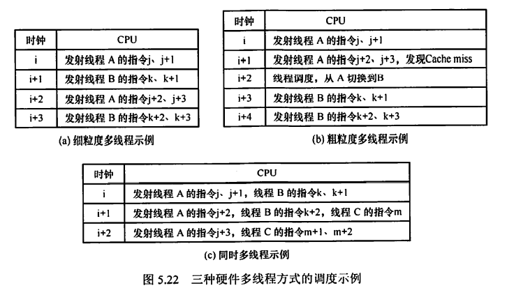

### 多核处理器

将多个处理单元集成到单个CPU中，每个处理单元称为一个核

每个核可以有自己的Cache，也可以共享同一个Cache

多核上的多个线程是在物理上并行执行的；而单核上的多线程实际是交错执行

### 共享内存多处理器

共享内存多处理器（SMP）：具有共享的单一物理地址空间的多处理器

处理器通过存储器中的共享变量相互通信，通过存取指令访问任何存储器的位置。

- UMA（统一存储访问）：每个处理器对所有存储单元的访问时间大致相同，与处理器和访存单元都无关
- NUMA（非统一存储访问）：某些访存请求要比其他的要快，取决于处理器和要访问的字。这是因为主存被分割并被分配给了同一机器上的不同处理器或内存控制器

NUMA解决了多核、多CPU争用前端总线的问题，它令每个CPU都有独立的内存控制器，且每个CPU都独立连接到一部分内存。<u>直连的内存被称为本地内存</u>。<u>通过QPI总线访问其他CPU直连的内存称为远程内存</u>。

访问本地内存明显要快于访问远程内存。

操作共享变量时需要同步，常用方法是对共享变量加锁。

