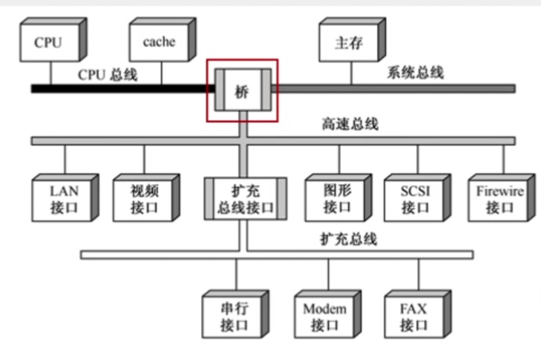
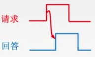

# 第六章 总线

## 6.1 总线概述

多根信号线组成一根总线，同一时刻只能有一个部件发送数据，但可有多个部件接受数据。

### 总线的定义

总线是一组能为多个部件分时共享的公共信息传送线路。

- 分时：同一时刻只允许有一个部件向总线发送信息
- 共享：总线上可以挂接多个部件，各个部件之间相互交换的信息都可以通过这组线路分时共享

为了解决I/O设备和主机之间连接的灵活性问题，从分散连接发展为总线连接。

### 总线的特性

1. 机械特性：尺寸、形状、管脚数、排列顺序
2. 电气特性：传输方向和有效的电平范围
3. 功能特性：每根传输线的功能（传输什么？地址or数据or控制？）
4. 时间特性：信号的时序关系

### 总线的分类

#### 按数据传输格式

- 串行总线

  每次只能传一位（如USB）

  优点：只需要一条传输线，成本低，广泛应用于长距离传输，节省布线空间

  缺点：在数据发送和接收时要进行拆卸和装配，要考虑串行、并行转换的问题

- 并行总线

  每次可以传多位

  优点：总线的逻辑时序比较简单，电路实现起来比较容易

  缺点：信号线数量多，占用更多的布线空间；长距离传输成本高昂；工作频率较高时，信号线彼此之间会产生严重干扰。因此并行总线不一定比串行总线更快

#### 按总线功能

- 片内总线

  片内总线是CPU芯片内部的总线。是CPU芯片内部寄存器之间、寄存器与ALU之间的公共连接线。

- 系统总线

  系统总线是计算机系统内各功能部件之间相互连接的总线。

  - 数据总线：用来传输数据信息，双向，位数与机器字长、存储字长有关
  - 地址总线：指出数据所在的主存单元或I/O端口的地址，单向，位数与主存地址空间和I/O设备数量有关（如统一编址的情况）。
  - 控制总线：传输的是控制信息，包括CPU送出的控制命令和主存（或外设）返回CPU的反馈信号。对于单根传输线而言是单向的，对于总线整体而言是双向的。

- 通信总线

  用于计算机系统之间或计算机系统与其他系统（如远程通信设备、测试设备）之间信息传送的总线，通信总线也称为外部总线。

### 系统总线的结构

- 单总线结构

  - CPU、主存、I/O设备（通过I/O接口）都连接在一组总线上，允许I/O设备之间、I/O设备和CPU之间或I/O设备与主存之间直接交换信息
  - 优点：结构简单、成本低、易于接入新的设备
  - 缺点：带宽低、负载重，多个部件只能争用唯一的总线，且不支持并发传送操作（即多组部件之间同时传送数据）

- 双总线结构

  - 有两条总线，一条是主存总线，用于CPU、主存和通道之间进行数据传送，速度较快；另一条是I/O总线，用于多个外部设备与通道之间进行数据传送，速度较慢
  - 具有通道。通道是具有特殊功能的处理器，能对I/O设备进行统一管理。通道程序放在主存中
  - 优点：将较低速的I/O设备从单总线上分离出来，实现存储器总线和I/O总线分离
  - 缺点：需要增加通道等硬件设备

- 三总线结构

  - 有三条总线，分别为主存总线、I/O总线和直接内存访问DMA总线。磁盘机等高速外设直接通过DMA总线与主存之间进行数据传输；打印机、键盘等低速外设则通过I/O总线与CPU之间进行数据传输。
  - 优点：提高了I/O设备的性能，使其更快地响应命令，提高系统吞吐量
  - 缺点：系统工作效率较低，因为三条总线同一时间只能有一条在工作。

- 四总线结构

  

  - 有四条总线，分别为CPU总线（CPU和Cache）、系统总线、高速总线和扩充总线。具有桥接器，用于连接不同的总线，具有数据缓冲、转换和控制功能。

## 6.2 总线的性能指标

### 传输周期/总线周期

一次总线操作所需的时间（包括申请阶段、寻址阶段、传输阶段和结束阶段），通常由若干个总线时钟周期构成

### 总线时钟周期

即机器的时钟周期

一个总线周期可能包含多个、一个、几分之一个时钟周期（即在一个时钟周期内可以完成多次总线操作）

### 工作频率

总线上各种操作的频率，为总线周期的倒数。

若总线周期=N个时钟周期，总线的工作频率=时钟频率/N

实际上指**一秒传送几次数据**

### 总线时钟频率

即机器的时钟频率，为时钟周期的倒数

若时钟周期为T，则时钟频率为1/T

实际上指一秒内有多少个时钟周期

### 总线宽度

又称总线位宽，指总线上同时能够传输的数据位数

通常是指数据总线的根数，如32根称为32位总线

### 总线带宽

单位时间内总线可传输的数据的位数，通常用每秒传送信息的字节数来衡量，单位B/s

是指总线本身所能达到的最高传输速率

在计算实际的有效数据传输率时，要用实际传输的数据量处以耗时

> 例：某同步总线采用数据线和地址线复用方式，其中地址/数据线有32根，总线时钟频率为66MHz，每个时钟周期传送两次数据。
>
> （1）该总线的最大数据传输率（总线带宽）是多少？
>
> （2）若该总线支持突发（猝发）传输方式，传输一个地址占用一个时钟周期，则一次“主存写”总线事务传输128位数据所需要的时间至少是多少？

（1）一个时钟周期的时长为$\frac{1}{66\times10^6}s$，一秒共有$66\times10^6$个时钟周期，一个时钟周期传送两次数据共64bit，则一秒传输$66\times 10^6\times64bit=66\times8\times10^6byte$，故总线带宽为$528MB/s$

（2）由于支持突发传输方式，只需传输一次地址就能连续得到128位数据。发送首地址需要占用一个时钟周期，128位数据需传送4次，占用两个时钟周期，三个时钟周期的总时间为$1/22\times10^{-6}s=45\times10^{-9}s=45ns$。

### 总线复用

总线复用是指一种信号线在不同的时间传输不同的信息。这样就可以使用较少的线传输更多的信息，从而节省空间成本

### 信号线数

地址总线、数据总线、空间总线3种总线数的总和

## 6.3 总线仲裁

### 总线仲裁的基本概念

主设备：获得总线控制权的设备

从设备：被主设备访问的设备，只能响应从主设备发来的各种总线命令

总线仲裁：多个主设备同时竞争主线控制权时，以某种方式选择一个主设备优先获得总线控制权

分类：集中仲裁方式、分布仲裁方式

### 集中仲裁

#### 工作流程

1. 主设备发出请求信号
2. 若多个主设备同时要使用总线，则由总线控制器的判优、仲裁逻辑按一定的优先等级顺序确定哪个主设备能使用总线
3. 获得总线使用权的主设备开始传送数据

#### 链式查询方式

总线中设有三根信号线，分别为BG（总线允许）、BR（总线请求）、BS（总线忙）

设备先向BR线发送信号，总线控制部件向BG线发送信号，BG线所经过的第一个发送了请求的设备获得总线控制权，同时该设备向BS线发送信号。总线控制部件收到BS线的信号，得知总线控制权已经分配完毕，撤销BG线信号。

优先级：离总线控制器越近，优先级越高，反之越低

优点：优先级固定，只需要很少几根控制线就能按一定优先次序实现总线控制

缺点：对硬件电路的故障敏感（BG线信号经过了某个损坏的设备无法继续向下传递），且优先级不能改变；饥饿现象。

#### 计数器查询方式

相对链式查询方式多了一组设备地址线，同时每个设备都有一个编号，少了一根总线响应线BG；设备间共用一根BR线。总线控制部件中增加一个计数器。

计数器查询方式实际上就是轮询，计数器当前的计数是多少，就询问对应编号设备是否需要使用总线，是则置BS线信号并暂停计数；否则继续计数询问下一个设备。

优点：计数初始值可以改变优先次序。若计数总是从上一次的终点开始，则设备使用总线的优先级相等。若计数每次从“0”开始，则设备优先级按顺序排列，固定不变。对电路故障没有链式敏感。

缺点：增加了控制线数；控制电路比链式查询复杂

#### 独立请求方式

每个设备都有一对BG线和BR线连接到总线控制部件；有一条公用的BS线；总线控制部件中设置有排队器。

当设备需要使用总线时，则通过BR线发送请求信号。总线控制部件会对请求信号进行排队，按一定的优先次序决定哪个部件的请求被批准，并发送对应的BG信号，被分配到总线控制权的部件对BS线发送信号。

优点：响应速度快，BG信号直接从控制器发送到对应设备，不必在设备间传递或查询；对优先次序的控制灵活

缺点：控制线数量多，n个设备需要2n+1条控制线；总线的控制逻辑更加复杂。

### 分布仲裁

特点：不需要中央仲裁器，每个潜在的主模块都有自己的仲裁器和仲裁号，多个仲裁器竞争使用总线。

1. 当设备有总线请求时，就把自己的仲裁号发送到共享的仲裁总线
2. 每个仲裁器从仲裁总线上得到仲裁号，与自己的仲裁号比较
3. 若仲裁总线上的号优先级高，则该仲裁器发出的总线请求不被响应，发出的仲裁号也会被撤销
4. 获胜者的仲裁号保留在仲裁总线上

## 6.3 总线操作和定时

### 总线传输的四个阶段

#### 申请分配阶段

需要使用总线的主模块（或主设备）提出申请，经总线仲裁机构决定将下一传输周期的总线使用权授予某一申请者。也可将此阶段细分为传输请求和总线仲裁两个阶段

#### 寻址阶段

获得总线控制权的设备向总线发出访问地址，启动参与本次传输的从模块

#### 传输阶段

主设备与从设备之间进行数据交换

#### 结束阶段

主设备的有关信息均从系统总线上撤除，让出总线控制权

### 定时

#### 同步定时方式（同步通信）

总线传输的各阶段按同一的时钟节拍进行

若总线从设备未能在规定的节拍之前准备好数据并在规定的节拍发出，则数据传输会失败

优点：传送速度快，具有较高的传输速率；总线控制逻辑简单

缺点：主从设备属于强制性同步；不能及时进行数据通信的有效性检验，可靠性较差

适用于总线长度较短及总线所接部件的存取时间比较接近的系统

#### 异步定时方式（异步通信）

- 不互锁

  主设备发出请求信号，等待一定时间后直接撤销，不需要从设备的响应

  从设备发出回答信号，等待一定时间后直接撤销，不需要主设备确认

  速度最快，可靠性最差

  

- 半互锁

  主设备发出请求信号，必须接收到从设备的回答信号后才能撤销

  从设备发出回答信号，等待一定时间后直接撤销，不需要主设备确认

  

- 全互锁

  主设备发出请求信号，必须接收到从设备的回答信号后才能撤销

  从设备发出回答信号，必须等待主设备的请求信号撤销后才能撤销

  最可靠，速度最慢

  

优点：总线周期长度可变，能保证两个工作速度相差很大的部件或设备之间可靠地进行信息交换，自动适应时间的配合

缺点：比同步控制方式稍复杂，速度比同步定时方式慢

#### 半同步通信

在统一时钟的基础上，增加一个“等待”响应信号，当从设备数据来不及准备时，让总线传输周期延长。

#### 分离式通信

分离式通信的一个总线传输周期分为两个子周期。

- 子周期1：主模块申请占用总线，使用完后放弃总线的使用权
- 子周期2：从模块申请占用总线，将各种信息送至总线上

特点：

1. 各模块均有权申请占用总线
2. 采用同步方式通信，不等对方回答
3. 各模块准备数据时，不占用总线
4. 总线利用率提高

## 6.4 总线标准

| 总线标准 | 工作频率 | 数据线 | 最大速度    | 特点     |
| -------- | -------- | ------ | ----------- | -------- |
| ISA      | 8MHz     | 8/16   | 16MB/s      | 系统总线 |
| EISA     | 8MHz     | 32     | 32MB/s      | 系统总线 |
| VESA     | 33MHz    | 32     | 132MB/s     | 局部总线 |
| PCI      | 33/66MHz | 32/64  | 528MB/s     | 局部总线 |
| AGP      | -        | -      | X8：2.1GB/s | 局部总线 |
| PCI-E    | -        | -      | 10GB/s以上  | 串行     |

### 设备总线标准

| 总线标准   | 工作频率 | 数据线 | 最大速度 | 特点           |
| ---------- | -------- | ------ | -------- | -------------- |
| RS-232C    | -        | -      | 20Kbps   | 串行通信总线   |
| SCSI       | -        | -      | 640MB/s  | 智能通用接口   |
| PCMCIA     | -        | -      | 90Mbps   | 便携设备接口   |
| USB        | -        | -      | 1280MB/s | 设备总线、串行 |
| IDE（ATA） | -        | 0      | 100MB/s  | 硬盘光驱接口   |
| SATA       | -        | -      | 600MB/s  | 串行硬盘接口   |

### 为何串行总线取代并行总线

并行总线：用m根线每次传送m个比特，通常采用同步定时方式，由于线间信号干扰，工作频率不能太高。各条线之间不能有长度差，长距离并行传输时工艺难度大

串行总线：用两根线每次传输一个比特，用“差模信号”（即两根线之间的电压差）表示1/0，通常采用异步定时方式，总线工作频率可以很高。通常基于包传输，包与包之间有先后关系。
