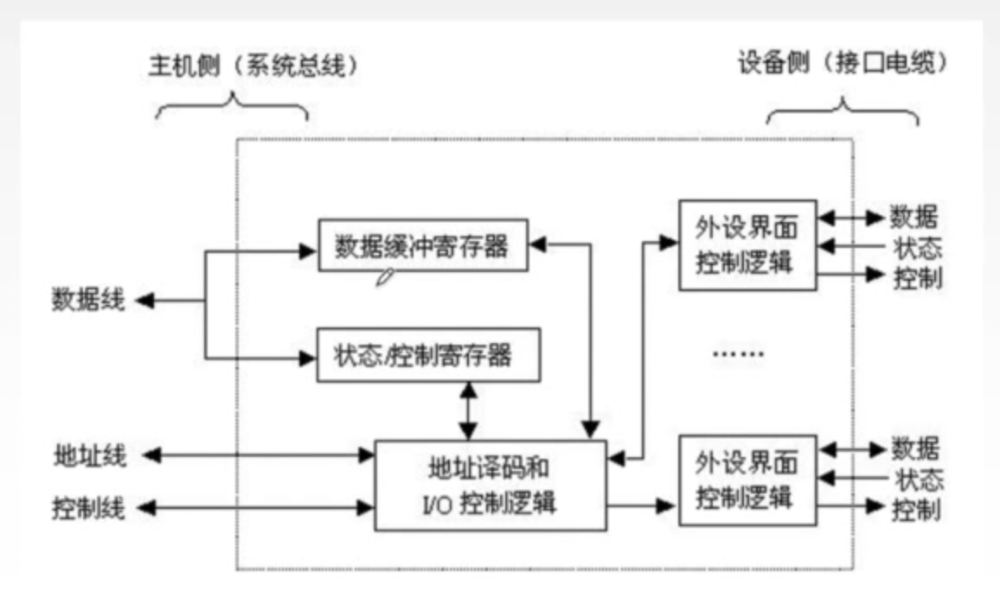
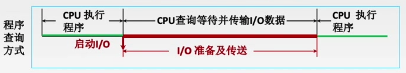
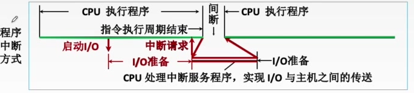
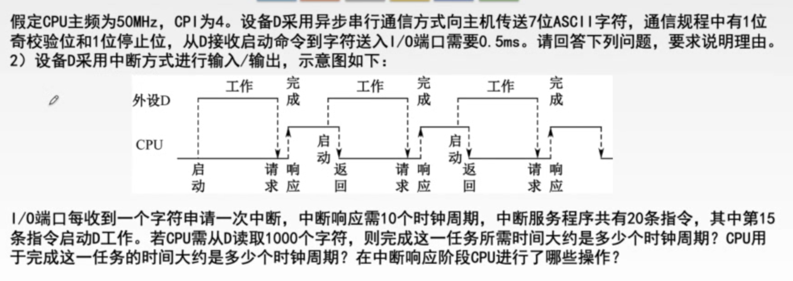
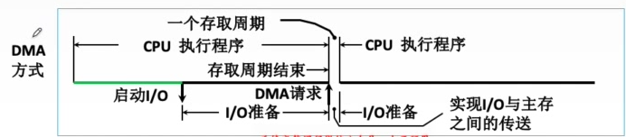

# 第七章 I/O系统

## 7.1 I/O系统基本概念

I/O接口：又称I/O控制器、设备控制器，负责协调主机与外部设备之间的数据传输。就是一块芯片，集成在主板上。

### I/O控制方式

> CPU如何知道键盘I/O的完成？

#### 程序查询方式

CPU不断轮询检查I/O控制器中的“状态寄存器”，检测到状态为“已完成”之后，再从数据寄存器取出输入数据。CPU一直等待，无法执行其他程序

#### 程序终端方式

等待键盘I/O时CPU可以先去执行其他程序，键盘I/O完成后I/O控制器向CPU发出终端请求，CPU响应中断请求，并取走输入数据

数据流：键盘→I/O接口的数据寄存器→数据总线→CPU某寄存器→主存（程序变量的对应位置）

#### DMA控制方式

> 对于快速I/O设备（如磁盘），如果每准备好一个字就向CPU发出一次中断请求，则中断频率会过高，如何解决？

高速外设通过DMA接口（也是一种I/O接口）和DMA总线直接与主存交换数据。

DMA控制方式：主存与高速I/O设备之间有一条直接数据通路（DMA总线）。CPU向DMA接口发出“读/写”命令，并指明主存地址、磁盘地址、读写数据量等参数。

DMA控制器自动控制磁盘与主存的数据读写，每次读写占用一个存取周期。每完成一整块数据读写（如1KB为一整块），才向CPU发出一次中断请求。

#### 通道控制方式

通道是具有特殊功能的处理器，能对I/O设备进行统一管理。

通道可以识别并执行一系列通道指令，通道指令种类、功能通常比较单一。

通道执行完规定的任务后，再向CPU发出中断请求，之后CPU对中断进行处理。

### I/O系统的基本组成

- I/O硬件：包括外部设备、I/O接口、I/O总线等
- I/O软件：包括驱动程序、用户程序、管理程序、升级补丁等。通常采用I/O指令和通道指令实现主机和I/O设备的信息交换。
  - I/O指令：是CPU指令的一部分，操作码（识别I/O指令）+命令码（对哪个设备进行操作）+设备码（做什么操作）
  - 通道指令：通道能识别的命令。通道程序提前编制好放在主存中

## 7.2 输入输出设备

### 显示器

#### 显存

显示存储器VRAM：也称为刷新存储器，为了不断提高刷新图像的信号，必须把一帧图像信息存储在刷新存储器中。其存储容量由图像分辨率和灰度级决定，分辨率越高、灰度级越多，刷新存储器容量越大。

显存的理论最小值是一帧图像的大小。

VRAM容量=分辨率*灰度级位数

VRAM带宽=分辨率\*灰度级位数*刷新频率

现代计算机中，显存除了作为当前显示帧的缓存，还会用于保存即将渲染的图像数据

#### 字符显示器

以点阵为基础。将字符点阵存入由ROM构成的字符发生器中，CRT控制器根据键盘I/O接口信息，从显存中找对应的ASCII码，再从字符发生器中读出相应字符的点阵，最后通过CRT显示

### 外存储器

- 磁表面存储器的优点：
  - 存储容量大、位价格低
  - 记录介质可以重复使用
  - 记录信息可以长期保存而不丢失，甚至可以脱机存档
  - 非破坏性读出，读出时不需要再生
- 磁表面存储器的缺点：
  - 存取速度慢
  - 机械结构复杂
  - 对工作环境要求较高

#### 磁盘设备的组成

1. 存储区域

   一块硬盘含有若干个记录面，每个记录面划分为若干条磁道，每条磁道又划分为若干个扇区，扇区（块）是磁盘读写的最小单位。

   - 磁头数：即记录面数
   - 柱面数：每一面盘片上由多少条磁道
   - 扇区数：表示每一条磁道上有多少个扇区

2. 性能指标

   - 容量：存储的字节总数

   - 记录密度：盘片上单位面积上的记录的二进制的信息量

     - 道密度：沿半径方向单位长度上的磁道数（如一厘米有多少圈）
     - 位密度：磁道单位长度上能记录的二进制位数（如一圈能记录多少位）
     - 面密度：位密度和道密度的乘积（一厘米的环面能记录多少位）

     所有磁道记录的信息量一定是相等的，故每个磁道的位密度都不同，越往外越小。

   - 平均存取时间：寻道时间（移动到目标磁道）+旋转延迟时间（移动到目标扇区）+传输时间（传输数据的时间）

   - 数据传输率：单位时间内向主机传送数据的**字节数**

3. 磁盘地址

   - 驱动器号+磁道号+盘面号+扇区号

4. 磁盘的工作过程
   
   - 读写操作是串行的，1bit1bit地读出/写入

#### 磁盘阵列(RAID)

多个独立的物理磁盘组成一个独立的逻辑盘，数据在多个物理盘上分割交叉存储、并行访问，具有更好的存储性能、可靠性和安全性

类比低位交叉编址的多体存储器

- RAID0

  无冗余和无校验的磁盘阵列。没有容错能力。

- RAID1

  镜像磁盘阵列。两个磁盘同时进行读写、互为备份。容量减少一半

#### 光盘存储器

利用光学原理读/写信息的存储装置。

分类：

CD-ROM（只读）、CD-R（只能写一次）、CD-RW（可读可写）、DVD-ROM（高容量的CD-ROM）

#### 固态硬盘

采用高性能Flash Memory记录数据，由E2PROM发展而来。

## 7.3 I/O接口

### I/O接口的作用

- 数据缓冲
- 错误或状态检测
- 控制和定时
- 数据格式转换：串-并、并-串等格式转换
- 与主机和设备通信：实现主机-I/O接口-I/O设备之间的通信

### I/O接口的工作原理

1. 主机通过数据线向I/O控制寄存器发送命令字/控制字
2. 主机从状态寄存器读取状态字，获得设备或I/O控制器的状态信息
3. 读/写数据：从数据缓冲寄存器发送或读取数据，完成主机与外设的数据交换

一个I/O接口可能连接多个I/O设备。这种情况下，每个设备都对应接口中的一组寄存器，操作不同的寄存器就是在操作不同的设备。

### I/O端口及其编址

I/O接口中的各种寄存器称为I/O端口。

#### 统一编址

I/O端口当作存储器的单元进行地址分配。用统一的访存指令访问I/O端口。依靠不同的地址码区分内存和I/O设备

优点：不需要专门的I/O指令，程序设计灵活性高；端口有较大编址空间；读写控制逻辑电路简单

缺点：端口占用了主存地址空间；外设寻址时间长（地址位数多，地址译码速度变慢）

#### 独立编址

I/O端口所用的地址单独编码。用专门的I/O指令访问I/O端口。

优点：使用专用I/O指令，程序编制清晰；I/O端口地址位数少，地址译码速度快；I/O端口的地址不占用主存地址空间

缺点：I/O指令类型少，一般只能对端口进行传送操作，程序设计灵活性差；需要CPU额外提供I/O设备读/写的控制信号，增加控制逻辑电路的复杂性。

### I/O接口的类型

- 按数据传送方式
  - 并行接口
  - 串行接口
- 按主机访问I/O设备的控制方式
  - 程序查询接口
  - 中断接口
  - DMA接口

## 7.4 控制方式

### 程序查询方式

### 程序中断方式

#### 中断系统

- 中断的基本概念

  在计算机执行现行程序的过程中，出现某些急需处理的异常情况或特殊请求，CPU暂时中止现行程序，转而处理这些异常情况或特殊请求。处理完毕后CPU自动返回到现行程序的断点处，继续执行原程序。

- 工作流程

  1. 中断请求：中断源向CPU发送中断请求信号

     - 若处于关中断状态，则不会响应任何中断请求
     - 关中断状态位存储在PSW寄存器中

  2. 中断响应：响应中断的条件

     - 中断请求标记：用专门的中断请求标记寄存器的各个位来区分不同的中断源
     - 中断判优：硬件排队器或查询程序实现

  3. 中断处理：中断隐指令、中断服务程序

     - 如何根据中断请求找到对应的中断服务程序的起始地址/入口地址？

       硬件向量法：给中断请求一个编号，中断向量地址形成部件根据中断请求产生对应的向量地址，再由向量地址在主存中找到对应的跳转指令，该跳转指令的地址码就是中断服务程序的入口地址，也称中断向量。

       所以**中断向量**是个地址，而**中断向量地址**是地址的地址，两者是不同的。

     - 中断服务程序的主要任务

       1. 保护现场：保存通用寄存器和状态寄存器的内容
       2. 中断服务
       3. 恢复现场：通过出栈指令或取数指令把之前保存的信息送回寄存器中
       4. 中断返回：开中断，返回至程序断点处

- 多重中断

  - 又称为中断嵌套，即在中断服务程序执行过程中又被中断，转去执行其他的中断服务程序。

  - 中断屏蔽字：虽然有多重中断，但是如果处理高速I/O的中断被处理低速I/O的中断打断了，优先处理低速I/O的中断的话，显然是不科学的。故不同类型的中断应屏蔽掉优先级比它更低的中断请求，以免被它们打断。这就用到了中断屏蔽字。

    中断屏蔽字中，1表示屏蔽，0表示正常申请。因此一个中断源的屏蔽字中1越多，表明这个中断源的优先级越高。且每个屏蔽字中至少要有一个1（屏蔽掉同种中断源的中断）

#### 例题

一个时钟周期为$\frac{1}{50\times 10^6}=20ns$，完成任务所需的时间为$1000\times(10+20\times4+0.5ms/20ns)=1000\times(10+80+25000)=25090000$个时钟周期

CPU用于该任务的时间为$1000\times(10+80)=9\times10^4$个时钟周期

### DMA方式

#### DMA工作流程

CPU向DMA控制器指明要输入还是输出；要传送多少个数据；数据在主存、外设中的地址

1. DMA控制器接受外设发出的DMA请求，并向CPU发出总线请求
2. CPU响应此总线请求，发出总线响应信号，接管总线控制权，进入DMA操作周期
3. 确定传送数据的主存单元地址及长度，并能自动修改主存地址计数和传送长度计数
4. DMA控制器规定数据在主存和外设间的传送方向（实际上是CPU告诉的），发出读写等控制信号，执行数据传送操作
5. 向CPU报告DMA操作的结束

#### DMA传送过程

1. 预处理
   - 主存起始地址→AR（DMA内的主存地址计数器）
   - I/O设备地址→DAR（存储要访问的数据在I/O设备中的地址）
   - 传送数据个数→WC（DMA内的传送长度计数器）
   - 启动I/O设备
2. 数据传送
   - CPU继续执行主程序
   - DMA控制器允许I/O设备将数据写入数据缓冲寄存器DR，当DR写满后，DMA请求触发器向DMA控制/状态逻辑发送DMA请求，再有DMA控制/状态逻辑向总线发送总线请求
   - DMA控制器将数据缓冲寄存器中的数据写入主存。
3. 后处理
   - 需要读写的I/O数据全部读写完毕，DMA控制器通过中断机构向CPU发出中断请求
   - 做DMA结束处理

注意：

- 每写满一次DR，才发出一次DMA请求，将DR中的数据写入主存
- 全部数据都写入主存后，DMA控制器才向CPU发出中断请求

#### DMA传送方式

当I/O设备与CPU同时访问主存时，可能发生冲突，因此需要规定访问方式。

1. 停止CPU访问主存

   当DMA控制并使用主存时，禁止CPU访问主存

2. DMA与CPU交替访存

   一个CPU周期，分为C1和C2两个周期。把访存时间固定。不需要总线使用权的申请、建立和归还

3. 周期挪用（周期窃取）

   若I/O设备需要访存时，CPU正在访存。则等待存取周期结束让出总线

   若CPU与DMA同时请求访存，则I/O访存优先。

#### DMA方式与中断方式

|          | 中断                                  | DMA                                             |
| -------- | ------------------------------------- | ----------------------------------------------- |
| 数据传送 | 程序控制（程序的切换→保存和恢复现场） | 硬件控制（CPU只需进行预处理和后处理）           |
| 中断请求 | 传送数据                              | 后处理                                          |
| 响应     | 指令执行周期结束后响应中断            | 每个机器周期结束均可，总线空闲时即可响应DMA请求 |
| 场景     | CPU控制，低速设备                     | DMA控制器控制，高速设备                         |
| 优先级   | 优先级低于DMA                         | 优先级高于中断                                  |
| 异常处理 | 能处理异常事件                        | 仅传送数据                                      |

