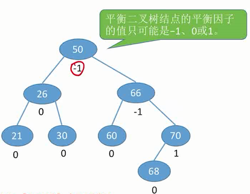
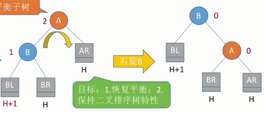
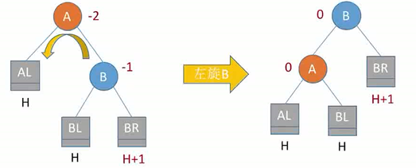
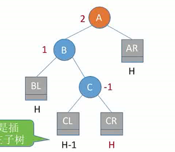
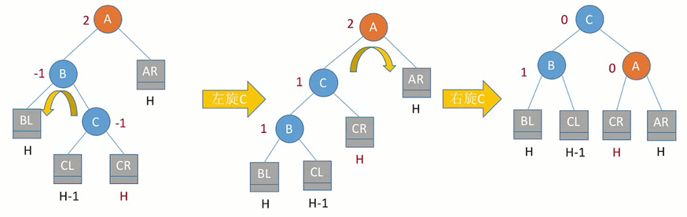
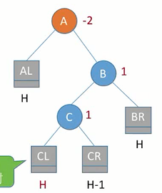
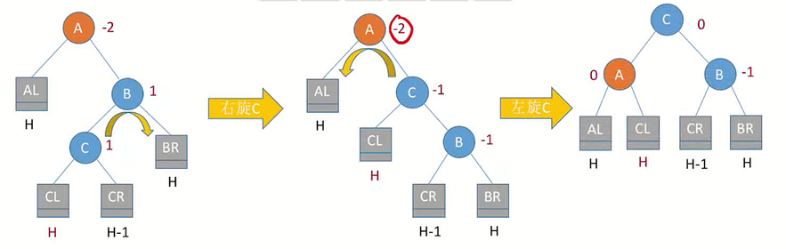
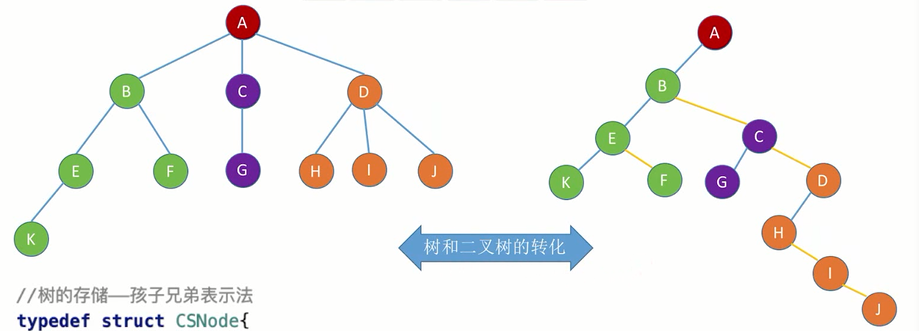

# 0x05 树与二叉树

## 一、基本术语

- 空树：结点数为0的树
- 非空树
  - 有且仅有一个根结点
  - 没有后继的结点称为叶子结点
  - 有后继的结点称为分支结点
  - 除根结点外，每个结点有且仅有一个前驱
- 两个结点之间的路径：从上往下
- 路径长度：路径经过了几条边
- 树的路径长度：从根结点出发到各个结点的路径长度之**和**

- 结点的层次（深度）——从上往下数（从1开始，根结点的深度是1）
- 结点的高度——从下往上数（从1开始，叶子结点的高度是1）
- 树的高度/深度——总共多少层
- 结点的度——有几个孩子
- 有序树——各子树从左到右是有顺序的，互换会影响含义
- 无序树——各子树无顺序，可以互换

## 二、树的性质

- 结点数=度数+1
- 树的度——各结点的度的最大值
- m叉树——每个结点**最多**只能有m个孩子的树

| 度为m的树                       | m叉树                         |
| ------------------------------- | ----------------------------- |
| 任意结点的度≤m（最多m个孩子）   | 任意结点的度≤m（最多m个孩子） |
| 至少有一个结点度=m（有m个孩子） | 允许所有结点的度都＜m         |
| 一定是非空树，至少有m+1个结点   | 可以是空树                    |

| 高度为h、度为m的树    | 高度为h的m叉树                                               |
| --------------------- | ------------------------------------------------------------ |
| **至少**有h+m-1个结点 | **至多**有$\frac{m^h-1}{m-1}$个结点（$=m^0+m^1+m^2+...$）<br>**至少**有h个结点 |

- 具有n个结点的m叉树的最小高度为$\lceil \log_m{(n(m-1)+1)}\rceil$

  - 推导：

  $$
  \begin{align}
  &\frac{m^{h-1}-1}{m-1}<n≤\frac{m^h-1}{m-1}\\
  &\Rightarrow m^{h-1}<n(m-1)+1≤mh\\
  &\Rightarrow h-1<\log_m{(n(m-1)+1)}≤h\\
  &\Rightarrow h_{min}=\lceil\log_m({n(m-1)+1)}\rceil&
  \end{align}
  $$

## 三、二叉树

### 3.1 二叉树的基本特点

#### 二叉树

- 空二叉树，n=0
- 由一个根结点、左子树、右子树构成，左子树、右子树又分别是二叉树

#### 二叉树的特点

- 每个结点至多有两棵子树
- 左右子树不能颠倒（有序树）

#### 二叉树与度为2的有序树的区别

- 度为2的有序树至少有3个结点，而二叉树可以有2个、1个甚至0个结点

### 3.2 二叉树的性质

1. 设非空二叉树中共有$n$个结点，度为0、1、2的结点个数分别为$n_0$、$n_1$、$n_2$，则
   - $n_0=n_2+1$。（1个二分支结点能长出2个叶子，3个二分支结点能长出4个叶子……）
   - $n=n_0+n_1+n_2$
   - $n=n_1+2n_2+1$（$总度数=n_1+2n_2$）
2. 二叉树的第$i$层至多有$2^{i-1}$个结点
3. 高度为$h$的二叉树至多有$2^h-1$个结点（满二叉树的情况）
4. 具有$n$个结点的完全二叉树的高度$h$为$\lceil\log_2{n+1}\rceil$或$\lfloor \log_2{n}\rfloor$

### 3.3 特殊的二叉树

#### 做题常用

- 完全二叉树第 i 层有 m 个叶子结点——当第 i 层是最后一层时结点总数最少，当第 i 层是倒数第二层时结点总数最多
- 完全二叉树共有 m 个叶子结点——当倒数第二层的最左侧的叶子结点有一个左孩子时（这不会改变叶子结点总数），结点总数最多；反之最少。（或通过度数与结点数的关系分析）
- 已知一棵有2011个结点的树，其叶结点个数是116，该树对应的二叉树中无右孩子的结点个数是——这题考点是树转二叉树，左孩子右兄弟。树要构造最特殊的，即一条链的末尾接116个孩子结点。按左孩子右兄弟转为二叉树后变成一条中间有转折的链，前1895个结点无右孩子，链的最末尾结点也无右孩子。故答案为1895+1=1896

#### 满二叉树

- 一棵高为$h$，且含有$2^h-1$个（$2^0+2^1+...+2^h=\frac{1-2^h}{1-2}$）结点的二叉树
- 每个结点都必有2个子树，且只有**最后一层**有叶子结点
- 按层序从1开始编号，则结点 $i$ 的左孩子为$2i$，右孩子为$2i+1$；结点 $j$ 的父结点为$\lfloor \frac{j}{2}\rfloor$

#### 完全二叉树

- 可以比满二叉树少一些结点，但所有结点按层序编号后要能与满二叉树一一对应
- 只有最后两层可能有叶子结点（如果倒数第二层有叶子结点，一定是最右的结点）
- 最多只有一个度为1的结点


#### 二叉排序树

- 首先是棵二叉树
- 结点的**左子树**上所有结点的val都**小于**结点的val
- 结点的**右子树**上所有结点的val都**大于**结点的val
- 左右子树又各是一棵二叉排序树

#### 平衡二叉树

- 首先是棵二叉树

- 任一结点的左子树和右子树的深度之差不超过1
- 如果一棵二叉排序树是平衡的，则搜索效率更高

### 3.4 二叉树的存储结构

#### 二叉树的顺序存储

```c++
#define MaxSize 100
struct TreeNode{
	ElemType value;
	bool isEmpty;
};
TreeNode t[MaxSize]
```

- 只有完全二叉树能将结点编号和数组下标对应起来，即根据结点编号找到左孩子和右孩子
- 非完全二叉树也想应用同样的存储方式，就不能层序遍历依次编号，只能与完全二叉树的编号一一对应；相应的，数组中会因此出现一些空位。浪费最严重的情况是非完全二叉树退化为最右侧的一条链，此时虽然只有$i$个结点，仍需要长度为$2^i-1$的数组

#### 二叉树的链式存储

```c++
typedef struct BiTNode{
	ElemType data;
	struct BiTNode *lchild, *rchild;
}BiTNode, *BiTree;
```

n个结点的二叉链表共有$n+1$个空链域

### 3.5 二叉树的遍历

#### 先序遍历

根-左-右

```c++
void PreOrder(BiTree T){
	if(T!=NULL){
        visit(T);
        PreOrder(T->lchild);
        PreOrder(T->rchild);
	}
}
```

#### 中序遍历

左-根-右

```c++
void InOrder(BiTree T){
	if(T!=NULL){
        PreOrder(T->lchild);
		visit(T);
		PreOrder(T->rchild);
	}
}
```

#### 后序遍历

左-右-根

```c++
void PostOrder(BiTree T){
	if(T!=NULL){
        PostOrder(T->lchild);
		PreOrder(T->rchild);
        visit(T);
	}
}
```

#### 层序遍历

```C++
void LevelOrder(BiTree T){
    LinkQueue(Q);
    InitQueue(Q);
    BiTree* p;
    EnQueue(T); //根结点入队
    while(!Q.isempty()){
        DeQueue(Q, p); //队首结点出队
        visit(p); //访问结点
        if(p->lchild!=NULL){
            EnQueue(Q, p->lchild);
        }
        if(p->rchild!=NULL){
            EnQueue(Q, p->rchild);
        }
    }
}
```

### 3.6 二叉树的构造

- 若只给出一棵二叉树的前序/中序/后序/层序中的其中一种序列，那么无法唯一确定一棵二叉树。
- 必须是中序遍历序列+其他三种中的任意一种，才能唯一确定一棵二叉树

## 四、线索二叉树

### 4.1 基本概念

线索二叉树的“前驱”和“后继”是针对二叉树的中序遍历序列而言的，不是逻辑结构上的“前驱”和“后继”。

用**二叉链表**构造二叉树时，n个结点会产生n+1个空链域。线索二叉树利用这些空链域来保存“前驱”和“后继”的信息。

- 当左孩子指针为空时，使它指向前驱结点（前驱线索）
- 当右孩子指针为空时，使它指向后继结点（后继线索）

```c++
typedef struct ThreadNode{
	ElemType data;
	struct ThreadNode *lchild, *rchild;
	int ltag, rtag; // 用于标记指针域指向的到底是孩子还是线索，0-孩子，1-线索
}ThreadNode, *ThreadTree;
```

### 4.2 二叉树的线索化

#### 中序线索化

```c++
ThreadNode *pre=NULL;
void CreateInThread(ThreadTree T){
    if(T!=NULL){
        InThread(T);
        pre->rchild = NULL; 
        //处理最后一个结点也就是中序遍历序列中最后一个元素的后继线索
        pre->rtag = 1;
    }
}
void InThread(ThreadTree T){
    if(T!=NULL){
        InThread(T->lchild);
        visit(T);
        InThread(T->rchild);
    }
}

void visit(ThreadNode* q){
    if(q->lchild == NULL){
        q->lchild = pre;
        q->ltag = 1;
    }
    if(pre!=NULL && pre->rchild==NULL){
        pre->rchild = q;
        pre->rtag = 1;
    }
    pre = q;
}
```

#### 先序线索化（！）

Q：若将中序线索化的代码照抄，只改变遍历顺序。先序遍历的顺序是根-左-右，假设pre指向根结点，q为正在访问的pre的左孩子。执行`visit(q)`，则q线索化后其前驱线索指向根结点，并令pre=q。然后会发生什么情况？

A：此时q已访问完毕，接下来访问的结点是q的左孩子，原本左孩子应为NULL，然而此时q的左指针已经被线索化，指向了q的根结点，然后将陷入死循环。

所以，应该相应修改代码，如下：

```c++
void PreThread(ThreadTree T){
	if(T!=NULL){
        visit(T);
        if (T->ltag == 0) 
            //当左指针未被线索化时，才尝试访问左孩子（实际上此时一定是NULL？）
            PreThread(T->lchild);
        PreThread(T->rchild);
    }
}
```

此外，先序线索化中访问的最后一个结点也是中序线索化中访问的最后一个结点（都是整棵树里最右边的那个结点），所以对它的处理方式相同：

```c++
void CreatePreThread(ThreadTree T){
    if(T!=NULL){
        PreThread(T);
        pre->rchild = NULL; 
        //处理最后一个结点也就是先序遍历序列中最后一个元素的后继线索
        pre->rtag = 1;
    }
}
```

#### 后序线索化

直接照抄中序线索化的代码，只改变遍历顺序即可。

后序线索化不存在先序线索化的小坑，因为后序遍历是左-右-根，访问结点的左孩子发生在结点的左指针线索化之前。

然而，后序线索化中访问的最后一个结点是整棵树的根结点，处理方式不能和先序中序一样（因为确实有存在右孩子的可能），应当先做个判断：

```c++
void CreatePostThread(ThreadTree T){
    if(T!=NULL){
        PostThread(T);
        if(pre->rchild == NULL) 
            //如果确实没有右孩子，就线索化，虽然一样是NULL
        	pre->rtag = 1;
    }
}
```

#### 易错点总结

- 先序线索化中访问左指针的小坑
- 三种线索化中对最后一个访问结点的rchild和rtag的处理

### 4.3 线索二叉树找前驱/后继

#### 中序线索二叉树

- 中序后继：如果没有右子树，则`p->rchild`就是它的后继；如果有右子树，则右子树的最左边结点就是它的后继。

  ```c++
  //找以P为根结点的子树中最左边的结点，也就是这棵子树中第一个开始中序遍历的
  ThreadNode* FirstNode(ThreadNode *p){ 
  	if(p->ltag == 0) p = p->lchild;
      return p;
  }
  //找p的中序后继
  ThreadNode* InOrder(ThreadNode *p){
  	if(p->rtag == 0) //如果有右子树，后继是右子树的最左边结点
          return FirstNode(p->rchild);
      else
          return p->rchild;
  }
  ```

- 中序前驱：如果没有左子树，则`p->lchild`就是它的前驱；如果有左子树，则左子树的最右边结点就是它的前驱。

  ```c++
  //找以P为根结点的子树中最右边的结点，也就是这棵子树中最后一个中序遍历的
  ThreadNode* LastNode(ThreadNode *p){ 
  	if(p->rtag == 0) p = p->rchild;
      return p;
  }
  //找p的中序前驱
  ThreadNode* InOrder(ThreadNode *p){
  	if(p->rtag == 0) //如果有左子树，前驱是左子树的最右边结点
          return Node(p->rchild);
      else
          return p->lchild;
  }
  ```

#### 先序线索二叉树

- 先序后继：

  - 如果有左孩子→后继为左孩子；
  - 如果没有左孩子→后继为右孩子；

- 先序前驱：对于先序遍历，当前结点的前驱不可能在它的子树中。

  - 如果没有左孩子，则前驱线索`p->lchird`就是它的前驱；
- **如果有左孩子，则不可能找到前驱**，除非从根结点开始重新遍历
  
  **改进：三叉链表，多一个指向父结点的指针**
  
  - 若p的父结点存在，且p是左孩子——前驱就是p的父结点。
  - 若p的父结点存在，且p是右孩子，p的左兄弟为空——前驱就是p的父结点。
  - 若p的父结点存在，且p是右孩子，p的左兄弟非空——以p的左兄弟为根结点的子树中，遵循以下原则找到最后一个结点：能向右走向右走，右边没路才向左走。最后的结点就是p的前驱。
  - 若p的父结点不存在——p是整棵树的根结点，在先序遍历中是第一个被访问的，没有前驱。

#### 后序线索二叉树

- 后序前驱：

  - 如果没有左孩子→前驱线索`p->lchild`；
  - 如果有左孩子（即存储不了前驱线索）且有右孩子→前驱是右孩子；
  - 如果有左孩子但没有右孩子→前驱是左孩子。

- 后序后继：对于后序遍历，当前结点的后继不可能在它的子树中。

  - 如果没有右孩子→后继线索`p->rchild`；
  - **如果有右孩子，则不可能找到后继**，除非从根结点开始重新遍历

  **改进：三叉链表，多一个指向父结点的指针**

  - 若p的父结点存在，且p是右孩子——后继就是p的父结点。
  - 若p的父结点存在，且p是左孩子，p的右兄弟为空——后继就是p的父结点。
  - 若p的父结点存在，且p是左孩子，p的右兄弟非空——后继就是以p的右兄弟为根的子树中，第一个被后序遍历的结点。具体为：以p的右兄弟为根结点的子树中，能向左走向左走，左边没路才向右走。最后的结点就是p的后继。
  - 若p的父结点不存在——p是整棵树的根结点，在后序遍历中是最后一个被访问的，没有后继。

#### 总结

中序线索二叉树，从任意一个结点出发，既能逆向地中序遍历，也能正向地中序遍历。

先序线索二叉树，从任意一个结点出发，只能正向地先序遍历；除非所有结点都没有左孩子（变成一条链了），或用三叉链表存储，才能逆向地先序遍历。

后序线索二叉树，从任意一个结点出发，只能逆向地后序遍历；除非所有结点都没有右孩子，或用三叉链表存储，才能正向地后序遍历。

## 五、二叉排序树

二叉排序树=二叉查找树=BST

二叉排序树中的每一个结点都满足：

- 左孩子的值小于它
- 右孩子的值大于它

对二叉排序树进行中序遍历，可以得到一个**升序序列**

### 5.1 二叉排序树的查找

```c++
BSTNode* BST_Search(BSTree T, int key){ //查找值为key的结点
	while(T!=NULL && key!=T->key){
        if(key>T->key) T=T->rchild;
        else T=T->lchild;
    }
    return T;
}
```

### 5.2 二叉排序树的插入

```c++
bool BST_Insert(BSTree &T, int k){
	if(T == NULL){ //原树为空，插入的结点为根结点
        T = (BSTree)malloc(sizeof(BSTNode));
        T->key = k;
        T->lchild = T->rchild = NULL;
        return true;
    }
    else if(k == T->key){
        return false; //结点已存在，插入失败
    }
    else{
        if(k > T->key){
            BST_Insert(T->rchild, k);
        }
        else{
            BST_Insert(T->lchild, k);
        }
    }
}
```

注意：非递归的插入操作不能直接按查找操作那样来，实现过程中有很多问题需要处理：比如最后原本应该指向根结点的指针T指向了最后一个插入的结点；或者丢失父结点信息导致malloc出来的新结点挂不到树上去（但是递归过程中malloc出来的结点就能自动挂到树上去，想不明白……）

### 5.3 二叉排序树的构造

```c++
void Creat_BST(BSTree &T, int str[], int n){
	T = NULL; //注意初始化T
    int i = 0;
    while(i<n){
        BST_Insert(T,str[i]);
        i++;
    }
}
```

### 5.4 二叉排序树的删除

情况1：删除的结点是叶子结点，对排序树的结构无影响，直接删除即可

情况2：删除的结点z只有一棵子树，则让z的子树顶替z原本的位置

情况3：删除的结点z既有左子树又有右子树

- 从中序遍历的角度考虑（中序遍历排序树应得到升序序列），可以由z的中序后继顶替z的位置。在二叉排序树中，z的中序后继就是z的右子树的最左下方结点p（即一直向左走走到无路可走的结点，注意绝对不向右）。将p的值复制给z，问题就变成了如何删除p，即情况2.
- 同理，也可以由z的中序前驱顶替z的位置。在二叉排序树中，z的中序前驱就是z的左子树的最右下方结点t（即一直向右走走到无路可走的结点，注意绝对不向左）。将t的值复制给z，问题就变成了如何删除t，即情况2.

### 5.5 查找效率分析

查找长度：比对关键字的次数。

查找失败的平均查找长度：直接看排序树还能再新增多少个叶子结点，计算这些叶子结点的深度-1，再算平均值。

## 六、平衡二叉树

### 6.1 定义

平衡二叉树=平衡树=AVL树

树上任一结点的左子树和右子树的高度之差不超过1.

**结点的平衡因子**=左子树高度-右子树高度



```c++
typedef struct AVLNode{
	int key;
    AVLNode* lchild, rchild;
    int balance;
}AVLNode, *AVLTree;
```

### 6.2 平衡调整

**从插入点往回**找到第一个不平衡结点，调整以该结点为根的子树（最小不平衡子树）。

以下平衡调整，**既能保持AVL树的平衡特性，也能保持二叉排序树的特性**。

#### LL（插入到左孩子的左子树）

设当前这棵最小不平衡子树的根结点是A，**A的左孩子为B**。

LL平衡旋转（右单旋转），即，把B拎起来作为根结点，A就自然成了B的右孩子。而B原来的右孩子就作为现在A的左孩子（就像是，B以过继自己的右孩子给A为代价，成为了树的老大）。



```c++

void LL(AVLNode* A){
    AVLNode* B = A->lchild;
    A->lchild = B->rchild;
    B->rchild = A;
    preA->lchild/rchild = B; // preA是A原本的父结点
}
```

#### RR（插入到右孩子的右子树）

设当前这棵最小不平衡子树的根结点是A，**A的右孩子为B**。

RR平衡旋转（左单旋转），类比LL，把B拎起来作为根结点，A就自然成了B的左孩子。而B原来的左孩子就作为现在A的右孩子。



#### LR（插入到左孩子的右子树）

设当前这棵最小不平衡子树的根结点是A，**A的左孩子为B，B的右孩子为C**



LR平衡旋转，即，先把C拎起来让它代替B，C的左孩子作为B的右孩子。然后，再把C拎起来让它代替A，C的右孩子作为A的左孩子。



#### RL（插入到右孩子的左子树）

设当前这棵最小不平衡子树的根结点是A，**A的右孩子为B，B的左孩子为C**



RL平衡旋转，类比LR，先把C拎起来代替B，C的右孩子作为B的左孩子；然后，再把C拎起来代替A，C的左孩子作为A的右孩子。



### 6.3 查找效率分析

- 设$n_h$表示深度为$h$的平衡树中含有的最少结点数（这种情况下，根结点的两个子树是不平的，其中一个子树会多一个结点，这个结点的深度为$h$）

  则$n_0=0$（空树）、$n_1=1$（只有根结点）、$n_2=2$（根结点只有一个孩子）……并且有$n_h=n_{h-1}+n_{n-2}+1$

- 平衡二叉树最大深度为$O(\log{n})$，平均查找长度/查找的时间复杂度为$O(\log{n})$

## 七、树与森林

本节的树是指一般的树，每个结点后面接几个结点都是任意的，不要老想成二叉树。

### 7.1 树与森林的存储结构

#### 双亲表示法（顺序存储）

```c++
#define MaxSize 100
struct PTNode{
	ElemType value;
    PTNode* parent; //每个结点都保存一个指向父结点的指针
};
typedef struct{
    PTNode t[MaxSize];
    int n; //保存整棵树的结点个数
}Tree;
```

优点：查指定结点的双亲很方便

缺点：

- 如果删除结点后不补位，会导致数组中有空位，影响遍历效率
- 查指定结点的孩子只能从头开始遍历

#### 孩子表示法（顺序+链式存储）

顺序+链式存储，就是有很多条链表，然后将每个链表的首结点用数组组织起来。

```c++
struct CTNode{
	int child; //孩子结点在数组中的位置
    struct CTNode *next; //下一个孩子
};
typedef struct{
    ElemType data; //实际数据都存储在数组中，CTNode链表仅指示孩子位置。
    struct CTNode *firstChild; //第一个孩子
} CTBox;
typedef struct{
    CTBox nodes[MAX_TREE_SIZE];
    int n, r; //结点数和根的下标；
} CTree
```

#### 孩子兄弟表示法（链式存储）

用二叉链表存储，每个结点两个指针，左指针保存该结点的第一个孩子结点，右指针保存该结点的后面一个兄弟

```c++
typedef struct CSNode{
    ElemType data;
    struct CSNode *firstchild, *nextsibling;
}CSNode, *CSTree;
```



#### 森林的存储

森林是m棵互不相交的树的集合。

存储：

1. 将各棵树按左孩子右兄弟的方式转换为二叉树
2. 各棵树的根结点视为兄弟关系连接起来
3. 森林转化为了一棵二叉树，这棵二叉树的根结点是原森林中某棵树的根结点。

### 7.2 树与森林的遍历

#### 树的先根遍历

树的先根遍历序列=这棵树对应二叉树的先序遍历序列

#### 树的后根遍历

树的后根遍历序列=这棵树对应二叉树的中序遍历序列

#### 树的层次遍历

#### 森林的先序遍历

森林中的每棵树去掉根结点后，其各个子树又构成森林。

先序遍历顺序：

1. 访问森林中第一棵树的根结点
2. 先序遍历这个根结点的子树森林
3. 先序遍历除去第一棵树后剩余的树构成的森林

做题写顺序：

- 直接从左到右对每棵树都做一遍先序遍历
- 或者先将森林转成二叉树，再做先序遍历

#### 森林的中序遍历

做题写顺序：

- 直接从左到右对每棵树都做一遍**后根遍历**
- 或者先将森林转成**二叉树**，再做**中序遍历**

| 树       | 森林     | 二叉树   |
| -------- | -------- | -------- |
| 先根遍历 | 先序遍历 | 先序遍历 |
| 后根遍历 | 中序遍历 | 中序遍历 |

## 八、哈夫曼树

### 8.1 哈夫曼树的定义

- 结点的带权路径长度（WPL）：从根结点到该结点的路径长度（经过的边数）与该结点上权值的乘积
- 树的带权路径长度：树中所有**叶子结点**的带权路径长度之和
- 在含有$n$个带权叶结点的二叉树中，带权路径长度最小的二叉树为哈夫曼树，也称为最优二叉树 
- **哈夫曼树共有n-1个双分支结点，结点总数为2n-1，不存在度为1的结点。**

### 8.2 哈夫曼树的构造

1. 构造一个新结点，从$n$个结点构成的森林F中选取两棵权值最小的树作为新结点的左右子树，并将新结点的权值设为左右子树根结点权值之和。
2. 将原来的两棵树从F中删除，并将得到的新树加入F
3. 重复上述步骤，直到F中只剩下一棵树为止（此时，原有的$n$个结点都成为了这棵树的叶子结点）

### 8.3 哈夫曼编码

- 固定长度编码：每个字符都用固定长度的二进制位表示
- 可变长度编码：允许对不同字符用不等长的二进制位表示
- 前缀编码：若没有一个编码是另一个编码的前缀，则称为前缀编码
- 哈夫曼编码：每个字符作为叶子结点，各字符出现的频度作为结点的权值。

