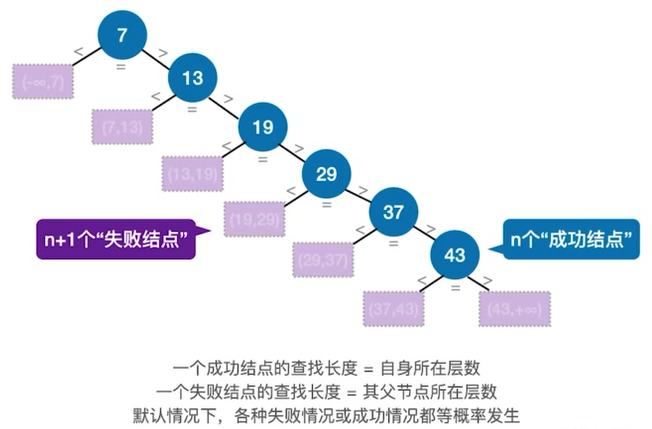
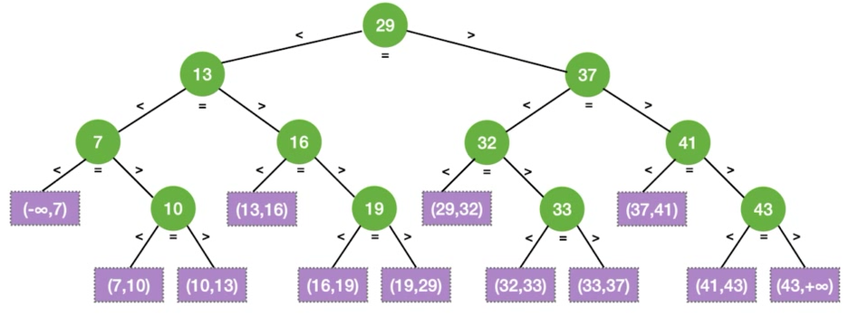
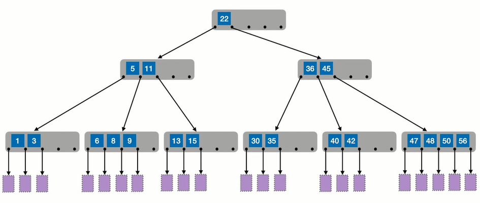
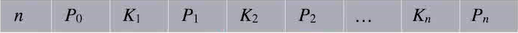
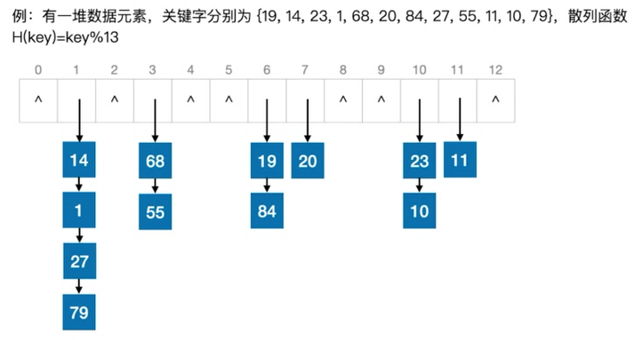

# 0x07 查找

## 一、查找的基本概念

- 查找：在数据集合中寻找满足某种条件的数据元素的过程
- 查找表：用于查找的数据集合
- 关键字：**唯一**标识数据元素的数据项
- 静态查找表：只需要查找符合条件的数据元素
- 动态查找表：既要查找符合条件的数据元素，也要进行插入、删除操作
- 查找长度：需要比对关键字的次数
- 平均查找长度：所有查找过程中进行关键字的比较次数的平均值

## 二、顺序查找

- 0号位置存哨兵，即待查找的元素。然后倒序遍历

- 时间复杂度$O(n)$

- 对有序表的查找优化：当关键字大于（或小于）目标关键字时，查找失败。查找失败时ASL更少

  - 共n+1种查找失败的情况，因为在升序查找表中，对最后一个元素查找失败既可能是因为待查元素小于它也可能是因为大于它

- 查找判定树

  

## 三、折半查找

#### 算法实现

```c++
//左闭右闭区间
int binary_search(SSTable L, ElemType key){
	int left = 0, right = L.length - 1, mid;
    while(low <= high){
        mid = (low+high)/2;
        if(L.elem[mid]==key) return mid;
        else if(L.elem[mid]>key) high = mid - 1;
        else low = mid + 1;
    }
    return -1;
}
```

#### 查找判定树



绿色为成功结点，紫色为失败结点

- 折半查找的判定树中，若使用$mid = \lfloor(low+high)/2\rfloor$，则右子树结点数-左子树结点数=0或1
- 折半查找判定树一定是平衡二叉树
- 元素个数为n时，树高$h = \lceil log_2(n+1)\rceil$（这个树高是不算失败结点的）

#### 查找效率

时间复杂度$O(log_2n)$

一般情况下折半查找比顺序查找效率更优秀，但并不是任何情况下都更优秀。如极端情况下待查元素就在查找表中第一位，则顺序查找第一次就可以找到，而折半查找需要多次折半才能确定。

## 四、分块查找

#### 算法思想

特点：块内无序，块间有序

1. 根据块内元素的最大值建立块的索引表
2. 用折半查找找到待查元素可能所在的块
   - 情况一：待查元素恰好就是索引值——`a[mid] == val`时确定块的位置
   - 情况二：待查元素在表中存在，但不是索引值——当进行到`left==right`时有一次判定，此时`mid`所指的块就是`val`所在的块，但因为`val`不是该块的索引值，判定会失败，又因为`val<index`，会进行`right--`，而`left`还停留在原来的位置。因此最终折半查找结束时，`left`所指的块就是`val`所在的块。
   - 情况三：待查元素不在表中——最终折半查找结束时，`low`会超出索引表范围。
3. 块内再用顺序查找

#### 查找效率 

- 平均查找长度：设索引查找和块内查找的平均查找长度分别为$L_1$、$L_s$，则分块的平均查找长度为$ASL=L_1+L_s$
- 设长度为$n$的查找表被均分成$b$块，每块$s$个元素
  - 若对该查找表的块间、块内都采用顺序查找，则$L_1 = \frac{1+2+3+...+b}{b}=\frac{b+1}{2}$，$L_s=\frac{1+2+3+...+s}{b}=\frac{s+1}{2}$，$ASL=\frac{b+1}{2}+\frac{s+1}{2}=\frac{s^2+2s+n}{2s}$，当$s=\sqrt{n}$时，ASL取得最小值$\sqrt{n}+1$
  - 若对该查找表的块间采用折半查找、块内采用顺序查找，则$L_1=\lceil\log_2{b+1}\rceil$，$L_2$不变，$ASL=L_1=\lceil\log_2{b+1}\rceil+\frac{s+1}{2}$

## 五、B树与B+树

### 5.1 B树/多路平衡查找树

#### B树的定义及特点

- **B树就是把二叉查找树变成$m$叉查找树，既保留排序特性，也保留平衡特性（规定对于任何一个结点，其所有子树的高度都要相同）**

- 在二叉查找树中，每个结点都用一个关键字把搜索区域切成了两部分；在m叉查找树中，一个结点可以包含$n$个关键字，从而把搜索范围切成$n+1$个部分，即该结点的分叉有$n+1$个。

  

- B树中所有结点的孩子个数的最大值称为**B树的阶**。

- 所有的叶结点都出现在同一层，并且不带信息（即类似于失败结点）。

- 除根结点外的所有非叶结点至少有$\lceil m/2 \rceil$棵子树，即至少含有$\lceil m/2 \rceil-1$个关键字。（这是为了防止B树退化成二叉树，导致树变高，查找效率降低）

  非叶节点的结构如下，其中$K_1,K_2,...,K_n$为结点关键字，$P_0,P_1,...,P_n$为指针。

  

- **计算B树的高度时一般不包括叶子结点/失败结点**

- 含有n个关键字的m阶B树，最小高度、最大高度是多少？

  - 最小高度：先考虑一棵高为$h$的满$m$叉树，它共有$\frac{m^h-1}{m-1}$个结点。因为是满m叉的，所以每个结点都一定包含$m-1$个关键字。故高为$h$的$m$阶B树的最多关键字数为$m^h-1$。由此反解最小高度，因为一定有$n≤m^h-1$，所以$h≥\log_m{(n+1)}$，由验证知$m=2，n=2$时$h$为$2$，故式中$\log_m{(n+1)}$向上取整。
    综上，最小高度为$\log_m{(n+1)}$向上取整。
  
  - 最大高度：让各层分叉尽可能少，即根结点只有2个分叉，其他结点只有$\lceil m/2\rceil$个分叉，则各层结点**至少**有：

    第一层：$1$

    第二层：$2$

    第三层：$2\lceil m/2 \rceil$

    第 $h$ 层：$2\lceil m/2\rceil ^{h-2}$

    第$h+1$层（叶子结点/失败结点层）：$2(\lceil m/2\rceil)^{h-1}$

    又因为$n$个关键字的B树一定有$n+1$个叶子结点（即失败结点）（$n$个关键字可以划分出$n+1$种失败情况）
  
    所以$n+1≥2\lceil m/2\rceil ^{h-1}$，得到$h≤\log_{\lceil m/2\rceil}\frac{n+1}{2}+1$

#### B树的查找

每次都与结点内部的关键字顺序比较（也可以用折半查找），直到能确定走向下一层的路径。

例如，在上图的B树中查找9：

1. 与22比较，9＜22，走向左子树
2. 与5比较，9>5；继续与11比较，9<11，可以确定应该走向5右侧、11左侧的子树。
3. 依次与6、8、9比较，找到9，结束。

#### B树的插入删除

**插入一个新关键字**$k$。

1. 按查找的方式，找到它应该插入的B树的结点（且一定是最终端的结点），并且在结点内部以不破坏有序的方式插入原有的关键字当中。
2. 若结点已满，且该结点无父结点：将该结点分裂成一棵树，这棵树的根结点的关键字是（插入$k$后）排在中间的关键字。
3. 若结点已满，该结点存在父结点：将（插入$k$后）排在中间的关键字放到父结点中，它的右边的关键字构成一个新的结点，其父结点不变。
4. 如果父结点也满了，则重复3，若满足2的条件，直接新增一个根结点。

**删除一个关键字**$k$。

1. 若$k$位于终端结点：直接删除。注意删除后结点关键字数量是否会低于下限$\lceil m/2 \rceil-1$
   - 如果低于下限，看（最近的）兄弟结点是否能借。如果能，则：兄弟的最左/最右关键字→顶替→父结点相应位置的关键字→补充→当前需补充关键字的结点。
   - 如果（最近的）兄弟也不够借，则直接将父结点对应关键字拉下来补充自己，然后与兄弟合并成一个新结点。
2. 若$k$位于非终端结点：要找它的中序遍历前驱/后继替代它。由于中序遍历前驱/后继一定是终端结点，问题转换为了删除终端结点

## 5.2 B+树


| m阶B+树                                                      | m阶B树                                           |
| ------------------------------------------------------------ | ------------------------------------------------ |
| 每个分支结点最多有m棵子树                                    | 每个分支结点最多有m棵子树                        |
| 非叶根结点至少有2棵子树，其他每个分支结点至少有$\lceil m/2 \rceil$棵子树 | 每个分支结点至少有$\lceil m/2 \rceil$棵子树      |
| 结点的子树个数=关键字个数                                    | 结点的子树个数=关键字个数+1                      |
| 所有叶结点包含全部关键字及指向相应记录的指针，叶结点中将关键字按大小顺序排列；且**相邻叶结点按大小顺序相互链接起来** | 所有叶结点都是失败结点，都是NULL                 |
| 所有分支结点中只包含它的各个子结点中关键字的最大值及指向其子结点的指针 | 所有分支结点中都包含关键字，与子结点的关键字无关 |
| 查找时，指向树结点的指针最终一定停留在终端结点               | 查找时，指针可能停留在非终端结点上               |
| 非叶结点都不保存记录的存储地址                               | 每个结点都保存了其内部关键字对应记录的存储地址   |

## 六、红黑树

### 6.1 红黑树的定义

红黑树是一棵二叉搜索树，即既有左右子树有序的特性，也有平衡的特性，并且满足以下特点：

1. 每个结点要么红色，要么黑色
2. 根节点和叶结点/外部结点/失败结点都是黑色
3. 不存在两个相邻的红色结点
4. 任意一条从根节点到叶子结点的简单路径上所经过的黑色结点数量都相同

### 6.2 红黑树的性质

1. 任意一条从根结点到叶结点的路径长度不超过树中最短路径长度的2倍。
   - 要在红黑树中构造一条根到叶的最短路径，则路径上一定全是黑色结点
   - 而红黑树中可能的最长路径只能由最短路径间隔插入红色结点得到
2. 有$n$个内部结点（即不包括叶子结点）的红黑树的高度$h≤2\log_2(n+1)$.
   - 记从任一结点到叶的路径上的黑色结点（不含该结点自己）的数量为该结点的黑高$h_b$。由于任一结点到叶的路径上至少有一半的结点是黑色结点，所以$h_b$至少为$h/2$，
   - 设根结点的黑高为$h_b$，则其内部结点数最少时，这棵红黑树的形态为一棵全为黑结点的满二叉树，其内部结点数共有$2^{h_b}-1$个。
   - 综上，高度为$h$的红黑树至少有$2^{h/2}-1$个内部结点，即$n≥2^{h/2}-1$，反解得到有$n$个内部节点的红黑树的高度范围$h≤2\log_2(n+1)$

### 6.3 红黑树的插入

插入步骤：

1. 按二叉排序树的查找方式，找到新结点的插入位置，插入
2. 若新结点是根结点，染为黑色，结束。
3. 若新结点不是根结点，染为红色，然后：
   - 若染色后仍满足红黑树定义，结束。
   - 若染色后不满足红黑色定义，需要调整，新结点的爷结点是最小不平衡子树的根结点：
     - 若新结点的叔结点为黑色（调整均与AVL树相同）
       - LL型调整+变色。注意要拎起来的是父结点。旋转完毕后**原父结点、原爷结点**均变色
       - LR型调整+变色。
       - RL型调整+变色。
       - RR型调整+变色。
     - 若新结点的叔结点为红色
       - 叔结点、父结点、爷结点直接变色，然后将爷结点视为新插入的结点，继续调整直到满足红黑树定义。

### 6.4 红黑树的删除


## 七、散列查找

- 散列表，又称哈希表，是**一种数据结构**。数据元素的关键字与其存储地址直接相关
- 散列函数：将关键字转换为对应的存储地址
- 同义词：不同的关键字被映射到同一个地址，则称这些关键字为同义词
- 冲突：通过散列函数确定的地址中已经被存放了其他元素

### 6.1 散列函数效率评估



查找长度：在散列查找中，一般不把与空指针比较的次数计算在内。所以，在上图中，查找关键字21的查找长度为0；查找关键词66的查找长度为4.

查找失败的平均查找长度：设每个关键字映射到这13个地址的概率都是相同的，则查找失败的平均查找长度=每个地址查找失败时的查找长度之和/地址数量，如图中的$ASL_{失败}$为：
$$
ASL_{失败}=\frac{4+2+2+1+2+1+7\times0}{13}=0.92
$$
装填因子$\alpha$：表中记录数/散列表长度，数值上=$ASL_{失败}$。

### 6.2 散列函数设计

#### 除留余数法

$H(key) = key \% p$，其中$p$为最接近散列表表长$m$但不超过$m$的**质数**。

#### 直接定址法

直接用关键字作为地址，或对关键字作线性运算后的结果作为地址

$H(key) = key$ 或 $H(key) = a*key+b$

适合的情况：关键字分布基本连续。（如学号）

若关键字分布不连续，会产生较多的空位，造成空间浪费。

#### 数字分析法

截取关键字中数码分布较均匀的若干位作为地址

如手机号中的手机尾号四位的分布较均匀，直接以后四位作为地址。

#### 平方取中法

取关键字平方值的中间几位作为散列地址

这种取法使得地址与关键字的每一位都有关，从而映射的地址较为均匀。

适合的情况：关键字的每位取值都不够均匀或均小于散列地址所需的位数。

### 6.3 冲突处理

#### 拉链法

在存在冲突的地址上增加一条链表，将映射到该地址的元素依次存放在链表中。


#### 开放定址法

即可存放新表项的空间即对它的同义词表项开放，也对它的非同义词表项开放

##### **线性探测法**

$H(i) = (H(key)+d_i) \% p$， 其中$d_i = i$，从0开始。

当发生冲突时，记录这是该地址的第几次冲突，往后查找相邻的为空的地址存放。

若查找过程中又发生冲突，则继续向后查找。

存储：

- 线性探测法可能会使得元素存放的位置超出了散列函数能直接确定的位置。如表长为16，散列函数为$H(key)=key\%13$，则散列函数能直接确定的位置是0到12，然而线性探测法可能会使得元素存放在位置14.
- 线性探测法中，元素既可能与同义词发生冲突，也可能与非同义词发生冲突。

查找：

- 与拉链法不同，空位置的判断也算作一次关键字比对。
- 越早遇到空位，越早确定是否查找失败。（所以删除操作会做对应调整以满足这个要求）

删除：

- 直接删除元素留下空位可能会截断元素的查找路径，所以不留下空位，而是留下一个特定的删除标记，指示这里虽然为空，但是是被删除的结果，查找路径应该向后继续。
- 弊端：最坏情况下散列表中前n-1个元素全被删除了，待查找元素恰是散列表的第n个元素，但由于上述查找过程，仍需比对$n$次关键字才能查找成功。

查找效率分析：

- $ASL_{成功}$：直接依次代入散列表的各个元素，先通过哈希函数确定地址，再看比对次数即可。分母为元素总个数。

- $ASL_{失败}$：假设查找元素时映射的地址依次为0、1、2……p-1，对于每个地址，计算它最终能确定查找失败时的关键字比对次数。**分母为哈希函数确定的位置个数**。

缺点：

- 很容易造成同义词、非同义词的“聚集/堆积”现象，严重影响查找效率。
- 这是因为线性探测法每当发生冲突时再探测都是存放在某个连续的位置

##### **平方探测法**

$H(i) = (H(key)+d_i) \% p$， 其中 $i$ 为冲突次数，$d_i = 0^2, 1^2,-1^2,2^2,-2^2...k^2,-k^2$，其中 $k≤m/2$

对 $p$ 有要求：$p$ 必须是一个可以表示成 $ 4j+3$ 的素数

##### 伪随机序列法

$d_i$ 为一个伪随机序列

#### 再散列法

准备多个散列函数，当一个散列函数冲突时，用下一个散列函数计算一个新地址，直到不冲突为止。

