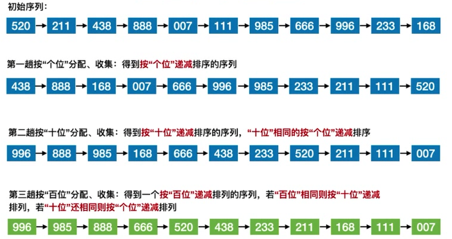
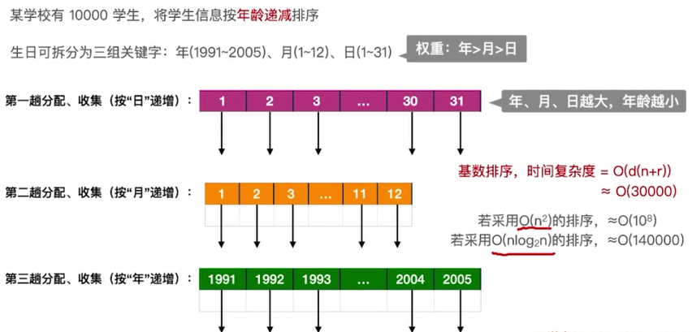
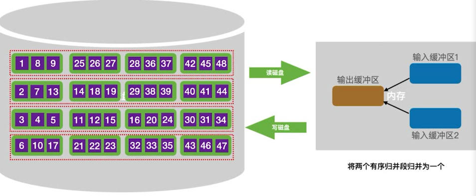
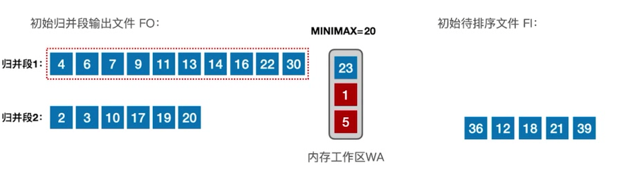
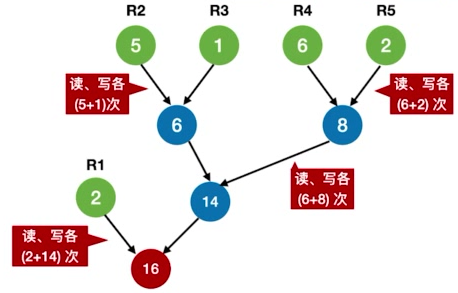
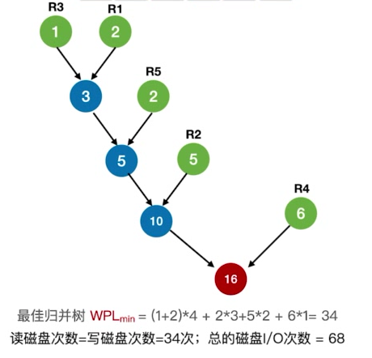
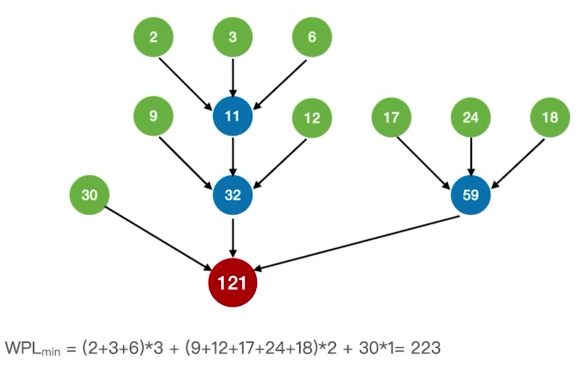
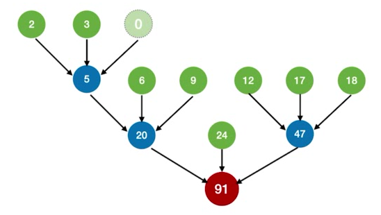

# 0x08 排序

## 一、排序的基本概念

- 排序算法的稳定性：指相同关键字的元素在经过排序算法多次处理后，其相对位置是否保持不变。若保持不变，则称排序算法是稳定的，否则是不稳定的
  - 不能说稳定的排序算法就一定比不稳定的好，应该看实际应用场景。
- 内部排序/外部排序：
  - 内部排序：数据全在内存中。关注点为算法的时间复杂度、空间复杂度
  - 外部排序：数据太多，无法全部放入内存，有些在磁盘上。关注点除了算法的时空复杂度外，还要关注如何使读/写磁盘次数更少。

## 二、插入排序

### 2.1 直接插入排序

```c++
//下标从0开始
void InsertSort(int A[], int n){
	for(int i = 1; i< n;i ++){
        if(A[i] < A[i-1]){
            int temp = A[i];
            int j;
            for(j = i-1; j>=0 && temp < A[j]; j--){ 
                //把前面已有序的部分全部后移一位
                A[j+1] = A[j];
            }
            A[j+1] = temp; //将元素插入到有序部分
        }
    }
}
```

- 空间复杂度：$O(1)$
- 时间复杂度：
  - 最好情况：要求升序排列，且原本就是升序排列。只需要n-1次关键字比对，不需要移动元素，$O(n)$
  - 最坏情况：要求升序排列，而原本是降序排列。$O(n^2)$
- 稳定性：稳定，因为找插入位置的时候是依次处理的，在前面的相同元素一定排在前面，后续的相同元素一定排在后面。

### 2.2 折半插入排序

先用折半查找在已经有序的部分找到应该插入的位置，再移动元素。

为了保证算法稳定性，当`A[mid]==A[0]`时（即数组中存在相同元素），固定在`mid`所指位置的后面/右边寻找插入位置（从而保证后面处理的相同元素一定会放在早前处理的相同元素后面）。

```c++
//数组下标从1开始，A[0]用于临时存放当前处理的元素
void InsertSort(int A[], int n){
	for(int i = 2; i <= n; i++){
		A[0] = A[i];
        int low = 1;
        int high = i-1;
        while(low <= high){
            int mid = (low+high)/2;
            if(A[mid] > A[0]) high = mid-1;
            else low = mid+1; //A[mid] == A[0]时也是low=mid+1
        }//结束循环时low在high的右边一位
        for(int j = i - 1; j >= low; j--){
            A[j+1] = A[j]; //在插入位置上及后面的元素全部后移一位
        }
        A[low] = A[0];
    }
}
```

- 只能减少关键字比对次数，整体时间复杂度仍是$O(n^2)$

## 三、希尔排序

设一个间隔序列（从大到小）$d_1$，$d_2$，$d_3...$，开始时取间隔$d_1$，让待排序表以该间隔划分为若干个子表，如子表1：$A[1],A[1+d_1],A[1+2d_1],...$、子表2：$A[2],A[2+d_2],A[2+d_2],...$。分别对这些子表进行直接插入排序。然后取下一个间隔$d_2$，重复以上操作，直到最后一个间隔$d_n=1$，即对整个表直接进行插入排序。

## 四、冒泡排序

每趟中，遍历数组中的每一个元素，将它与前一个或后一个元素（如果存在）比较，若不符合排序要求则交换元素。每一趟结束后，都可让一个元素归位（且是当前这一趟遍历的元素中最小/最大的那一个）。

保证算法稳定性：比较中若发现存在相同的元素，则不作交换。

```c++
for (int i = 0 ; i< n-1 ;i++){ 
    //要比较n-1趟，而不是n趟，因为最后一趟会一次归位2个元素。
    bool flag = false;
	if (int j = n-1; j>i; j--){ //从后往前比较
        if(A[j-1] > A[j]){
            swap(A[j-1], A[j]);
            flag = true;
        }
    }
    if(!flag) break; //本趟遍历后没有发生交换，说明数组已经有序
}
```

- 注意，每1次**交换**都会**移动3次**元素

时间复杂度：

- 最好：$O(n)$
- 最坏：$O(n^2)$

## 五、快速排序

每趟划分归位一个元素。基准一般选择数组第一个元素。

```c++
void QuickSort(int A[], int low, int high){
    if(low < high){
		int pivotpos = Partition(A, low, high);
        QuickSort(A, low, pivotpos - 1);
        QuickSort(A, pivotpos+1, high);
    }
}
//升序排列
int Partition(int A[] , int low, int high){ //返回归位的下标
    int pivot = A[low];
    while(low < high){
        while(low<high && A[high] >= pivot) high--;
        A[low] = A[high]; //找到右边第一个不满足升序的元素A[high];
        while(low<high && A[low] <= pivot) low++;
        A[high] = A[low]; //找到左边第一个不满足升序的元素A[low];
    }
    A[low] = pivot;
    return low;
}
```

递归层数：可以将处理过程看成一棵二叉树，则树高即递归层数。$n$个结点的二叉树，最小高度$\lfloor log_2n\rfloor+1$，最大高度$n$

最好情况：每次选中的基准元素能把数组划分成均匀的左右两个部分；

最坏情况：每次选中的基准元素的归位位置都是待排数组的最左边/最右边，导致递归层数加深。即数组全部顺序/逆序的情况。

时间复杂度：$O(n*递归层数) = O(nlog_2n)$，最坏情况下$O(n)$

空间复杂度：$O(递归层数)= O(log_2n)$，最坏情况下$O(n)$

优化基准元素的选择：①随机选取；②每次取头、中、尾三个元素，取其中间值。

**稳定性：不稳定。**

| 一趟排序                     | 一次划分                     |
| ---------------------------- | ---------------------------- |
| 指递归树中的一层             | 指一个元素的归位             |
| 一趟排序完成后可归位多个元素 | 一次划分完成后只归位一个元素 |

## 六、简单选择排序

每一趟在待排序元素中选取关键字最小（或最大）的元素加入有序子序列。

与插入排序的不同：插入排序中每处理一个元素，都**插入**到有序子序列，即，此时有序子序列内部元素会发生后移/前移。而选择排序则总是将元素**追加**到有序子序列的末尾，原先的内部元素不需要发生移动。

```c++
void SelectSort(int A[], int n){
    for(int i = 0; i<n-1; i++){
        int min = i;
        for(int j = i+1; j<n; j++){
            if(A[j]<A[min]) min=j;
        }
        if(min!=i) swap(A[i], A[min]);
    }
}
```

时间复杂度：

- 无论是顺序、逆序还是乱序，都是一样的处理过程，都是$O(n^2)$

空间复杂度：$O(1)$

**稳定性：不稳定**

## 七、堆排序

### 7.1 堆的定义

- 堆是一个顺序存储的完全二叉树。父结点大于孩子结点的堆为大根堆，根结点是堆中元素的最大值；父结点小于孩子结点的堆是小根堆，根结点是堆中元素的最小值。
- 堆排序：先将待排序的数组整理成堆，再输出排好的数组

### 7.2 堆的构建

1. 检查数组中的非终端结点（即$i≤\lfloor n/2\rfloor$的结点，数组的左半部分）是否满足堆的要求
2. 若不满足，将当前结点与它更大的一个孩子互换
3. 若元素互换破坏了下一级的堆，则采用相同的方法继续向下调整
4. 重复以上过程，直到所有非终端结点调整完成

```c++
void BuildMaxHeap(int A[], int len) {
	for (int i = len / 2; i > 0; i--) {
		HeadAdjust(A, i, len);
	}
}

//将以k为根的子树调整为大根堆
//由于调整过程是根结点不断下沉直到满足大根堆要求的过程，
//因此只需要记录根结点的值（A[0]）并追踪它的可能位置（下标k）
void HeadAdjust(int A[], int k, int len) {
	A[0] = A[k]; //A[0]暂存子树的根结点
	for (int i = 2 * k; i <= len; i *= 2) { //i*=2即进入到树的下一层
		if (i < len && A[i] < A[i + 1]) { //先默认选左孩子，发现右孩子存在且更大再选右孩子
			i++; //取更大的子结点的下标
		}
		if (A[0] >= A[i]) break;
        //如果根结点比当前位置k更大的孩子还要大，则满足大根堆要求，应该存放在当前位置
		else {
			A[k] = A[i];  //与根结点互换
			k = i;		//先假设根结点可以存放在下标i中，继续向下看是否符合要求
		}
	}
	//如果跳出了循环，要么i已经>len，即k这个位置已经是叶子结点
	//要么k这个位置符合大根堆要求
	A[k] = A[0]; //k这个位置符合要求
}
```

### 7.3 基于堆的排序

假设数组`A`下标从1开始，`A[n]`为最末尾的元素

1. 每次从堆顶（`A[1]`）获得当前大根堆中最大的元素，然后将`A[1]`与`A[n]`交换
2. 交换后将`A[n]`视为已删除，余下的元素构成新堆，**该堆需要重新调整**，恢复成大根堆
3. 重复上述步骤，直到所有元素均处理完毕

```c++
void HeapSort(int A[], int len) {
	BuildMaxHeap(A, len);
	for (int i = len; i > 1; i--) {
		swap(A[i], A[1]);
		HeapAdjust(A, 1, i - 1);
	}
}
```

### 7.4 算法效率分析

- 建堆过程

  1个结点，每下坠1层，最多只需对比关键字2次（左右孩子比较一次，父节点与孩子比较一次）

  若树高为h，某结点在第i层，则这个结点最多下坠 h-i 层， 关键字对比次数最多 2(h-i)

  完全二叉树的树高 h 与结点数 n 的关系为$h = \lfloor \log_2{n}\rfloor+1$

  第 i 层最多有 $2^{i-1}$个结点，而只有第$1$到第$h-1$层的结点才需要下坠

  因此所有结点的关键字对比次数最多不超过——
  $$
  \sum^1_{i=h-1}{2^{i-1}2(h-i)}=1\times2(h-1) + 2\times2(h-2)+...+2^{h-2}\times2(h-2)
  $$
  整理可得建堆过程中关键字对比次数不超过$4n$，建堆时间复杂度$=O(n)$	

- 排序过程

  每一趟排序，根结点最多下坠$h-1$层，故每趟排序复杂度不超过$O(log_2n)$

- 总的时间复杂度为 $O(n)+O(nlog_2n)=O(nlog_2n)$

  总的空间复杂度为 $O(1)$（全过程都是原地操作）

- 稳定性

  **堆排序是不稳定的**

## 八、归并排序

合并$m$个有序序列，产生新的一个有序序列$T$。

显然$T$中每一个元素的确定都需要比较这$m$个序列的当前元素，需要$m-1$次比较才能从中选出最大/最小的那一个。

## 九、基数排序

不直接比较元素大小，而是用元素的个位、十位、百位……作为排序依据。



算法流程：

1. 创建10个队列，分别代表0~9。将初始序列中各个元素按个位数加入到相应的队列。
2. （要求降序排列）从队列9开始出队元素，直到10个队列全部清空，得到按“个位”递减的新序列$T_1$
3. 将$T_1$中各个元素按十位数加入到相应的队列。
4. 从队列9开始出队元素，直到10个队列全部清空，得到按“十位”递减的新序列$T_2$
5. 将$T_2$中各个元素按百位数加入到相应的队列。
6. 从队列9开始出队元素，直到10个队列全部清空，得到按“百位”递减的新序列$T_3$
7. $T_3$已经是有序序列，结束。

时间复杂度：

- $O(d(n+r))$
- 其中$d$是关键字的位数（上述例子中是百、十、个，共3位），$n$是关键字的个数，$r$是各位可能的取值的个数（上述例子中是0~9共10个）

空间复杂度：

- 需要$r$个辅助队列
- $O(r)$

**稳定性：稳定**

应用场景：



在关键字内部有明显的各部分权重差异的情况下，基数排序比快排还要优秀。

基数排序的适用场景特征：

- 数据元素的关键字可以方便地拆分成$d$组，且$d$较小（上述例子中拆成了年、月、日，$d=3$）
- 每组关键字的取值范围不大，即$r$较小（学生的出生年份通常相近，顶多有十余种可能；月份1~12；日期1~31）
- 数据元素个数$n$较大

## 十、外部排序

外部排序其实基于归并排序。采用归并排序，只需分配三个磁盘块大小的内存，即可对所有磁盘块的数据进行排序。

内存分配：输入缓冲区1、输入缓冲区2、输出缓冲区。各缓冲区大小=一个磁盘块大小。

### 10.1 排序过程

1. 构造初始归并段

   这是一个让各磁盘块中的数据有序的过程。假设初始有16个磁盘块。

   每次读入一个磁盘块的数据，分别到输入缓冲区1和输入缓冲区2。在程序看来这两个缓冲区中的数据可以视为在同一个待排序列当中。

   经过内部排序后，两个输入缓冲区的数据有序（不仅内部有序，两个缓冲区直接并起来也是有序的）。先将输入缓冲区1的数据经输出缓冲区写入磁盘，再将输入缓冲区2的数据写入磁盘。

   全部结束后，得到了16个有序磁盘块和8个有序的归并段。

   **需要16次“读”和16次“写”**

2. 第一趟归并

   将8个归并段两两归并。一个归并段由2个有序磁盘块构成。

   对归并段1和2进行归并。每个归并段都取前面一个磁盘块，读入到输入缓冲区1和输入缓冲区2。

   将两个输入缓冲区中的数据进行归并，每确认一个元素都写到输出缓冲区

   - 输出缓冲区写满后写回磁盘。
   - 输入缓冲区1一旦空了，就立即用归并段1的下一块补上；
   - 输入缓冲区2一旦空了，就立即用归并段2的下一块补上；

   归并段1和2归并完成，选择归并段3和4继续归并。

   重复上述步骤。全部结束后得到4个有序的归并段。

   **需要16次“读”和16次“写”**

   

3. 第二趟归并

   将4个归并段两两归并。每个归并段都视为归并排序中的一个有序子序列。

   过程同第一趟归并。当输入缓冲区1为空时，依次选择当前归并段中的归并段1的第1、2、3、4个磁盘块；当输入缓冲区2为空时，依次选择当前归并段中的归并段2的第1、2、3、4个磁盘块；

   重复以上步骤，全部结束后得到2个有序的归并段。

   **需要16次“读”和16次“写”**

4. 第三趟归并

   将2个归并段归并。

   **需要16次“读”和16次“写”**

### 10.2 时间开销分析

外部排序时间开销 = 读写外存的时间 + 内部排序所需时间 + 内部归并所需时间

对于2路归并，读、写磁盘总次数：16个磁盘块需要3趟归并，每趟归并都是32次读写；再加上构造初始归并段的32次读写，共128次读写。

优化：

- 增加归并路数 k ：
  - 将2路归并优化为k路归并。内存中分配的输入缓冲区个数也相应增加到k。
  - 多路归并可以减少归并趟数，从而减少磁盘读写次数。
  - 增加了内部排序的耗时，因为每次都需要 k-1 次关键字对比
- 减少初始归并段数量 r ：
  - 只在构造初始归并段的时候用多个输入缓冲区，这样就能增加一次内部排序参与的元素数量，从而减少初始归并段的数量，最终减少归并趟数。
  - 假设磁盘中总共有$N$个元素待排序，内存工作区可容纳$L$个元素，则初始归并段数量 $r = N/L$

### 10.3 k路平衡归并

定义：

1. 最多只能有k个段归并为1个
2. 每一趟归并中，若有 m 个归并段参与归并，则经过这一趟处理得到$\lfloor m/k\rfloor$个新的归并段。

### 10.4 败者树

#### 败者树的构造

败者树，可视为根结点头上还有一个结点的完全二叉树。

k个叶子结点是所有参加比较的元素；非叶子结点用于记忆左右子树中的**失败者**。比较中的胜利者往上继续比较。

#### 败者树在k路平衡归并中的应用

1. 构造：每个归并段各出一个元素作为败者树的叶子结点，构造败者树。最终的胜利者就是所有归并段中最小/最大的元素
2. 比较：胜者退场，空出一个叶子结点，用来自同一归并段的下一个元素顶替。只需要对比关键字$\lceil log_k\rceil$次即可再次选出最小元素。
3. 重复上述过程，直到归并段全空。

#### 其他细节

- k路平衡归并对应败者树的$k$个叶子结点。先不计最终的胜者结点，则剩下部分是一个完全二叉树。$k$个叶子结点对应有$k-1$个非叶结点，也就是需要记忆的$k-1$个失败者。再加上需要记忆的最终胜者结点，则**只需要长度为$k$的数组即可保存整个败者树**（显然叶子结点直接来自于归并段，不需要保存一份到树上）。

### 10.5 置换-选择排序

#### 原理

归并段初始化只需保证有若干个内部有序的归并段即可，不需要归并段之间有序，也不需要归并段长度相等。

#### 算法流程

设内存工作区可容纳 $w$ 个记录。

1. 从输入缓冲区读入 $w$ 个记录到工作区
2. 选取最小的记录，输出到输出缓冲区，并记为$MINIMAX$
3. 读入新的记录到工作区补缺
4. 继续选取最小的但比$MINIMAX$要大的记录，输出并更新$MINIMAX$
5. 重复上述3~4，直到选不出新的记录。此时得到一个初始归并段
6. 选取最小的记录，输出到一个新的初始归并段，并更新$MINIMAX$
7. 重复上述过程，直到工作区为空。



### 10.6 最佳归并树

#### 二路归并的情况

采用置换-选择排序优化归并段初始化的过程，会导致产生磁盘块数量不等的若干个归并段。

在10.1节的例子中，我们初始化了8个等长的归并段，每个归并段都包含2个磁盘块。它们的归并过程可以视为一棵归并树。采用二路归并时，这棵归并树是棵满二叉树，叶子结点有8个，每个叶子结点的权值都为2。则树的带权路径长度为$8\times2\times3=48=读磁盘的次数=写磁盘的次数$，即归并过程中的磁盘读写次数为$48\times2 =96$，再加上归并段初始化过程中的$32$次读写操作，总的磁盘读写次数为$96+32=128$。

而当初始归并段不等长时，其归并过程同样可以用一棵树来描述，且**归并过程中的磁盘读写次数恰是这棵树的带权路径长度的2倍**。



于是，最小化归并过程中磁盘读写次数的问题，就转化为了使树的带权路径长度最小化的问题。而该问题有现成的解，即哈夫曼树。

**2路归并的最佳归并树即哈夫曼树**。



#### 多路归并的情况

类似于构造哈夫曼树（注意，根据哈夫曼树的定义，它特指二叉树的情形）的方法，只不过对于 $k$ 路归并，每次都从森林中选取 $k$ 个权值最小的树/结点。



**问：如果结点数量不能保证最后得到的树一定是 $k$ 叉树，如何构造？**

补充几个权值为0的叶子结点（虚段），凑够数量，保证最后得到的树是$k$叉树。

下图为补充了一个“虚段”的情形。



**问：如何确定虚段的数量？**

最后得到的树是严格的$k$叉树，即只有度为$k$和度为$0$的结点。

则有$n = n_0+n_k$，又总度数 = 结点数 -1，$k\times n_k = n-1$

联立两式解得$n_k=\frac{n_0-1}{k-1}$，$n_k$一定为整数

1. 当 $( 初始归并段数量 -1)\%(k-1)=0$ 时，不需要补充虚段
2. 当 $( 初始归并段数量 -1)\%(k-1)=u≠0$ 时，需要补充$(k-1)-u$个虚段


