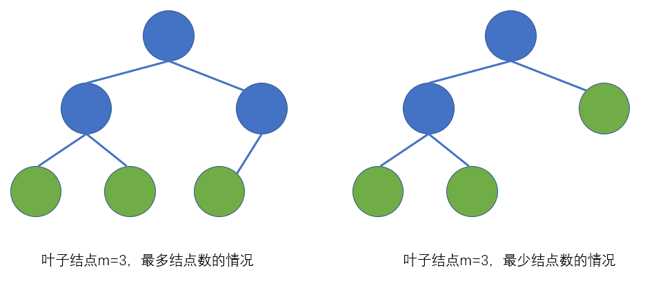
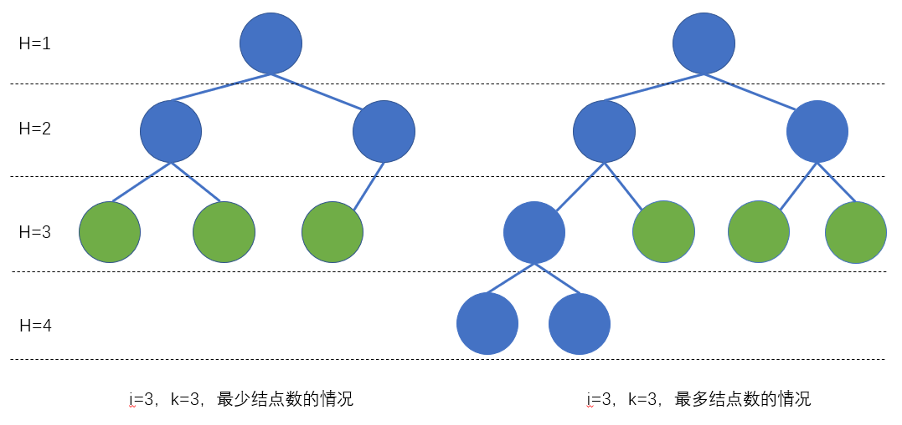

# 0x09 树的计算专题

**注意！下文中所有计算沿用王道的说法，均约定：只有根结点的树高度为1，根结点所在深度为1，高度为0的树为空树。**

1. **深度为$h$的平衡树的最少结点数、最多结点数**

   最少结点数：只能用递推。设$n_h$为深度为$h$的平衡树的最少结点数，则$n_0=0$，$n_1=1$，$n_h =n_{h-1}+n_{h-2}+1$

   最多结点数：即满二叉树的情况 $n_h=2^h-1$

2. **结点数为$n$的平衡树的最大深度**

   即最少结点数问题的反解。例如，$n=18$，由递推式知 $n_6=20$ 而 $n_5=12$，所以 $n=18$ 时平衡树的最大深度为 $5$。

3. **高度为$h$、度为$m$的树的最少结点数**

   度为$m$的树至少有一个结点有$m$个孩子，最少结点数的情形是：将$h-1$个结点组织成链，末端结点再挂$m$个孩子，故最少结点数为$h-1+m$

4. **高度为$h$的$m$叉树的最少结点数、最多结点数**

   最少结点数：此时树的形态是$h$个结点构成的一条链，故最少结点数为$h$

   最多结点数：满$m$叉树，$m^0+m^1+m^2+...+m^{h-1}=\frac{m^h-1}{m-1}$

5. **具有$n$个结点的$m$叉树的最小高度、最大高度**

   最小高度：即最多结点数问题的反解，注意只有右边才能取得等号，所以最终结果向上取整
   $$
   \begin{align}
   &\frac{m^{h-1}-1}{m-1}<n≤\frac{m^h-1}{m-1}\\
   &\Rightarrow m^{h-1}<n(m-1)+1≤mh\\
   &\Rightarrow h-1<\log_m{(n(m-1)+1)}≤h\\
   &\Rightarrow h_{min}=\lceil\log_m({n(m-1)+1)}\rceil&
   \end{align}
   $$
   最大高度：即最少结点数问题的反解，最大高度为$n$

6. **高度为$h$的完全二叉树的最少结点数、最多结点数**

   最少结点数：第$h$层只有$1$个结点。$n = 2^{h-1}-1+1=2^{h-1}$

   最多结点数：满二叉树的情况。$n = 2^{h}-1$

7. **具有$n$个结点的完全二叉树的高度**

   由于完全二叉树的所有结点按层序编号后能与满二叉树一一对应，所以结点数确定时树的形态是唯一的，其高度也是唯一的。

   以最少结点数反解：由$2^{h-1}≤n$ 解得 $h≤\log_2{n} +1$，又验证当$n=3$时$h=2$，所以式中的$\log_2n$向下取整。由于高度唯一，直接取等号。

   或以最多结点数反解：由$n≤2^h-1$解得$h≥\log_2{(n+1)}$，又验证当$n=2$时$h=2$，所以式中的$\log_2(n+1)$向上取整。由于高度唯一，直接取等号。

8. **具有$m$个叶子结点的完全二叉树的最多结点数、最少结点数**

   题目给出的$m$一般不会是满二叉树的情况，基于这个前提进行讨论。

   最多结点数：此时树中存在1个度为1的结点。

   最少结点数：此时树中不存在度为1的结点。

   

9. **第$i$层具有$k$个叶子结点的完全二叉树的最少结点数、最多结点数**

   

10. **高度为h的$m$阶B树的最小关键字数、最大关键字数**

    注意这里高度$h$<u>仅计算包含关键字的结点</u>，不含关键字的叶子结点都在第$h+1$层

    最小关键字数：让各个结点的分叉数/孩子数取最小值。即根结点分叉数取$2$，其他结点分叉数取$k=m/2$（向上取整）。此时B树的（含关键字的）结点总数为：$1+2+2k^1+2k^2+...+2k^{h-2}$，第$h$层共有$2k^{h-2}$个结点。

    最大关键字数：先考虑一棵高为$h$的满$m$叉树，它共有$\frac{m^h-1}{m-1}$个（含关键字的）结点。因为是满m叉的，所以每个结点都一定包含$m-1$个关键字。故高为$h$的$m$阶B树的最多关键字数为$m^h-1$。

11. **含有$n$个关键字的$m$阶B树的最小高度、最大高度**

    最小高度：由$n≤m^h-1$反解最小高度，得$h≥\log_m{(n+1)}$，由验证知$m=2，n=2$时$h$为$2$，故式中$\log_m{(n+1)}$向上取整。

    综上，最小高度为$\log_m{(n+1)}$向上取整。（这里算得的高度不包括叶子结点）

    最大高度：因为$n$个关键字的B树必有$n+1$个叶子结点，又知第$h+1$层至少有$2\lceil m/2\rceil^{h-1}$个结点，所以有$n+1≥2\lceil m/2\rceil^{h-1}$，由此反解最大高度得$h≤\log_{\lceil m/2\rceil}{(\frac{n+1}{2})+1}$

