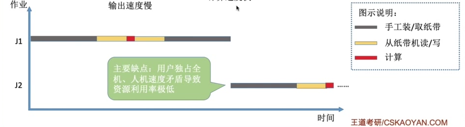
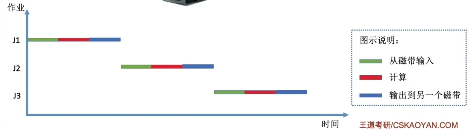
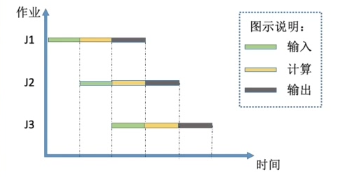

# 0x01 计算机系统概述

## 一、操作系统的概念、特征与功能

### 1.1 操作系统的概念 

- 操作系统：指控制和管理整个计算机系统的硬件和软件资源，并合理地组织调度计算机的工作和资源的分配，以提供给用户和其他软件方便的接口和环境，是计算机系统中最基本的**系统软件**

### 1.2 操作系统的特征

- 操作系统的特征有：并发、共享、虚拟、异步
- 其中并发和共享是操作系统**最基本的特征**

#### 并发

并发是指**两个或多个事件在同一时间间隔内发生**。这些事件在宏观上是**同时**发生的，在微观上是**交替**发生的。

并行是指两个或多个事件在同一时刻同时发生。

单核CPU同一时刻只能执行一个程序，只能并发

多核CPU同一时刻能执行多个程序，可以并行

#### 共享

共享即资源共享，是指系统中的资源可供内存中多个并发执行的进程共同使用

- 互斥共享：同一时间段内只允许一个进程访问该资源

- 同时共享：同一时间段内允许多个进程“同时”访问。“同时”是宏观上的同时，微观上可能是交替访问的

#### 虚拟

如虚拟内存，虚拟处理器（实际上只有一个单核CPU，但在用户看来好像有6个CPU同时在服务）等

没有并发就没有虚拟

- 空分复用技术和时分复用技术

#### 异步

多道程序环境下，允许多个程序并发执行，但进程的执行不是一贯到底的，而是受资源限制走走停停，以不可预知的速度推进

没有并发就没有异步

### 1.3 操作系统的目标和功能

为了给多道程序提供良好的运行环境，操作系统应具有以下功能：处理机管理、存储器管理、设备管理和文件管理。

#### 处理机管理

即对进程的管理。主要功能包括：进程控制、进程同步、进程通信、死锁处理、处理机调度等。

#### 存储器管理

方便用户使用及提高内存的利用率。主要包括内存分配与回收、地址映射、内存保护与共享、内存扩充

#### 设备管理

完成用户的I/O请求，方便用户使用各种设备。包括缓冲管理、设备分配、设备处理、虚拟设备

#### 文件管理

计算机中的信息都以文件的形式存在。包括文件存储空间的管理、目录管理、文件读写管理和保护

## 二、操作系统的发展和分类

### 2.1 手工操作阶段

### 2.2 单道批处理系统

程序预先输入到磁带中，由监督程序负责控制作业的输入、输出

- 自动性
- 顺序性：先调入内存的作业先完成
- 单道性：内存中仅有一道程序运行

优点：一定程度上缓解了人机速度矛盾，资源利用率有一定提升

缺点：同一时刻只有一个程序在运行。CPU有大量时间在等待I/O完成

### 2.3 多道批处理系统

- 多道
- 宏观上并行
- 微观上串行

优点：多个程序并发执行，CPU和资源更能保持忙碌状态

缺点：用户响应时间长，没有人机交互功能，作业一旦提交就不能再干涉作业

### 2.4 分时操作系统

- 同时性：允许多个终端用户同时使用一台计算机
- 交互性：用户能方便地与系统进行人机对话
- 独立性：多个用户可以彼此独立地进行操作，互不干扰
- 及时性：用户请求能在很短时间内获得响应

计算机以时间片为单位轮流为各个用户/作业服务

优点：用户请求可以被即时响应，解决人机交互问题。

缺点：不能优先处理一些紧急任务

### 2.5 实时操作系统

计算机需要在严格的时限内成立完事件。特点是及时性和可靠性

优点：能够优先响应一些紧急任务，某些紧急任务不需时间片排队

缺点：交互性不如分时操作系统

- 硬实时系统：必须在绝对严格的规定时间内完成处理（如导弹控制系统、飞行自动控制系统、自动驾驶系统）
- 软实时系统：能接受偶尔违反时间规定（如订票系统、银行管理系统）

##  三、操作系统的运行机制

### 3.1 特权指令与非特权指令

指令分为<u>特权指令</u>和<u>非特权指令</u>

CPU处于内核态才能执行特权指令，处于用户态只能执行非特权指令。

CPU内部的PSW寄存器的一个标志位用于标志当前处于用户态还是内核态。

- CPU处于内核态时，可以执行一条**特权指令**，修改PSW标志位为用户态，从而使CPU从内核态转为用户态，即操作系统主动让出CPU使用权
- CPU处于用户态时，若（被动或主动地）触发了中断，则硬件自动完成标志位的修改，使CPU从用户态转为内核态，操作系统强行接管CPU使用权。
- 用户态到核心态的转换是由硬件完成的

### 3.2 操作系统内核

大部分操作系统内核包括始终管理、中断机制、原语、系统控制的数据结构及处理

- 时钟管理
- 中断机制
  - 线代操作系统是靠中断驱动的软件
  - 中断机制中，只有一小部分功能属于内核，负责保护和恢复中断现场的信息，转移控制权到相关的处理程序
- 原语
  - 处于操作系统的最底层，是最接近硬件的部分
  - 运行具有原子性，操作必须一气呵成
  - 运行时间都较短，且调用频繁
- 系统控制的数据结构及处理
  - 基本数据结构如作业控制块、进程控制块、设备控制块、各类链表等
  - 常见操作：进程管理、存储器管理、设备管理。

### 3.3 中断与异常

- 定义
  - 中断也称外中断，是指来自CPU执行指令外部的事件，如设备发出的I/O结束中断、时钟中断等。
  - 异常也称内中断，是指来自CPU执行指令内部的事件，如非法操作码、地址越界、运算溢出、虚存缺页或专门的陷入指令等。**异常都不可屏蔽**。
- 分类
  - 中断分为可屏蔽中断和不可屏蔽中断，可屏蔽中断是通过INTR线发出的中断请求；不可屏蔽中断是通过NMI线发出的中断请求，如电源掉电等紧急硬件故障
  - 异常分为故障、自陷和终止。故障为指令引起的异常，如访问越界、除零错误、运算溢出等；自陷为程序主动调用陷入指令进入内核态；终止为出现了使CPU无法继续执行的硬件故障，如控制器出错等。
  - 故障异常和自陷异常都属于软件中断；终止异常和外中断都属于硬件中断

### 3.4 系统调用

系统调用是应用程序请求操作系统服务的**唯一方式**

系统调用又称为广义指令

凡是与共享资源有关的操作，都必须通过系统调用的方式向操作系统内和提出服务请求

- 陷入指令：是一条<u>非特权指令</u>，在用户态下执行。会立即引发一个内中断，使CPU进入核心态
- 系统调用请求是在用户态下发出的，对系统调用的相应处理则是在核心态下进行

## 四、操作系统体系结构

### 分层法

优点：便于系统调试和验证，简化了系统的设计和实现；易扩充和易维护，增加、修改或替换一层中的模块或整层时，只要不改变层间接口，就不会影响其他层

缺点：合理定义各层比较困难，依赖关系固定后显得不够灵活；效率较差，OS每执行一个功能，要自上而下地穿越多层，各层之间需要有相应地层间通信机制，增加了额外开销

### 模块化

将OS按功能划分为若干具有一定独立性的模块，各模块可进一步细分为具有一定功能的子模块，模块之间通过接口进行通信。

模块划分太小，使模块之间联系过多，较为混乱；模块划分太大，会增加模块内部的复杂性。

模块独立性：高内聚、低耦合，独立性好。独立性好，各模块之间的交互越少，系统结构越清晰

优点：提高了OS设计的正确性、可理解性和可维护性；增强了OS的可适应性；加速了OS的开发过程

缺点：模块间的接口规定很难满足对接口的实际需求；各模块设计者齐头并进，无法找到一个可靠的决定顺序

### 宏内核

也称单内核或大内核，把进程管理、存储器管理、设备管理等管理功能及时钟管理、中断处理、原语等与硬件联系最紧密的功能都包含在内核里。

具有无可比拟的性能优势。

### 微内核

- 微内核的基本概念
  - 只把时钟管理、中断处理、原语等与硬件联系最紧密的功能都包含在内核里；
  - 进程管理、存储器管理等可以在用户态执行
  - 为了实现高可靠性，只有微内核运行在内核态，其他模块都运行在用户态。因此在请求系统服务时，大内核需要的CPU状态切换次数少，微内核则需要频繁切换。

- 微内核的基本功能
  - 进程（线程）管理。进程（线程）之间的通信功能是微内核OS最基本的功能。
  - 低级存储器管理。如将逻辑地址变换为物理地址等的页表机制和地址变换机制等依赖于硬件的内容。而实现虚存管理的策略则在用户态
  - 中断和陷入处理

- 特点
  - 扩展性和灵活性
  - 可靠性和安全性
  - 可移植性
  - 分布式计算

## 五、操作系统引导

## 六、虚拟机

