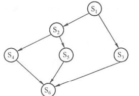
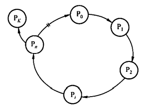
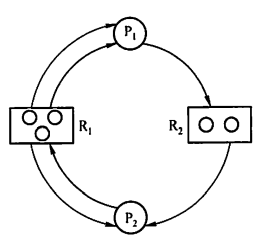

# 0x02 进程管理

## 一、进程

### 1.1 进程的概念

- 程序是静态的，是一系列指令的集合。进程是动态的，是程序的一次执行过程。
- **进程是进程实体的运行过程，是系统进行资源分配和调度的一个独立单位**

- PID：操作系统为进程分配的唯一标识

- PCB：一个存储进程各信息的数据结构，**是进程存在的唯一标志**
  - PID
  - 进程所属用户ID
  - 资源分配情况
  - 进程运行情况
- 进程实体/进程映像
  - PCB
  - 程序段：程序的代码
  - 数据段：运行过程中产生的各种数据

### 1.2 进程的特征

- 动态性
  - 进程是程序的一次执行过程，是动态地产生、变化和消亡的
- 并发性
  - 内存中有多个进程实体，各进程可并发执行
- 独立性
  - 进程是能独立运行、独立获得资源、独立接受调度的基本单位
- 异步性
  - 各进程按各自独立的、不可预知的速度向前推进
  - 操作系统要提供“进程同步机制”来解决异步问题
- 结构性
  - 每个进程都会配置一个PCB
  - 进程由程序段、数据段、PCB组成

### 1.3 进程的状态

- 运行态：进程正在处理机上运行
- 就绪态：进程仅缺少处理机
- 阻塞态：进程需要其他资源（除了处理机）或等待某一事件
- 创建态：进程正在被创建。如果进程所需的资源尚不能得到满足，则创建工作尚未完成，进程会停留在创建态
- 结束态：进程需要结束运行时，系统首先将该进程置为结束态，然后进一步处理资源释放和回收等工作

一个进程从运行态变成阻塞态是主动的行为，从阻塞态变成就绪态是被动的行为，需要其他相关进程的协助。

### 1.4 进程的组织

#### 进程控制块（PCB）

- PCB常驻内存，任意时刻都可以存取

- PCB通常包含的内容:

  | 进程描述信息 | 进程控制和管理信息 | 资源分配清单 | 处理机相关信息 |
  | ------------ | ------------------ | ------------ | -------------- |
  | 进程标识符   | 进程当前状态       | 代码段指针   | 通用寄存器值   |
  | 用户标识符   | 进程优先级         | 数据段指针   | 地址寄存器值   |
  |              | 代码运行入口地址   | 堆栈段指针   | 控制寄存器值   |
  |              | 程序的外存地址     | 文件描述符   | 标志寄存器值   |
  |              | 进入内存时间       | 键盘         | 状态字         |
  |              | 处理机占用时间     | 鼠标         |                |
  |              | 信号量使用         |              |                |

- PCB的组织方式

  - 链接方式：将同一状态的PCB链接成一个队列，不同状态对应不同的队列
  - 索引方式：将同一状态的进程组织在一个索引表中，索引表的表项指向相应的PCB，不同状态对应不同的索引表

#### 程序段

程序段是能被进程调度程序调度到CPU执行的程序代码段。程序可被多个进程共享

#### 数据段

可以是进程对应的程序加工处理的原始数据，也可以是程序执行时产生的中间或最终结果

### 1.5 进程控制

#### 进程的创建

允许一个进程创建另一个进程，创建者称为父进程，被创建者称为子进程

子进程可以继承父进程所拥有的资源

- 当子进程被撤销时应归还资源

父进程被撤销时，通常也会同时撤销其所有的子进程

创建原语：

1. 为新进程分配一个唯一的PID，并申请一个空白PCB，若PCB申请失败，则创建失败
2. 为进程分配其运行所需的资源，如内存、文件、I/O和CPU时间等
3. 初始化PCB，主要包括初始化标志信息，初始化处理机状态信息和初始化处理机控制信息，以及设置进程的优先级等
4. 若进程就绪队列能够接纳新进程，则将新进程插入就绪队列，等待被调度运行

#### 进程的终止

引起进程终止的事件有：

- 正常结束：表示进程的任务已完成并准备退出运行
- 异常结束：进程在运行时，发生了某种异常事件，使程序无法继续运行
- 外界干预：应外界的请求而终止运行

终止原语：

1. 根据被终止进程的标识符，检索出该进程的PCB，从中读出该进程的状态
2. 若被终止进程处于运行态，立即终止运行，将处理机资源分配给其他进程
3. 若该进程还有子孙进程，将其所有子孙进程终止
4. 将该进程拥有的全部资源，或归还给父进程，或归还给操作系统
5. 将该PCB从所在队列（链表）中删除

#### 进程的阻塞和唤醒

只有处于运行态的进程，才可能将自己转为阻塞态。

阻塞（Block）原语：

1. 找到将要被阻塞进程的PID对应的PCB
2. 若该进程为运行态，则保护其现场，将其状态转为阻塞态，停止运行
3. 把该PCB插入相应时间的等待队列，将处理机资源调度给其他就绪进程

唤醒（Wakeup）原语（由相关进程调用）：

1. 在该事件的等待队列中找到相应进程的PCB
2. 将其从等待队列中移出，并置其状态为就绪态
3. 把该PCB插入就绪队列，等待调度程序调度

只要有进程调用了阻塞原语，就必须在与之合作的或其他相关的进程中安排一条相应的唤醒原语。否则，阻塞进程无法被唤醒，会永久处于阻塞状态。

### 1.6 进程的通信

#### 共享存储

进程之间使用一块可直接访问的共享空间，通过对这块空间的读写操作实现进程之间的信息交换。

需要使用同步互斥工具对共享空间的写/读进行控制

低级方式的共享：基于数据结构的共享

高级方式的共享：基于存储区的共享

#### 消息传递

消息传递是当前应用最广泛的进程间通信机制。

进程间的数据交换以格式化的消息（Message）为单位。

- 直接通信方式：发送进程直接把消息发送给接收进程，并将它挂在接收进程的消息缓冲队列上，接收进程从消息缓冲队列中取得消息
- 间接通信方式：发送进程把消息发送到某个中间实体，接收进程从中间实体取得消息。这种中间实体一般称为信箱。

#### 管道通信

管道通信是消息传递的一种特殊方式。写进程以字符流形式将大量数据写入管道，而读进程从管道中读数据。

管道：连接一个读进程和一个写进程以实现它们之间的通信的一个**共享文件**，与一般文件有所不同，管道可以克服文件进行通信的两个问题：

- 限制管道的大小。管道是个固定大小的缓冲区，在Linux中大小为4KB，当管道满时写进程被阻塞直到管道数据被读取腾出空间。
- 读进程可能工作得比写进程快。当管道已空时，读进程默认被阻塞，等待数据被写入。

管道通信是半双工通信。

与共享存储方式不同，管道通信不会发生读写冲突，因为写进程必定先把缓冲区写满，才会让读进程读；而在读进程眼中，只要缓冲区有数据，它就可以读。

### 1.7 线程和多线程模型

#### 线程的概念

引入线程：减小程序在并发执行时的开销，提高操作系统的并发性能。

线程可以理解为“轻量级进程”，是基本的CPU执行单元，也是程序执行流的最小单元，也是系统独立调度和分派的基本单位。

线程的组成：线程ID、程序计数器、寄存器集合、堆栈。

线程自己不拥有系统资源，但与同属于同一个进程的其他线程一起共享进程所拥有的资源。

线程之间的制约，使线程在运行中呈现间断性

线程有就绪、阻塞、运行三种基本状态

|              | 线程                                                         | 进程                                                         |
| ------------ | ------------------------------------------------------------ | ------------------------------------------------------------ |
| 调度         | 是独立调度的基本单位，且线程切换代价远低于进程；属于不同进程的线程之间切换会引起进程切换 | 在传统操作系统中，进程是独立调度的基本单位，每次调度都要进行上下文切换，开销大 |
| 并发         | 进程与进程之间可并发执行，线程与线程之间也可并发执行，无论是否属于同一进程 | 进程与进程之间可并发执行                                     |
| 资源         | 不拥有系统资源（只有一点必不可少、能保证独立运行的资源），但可以访问其所属进程的资源。**同一进程的所有线程都有相同的地址空间** | 进程是系统中拥有资源的基本单位                               |
| 独立性       | 同一进程的各个线程共享进程的地址空间和资源。一个进程的线程对其他进程不可见 | 每个进程都拥有独立的地址空间和资源，除了共享全局变量以外，不允许其他进程访问 |
| 系统开销     | 线程的创建、撤销、切换的开销都很小；同一进程的线程之间同步与通信非常容易实现，甚至无需操作系统的干预 | 进程的创建、撤销需要系统分配/回收PCB及其他资源等；进程切换需要切换上下文内容，开销大 |
| 多处理机系统 | 同属于同一个进程的多个线程可以分散在不同处理机上运行         | 不管有多少处理机，进程都只能在一个处理机上运行               |

#### 线程的属性

- 线程都具有唯一标识符和对应线程控制块，线程控制块记录线程执行的寄存器和栈等现场状态
- 不同的线程可以执行相同的程序
- 同一进程中的各个线程共享该进程所拥有的资源
- 线程是处理机的独立调度单位

#### 线程的状态与转换

执行状态、就绪状态、阻塞状态，与进程基本一致

#### 线程的组织与控制

- 线程控制块TCB
  - 线程标识符、一组寄存器、线程运行状态、优先级、线程专有存储区、堆栈指针
  - 由于地址空间共享，一个线程可以读写甚至清除另一个线程的堆栈
- 线程的创建
  - 操作系统中有用于创建线程和终止线程的函数（或系统调用）
  - 用户程序启动时，由一个称为“初始化线程”的线程执行创建新线程的工作。
- 线程的终止
  - 有些线程（如系统线程）一旦被建立而不会被终止
  - 线程被终止后不会立即释放占有的资源，只有当进程中的其他线程执行了分离函数后，被终止线程才与资源分离，资源才可用
  - 被终止但尚未释放资源的线程仍可被其他线程调用，重新恢复运行

#### 线程的实现方式

- **用户级线程（ULT）**

  线程管理工作：由应用程序在用户空间中完成，内核意识不到线程的存在

  系统调度：仍以进程为单位进行

  优点：

  - 不同进程可以根据不同需要选择不同的线程调度算法

  - 线程切换不需要转换到内核空间，节省了模式切换的开销；

  - ULT的实现与操作系统平台无关

  缺点：

  - **一个线程执行系统调用时会导致其自身以及其他线程都被阻塞**
  - 不能发挥多处理机的优势，内核每次分配给一个进程的只有一个CPU，因此同一时间内进程中只有一个线程能执行

- **内核级线程（KLT）／内核支持的线程**

  线程管理工作：在内核空间内实现

  优点：

  - 如果进程中的一个线程被阻塞，内核可以调度该进程的其他线程占用处理机，也可运行其他进程中的线程
  - 能发挥多处理机的优势，内核能同时调度同一进程中的多个线程并行执行
  - 内核本身也可采用多线程技术，提高系统执行速度和效率

  缺点：

  - 同一进程中的进程切换，需要转到核心态进行，系统开销较大。因为用户进程的线程都是在用户态运行，而线程调度和管理在内核实现。

- **ULT和KLT的组合实现**

  即操作系统内核支持多个内核级线程的建立、调度和管理，也允许用户程序建立、调度和管理用户及线程。

  一些内核级线程对应多个用户级线程。同一进程中的多个线程可以同时在多处理机上并行执行，阻塞一个线程时不需要将整个进程阻塞，结合了KLT和ULT的优点，并能克服各自的不足。

  根据用户级线程和内核级线程连接方式的不同，有多种多线程模型：

  - 多对一模型
    - 将多个用户级线程映射到一个内核级线程。用户级线程运行在用户态，当线程需要访问内核时，才将其映射到一个内核级线程上，每次仅允许一个线程进行映射。
    - 优点：线程管理在用户空间进行，效率高
    - 缺点：如果一个线程在访问内核时发生阻塞，则阻塞整个进程；且任何时刻只有一个线程能访问内核，多个线程不能同时在多个处理机上运行
  - 一对一模型
    - 每个用户级线程映射到一个内核级线程
    - 优点：一个线程被阻塞后，允许调度另一个线程运行
    - 缺点：每创建一个用户线程，就要相应创建一个内核级线程，开销大
  - 多对多模型
    - 将n个用户线程映射到m个内核级线程上，且n≥m
    - 既克服了上述两种模型的缺点，又兼具两者的优点

## 二、处理机调度

### 2.1 调度的概念与目标

#### 调度的概念

在多道程序系统中，进程的数量多于处理机的个数，系统需要按一定的算法将处理机分配给各个进程，以实现进程并发

#### 调度的层次

- 高级调度（作业调度）：从外存中处于后备队列的作业中挑选一个或多个，分配内存、I/O设备等必要资源并建立相应进程。每个作业仅调入一次、调出一次
- 中级调度（内存调度）：为了提高内存利用率和系统吞吐量，将暂时不能运行的进程调至外存等待（挂起态），等到运行条件满足且内存可容纳时，再重新调入内存（就绪态），等待进程调度。
- 低级调度（进程调度）：从就绪队列中选取一个进程，分配处理机。进程调度是最基本的调度，频率很高，一般几十毫秒一次。

#### 调度的目标

- CPU利用率
  $$
  CPU利用率=\frac{CPU有效工作时间}{CPU有效工作时间+CPU空闲等待时间}
  $$

- 系统吞吐量：单位时间内CPU完成作业的数量

- 周转时间：作业提交到作业完成所经历的时间

- 平均周转时间：所有作业周转时间的平均值

- 带权周转时间：作业周转时间/作业实际运行时间（显然是大于等于1的）

- 平均带权周转时间：所有作业平均带权周转时间的平均值

- 等待时间：进程等待处理机的时间之和

- 响应时间：用户提交请求到系统首次产生响应所用的时间

### 2.2 调度的实现

#### 调度程序

由排队器、分派器、上下文切换器三个部分组成。

- 排队器：将就绪进程按需要组织成队列，以便选择，并负责把新转换为就绪态的进程插入到就绪队列
- 分派器：将选择的进程从就绪队列中取出，将CPU分配给该进程
- 上下文切换器：在对处理机进行切换时，**会发生2对上下文切换操作**。第一对，将当前进程的上下文保存到其PCB中，再装入分派程序的上下文，以运行分派程序；第二对，移出分派程序的上下文，将新选进程的CPU现场信息装入处理机的各个相应寄存器。

为了减少进程切换时的上下文切换时间，通常采用两组寄存器，一组供内核使用（分派程序用？），一组供用户使用

#### 调度的时机、切换与过程

调度需要执行调度程序。

| 不能进行进程的调度与切换的情况                               | 应该进行进程的调度与切换的情况                               |
| ------------------------------------------------------------ | ------------------------------------------------------------ |
| 处理中断的过程中                                             | 调度条件满足且当前进程无法继续运行下去时。                   |
| 进程在操作系统内核临界区中                                   | 中断处理结束或自陷处理结束后，返回用户态程序执行现场，可马上进行进程调度与切换。 |
| 其他需要完全屏蔽中断的原子操作过程中（如加锁、解锁、中断现场保护等） |                                                              |

调度完成后，立即开始进行切换工作，具体内容如下：

1. 保存原进程当前断点的现场信息
2. 恢复新进程的现场信息
3. 内核更新当前运行的进程空间指针
4. 内核重设PC寄存器等

切换完成后开始运行新的进程。

#### 进程调度方式

进程调度方式是指，当有进程正在占用处理机，而有更高优先级的进程进入就绪队列时，分配处理机的方式

- 非抢占调度方式/非剥夺方式：让正在执行的进程继续执行，直到它完成或阻塞，才把处理机分配给其他进程。

  优点：实现简单、系统开销小，适用于大多数批处理系统，但不能用于分时系统和大多数的实时系统

- 抢占调度方式/剥夺方式：允许调度程序根据某种原则暂停正在执行的进程，将处理机分配给这个优先级更高的进程

  优点：提高系统吞吐率、响应效率。但”抢占“必须遵循一定的原则

#### 闲逛进程

若系统中无就绪进程，就会调度闲逛进程运行，并在执行过程中测试中断。一旦有进程就绪，立即让出处理机。**闲逛进程不需要CPU以外的资源，不会被阻塞**

#### 线程调度

- 用户级线程调度：内核不知道线程的存在，仍以进程为单位调度。
- 内核级线程调度：内核选择一个特定线程运行，并赋予一个时间片，如果超时则强制挂起。
- 内核级线程调度的开销比用户级要高，因为需要完整的上下文切换、修改内存映像等

### 2.3 调度算法

#### 先来先服务（FCFS）

- 非剥夺算法
- 不能作为分时系统和实时系统的主要调度策略，因为先到达的长作业会使后到达的许多短作业等待很长时间
- 算法简单，但效率低；对长作业比较有利，但对短作业不利；有利于CPU繁忙型作业，不利于I/O繁忙型作业

#### 短作业优先（SJF）调度算法

- 每次都从后备队列中选择一个或若干**估计运行时间最短**的作业调入内存；每次都从就绪队列中选择一个**估计运行时间最短**的进程分配处理机
- 对长作业不利，可能会长期得不到调度（饥饿现象）
- 完全未考虑作业的紧迫程度，不能保证紧迫性作业会被及时处理
- 作业的估计执行时间是用户提供的，不一定准确，导致该算法不一定能真正做到短作业优先调度
- **平均等待时间、平均周转时间最少**

#### 优先级调度算法

- 每次都选择**优先级最高**的作业/进程
- 根据新进入就绪队列的更高优先级进程是否能抢占正在执行的进程，分为抢占式和非抢占式：
  - 抢占式：立即暂停正在执行的进程，将处理机分配给更高优先级的进程
  - 非抢占式：等待正在执行的进程阻塞或结束，才能将处理机分配给就绪队列中优先级最高的进程
- 根据进程创建后其优先级是否可以改变，分为动态优先级和静态优先级：
  - 动态优先级：在进程运行过程中，根据进程情况的变化动态调整优先级。调整依据有：进程占有CPU时间的长短、就绪进程等待CPU时间的长短
  - 静态优先级：优先级在创建进程时确定，并在运行过程中不变。确定的依据有：进程类型、进程对资源的要求、用户要求
- 优先级设置基本规则
  - 系统进程＞用户进程
  - 交互性进程＞非交互性进程
  - I/O型进程＞计算型进程：让I/O设备尽早开始工作，从而提升系统的总体效率

#### 高响应比优先调度算法

- **主要用于作业调度**，是对FCFS和SJF的综合平衡，既考虑了作业等待时间，也考虑了估计的运行时间

- 每次从后备队列中挑选**响应比最高**的作业投入运行

- 响应比计算：
  $$
  响应比R_P=\frac{等待时间+要求服务时间}{要求服务时间}
  $$

- 作业等待相同时，要求服务时间越短，响应比越高，有利于短作业，类似于SJF

- 作业服务时间相同时，等待时间越长，响应比越高，类似于FCFS

- 对于长作业，作业响应比会随其等待时间增加而提高，等待时间足够长时会获得处理机，克服了“饥饿”现象

#### 时间片轮转调度算法

- 主要适用于分时系统
- 就绪进程按FCFS排成就绪队列，每次总选择队头进程执行，但只能运行一个时间片。若时间片结束，无论进程是否运行完成，都需要回到就绪队列末尾重新排队
- 若时间片足够大，以至于所有进程都能在一个时间片内执行完毕，则退化为FCFS
- 若时间片很小，则处理机切换进程过于频繁，开销增大
- 时间片的长短确定因素：系统响应时间、就绪队列中的进程数目和系统的处理能力

#### 多级队列调度算法

- 设置多个就绪队列，按类型或性质将进程固定分配到不同的队列，再对各个队列实施不同的调度算法
- 在多处理机系统中，可以为每个处理机设置一个单独的就绪队列，每个处理机可实施各自不同的调度策略

#### 多级反馈队列调度算法

- 设置多个就绪队列，每个队列赋予不同优先级
- 每个队列的时间片大小不同。队列优先级越高，进程时间片越小
- 每个队列采用FCFS算法。新进程进入内存后首先放入第1级队列末尾，若它在执行一个时间片后尚未完成，则放入第2级队列末尾……以此类推。当进程被降到第n级队列后，就在第n级队列中采用时间片轮转方式运行
- 按队列优先级调度。只有当第1级队列为空时，才调度第2级队列的进程……以此类推。当正在执行第 i 级队列的某进程时，若更高优先级的队列有新进程进入则立即抢占，并把原进程放回第 i 级队列末尾（而不是放到第 i+1 级队列）
- 短作业优先，周转时间短，克服了长作业的饥饿现象（能先得到部分执行）

#### 调度算法对比总结

|                | FCFS           | SJF                            | 高响应比优先       | 时间片轮转                           | 多级反馈队列                             |
| -------------- | -------------- | ------------------------------ | ------------------ | ------------------------------------ | ---------------------------------------- |
| 能否是可抢占   | 否             | 能                             | 能                 | 能                                   | 取决于队列采用的算法                     |
| 能否是不可抢占 | 能             | 能                             | 能                 | 否                                   | 取决于队列采用的算法                     |
| 优点           | 公平、实现简单 | 平均等待时间、平均周转时间最少 | 兼顾长短作业       | 兼顾长短作业                         | 兼顾长短作业，有较好的响应时间，可行性强 |
| 缺点           | 不利于短作业   | 长作业会饥饿，估计时间不易确定 | 计算响应比的开销大 | 平均等待时间较长，上下文切换浪费时间 | 无                                       |
| 适用于         | 无             | 作业调度、批处理系统           | 作业调度           | 分时系统                             | 通用                                     |
| 默认决策       | 非抢占式       | 非抢占式                       | 非抢占式           | 抢占式                               | 抢占式                                   |

### 2.4 进程切换

任何进程都是在操作系统内核的支持下运行的。即，进程的创建、撤销、要求的I/O操作、切换等，都需要经过系统调用进入内核态，再由内核处理程序予以完成。

#### 上下文切换

**上下文**是指某一时刻CPU各个寄存器和PC（程序计数器）的内容。

**上下文切换**是指保存当前进程状态（到进程PCB）并恢复另一个进程状态。

**流程：**

1. 挂起一个进程，保存CPU上下文
2. 更新该进程的PCB信息
3. 将该进程的PCB移入相应队列，如就绪队列、阻塞队列
4. 选择新进程执行，更新其PCB
5. CPU程序计数器中的值更新（或者说恢复）为新进程PCB中保存的对应值
6. 根据新进程PCB恢复其他处理机上下文

**上下文切换的开销：**切换需要纳秒量级的时间。为了节省开销，有些处理器会提供多组寄存器，上下文切换只需简单改变当前寄存器组的指针

**上下文切换与模式切换：**模式切换指用户态/内核态的切换。模式切换并未改变当前的进程。上下文切换只能发生在内核态。

## 三、同步与互斥

### 3.1 基本概念

- 临界资源：一次仅允许一个进程访问的资源
- 临界区：进程中访问临界资源的那段代码
- 临界资源的访问过程
  - 进入区：在进入区可否进入临界区，若可以，则设置相应标志
  - 临界区：访问临界资源的那段代码
  - 退出区：清除标志
  - 剩余区：代码的其余部分
- 同步：进程之间的直接制约关系，来源于它们之间的相互合作，即必须先完成某个进程，然后才能进行某个进程
- 互斥：进程之间的间接制约关系。当一个进程进入临界区临界资源时，另一个需要使用相同临界资源的进程必须等待。
  - 空闲让进：临界资源空闲时，允许一个请求临界资源的进程进入临界区开始访问
  - 忙则等待：已有进程访问临界资源，其他进程必须等待
  - 有限等待：请求访问的进程应保证能在有限时间内进入临界区（防止饥饿）
  - 让权等待：当进程不能进入临界区时，应立即释放处理器，防止忙等待

### 3.2 临界区互斥的实现方法

#### 软件实现方法

- **单标志法**

  设置一个标志变量`turn`，表示当前允许哪个进程进入临界区。

  相当于一个接力棒，进程退出临界区时再把接力棒交给另一个进程。如此交替进入临界区。

  会出现的问题：如果拿到接力棒的进程并没有进入临界区的打算，就没有“退出临界区”这个操作，导致进程会一直把接力棒拿在自己手里不给其他进程。

  **——违背“空闲让进”原则**

  ```c++
  // P0进程
  while(turn!=0); //这样写就可以实现“拿不到接力棒就等待”的效果
  critical section;
  turn = 1;
  remainder section;
  
  // P1进程
  while(turn!=1)
  critical section;
  turn = 1;
  remainder section;
  ```

- **双标志法先检查**

  进程访问临界资源之前，先查看临界资源是否空闲，若忙则等待，否则进入临界区进行访问。但“查看临界资源是否空闲”其实是“查看是否存在其他进程正在访问”。所以需要设置一个数组`frag[i]`，若第`i`个元素为`false`，则表示$P_i$进程未进入临界区。

  与单标志法的区别在于，如果进程没有进入临界区的打算，就不会把flag置为true，不会阻碍其他想要进入临界区的进程访问。

  ```c++
  // Pi进程
  while(flag[j]);
  flag[i] = true;
  critical section;
  flag[i] = false;
  remainder section;
  
  // Pj进程
  while(flag[i]);
  flag[i] = true;
  critical section;
  flag[j] = false;
  remainder section;
  ```

  优点：不用交替进入，可连续使用

  缺点：$P_i$和$P_j$可能同时进入临界区。即，$P_i$进程的`while(flag[j]);`判定通过，但还未置true，就发生了进程调度切换至$P_j$进程，然后$P_j$进程的`while(flag[i]);`也能判定通过，导致两个进程都能进入临界区。

  **——违背“忙则等待”原则**

- **双标志法后检查**

  先将自己的标志位置true`flag[i]=true`，后检查对方的标志位`while(flag[j])`，即可避免双标志法先检查中同时进入临界区的问题。

  ```c++
  // Pi进程
  flag[i] = true;
  while(flag[j]);
  critical section;
  flag[i] = false;
  remainder section;
  
  // Pj进程
  flag[i] = true;
  while(flag[i]);
  critical section;
  flag[j] = false;
  remainder section;
  ```

  问题：可能会因为互相“谦让”而导致饥饿现象，如P1置true→P2置true→P1循环检查→P2也循环检查，谁也进不了临界区。

  **——违反空闲让进和有限等待原则**

- **Peterson's Algorithm**

  结合双标志法后检查和单标志法，`flag[i]=true` 表示进程 i 想访问临界区；`turn=j`来表明“虽然我想用，但可以让进程j先用”

  ```c++
  // Pi进程
  flag[i] = true; turn = j;
  while(flag[j] && turn == j);
  critical section;
  flag[i] = false;
  remainder section;
  
  // Pj进程
  flag[i] = true; turn = i;
  while(flag[i] && turn == j);
  critical section;
  flag[j] = false;
  remainder section;
  ```

  在让双标志法后检查发生饥饿现象的场景中，本算法的执行过程是这样的（最坏情况下每次只来得及执行一条语句就发生进程调度）：P1置true→P2置true→P1设turn=2→P2设turn=1→P1跳出while循环进入临界区→P1访问完毕置false→P2跳出循环进入临界区→P2访问完毕置false。

以上软件实现方法都违背了让权等待原则，因为都存在一个while循环不断检测，而这个循环判断是需要占用处理机的。

#### 硬件实现方法

- **中断屏蔽方法**

  防止其他进程进入临界区的最简单方式是关中断。因为CPU只在发生中断时引起进程切换，只要屏蔽/关中断就可以避免进程切换，从而让当前进程独占CPU，保证把临界区代码执行完毕。

  缺点：降低处理机执行效率；若将关中断权力交给用户，则用户进程可能关中断后不再开中断，导致系统无法运行。

- **硬件指令方法**

  以下两条指令都是原子操作。

  TestAndSet指令：读出指定标志，并把该标志设置为真。

  ```c++
  while TestAndSet(&lock); 
  //当读到lock状态为false的同时将lock置为true，并跳出循环进入临界区
  critical section;
  lock = false; //访问完毕，释放
  remainder section;
  ```

  Swap指令：交换两个字/字节的内容

  ```c++
  key = true;
  while (key != false) //当检测到key（被交换成）为false时，说明lock刚才处于false状态，且现在已经被换成了true，立刻跳出循环进入临界区
      swap(&lock, &key); //否则一直与lock互换
  critical section;
  lock = false; //访问完毕，释放
  remainder section;
  ```

  优点：适用于任意数目进程，且简单、容易检验正确性。可以支持进程内有多个临界区，只需要为每个临界区设立一个布尔变量

  缺点：一直都要`while`循环判断，违背让权等待原则。且是随机挑选一个进程进入临界区，有的进程可能选不上，导致饥饿现象

### 2.3 互斥锁

一个进程在进入临界区时获得锁，在退出临界区时释放锁

### 2.4 信号量机制

信号量机制包含两个原语：`wait(S)`（P操作）和`signal(S)`（V操作）

#### 整型信号量

```c++
wait(S){
    while(S<=0); //不断查询
    S = S-1; //一旦有空位马上抢位
}
signal(S){
    S = S+1; //让出空位
}
```

未遵循让权等待原则，有“忙等”现象

#### 记录型信号量

在整形信号量的基础上，增加一个进程链表L，使得申请访问临界资源但需要等待的进程组织为一个队列，当资源空闲时依次唤醒。

```c++
typedef struct{
	int value;
	struct process *L;
} semaphore;

void wait(semaphore S){
    S.value --; 
    //先领个号（注意，如果领完号后S.value=0，说明领走了最后一个现成空位）
    if(S.value < 0){ //暂时没现成空位了
        add this process to S.L;
        block(S.L); //阻塞
    }
}

void signal(semaphore S){
    S.value ++; //释放资源
    if(S.value <= 0){ //释放完了还是小于等于0，说明存在等待进程
        remove a process P from S.L;
        wakeup(P); //唤醒
    }
}
```

记录型信号量机制遵循了“让权等待”原则。

#### 信号量机制实现进程互斥

```c++
semaphore S = 1; //一开始有1个空位
P1(){
	...
    P(S);		//访问开始，加锁
    进程P1的临界区;
    V(S);		//访问结束，解锁
    ...
}
P2(){
	...
    P(S);		//访问开始，加锁
    进程P2的临界区;
    V(S);		//访问结束，解锁
    ...
}
```

#### 信号量机制实现进程同步

如，必须先等到P1执行完语句`x`后，P2才可以开始执行语句`y`，则算法如下：

```c++
semaphore S = 0; //必须等前一个进程结束之后才会有资源，从而后一个进程才能进行
P1(){
    ...
    x;
    V(S); //执行完了x，通知P2
    ...
}
P2(){
    ...
    P(S); 	//等待P1执行x语句
    y;		//P1执行了x语句，可以执行y语句了
    ...
}
```

#### 信号量机制实现前驱关系



前驱图如图所示。要确保各程序段之间的执行顺序正确，算法如下：

```c++
semaphore a12=a13=a24=a25=a46=a56=a36=0;
S1(){
    ...;
    V(a12); //S2可以开始执行了
    V(a13); //S3可以开始执行了
}
S2(){
    ...;
    P(a12); //等待S1完成
    ...;
    V(a24); //S4可以开始执行了
    V(a25); //S5可以开始执行了
}
S3(){
    ...;
    P(a13); //等待S1完成
    ...;
    V(a36); //S3完成，满足S6执行的条件之一
}
S4(){
    ...;
    P(a24); //等待S2完成
    ...;
    V(a46); //S4完成，满足S6执行的条件之一
}
S5(){
    ...;
    P(a25); //等待S2完成
    ...;
    V(a56); //S5完成，满足S6执行的条件之一
}
S6(){
    ...;
    P(a46); //等待S4完成
    P(a56); //等待S5完成
    P(a36); //等待S3完成
    ...;
}
```

### 2.5 管程

管程是一种进程同步工具，其特性保证进程互斥，无需程序员自己实现互斥。

#### 定义

管程由三部分组成：

1. 局部于管程的共享变量说明
2. 对该数据结构进行操作的一组过程
3. 对局部于管程的数据设置初始值的语句；此外，还需为该管程赋予一个名字

管程很像一个类，它既定义了一个数据结构，也定义了对这个数据结构的一组操作。

```c++
monitor Demo{ //一个名叫“Demo”的管程
	Shared_DataType S; //一个共享数据结构S
	init_code(){ //初始化S
		S=5;
	}
    take_away(){ //申请一个资源
        S--;
        ...
    }
    give_back(){ //归还一个资源
        S++;
        ...
    }
}
```

每次仅允许一个进程进入管程（即调用其函数），从而实现进程互斥。若多个进程同时调用管程的函数，则只能串行执行。

保证了各进程对共享数据结构S的互斥访问。

#### 条件变量

进程可能在管程内部（即在执行管程操作函数的过程中）被阻塞，为了不影响其他进程使用管程，应在阻塞前记录阻塞原因并释放管程，待条件满足后被唤醒继续执行。

条件变量`condition`用于代表阻塞原因。进程的阻塞原因可能有多个且需要全部满足再能被唤醒执行，所以条件变量有多个。

每个条件变量`x`都对应一个等待队列，所有因对应原因而阻塞的进程都加入等待队列。

`x.wait`：当x对应的条件不满足时，正在管程内部的进程调用`x.wait`，将自己插入x的队列并释放管程。

`x.signal`：当x的条件满足时，唤醒一个因x的条件而阻塞的进程。

#### 条件变量和信号量的异同

相似点：`wait`和`signal`类似于P/V操作，可以阻塞/唤醒进程

不同点：条件变量没有值，只实现了排队等待功能。管程中用共享数据结构来记录资源数。

### 2.6 经典同步问题

#### 生产者-消费者问题

一组生产者进程和一组消费者进程共享一个初始为空、固定大小为n的缓存（缓冲区）。生产者的工作是制造数据，只有缓冲区没满时，生产者才能把数据放入到缓冲区，否则必须等待，如此反复；同时，只有缓冲区不空时，消费者才能从中取出数据，一次取出一份数据，否则必须等待。由于缓冲区是临界资源，同一时刻，它只允许一个生产者放入数据，或者一个消费者从中取出数据。

- 特点：
  1. 先生产后消费，同步关系
  2. 生产者将数据放到缓冲区，消费者从缓冲区取走数据，同一时间只能有一个生产者放或一个消费者取，互斥关系
- 把什么看作资源？
  1. 同步关系，先进行的进程结束后应释放某特定资源，后进行的进程要一直等待直到拿到该特定资源才能开始执行。然而，缓冲区大小有限，只有当**缓冲区不满**时生产者才能释放资源，当**缓冲区不空**时消费者才能拿走资源。
  2. 互斥关系，缓冲区是资源，一个进程占用了，其他进程就不能再用。

```c++
semaphore full = 0;
semaphore empty = n; //初始时缓冲区为空，n个空位
semaphore mutex = 1; //初始时缓冲区无人访问

producer(){
    while(1){
        produce data;
        P(empty); //需要1个空位
        P(mutex); //必须在P(empty)之后
        put data;
        V(mutex);
        V(full);
    }
}
consumer(){
    while(1){
        P(full);
        P(mutex);
        remove data;
        V(mutex);
        V(empty);
    }
}
```

#### 读者-写者问题


方法一：

读进程优先。如果一直有读进程读，可能导致写进程饥饿

```c++
semaphore mutex = 1; // count的互斥访问
semaphore rw = 1;
int count = 0; //记录当前有多少读者

write(){
    while(1){
        P(rw);
        writing..;
        P(rw);
    }
}
read(){
    while(1){
        P(mutex); //给count的访问上锁
        if(count == 0) P(rw); //第一个进去读的进程给文件上锁
        count++;
        V(mutex);
        reading;
        P(mutex);
        count --;
        if(count == 0) //最后一个退出的读进程解锁
            V(rw); //允许再读，也允许写
        V(mutex); //给count的访问解锁
    }
}

```

方法二：

写进程优先/读写公平法。如果已经有写进程在等，就禁止后续的读进程请求。保证写进程请求能得到满足。

```c++
int count = 0;
semaphore mutex = 1;
semaphore rw = 1;
semaphore w = 1;

write(){
    while(1){
        P(w);
        P(rw);
        writing..;
        V(rw);
        V(w);
    }
}

read(){
    while(1){
        P(w); //只有在无写进程请求时才能进入，否则等待
        P(mutex);
        if(count == 0) P(rw);
        count++;
        V(mutex);
        V(w); //已经上了读锁，不会再有写进程进来，可以释放
        reading...;
        P(mutex);
        count--;
        V(mutex);
        if(count == 0) V(rw);
        V(mutex);
    }
}
```

#### 哲学家就餐问题

#### 吸烟者问题

## 四、死锁

### 4.1 死锁的概念

#### 定义

多个进程因竞争资源而造成的僵局（互相等待），若无外力作用，这些进程都将无法向前推进。

#### 产生原因

1. 对数量有限的不可剥夺资源的竞争
2. 进程请求和释放资源顺序不当，或信号量使用不当

#### 产生的必要条件

以下条件必须同时满足才会发生死锁。

1. 互斥条件：进程要求独占所分配的资源。
2. 不剥夺条件：在进程获得的资源尚未使用完毕之前，不能被其他进程强行夺走，只能由拥有该资源的进程主动释放。
3. 请求并保持条件：进程已经持有了至少一个资源，但又提出了新的资源请求，且该资源已被其他进程占有。此时进程因资源未满足而阻塞，但不释放持有的资源。
4. 循环等待：存在一条进程资源的循环等待链，链中每个进程已获得的资源同时被下链中下一个进程请求。

资源分配图含圈时，若同类资源数大于1，则系统不一定有死锁，否则一定死锁。下图即是含圈但不构成死锁的资源分配图。因为$P_n$所请求的资源既可从$P_0$获得又可从$P_K$获得，同类资源数＞1.

> 例题：有某资源11个，有X个进程需要，每个进程最多请求3个，则必然不会发生死锁的最大X数是？

鸽巢原理，让每个进程都处于临界状态（即再来一个资源就满足了），则让每个进程都分配2个，则11个资源可以分配给5个进程，余下1个资源，必然能满足一个进程的需要，不会发生死锁。



#### 处理策略

1. 死锁预防：破坏死锁4个必要条件的某一个或某几个
2. 避免死锁：在资源动态分配过程中，用某种方法防止系统进入不安全状态（银行家算法）
3. 死锁的检测及解除：允许进程发生死锁，系统可以及时地检测死锁的发生并采取措施解除死锁

|          | 资源分配               | 措施                                     | 主要优点                                           | 主要缺点                                                   |
| -------- | ---------------------- | ---------------------------------------- | -------------------------------------------------- | ---------------------------------------------------------- |
| 死锁预防 | 宁可资源闲置           | 一次请求所有资源，资源剥夺，资源按序分配 | 适用于突发式处理的进程，不必进行剥夺               | 效率低，进程初始化时间长；剥夺次数过多；不便灵活申请新资源 |
| 死锁避免 | 是“预防”和“检测”的折中 | 寻找可能的安全允许顺序                   | 不必进行剥夺                                       | 必须知道将来的资源需求；进程不能被长时间阻塞               |
| 死锁检测 | 只要允许就分配         | 定期检查死锁是否发生                     | 不需要延长进程的初始化时间，允许对死锁进行现场处理 | 通过剥夺解除死锁，造成损失                                 |

### 4.2 死锁预防

#### 破坏互斥条件

允许所有系统资源共享使用，但这是不可能的，有的资源不可能同时访问，如打印机等。

#### 破坏不剥夺条件

当一个保持了某些不可剥夺资源的进程请求新的资源而得不到满足时，强制其释放所有资源，待需要时再重新申请。

典型应用如处理机调度。常用于状态易于保存和恢复的资源，如CPU寄存器和内存等；不能用于打印机等（总不能一页纸打了一半突然换了另一个进程打印其他内容）。

#### 破坏请求并保持条件

预先静态分配资源，即在进程开始运行前一次性分配完它所需要的所有资源，一旦满足并开始运行，进程便不需要再提出新的资源请求。

缺点：导致系统资源严重浪费，以及饥饿现象。

#### 破坏循环等待条件

顺序资源分配法，即给系统中的资源编号，要求每个进程必须按编号递增的顺序请求资源，同类资源一次申请完。

缺点：编号必须相对稳定，限制了新类型设备的增加；经常会发生作业使用资源的顺序与系统规定顺序不同的情况，造成资源的浪费；给用户编程带来麻烦。

### 4.3 死锁避免

#### 系统安全状态

系统能按某种进程推进顺序为每个进程分配其所需资源，知道满足每个进程对资源的最大需求，使每个进程都可顺序完成，则称这个进程顺序为**安全序列**。

若系统能找到一个安全序列，则处于安全状态，否则处于**不安全状态**。

不安全状态≠死锁，只是有可能发生死锁；**安全状态一定不会发生死锁**

#### 银行家算法

假设当前系统处于状态S：

- 此时系统中有**m**种可利用资源，每种资源有若干个，则将这些资源及其数量用一维数组`Avaliable`表示。`Available[j]=K` 表示资源 j 还有k个可利用
- 此时系统中存在**n**个进程，每个进程都已经分配了一些资源，将分配情况用二维矩阵`Allocation`表示，`Allocation[i,j]=K`表示进程 i 已经分配了 k 个资源 j
- 这些进程所需的全部资源（即对资源的最大需求）都已知，将这些最大需求用二维矩阵`Max`表示，`Max[i,j]=p`表示进程 i 总共需要 p 个资源 j
- 根据`Max`和`Allocation`，可以计算得到各进程还需要什么资源、多少资源才能满足，将计算结果用二维矩阵`Need`表示，则`Need`=`Max`-`Allocation`（矩阵减法），`Need[i,j]=q`表示进程 i 还需要 q 个资源 j
- 则状态S共有四个矩阵`Avaliable`、`Allocation`、`Max`、`Need`

算法步骤如下：

1. 看`Avaliable`和`Need`，看哪个进程能被满足，如果有多个，随便挑一个把资源分配给它（就是试探性地分配，不行再退回来选别的）
2. 然后该进程需求被满足，执行完毕，释放它占有的所有资源，更新`Avaliable`，然后继续看剩下哪些进程能被满足
3. 重复以上过程，如果最终所有进程都能被满足，则这个被满足的先后次序就是**安全序列**；如果卡在了某一步，则倒退回去，选择其他进程（如果有）来满足；如果不管怎么选都会被卡住，则找不出一条安全序列，状态S是不安全状态。

### 4.4 死锁检测

#### 资源分配图

进程到资源的有向边：请求边

资源到进程的有向边：分配边

图中$P_1$拿到了2个$R_1$资源，同时请求1个$R_2$资源；$P_2$拿到了1个$R_2$资源和1个$R_1$资源，还要再请求1个$R_1$资源



#### 死锁定理

简化资源分配图，步骤如下：

1. 找一个有边相连的进程顶点，如果它的请求边可以被满足，则删掉与它相连的所有边
2. 重复以上步骤
3. 若最终所有的边都能被消去，则称该资源分配图是**可完全简化**的

死锁定理：状态S为死锁状态的**充要条件**为状态S的**资源分配图不可完全简化**。

#### 死锁解除

1. 资源剥夺法。挂起某些死锁进程，剥夺它的资源，分配给其他死锁进程
2. 撤销进程法：强制撤销部分甚至全部死锁进程并剥夺资源
3. 进程回退法：让一个或多个进程回退到足以回避死锁的地步，进程回退时主动释放资源。要求系统要保持进程的历史信息，设置还原点。