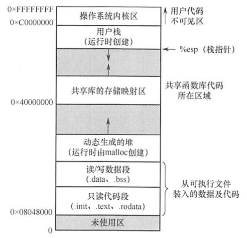
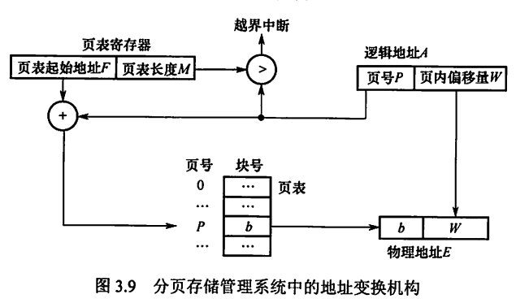
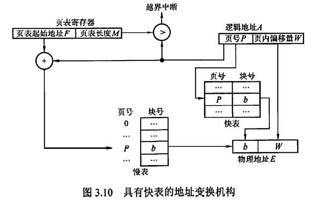
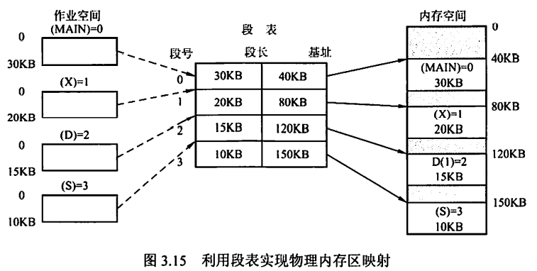
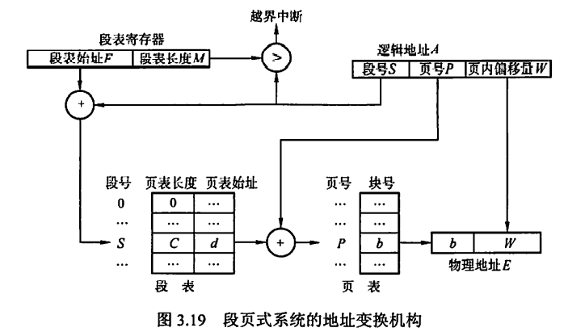
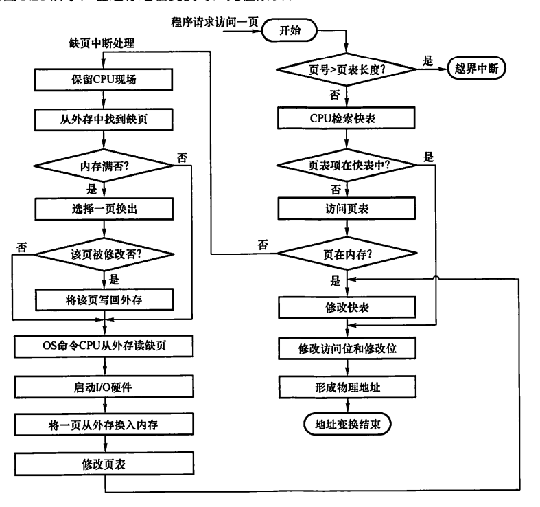
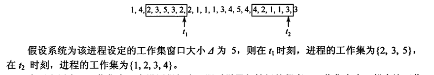

# 0x03 内存管理

## 一、内存管理基本概念

- 内存管理的主要功能
  - 内存空间的分配与回收
  - 地址转换
  - 内存空间的扩充
  - 内存共享
  - 存储保护

- 程序的链接与装入过程

  - 编译：由**编译程序**将用户源代码编译成若干**目标模块**
  - 链接：由**链接程序**将目标模块及它们所需的库函数链接在一起，形成一个完整的**装入模块**
    - 静态链接：1. 修改相对地址。因为编译后的目标模块都是从0开始的相对地址，形成一个装入模块后需要修改；2. 变换外部调用符号，每个模块中所用的外部调用符号要变换成相对地址
    - 装入时动态链接：便于修改和更新，便于实现对目标模块的共享
    - 运行时动态链接：在程序执行中需要某目标模块时才链接；执行过程中未用到的目标模块，不会被调入内存和链接到装入模块上。优点是加快程序装入过程，节省内存空间
  - 装入：由**装入程序**将装入模块装入内存中运行
    - 绝对装入：只适用于单道程序环境。逻辑地址与实际内存地址完全相同。通常情况下程序中采用的是符号地址，编译或汇编时再转换为绝对地址
    - 可重定位装入/静态重定位：在装入模块装入内存时一次性完成的地址变换。
    - 动态运行时装入/动态重定位：装入模块装入内存后不立即进行地址变换，而是等到执行时才进行；需要**重定位寄存器**的支持。程序可以分散存储，即在物理上地址不连续；可以只装入部分代码来运行，执行中再根据需要动态申请分配内存；便于程序段共享

- 进程的内存映像

  - 代码段：只读的，可以被多个进程共享
  - 数据段：包括全局变量和静态变量
  - PCB：存放在系统区
  - 堆：存放动态分配的变量，通过调用malloc函数动态**向高地址分配空间**
  - 栈：实现函数调用，**从用户的最大地址向低地址方向增长**

  

- 内存保护
  - CPU中的上、下限寄存器，存放用户作业在主存中的下限地址和上限地址，将当前要访问的地址与它们进行比对，判断是否越界
  - 重定位寄存器（基地址寄存器）和界地址寄存器（限长寄存器）：界地址寄存器含逻辑地址的最大值。将当前逻辑地址与界地址寄存器比较，若未越界，则加上基地址寄存器后形成物理地址，送交主存。
    - 只有操作系统内核才能加载这两个存储器，必须适用特权指令，不允许用户程序修改
- 内存共享
  - 可重入代码：允许多个进程同时访问但不允许被任何进程修改的代码。
- 内存分配与回收

## 二、内存分配管理

### 2.1 连续分配管理方式

连续分配方式是指为一个用户程序分配一个连续的内存空间。

外部碎片：位于分区以外的碎片，仅动态分区分配方式和分段式管理会产生

内部碎片：位于分区内部的碎片，除动态分区分配方式和分段式管理都会产生

#### 单一连续分配

将内存分为系统区和用户区。系统区供操作系统使用，通常在低地址部分

用户区中**只有一道用户程序**。

优点：简单、无外部碎片，无须进行内存保护

缺点：只能用于单用户、单任务的操作系统中，有**内部碎片**，存储器利用率极低

#### 固定分区分配

将用户区花费为若干固定大小的区域，每个分区只装入一道作业。

- 等大划分：程序太小会造成浪费，程序太大无法装入，缺乏灵活性
- 不等划分：分为多个较小分区、适量中等分区和少量大分区

管理方式：将分区按大小排列，并建立一张分区说明表，如下表所示

| 分区号 | 大小/KB | 起始地址/KB | 状态   |
| ------ | ------- | ----------- | ------ |
| 1      | 12      | 20          | 已分配 |
| 2      | 32      | 32          | 已分配 |
| 3      | 64      | 64          | 已分配 |

优点：多道程序设计的最简单的存储分配、无外部碎片

缺点：程序可能太大而放不进任何一个分区；当程序小于固定分区大小时，也要占用一个完整分区，导致**内部碎片**，且多进程无法共享一个主存区，存储利用率低

#### 动态分区分配

只要有足够大的连续空闲区域，就分配给用户进程。

缺点：会产生越来越多的外部碎片。可以用紧凑技术解决，即操作系统不时地堆进程进行移动和整理，但需要动态重定位寄存器的支持，且相对费时

> 如何决定将哪个空闲分区分配给进程呢？

分配策略：

- 首次适应算法：从最低地址开始，扫描到的第一个大小够用的空闲分区分配给进程。是最好最快的，但会导致低地址部分出现很多小的空闲分区
- 邻近适应算法：从上次扫描结束的地址开始，扫描到的第一个大小够用的空闲分区分配给进程。比首次适应还差。
- 最佳适应算法：将空闲分区按容量递增次序组织成链，找到第一个满足要求且最小的空闲分区分配给进程。性能很差，会产生最多的外部碎片
- 最坏适应算法：将空闲分区按容量递减次序组织成链，找到第一个满足要求且最大的空闲分区分割一部分分配给进程。性能也很差，会导致没有大内存块可用

回收策略：

- 若回收分区恰好与一个空闲分区相邻，则合并为一个分区结点。
- 若回收分区没有相邻的空闲分区，则新建一个结点，记录起始地址和大小，插入空闲分区链

### 2.2 非连续分配方式

#### 基本分页存储管理

- 与等大固定分区管理方式的异同：
  - 相同：不会产生外部碎片
  - 不同：块大小远小于分区大小，产生的内部碎片也很小；每个进程平均产生半个块大小的内部碎片

- 基本地址变换机构

  - 分页是对程序分页，所以每个进程自带页表。进程未执行时页表信息（起始地址、长度）存放在自己的PCB中，被调度执行时才装入页表寄存器

  逻辑地址A变换过程（硬件自动完成）：

  - 页面大小为L，则A/L可知A位于第几页（即页号）（A是个相对地址，当作从0开始）

  - 页号从0开始，所以如果得到的页号≥页表长度，产生越界中断
  - 计算页号对应的页表项的起始地址，即 **页表起始地址+页号×页表项长度** ，其中页表项长度是存储一个物理块号所需的空间大小（因为页号是不用存储的）
  - 根据页表项起始地址，读出页号对应的物理块号b
  - 物理块号b×页面大小L+页内偏移量W，得到物理地址E。变换完成。

  

- 具有快表的地址变换机构

  - 访问页表需要一次访存；而访问快表不是访存，它是独立于主存之外的存储器。
  - 快表命中率可达90%以上

  

- 两级页表

  - 如果进程所需的逻辑地址空间稍大，则它的分页可能会有成千上万，导致其页表中含有成千上万个页表项，而一个页表项可能有4B左右。导致一个进程的页表过大，甚至也需要进行分页管理。
  - 实际运行中不需要将一整个页表都放入主存，只需要其中的某几页。因此构造页表的页表——二级页表，并规定**顶级页表所占空间大小不超过一个页面**。

#### 基本分段存储管理

**不会产生内部碎片，只会产生外部碎片**

- 分段

  - 将用户进程分为主程序段、子程序段、栈段和数据段。
  - 段内地址要求连续，段间地址可以不连续
  - 段号S+段内偏移量W
  - 和页式存储管理不同，段号和段内偏移量必须由用户显式提供，一般由编译程序完成

- 段表

  段号（不存储）+段长+本段在主存中的起始地址

  

- 地址变换机构

  逻辑地址A变换过程

  - 由A中显式得到（而不是除法）段号S和段内偏移量W
  - 比较段号S和段表长度M，若S≥M，则**越界中断**
  - 计算段号对应的段表项的起始地址，即 **段表起始地址+段号S×段表项长度M** 
  - 根据段表项起始地址，读出其中存储的段长C+对应的物理地址的起始地址b。**若段内偏移量W≥C，则越界中断**
  - 起始地址b+段内偏移量W，得到物理地址E

- 段的共享与保护
  - 共享：两个作业各自的段表中有一个段表项指向共享的段的物理地址
  - 保护：段的地址越界保护分为两部分：判断段号越界和判断段内偏移量越界。这与页式管理不同，页号可能越界，而页内偏移量不可能越界
  - 分段管理的地址空间是二维的

#### 段页式管理

作业地址空间先分段后分页。

**逻辑地址结构：段号+页号+页内偏移量**

**段表只有一个，而页表可能有多个**。**一个段对应一个页表**

段页式管理的地址空间是二维的。

在不使用快表的情况下，进行一次访问实际需要三次访问主存。

地址变换过程：

1. 根据逻辑地址显式找到段号，与段表长度比对，判断段号是否越界
2. 根据段号找到对应段表项，读出页表长度和页表存放块号
3. 根据逻辑地址显式找到页号，与页表长度比对，判断页号是否越界
4. 根据页号找到对应页表项，读出页号对应的主存块号
5. 主存块号进行一些变换（比如说计算它对应的真正物理起始地址），与逻辑地址中的页内偏移量拼接，得到物理地址

## 三、虚拟内存管理

### 3.1 基本概念

#### 虚拟存储器的三个主要特征

1. 多次性。无须在作业运行时一次性地全部装入内存，而是允许被分成多次调入内存运行
2. 对换性。无需在作业运行时一直常驻内存，可以将暂不使用的程序和数据从内存调到外存的对换区
3. 虚拟性。指逻辑上扩充内存容量，使用户看到的内存容量远大于实际的内存容量。是虚拟存储器的最重要特征，也是实现虚拟存储器的最重要目标

#### 虚拟内存的实现方式

- 请求分页存储管理
- 请求分段存储管理
- 请求段页式存储管理

硬件支持：

- 一定容量的内存和外存
- 页表机制/段表机制，作为主要数据结构
- 中断机制，当用户程序要访问的部分尚未调入内存时，产生中断
- 地址变换机构，实现逻辑地址到物理地址的变换

#### 虚拟内存的大小

虚拟内存的实际容量≤内存容量+外存容量

虚拟内存的最大容量≤计算机地址位数所能容纳的最大容量

虚拟内存的大小取上述两个条件的交集，两个条件都要满足。

### 3.2 请求分页

在基本分页管理的基础上，增加了**请求调页功能**和**页面置换功能**。是目前最常用的实现虚拟存储器的方法。

#### 页框分配

- 进程准备执行时，分配给它几个内存的页框？
  - 驻留集：分配给一个进程的物理页框的集合
  - 分配页框越少，驻留在主存中的进程越多，可提高CPU利用率；但分配页框过少，缺页率仍相对较高；分配页框过多，也不会太改善进程的缺页率；
- 页框/内存分配策略
  - 固定分配，局部置换
    - 给进程分配的页框数从一开始就确定，运行期间不改变；发生缺页时只在这固定几个页框内置换。
    - 难以确定应该分配多少，太少会频繁缺页中断，太多会降低CPU和其他资源利用率
    - 分配算法：
      - 平均分配：将系统中所有可供分配的物理块均分给各个进程
      - 按比例分配：根据进程大小按比例分配物理块
      - 优先权分配：为重要和紧迫的进程分配较多的物理块。
    - 通常采取的分配算法是：将空闲物理块分为两部分，一部分按比例分配，一部分按优先权分配
  - 可变分配，全局置换
    - 先分配一定数量的页框，若缺页则找新的空闲页框分配给该进程后再调页。
    - 可能会导致某个进程占有的页框数持续增加，导致系统多道程序并发能力下降
  - 可变分配，局部置换
    - 先分配一定数量的页框，缺页时在这固定几个页框内置换；若缺页频繁，则再给它增加空闲页框数，直到缺页率降低到适当程度；若缺页率极低，则适当减少进程的页框数，但不能引起缺页率的明显升高。
    - 需要更大开销，但值得。

#### 缺页判断与处理

- 如何判断要访问的页面是否在内存中？

  **请求页表项：页号-物理块号-状态位-访问字段-修改位-外存地址**

  状态位：指示该页是否已调入内存

  访问字段：页面置换算法需要的计数器

  修改位：标记该页调入内存后是否修改过

  外存地址：该页在外存上的地址，通常是物理块号

- 若要访问的页面不在内存中，如何处理？

  - 产生缺页中断，请求操作系统将所缺的页调入内存。

  - 阻塞缺页的进程。
  - 调页时，若内存中有空闲块，则分配给它；若无空闲块，则按置换算法淘汰某页，若该淘汰页有被修改过，则需要写回外存。

- 如何确定从何处调入页面？

  - 外存中有专门的**对换区**存放对换页面。对换区采用连续分配方式，I/O速度比文件区更快
  - **对换区空间足够**：全部从对换区调入所需页面（对换区的页面在进程运行前从文件区复制过来）
  - **对换区空间不足**：则**不会被修改的文件直接从文件区调入**，这些页面不会有换出操作；而可能会被修改的文件则在对换区周转。
  - **UNIX方式**：从未用过的页面全部从文件区调入，用完后再放到对换区。

- 如何调入页面？

  - 进程发出缺页中断→CPU转入缺页中断处理程序
  - 查页表得到该页外存块号→到外存中找到页面
  - 内存未满→直接启动I/O调页→修改页表
  - 内存已满→按置换算法换页→若淘汰页有修改，写回外存，否则直接淘汰→将新页换入内存→修改页表
  - 进程按照更新后的页表进行地址变换

- 缺页中断与一般中断的区别：

  - 在指令执行期间产生和处理中断信号，属于内部异常
  - 一条指令在执行期间，可能产生多次缺页中断

#### 页面置换算法

好的页面置换算法应有较低的页面更换频率。

- 最佳置换
  - 淘汰以后永不使用的页面，或再最长时间内不再被访问的页面。能获得最低缺页率，但**无法实现**，只用于算法评价的参考
  - 注意是“**最长时间内不再被访问**”，而不是“以后被访问的次数最小”
- 先进先出
  - 淘汰最早进入内存的页面。将内存中的页面用队列组织即可实现。
  - Belady异常：进程得到的页框数增多，而缺页次数不减反增。只有先进先出算法会出现该异常。
- **最近最久未使用（LRU）**
  - 淘汰最近最长时间未访问过的页面。
  - 每个页面设置一个访问字段（计数器），用于记录页面自上次访问以来所经历的时间。注意与Cache置换中的LRU算法相区别，不过手算的时候都是一样的。
  - **属于堆栈类算法**。堆栈类算法不可能出现Belady异常。
  - **性能最接近OPT算法**，但需要对所有的页进行排序，因此需要硬件的特殊支持，实现开销大
- **CLOCK置换**
  - 以尽量小的开销取得最接近LRU的性能
  - **简单CLOCK置换算法/最近未用（NRU）算法**
    - 每个页面设置一个<u>访问位</u>，当首次被装入或被访问时置1
    - 将页面组织成一个<u>循环队列</u>，设置一个<u>替换指针</u>，初始时指向第一个页面。
    - 淘汰页面时，从替换指针指向的页面开始扫描整个队列，碰到访问位为1的页面就置0，直到遇到访问位为0的页面，结束扫描并淘汰该页，然后替换指针指向下一个页面。
  - **改进型CLOCK置换算法**
    - 对于修改过的页面，替换时还要写回磁盘，开销大；所以同等条件下尽量优先选择未被修改过的页面进行淘汰
    - 每个页面设置一个<u>访问位</u>和一个<u>修改位</u>，当首次被装入或被访问时访问位置1，被修改时修改位置1.
    - 将页面组织成一个<u>循环队列</u>，设置一个<u>替换指针</u>，初始时指向第一个页面
    - 淘汰页面时，从替换指针指向的页面开始进行<u>第一轮扫描</u>。第一轮扫描不改变访问位，只是寻找<u>访问位为0且修改位为0的页面</u>进行淘汰。
    - 若第一轮扫描结束后仍无法淘汰，则开始<u>第二轮扫描</u>。第二轮扫描碰到访问位为1的页面就置0，直到遇到<u>访问位为0且修改位为1的页面</u>，淘汰该页
    - 若第二轮扫描结束后仍无法淘汰，则将替换指针返回到开始的位置，并将所有页的访问位设为0；重复上述两轮扫描直到找到淘汰页。

#### 地址变换过程

#### 效率分析

- 抖动

  - 定义：刚刚换出的页面又要马上换入内存、刚刚换入的页面又要马上换出内存，页面调度频繁，称为抖动/颠簸。
  - 根本原因：同时运行的进程太多，每个进程的页框数太少，不能满足进程正常运行的基本要求
  - 后果：大量进程等待页面调入/调出、磁盘访问时间急剧增加，CPU利用率急剧下降并趋于零

- 工作集

  - 定义：在某段时间间隔内，一个进程要访问的页面的集合
  - 
  - 为了防止抖动，只需让进程的驻留集大小大于工作集大小即可

- 内存映射文件

  - 将磁盘文件的全部或部分内容与进程虚拟地址空间的某个区域建立映射关系，从而直接访问，不必I/O
  - 当进程退出或显式解除文件映射时，再将被改动的页面写回磁盘文件
  - 多个进程允许并发地映射同一文件，以便实现数据共享。实际上这是共享内存的实现方式。

- 虚拟存储器性能影响因素

  1. 页面大小：页面较大时缺页率较低，同时减少页表长度，但使页内碎片增大；页面较小时缺页率较高，页表过长，但能减少内存碎片，提高内存利用率。

  2. 页框分配：分配给一个进程的页框数越多，缺页率越低。但页框数超出一定数量时，对缺页率改善不明显。

  3. 页面置换算法：选择LRU、CLOCK等置换算法，可以使进程运行具有较低的缺页率
  4. 写回磁盘的频率：如果每换出一个被修改过的页面就启动一次磁盘I/O，效率很低。因此<u>将换出的被修改过的页面组织成一个链表，攒满一定数量再一起写回磁盘</u>，从而显著减少I/O次数。如果链表上的页面要被再次访问，则不必再从磁盘中调入，而是从链表上获取，减少磁盘读入。
  5. 编程角度：<u>编写局部化程度较高的程序</u>。如存储是行优先，则访问时就要尽量采用先行后列的方式，避免先列后行造成缺页率过高。