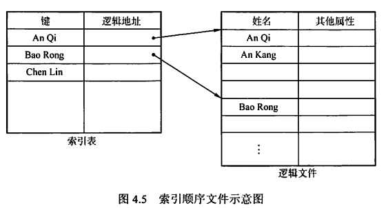
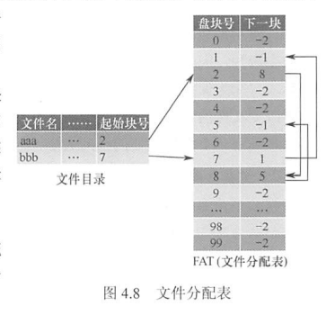
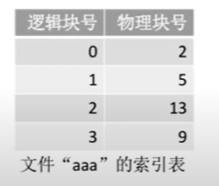
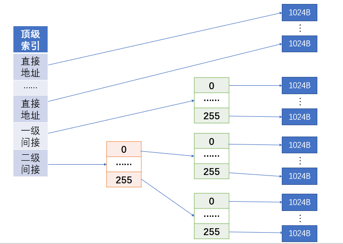
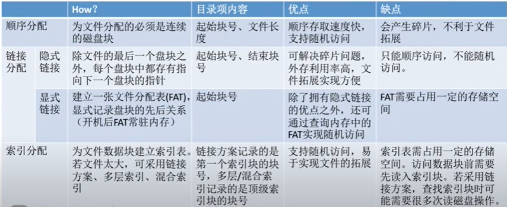
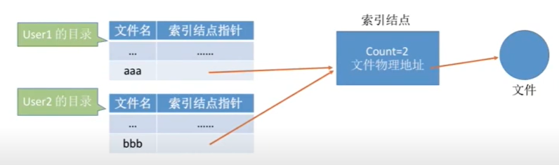

# 0x04 文件管理

## 一、文件的基本概念

### 1.1 文件的定义与组成

- 文件的定义

  文件是以硬盘为载体的存储在计算机上的信息集合，可以是文本文档、图片、程序等。
  用户进行的输入、输出中，以文件为基本单位。

- 文件的结构
  - 数据项：文件系统中最低级的数据组织方式
    - 基本数据项：数据中的最小逻辑单位，用于描述一个对象的某种属性的一个值，如某个学生的年龄
    - 组合数据项：由多个基本数据项组成
  - 记录：一组相关的数据项的集合，用于描述一个对象在某方面的属性
  - 文件：创建者所定义的、具有文件名的一组相关元素的集合
    - 有结构文件：文件由若干个相似的记录组成，如一个班的学生记录
    - 无结构文件：被视为一个字符流，如一个二进制文件
- 文件的属性/文件元数据
  - 名称：文件名唯一
  - 类型
  - 创建者
  - 所有者
  - 位置
  - 大小
  - 保护：对文件进行保护的访问控制信息
  - 创建时间、最后一次修改时间、最后一次存取时间

### 1.2 文件控制块与索引结点

#### 文件控制块（FCB）

- 用来存放控制文件所需要的各种信息的数据结构，实现“按名存取”
- FCB的内容
  - 基本信息：如文件名、文件物理位置、文件逻辑结构、文件物理结构等
  - 存取控制信息
  - 实用信息：如文件建立时间、上次修改时间等
- 一个文件目录也视为一个文件，称为目录文件

#### 索引结点

文件名和文件描述信息分离，文件描述信息单独形成一个数据结构——索引结点/ i 结点。
一个目录项仅有一个文件名和一个指向索引结点的指针构成
这种做法使同样大小的盘块可以存放更多目录项，减少查找时启动磁盘的次数

- 磁盘索引结点
  - 存放在磁盘上的索引结点，每个文件唯一
  - 文件主标识符：拥有该文件的个人或组的标识符
  - 文件类型
  - 文件存取权限
  - 文件物理地址
  - 文件长度
  - 文件链接计数
  - 文件存取时间
- 内存索引结点
  - 索引结点编号：用于标识内存索引结点
  - 状态：指示结点是否被上锁或修改
  - 访问计数：每当有一进程要访问此结点时，计数+1；访问结束-1
  - 逻辑设备号：文件所属文件系统的逻辑设备号
  - 链接指针：设置分别指向空闲链表和散列队列的指针

## 二、文件操作

### 2.1 基本操作

- 创建文件：1. 为新文件分配必要的外存空间；2. 在目录中为之创建一个目录项
- 写文件：执行系统调用。系统要为文件维护一个写位置的指针。发生写操作时更新写指针。
- 读文件：执行系统调用。系统要为文件维护一个读位置的指针。读写可以用同一个指针，因为一个进程通常只对一个文件读或写。
- 重新定位文件：将文件位置指针重新定位到给定值。不涉及读写文件。
- 删除文件：检索目录，释放该文件所占内存空间，以便被其他文件重复使用，并删除目录条目
- 截断文件：允许文件所有属性不变，并删除文件内容，将其长度置为0并释放空间。

### 2.2 打开与关闭

- 打开：系统调用open根据文件名搜索目录，将指明文件的属性（包括该文件在外存上的物理位置），从外存复制到内存打开文件表的一个表目中，并将该表目的编号返回给用户。
- 关闭：系统调用close从打开文件表中删除这一条目
- 两级表：每个进程的打开文件表、整个系统的打开文件表
- 文件名不必存储在打开文件表中，因为它只是用于查找FCB在磁盘上的位置的。

## 三、文件保护

- 访问类型：读、写、执行、添加、删除、列表清单（列出文件名和文件属性）
- 访问控制
  - 基于身份访问：
    - 使用访问控制列表：每个目录和文件都有一个控制列表，规定每个用户名及其允许的访问类型
    - 使用精简的访问列表：拥有者、组、其他三种用户类型
  - 基于口令访问：用户在建立文件时提供口令，系统在PCB中附上相应口令。时间和空间的开销都不多，但口令直接存在系统内部，不够安全
  - 基于密码访问：用户对文件进行加密，文件被访问时需要使用密钥。保密性强、节省存储空间，但编码和译码需要花费一定时间
- 现代操作系统常用的文件保护方法：将访问控制列表与用户、组和其他成员访问控制方案组合使用
- 对于多级目录结构，需要提供目录保护机制。

## 四、文件的逻辑结构

### 4.1 无结构文件（流式文件）

- 有序相关信息项的集合，以字节为单位
- 没有结构，对记录的访问只能用穷举搜索的方式
- 适用于对基本信息单位操作不多的文件，如源程序文件、目标代码文件

### 4.2 有结构文件（记录式文件）

#### 顺序文件

- 串结构：记录之间的顺序与关键字无关，通常按存入时间的先后进行排列。检索时必须从头开始顺序依次查找
- 顺序结构：对文件中的所有记录按关键字排列，可采用折半查找法
- 要读、写一大批记录时，顺序文件效率最高
- 要经常需要查找、修改、增加或删除单个记录，顺序文件性能较差

#### 索引文件

- 为变长记录文件建立一张索引表，每个记录建立一个表项，每个表项包含：变长记录的指针（即逻辑起始地址）、记录长度。
- 索引表按关键字排序，本身也是一个定长记录的顺序文件
- 在查找文件时，可以直接随机检索定长记录索引文件

#### 索引顺序文件

- 顺序文件按关键字分组有序排列；每个组的第一条记录的关键字值与起始位置作为索引表的一个表项。

  

- 查找一条记录时，先在索引表中找到其所属组的起始地址；再在该组中顺序查找。

#### 直接文件/散列文件

- 给定记录的键值或通过散列函数转换的键值直接决定记录的物理地址。
- 有很高的存取速度，但会发生冲突

## 五、文件的物理结构

### 5.1 连续分配

- 目录项结构：文件名+起始块号+文件长度

- 每个文件在磁盘上**占有一组连续的块**
- 支持**顺序访问**和**直接访问**
- 优点：实现简单、存取速度快
- 缺点：文件长度不宜动态增加，一旦增加可能需要移动大量盘块；为保证文件有序性，删除或插入记录时，还需要对相邻的记录作物理上的移动；反复增删文件后会产生外部碎片；很难确定一个文件需要的空间大小，只适用于长度固定的文件

### 5.2 链接分配

#### 隐式链接

- 目录项结构：文件名+起始块号+结束块号

- 除了最后一个盘块外，每个盘块都含有指向文件下一个盘块的指针

- 从而，每个文件都对应一个磁盘块的链表
- 缺点：只适合顺序访问；稳定性差，如果丢失了链表中的指针，会导致文件数据的丢失
- 改进：将几个盘块组成簇，按簇分配。会增加内部碎片

#### 显式链接

- 目录项结构：文件名+起始块号
- 将隐式链接中存储在盘块内的指针提取出来，显式地存放在内存中的一张链接表中——文件分配表FAT。
- 文件分配表的每个表项包含盘块号及该盘块的下一块盘块号。可以通过特定数字区分空闲盘块号和文件的最后一块。
- FAT在系统启动时就读入内存，所有查找操作都在内存中进行，显著地提高了检索速度

### 5.3 索引分配

- 允许文件离散地分散在各磁盘块中，用一张索引表建立文件的逻辑块号与物理块号的对应关系，类似于页表

- 索引表存放的磁盘块称为索引块

  

- 用户给出要访问的逻辑块号i→OS根据逻辑块号找到文件对应的FCB→从FCB中获得索引表位置→读入索引表→根据逻辑块号从索引表中找到对应的物理块号

- 优点：支持随机访问

> 如果索引表太大，一个索引块存不下，怎么办？

#### 链接索引

索引块组织成链表，但这样访问最后一个索引块需要遍历所有索引块，很低效

#### 多层索引

- 类似于多级页表，建立多层索引。但要求每个索引表的大小都不能超过一个磁盘块。所以对于一个确定层数的多层索引，可以算出它允许的文件最大长度。
- 使用k层索引，且顶层索引表未调入内存，则找到一个数据块需要k+1次读磁盘操作（前k次都是读索引表，最后一次读数据块）

#### 混合索引

- 多层索引中每一层索引表的内容，可以包含单层索引表（单层索引表中的索引项都是逻辑块号-物理块号的键值对）的地址（即一级间接），也可以包含二层索引表的地址（即二级间接），还包含一些直接索引，直接存放逻辑块号—物理块号的键值对。
- 有利于小文件的查找，小文件访问一个数据块所需的读磁盘次数更少

#### 三种分配方式的比较

## 六、目录

### 6.1 目录的基本概念

- 文件目录：FCB的有序集合，一个FCB就是一个文件目录项
- 目录管理的基本要求：
  - 实现“按名存取”：在目录中要建立文件名-文件所在物理块号的映射关系
  - 提高检索速度
  - 访问控制：允许多个用户共享一个文件
  - 树形结构：允许不同用户对不同文件采用相同的名字，要求目录管理用树形结构来解决和实现

### 6.2 目录结构

#### 单级目录结构

- 整个文件系统中只建立一张目录表，每个文件占一个目录项
- 实现了“按名存取”，但查找速度慢、文件不允许重名、不便于文件共享等缺点，不适用于多用户操作系统

#### 两级目录结构

- 分为<u>主文件目录</u>和<u>用户文件目录</u>两级
  - 主文件目录项记录用户名及相应用户文件目录所在的存储位置
  - 用户文件目录项记录该用户文件的FCB信息
- 提高了检索速度、解决了多用户之间的文件重名问题、可以在目录上实现访问限制。但缺乏灵活性，不能对文件分类

#### 树形目录结构

- 绝对路径：从根目录出发的路径
- 相对路径：从当前目录出发的路径。**进程对个文件的访问都是相对于当前目录进行的**
- 方便对文件进行分类、层次结构清晰、能够更有效地进行文件的管理和保护、容易对文件赋予不同的存取权限；但需要按路径名逐级访问中间结点，增加了磁盘访问次数，影响查询速度
- 大多数操作系统都采用树形文件目录

#### 无环图目录结构

- 在树形目录结构的基础上增加一些指向同一结点的有向边
- 当用户要求删除一个共享结点时，将共享计数器-1；若减为0则真正删除该结点。
- 方便地实现了文件共享，但也使得系统的管理变得更加复杂

### 6.3 目录操作

- create创建目录：
  - 除了要为之分配磁盘空间外，还要在它的父目录表中新建对应表项
  - 每一个新建空目录都会有两个默认FCB，分别是`.`和`..`，分别指向当前目录和父目录
- delete删除目录
  - 方式一：要求只有空目录才能被直接删除。若要删除一个非空目录，则必须先删除目录中的所有文件，再递归地删除子目录
  - 方式二：非空目录可以被直接删除。当删除一个非空目录时，其文件和子目录同时被删除
- opendir打开目录：和打开普通文件一样，只将对应FCB读入内存，而不是把目录文件的数据全部读入内存。
- readdir读目录：必须先opendir才能readdir，且不一定每次readdir都要访问磁盘，因为可能整个磁盘块都已经调入内存，可以直接访问。
- 移动目录
- 显示目录：用户可以请求显示目录的内容，如目录中的所有文件及树形
- 修改目录：某些文件属性保存在目录中，这些属性发生变化时需要修改相应的目录项。

### 6.4 文件共享

- 基于索引结点的共享方式（硬链接）

  - （回忆）为减小文件目录的长度，将文件名及文件信息相分离，文件信息作为一个单独的数据结构（索引结点）进行存储，目录表项中仅保留文件名及指向相应索引结点的指针。
  - 当不同用户需要共享同一个文件时，只需在各自的目录中增加该文件的表项（文件名可以不同），并将指针指向同一个索引结点。
  - 索引结点中也要维护一个计数器，用于记录当前链接到该索引结点的目录表项数。如计数器为2时，说明有2个用户在共享此文件。一个用户删除该文件时，计数器-1；当计数器为0时操作系统真正删除该结点，从而删除文件。

  

- 基于符号链的共享方式（软链接）

  - 用户可以创建一个特殊的Link型的文件A，这个文件记录另一个文件B的存放路径。文件A的文件名可以随意命名
  - 当用户访问这个Link型文件A时，系统会根据其中记录的存放路径找到并打开文件B
  - 当文件B被删除时，文件A依然存在，但访问时会查找失败。
  - 当文件A被删除时，文件B不受任何影响。
  - 访问软链接需要多次磁盘I/O，会更慢。

## 七、文件系统

### 7.1 文件系统的全局结构

### 7.2 文件系统在外存中的结构

1. 物理格式化/低级格式化

   将磁盘划分扇区，检测坏扇区并用备用扇区替换坏扇区。

   坏扇区对操作系统是透明的。

2. 逻辑格式化/高级格式化

   将磁盘分区（分卷），并完成各分区的文件系统初始化。

   分区信息记录在**分区表**中，它的存储位置独立于各分区之外，属于主引导记录（MDR）部分。

   每个分区都可以建立单独的文件系统。

   在UNIX文件系统（UFS）中，初始化信息包含：

   - 引导块：负责开机时初始化操作系统
   - 超级块
   - 空闲空间管理：如位示图
   - i结点区（索引结点区）
   - 根目录

   在FAT文件系统中，初始化信息包含：

   - 引导块
   - 空闲空间管理：FAT表
   - 根目录
   
   每个分区都有自己的引导块，若这个分区没有安装操作系统，则引导块内容为空

### 7.3 文件系统在内存中的结构

#### 目录缓存

近期访问过的目录文件会缓存在内存中，不用每次都从磁盘读入，加快目录检索速度

#### 系统打开文件表

整个系统只有一张。

执行系统调用open时，系统根据路径一级一级读入目录，找到目标文件FCB，复制到系统打开文件表。

表项包含：索引、目录项、打开计数

#### 进程打开文件表

每个进程都有一张。

执行系统调用open时，在FCB复制到系统打开文件表后，也在进程打开文件表中新建一个条目，并**返回文件描述符**。

表项包含：索引、打开方式、系统打开文件表索引等。

### 7.4 外存空闲空间管理

文件存储设备分成大小相同的物理块，以块为单位交换信息。

需要管理空闲块，包括空闲块的组织、分配、回收

#### 空闲表法

- 空闲盘块表表项：第一个空闲盘块号+空闲盘块数
- 将连续的空闲块视为一个盘区，每个盘区都在空闲盘块表中拥有一个表项
- 适用物理结构：连续分配方式
- 磁盘块的分配：与内存管理中的动态分区分配类似，为一个文件分配连续的存储空间，算法有首次适应、最佳适应、最坏适应等
- 磁盘块的回收：也与内存管理中的动态分区分配类似，如果回收的磁盘块与已有的空闲磁盘块相邻，则在空闲盘块表中合并表项。

#### 空闲链表法

分为空闲<u>盘块</u>链组织法和空闲<u>盘区</u>链组织法，区别在于链表的元素是一个单独的空闲盘块还是由若干个连续空闲盘块构成的一个空闲盘区。

连续分配、离散分配都适用

- 空闲盘块链
  - 每个盘块保存指向下一个盘块的指针
  - 磁盘块的分配：文件申请K个磁盘块，则从空闲盘块链中从链头开始依次摘下K个盘块进行分配，修改链头指针。
  - 磁盘块的回收：回收的磁盘块挂到链尾，并修改空闲链的链尾指针
- 空闲盘区链
  - 在盘区的第一个盘块保存<u>指向下一个盘区的指针</u>以及<u>盘区的长度</u>，而链头、链尾指针由操作系统保存。
  - 磁盘块的分配：文件申请K个磁盘块，则从空闲盘区链中从链头开始应用首次适应等算法找到符合条件的盘区，分配给文件。如果没有合适的盘区，也可以将不同盘区的盘块同时分配给一个文件
  - 磁盘块的回收：若回收的磁盘块与某个已有的空闲盘区相邻，则合并链表结点，否则单独挂到链尾

#### 位示图法

- 一个n行m列的矩阵，m=字长，n=字数。理解为包含若干个字的二进制串就行，每个二进制位都表示某个盘块空闲与否（0空闲、1已分配）。

- 显然盘块号b与位示图中的第i个字第j位是能一一对应的。默认顺序编号，如盘块号0对应第0个字的第0位，盘块号1对应第0个字的第1位。

- 注意盘块号、字号、位号是从0开始还是从1开始

- 磁盘块的分配：文件申请K个磁盘块，分配步骤如下

  1. 顺序扫描位示图，找到K个相邻或不相邻的0
  2. 根据字号、位号算出对应盘块号，将相应盘块分配给文件
  3. 将相应位设置为1

- 磁盘块的回收：

  1. 根据回收的盘块号计算出对应的字号、位号

  2. 将相应为设置为0

- 连续分配、离散分配都适用

#### 成组链接法

在<u>文件卷的目录区</u>中专门设置一个磁盘块作为“超级块”。系统启动时将超级块读入内存，并保证内存与外存的超级块数据一致。

在成组链接法中，超级块作为起始的第一个成组链接块，存储第一组的盘块数量及第一组的所有盘块号。第一组的第一个空闲盘块作为成组链接块，存储下一组的盘块数量及下一组的所有盘块号，以此类推。

如超级块中存放数据：第一组的空闲盘块数3，空闲块号有300、273、986。在盘块号为300的盘块中，继续存放数据：第二组的空闲盘块数100，空闲块号有200、201、202……以此类推

成组链接块本身也是空闲盘块，若它也被分配出去了则说明该组已经没有空闲盘块了，而成组链接块中的数据需要另外保存，见下。

- 磁盘块的分配：
  1. 首先从内存中找到超级块，查看第一组的空闲盘块数是否≥K块
  2. 若满足条件，则将第一组的末尾K个空闲盘块都分配出去，同时将超级块中记录的第一组盘块数量-K
  3. 若第一组的盘块要全部分配出去（包括成组链接块）才能满足要求，则将成组链接块的数据复制到超级块中保存。从而第二组自动成为新的第一组
- 磁盘块的回收：
  1. 假设每个分组最多为100个空闲块，则检查第一组是否已满，若未满则将新的空闲盘块号保存到第一组
  2. 若第一组已满，假设要回收1个盘块，则将超级块中的数据复制到新回收的空闲盘块中，让新回收的块成为第一组；超级块保存该空闲盘块的块号及第一组的空闲块数1.

### 7.5 虚拟文件系统

### 7.6 文件系统挂载

