# 0x05 I/O管理

## 一、I/O管理概述

### 1.1 I/O设备

#### 设备分类

- 块设备：信息交换以数据块为单位，有结构，如磁盘。传输速率高、可寻址（即可随机读/写任一块）
- 字符设备：信息交换以字符为单位，无结构，如交互式终端机、打印机等。传输速率低、不可寻址，通常采用中断I/O方式
- 低速设备：速率几字节、几百字节。键盘、鼠标
- 中速设备：速率数千字节、数万字节。激光打印机
- 高速设备：速率百千字节、千兆字节。磁盘机、光盘机

#### I/O接口

CPU与设备之间通信的媒介。

主要功能：

- 接收和识别CPU发来的命令
- 数据交换，包括设备和控制器之间的数据传输、控制器和主存之间的数据传输
- 标识和报告设备的状态，以供CPU处理
- 地址识别
- 数据缓冲
- 差错控制

分为三部分：

- 与CPU的接口：数据线、地址线和控制线。数据线与数据寄存器和控制/状态寄存器相连。
- 与设备的接口：有一个或多个，从而可以连接一个或多个设备。存在数据、控制、状态三种类型的信号
- I/O逻辑：实现对设备的控制。通过一组控制线与CPU交互，对从CPU收到的I/O命令进行译码。

#### I/O端口

I/O接口中可被CPU直接访问的一组寄存器。

- 数据寄存器：实现CPU和外设之间的数据缓冲
- 状态寄存器：获取执行结果和设备的状态信息
- 控制寄存器：由CPU写入，以便启动命令或更改设备模式

### 1.2 I/O 软件层次结构

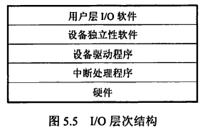

#### 用户层I/O软件

用户可直接调用在用户层提供的，与I/O操作有关的库函数，对设备进行操作

用户层软件必须通过一组系统调用来获取操作系统服务

#### 设备独立性软件

1. 执行所有设备的共有操作，如设备保护、设备分配与释放等，同时为设备管理和数据传送提供必要的存储空间。
2. 向用户层提供统一接口。

**设备独立性使得应用程序独立于具体使用的物理设备**。建立逻辑设备到物理设备的映射。

使用逻辑设备名的优点：

1. 增加设备分配的灵活性
2. 易于实现I/O重定向，即用于I/O操作的设备可以更换，而不必改变应用程序

#### 设备驱动程序

每类设备配备一个。

与硬件直接相关，具体实现系统对设备发出的操作指令，驱动I/O设备操作。

是I/O进程与设备控制器之间的通信程序，常以进程形式存在

向上层用户程序提供一组标准接口，屏蔽设备具体差异。

#### 中断处理程序

主要任务：进行进程上下文的切换、对处理中断信号源进行测试、读取设备状态和修改进程状态等

### 1.3 应用程序I/O接口

#### 字符设备接口

- 数据存取和传输以字符为单位，如键盘、打印机
- 传输速率低、不可寻址、采用中断驱动方式
- 属于独占设备，需要提供打开和关闭操作，实现互斥共享
- get/put操作：系统为字符设备建立一个字符缓冲区，get操作从缓冲区获取字符；put操作输出到缓冲区
- in-control指令：接口中提供的通用指令，用于处理不同类型的字符设备

#### 块设备接口

- 数据存取和传输以块为单位，如磁盘
- 传输速率高、可寻址、采用DMA方式
- 隐藏了磁盘的二维结构
- 将抽象命令映射为低层操作
- 内存映射接口通过内存的字节数组来访问磁盘，但不提供读/写磁盘操作。当需要访问内存映像时，才由虚拟存储器实际调页

#### 网络设备接口

- 为网络socket（套接字）接口
- 使计算机能够通过网络与其他计算机进行通信

#### 阻塞/非阻塞I/O

- 阻塞I/O：当用户进程调用I/O操作时，进程就被阻塞，需要等待I/O操作完成
- 非阻塞I/O：用户进程调用I/O操作时，不阻塞该进程。通常需要采用轮询的方式查询I/O操作是否完成
- 大多数OS提供的I/O接口都是阻塞I/O

## 二、设备独立性软件

设备独立性软件执行所有设备的共有操作，如设备保护、设备分配与释放等，同时为设备管理和数据传送提供必要的存储空间，并向用户层提供统一接口。

因此设备独立性软件负责的工作有缓冲区管理、设备分配与释放等。

### 2.1 高速缓存与缓冲区管理

#### 高速缓存

磁盘高速缓存技术用于提高磁盘的I/O速度，访问高速缓存比直接访问原始磁盘数据更高效。

具体实现是：利用内存中的存储空间来暂存从磁盘中读出的一系列盘块中的信息

高速缓存<u>在逻辑上</u>属于磁盘，<u>在物理上</u>是驻留在内存中的盘块

分为两种形式：

1. 在内存中开辟一个大小固定的单独空间作为磁盘高速缓存
2. 将未利用的内存空间视为一个缓冲池，供请求分页系统和磁盘I/O时共享

#### 缓冲区作用

1. 缓和CPU与I/O设备之间速度不匹配的矛盾
2. 减少对CPU的中断频率，放宽对CPU中断响应时间的限制
3. 解决数据粒度不匹配的问题（如进程会一块一块地输出数据，则I/O设备只能一个一个地输入数据）
4. 提高CPU与I/O设备之间的并行性

#### 单缓冲

- OS在主存中为需要I/O的进程分配一个缓冲区

- 缓冲区非空时，不能冲入数据，只能传出数据；缓冲区为空时，可以冲入数据，但必须充满之后才能传出数据

#### 双缓冲

- 若采用双缓冲的策略，主存中为需要I/O的进程分配两个缓冲区
- 与单缓冲在通信时的区别：
  - 采用单缓冲是半双工通信，同一时间只能实现数据的单向传输
  - 采用双缓冲是全双工通信，同一时间可以存在数据的双向传输

#### 解题

- 先确定一个初始状态。如双缓冲题目中可假设初始状态为工作区空、其中一个缓冲区满、另一个缓冲区空
- 计算到达相同状态所需的时间，即得处理一块数据的平均耗时
- 注意将<u>一块数据从磁盘送至缓冲区</u>与<u>CPU处理一块数据</u>是并行执行的，时间取两者中的最大值即可

#### 循环缓冲

将多个大小相等的缓冲区使用循环链表组织起来。

in指针：指向可以输入数据的第一个空缓冲区，当要从设备接收数据时，就存放到该区域

out指针：指向可以提取数据的第一个满缓冲区，当运行进程需要数据时，从此缓冲区中提取数据

#### 缓冲池

由多个系统公用的缓冲区组成。

缓冲区按用途分为四种：

1. 用于收容输入（设备→进程）数据的工作缓冲区
2. 用于提取输入数据的工作缓冲区
3. 用于收容输出（进程→设备）数据的工作缓冲区
4. 用于提取输出数据的工作缓冲区

缓冲区按状态组织成队列：

- 空缓冲队列
- 装满输入数据的缓冲队列/输入队列
- 装满输出数据的缓冲队列/输出队列

#### 高速缓存与缓冲区的异同

相同点：都介于高速设备和低速设备之间

不同点：

- **高速缓存**的数据是低速设备上数据的拷贝，所以高速缓存上有的，低速设备上必然有；

  **缓冲区**存放的是两种设备之间需要传递的数据，不一定有备份

- **高速缓存**的数据是高速设备经常要访问的数据，若高速设备要访问的数据不在高速缓存中，则直接访问低速设备；

  **缓冲区**是两种设备之间通信的必经之地，高速设备不可能直接去访问低速设备

### 2.2 设备分配与回收

#### 设备分类

- 独占设备：进程分配到独占设备后，便由其独占，直至该进程释放该设备
- 共享设备：可同时分配给多个设备，**分时共享**（不是同一时刻同时使用！）
- 虚拟设备：利用SPOOLing技术实现，可以将一个物理设备虚拟为多个虚拟设备，同时分配给多个进程。实质上实现了对设备I/O操作的批处理

#### 设备分配的数据结构

- 设备控制表（DCT）：

  - 一个DCT表征一个设备
  - 各表项就是设备的各个属性，如设备类型、标识符、状态等

  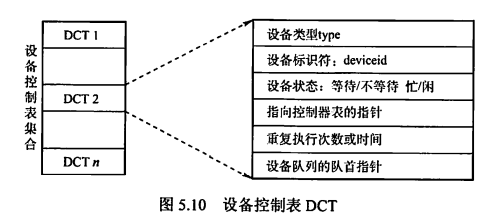

- 控制器控制表（COCT）：

  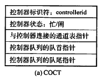

- 通道控制表（CHCT）：

  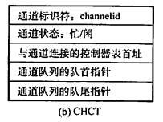

- 系统设备表（SDT）：

  - 整个系统只有一张
  - 记录已连接到系统中的所有物理设备的情况，每个物理设备占一个表项

  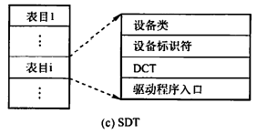

#### 设备分配策略

- 需要考虑的因素
  - I/O设备的固有属性
  - I/O设备的分配算法
  - I/O设备分配的**安全性**
  - I/O设备的**独立性**

- 设备分配方式
  - 静态分配：主要用于对独占设备的分配。在用户作业开始执行前一次性分配完毕，分配后设备为该用户作业所独占，直到该作业被撤销。不会出现死锁，但设备使用率低
  - 动态分配：在进程执行过程中根据需要进行。当进程需要设备时，通过系统调用命令向系统提出设备请求，由系统按某种策略分配设备、控制器，一旦使用完毕立即释放。可提高设备利用率，但若分配算法使用不当，可能造成死锁
- 设备分配算法：先请求先分配、优先级高者优先等

对于独占设备，既可采用动态分配方式，又可采用静态分配方式，一般采用后者。

对于共享设备，一般采用动态分配方式，但在每个I/O传输的单位时间内依然是独占的，通常采用先请求先分配和优先级高者优先的分配算法

#### 设备分配安全性

安全性是指防止进程发生死锁

- 安全分配方式：每当进程发出I/O请求后便进入阻塞态，直到I/O完成时才被唤醒。
  - 优点：设备分配安全
  - 缺点：CPU与I/O设备串行工作
- 不安全分配方式：进程在发出I/O请求后仍继续运行，需要时又发出第二个、第三个I/O请求。仅当进程那个所请求的设备已被另一进程占用时，才进入阻塞态。
  - 优点：一个进程可同时操作多个设备，使进程推进迅速
  - 缺点：有可能造成死锁

#### 逻辑设备名到物理设备名的映射

- 逻辑设备表（LUT）
  - 用于将逻辑设备名映射为物理设备名
  - 表项包括：逻辑设备名、物理设备名、设备驱动程序入口地址
  - 当进程用逻辑设备名请求分配设备时，系统分配一台相应的物理设备，并在LUT中建立一个表目。
- 配置方案
  - 整个系统中只设置一张LUT。此时不允许有重复的逻辑设备名，适用于单用户系统
  - 每个用户设置一张LUT。每当用户登录时，系统便为该用户建立一个进程，同时也为之建立一张LUT，并将该表放入进程的PCB中

### 2.3 SPOOLing技术

#### 概念

**是什么**：为了缓解CPU的高速性与I/O设备低速性之间的矛盾，引入SPOOLing技术（脱机输入/输出技术），是一项将独占设备改造为共享设备的技术。

**用了什么**：利用了专门的外围控制机（实际上一台都没有，是用进程模拟的）。

**作用是什么**：将低速I/O设备上的数据传送到高速磁盘上

**目的是什么**：提高系统资源/独占设备的利用率

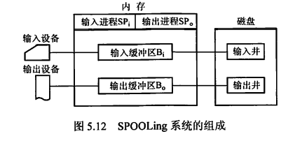

#### 组成部分

- 输入井和输出井：
  - **是磁盘上的两个区域**
  - 输入井用于收容来自I/O设备的数据
  - 输出井用于收容来自用户程序的数据
  - 一个进程的输入/输出数据保存为一个文件，所有进程的输入/输出数据链接成一个输入/输出队列
- 输入缓冲区和输入缓冲区：
  - **是内存上的两个区域**
  - 输入缓冲区用于暂存来自输入设备的数据，之后将送至输入井
  - 输出缓冲区用于暂存来自输出井的数据，之后将送至输出设备

- 输入进程和输出进程：
  - 模拟脱机输入/输出时的外围控制机
  - 用户要求输入的数据传输路径为：输入设备（I/O设备）→输入缓冲区（内存）→输入井（磁盘），当CPU需要输入数据时，直接从输入井读入内存
  - 用户要求输出的数据传输路径为：内存→输出井（磁盘）→输出缓冲区（内存）→输出设备（I/O设备）

#### 实例

共享打印机。当用户进程请求打印输出时，SPOOLing系统同意打印，但并不真正立即把打印机分配给该进程，而是由假脱机管理进程完成下列工作：

1. 在磁盘中申请一个空闲盘块作为输出井，将要打印的数据送入输出井暂存
2. 为用户进程申请用户请求打印表并填写，并将该表挂到假脱机文件队列上

虽然此时打印工作未真正开始，但在用户进程看来打印工作已经完成。

当打印机空闲，并且该任务排在等待队列队首时，打印机才会真正开始打印。

#### 特点

1. 提高了I/O速度，将对低速I/O设备执行的I/O操作转为对磁盘缓冲区中数据的存取
2. 将独占设备改造为共享设备。
3. 实现了虚拟设备功能。对于每个进程来说，都认为自己独占了一个设备
4. 是一个牺牲空间换时间的技术

### 2.4 设备驱动程序接口

#### 是什么

操作系统：定义一组驱动程序必须支持的函数，如读、写、格式化等

驱动程序：用一张函数指针表，将这些规定实现的函数与自身的指针建立对应关系

操作系统装载驱动程序时，记录驱动程序中这张函数指针表的地址。当操作系统需要调用一个设备相关的函数时，它可以通过这张表格间接调用

#### 为什么

- 方便操作系统添加一个新设备驱动程序
- 方便开发人员编制设备驱动程序

#### 驱动程序如何与设备匹配

设备独立性软件负责该匹配工作。它将符号化的设备名映射到适当的驱动程序上。

如UNIX中，设备作为命名对象出现在文件系统中。设备名/dev/disk0唯一确定了一个特殊文件的inode，这个inode包含了主设备号（用于定位相应的驱动程序）和次设备号（用于确定要读写的具体设备）

## 三、外存管理

### 3.1 磁盘

#### 磁盘结构

- 磁盘是表面涂有磁性物质的物理盘片，通过一个称为磁头的导体线圈从磁盘存取数据。
- 读写操作时，磁头固定，盘片高速旋转。
- 磁盘盘面被划分为若干个磁道，每个磁道都与磁头等宽，一个盘面有上千个磁道
- 磁道又被划分为几百个扇区，每个扇区固定存储大小（即使物理上的面积不等大），一个扇区称为一个盘块。显然对于扇区而言，从圆心出发由内向外的存储密度逐渐降低，因此<u>磁盘的存储能力受限于最内道的最大记录密度</u>
- 相邻磁道之间、相邻扇区之间都存在一定间隙，以避免精度错误。

#### 磁盘驱动器

- 由磁头臂、用于旋转磁盘的主轴、用于数据输入输出的电子设备组成
- 磁盘驱动器上安装多个盘片，垂直堆叠构成磁盘组，每个盘面对应一个磁头。
- 所有盘片上相对位置相同的磁道构成柱面
- **扇区是磁盘可寻址的最小单位**

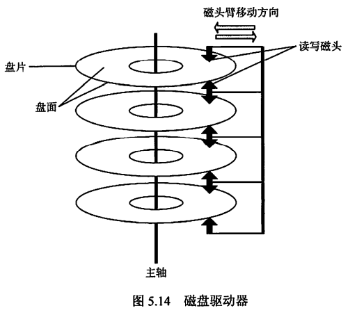

#### 磁盘分类

- 固定头磁盘：磁头相对于盘片的径向方向固定，每个磁道一个磁头
- 活动头磁盘：磁头臂可来回伸缩定位磁道
- 固定盘磁盘：磁盘永久固定在磁盘驱动器内
- 可换盘磁盘：磁盘可移动和替换

#### 磁盘管理

1. 磁盘初始化

   使用一个新的磁盘之前，必须先分成扇区，以便磁盘控制器能够进行读写操作。

   <u>这一操作称为低级格式化/物理格式化</u>。

   每个扇区具备特殊的数据结构，通常由头部、数据区域（通常为512B）、尾部组成。头部和尾部包含了一些磁盘控制器的使用信息。

2. 分区

   操作系统将磁盘分为一个或多个柱面组成的分区（即C盘、D盘等），并将每个分区的起始扇区和大小都记录在磁盘主引导记录的分区表中

   对物理分区进行<u>逻辑格式化</u>（创建文件系统），操作系统将初始的文件系统数据结构存储到磁盘上，包括空闲空间、已分配空间、一个初始为空的目录

   为了提高存储效率，操作系统将若干个相邻扇区组成一簇，<u>以簇为单位存储文件</u>。从而一簇只能存放一个文件的内容，文件的占用空间是簇的整数倍；如果文件大小小于一簇，也要占用一簇的空间

3. 引导块

   以Windows为例，Windoes将磁盘分为多个分区，其中包含操作系统和设备驱动程序的分区为<u>引导分区</u>，引导分区的第一个扇区为<u>引导扇区</u>。

   主引导记录（MBR）独立在所有分区之外，是磁盘的第0号扇区，存储了引导代码、磁盘分区表和标志（用于指示从哪个分区引导系统）。

   计算机通电时，首先执行主板ROM的引导程序（BIOS），BIOS将磁盘上的MBR读入内存，然后执行MBR读取分区表，找到引导分区并读取引导扇区，初始化操作系统。

4. 坏块处理

   复杂磁盘由控制器维护坏块列表，该列表在低级格式化时初始化，并在磁盘使用过程中更新。

   低级格式化时会将一些块保留作为备用，对操作系统是透明的。控制器可以采用备用块逻辑地替代坏块，称为<u>扇区备用</u>

   对坏块的处理实质上是使用某种机制使系统不去使用坏块

#### 磁盘读写时间

一次磁盘读写操作的时间由<u>寻道时间</u>、<u>旋转延迟时间</u>、<u>传输时间</u>决定

**寻道时间可以通过合适的磁盘调度算法进行优化**

**旋转延迟时间可以通过盘面错位编号的方法进行优化**

**传输时间是磁盘本身性质决定的，无法优化**

- 寻道时间（受磁盘调度算法影响）

  活动头磁盘将磁头移动到指定磁道所需时间。包括跨越n条磁道的时间和启动磁臂的时间。设跨越1条磁道的时间为m（是一个与磁盘驱动器有关的常数），启动磁臂的时间为s，则

  <u>**寻道时间=m×n+s**</u>

  m约为0.2ms，s约为2ms

- 旋转延迟时间（受磁盘旋转速度影响）

  磁头定位到某一磁道的扇区所需时间。设磁盘旋转速度为r（转/分），则

  <u>**旋转延迟时间=1/2r**</u>

  如r=5400转/分，则旋转一周需要11.1ms，旋转延迟时间取均值5.55ms

- 传输时间（受磁盘旋转速度影响）

  从磁盘读出或向磁盘写入数据所需时间。取决于每次读写的字节数b和磁盘旋转速度，即

  **<u>传输时间=b/rN</u>**

  其中r为磁盘旋转速度，N为一个磁道上的字节数

- 总平均存取时间

  **<u>总平均存取时间=寻道时间+旋转延迟时间+传输时间</u>**

#### 磁盘调度算法

平均查找长度：磁头跨越的磁道数之和/请求数

**磁盘调度算法目的在于减少寻道时间**

- 先来先服务FCFS

  按进程请求访问磁盘的先后顺序进行调度。最简单

  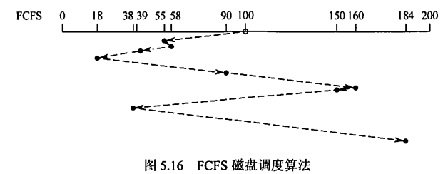

- 最短寻找时间优先SSTF

  结合当前磁头所处磁道，优先处理磁道最近的请求，使每次寻道时间最短，但不能保证平均寻道时间最短。

  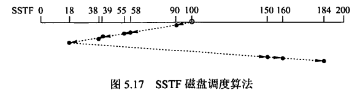

- 扫描SCAN/电梯调度

  结合当前磁头所处磁道和磁头移动方向，优先处理磁道最近的请求。

  实际上就是在SSTF的基础上增加了方向限制，在同一方向的请求都处理完之前都不走回头路。

  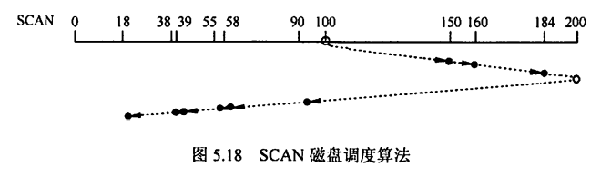

- 循环扫描C-SCAN

  在SCAN的基础上，增加要求：在处理完一个方向上的所有请求后，移动到该方向的终点，再快速回到起始端而不处理任何请求，即磁头由始至终都只在一个方向上移动。

  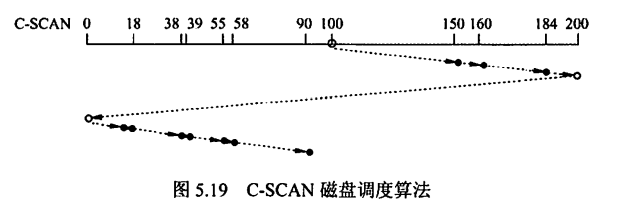

- LOOK调度/C-LOOK调度

  即处理完方向上最后一个请求之后就立即回头，并从距离起点最近的请求开始处理，而不需要移动到方向的终点再回到起点。

  没有特别说明时默认SCAN和C-SCAN为LOOK/C-LOOK调度

  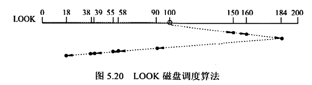

  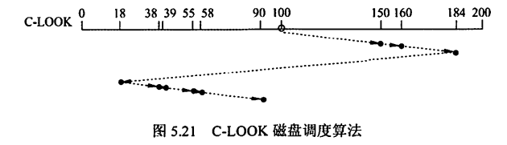

- 磁盘调度算法比较

  |        | 优点                                 | 缺点                                                         |
  | ------ | ------------------------------------ | ------------------------------------------------------------ |
  | FCFS   | 公平、简单                           | 平均寻道距离大，仅应用于磁盘I/O较少的场合                    |
  | SSTF   | 性能优于FCFS、每次寻道时间都是最短的 | 不能保证平均寻道时间最短、可能出现饥饿现象                   |
  | SCAN   | 寻道性能较好，可避免饥饿现象         | 对最近扫描过的区域不公平，在访问局部性方面不如FCFS和SSTF；也不利于远离磁头一端的访问请求 |
  | C-SCAN | 消除了对两端磁道请求的不公平         | ——                                                           |

#### 扇区交替编号

**扇区交替编号目的是减少旋转延迟时间**

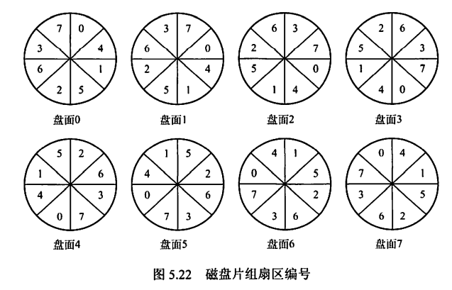

#### 文件存储策略

存储一个文件时，若一个磁道存储不下，剩下部分存在同一个柱面上的不同盘面更好，而不是同一盘面的不同磁道。

因为存在不同磁道会在读写过程中引起磁头的移动，增加文件访问时间，而存在不同盘面的同一柱面上时不需要移动磁道。

### 3.2 固态硬盘

#### 固态硬盘的特性

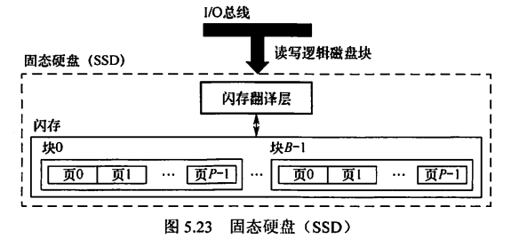

- 采用高性能Flash Memory记录数据，由E2PROM发展而来。实际上是ROM，和U盘没有本质区别，只是容量更大、存取性能更好
- 一个闪存由若干个块组成，每块由若干个页组成，<u>数据以页为单位读写</u>。
- 只有在一页所属的块全部被擦除后，才能写这一页；如果整个块都被擦除过，则该块内的所有页内可以写。一个块经过约10万次重复写后就会磨损坏，无法使用。
- 优点：由半导体存储器构成，没有移动的部件，随机访问时间比机械磁盘快很多，没有任何机械噪声和震动，能耗更低、抗震性好、安全性高等
- 缺点：
  1. 擦除块很慢，1ms级；
  2. 如果需要写一个已有数据的页P，则必须先把这些数据复制到一个新的块中，才能写P

#### 磨损均衡

- 动态磨损均衡：写入数据时，自动选择较新的内存块
- 静态磨损均衡：SSD检测并自动进行数据分配，让老的内存块承担无须写数据的存储任务，同时让较新的内存块腾出空间，平时读写操作在较新的内存块中进行

